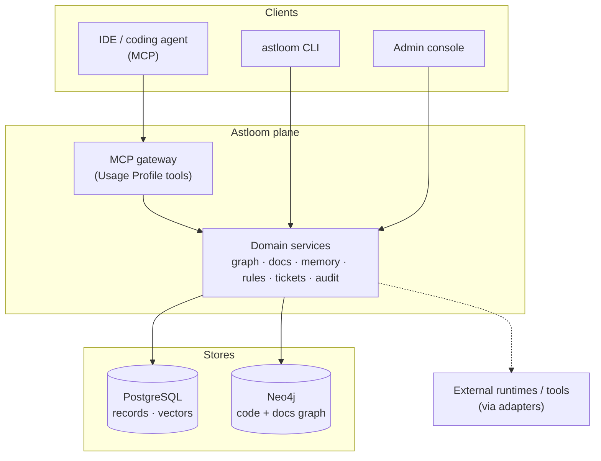

# Astloom

> **Astloom — project truth for coding tools**
>
> Also: *programming context hub for coding tools* · *code graph, memory, and guidance for IDEs*

[](LICENSE)
[](https://www.python.org/)
[](https://fastapi.tiangolo.com/)
[](https://www.postgresql.org/)
[](docs/08-software-engineering-architecture/35-usage-profile-and-cursor-mcp-onboarding.md)
[](pyproject.toml)
[](docs/00-master-plan/02-roadmap-and-phase-gates.md)
[](CONTRIBUTING.md)
[](https://github.com/Mohammad-Mirasadollahi/Astloom/stargazers)
[](https://github.com/Mohammad-Mirasadollahi/Astloom/commits)

## What it is

**Astloom** (*AST* + *loom*) weaves repository structure into durable **project truth** that coding tools can trust: a code-knowledge graph, linked documentation, shared memory, and MCP/CLI guidance for IDEs such as Cursor.

It is a vendor-neutral **control and knowledge plane** for AI-assisted work. It is **not** an LLM, a coding IDE, or an agent framework — workers still execute; Astloom owns registry, memory, docs sync, tickets, routing, policy, approval, and audit.

Why the name: **AST** signals code structure (symbols, callers, blast radius); **loom** signals weaving those signals with docs, memory, and guidance into one operable context hub for agents.

It is useful **beyond coding**: the same platform governs shared memory, documentation truth, durable tickets, multi-agent routing, human approval, and audit across domains. Coding is the first wedge that proves the loop; the destination is a cross-domain operating layer for agentic teams.

**Primary profile in active development:** programming / Cursor MCP (`programming-cursor-mcp`) — connect a repository, build a code-knowledge graph, and improve IDE/agent outputs. Other Usage Profiles compose the same core for different audiences; see [Usage Profile + MCP](docs/08-software-engineering-architecture/35-usage-profile-and-cursor-mcp-onboarding.md).

## Scope (read this first)

| | |
| --- | --- |
| **Nature** | Knowledge + control plane (context, governance, evidence) — not the executor |
| **Delivery focus (v1 wedge)** | Code connection: **explore · hybrid retrieval · change-risk · architecture · scored dead-code / shared-package findings · quality audit** (MCP + CLI) |
| **Freshness** | Explicit ingest + session pending-sync — **not** continuous save-watch indexing; **not** Repository Code Wiki in v1 |
| **Trust** | Closed Beta / **single-tenant lab** — multi-tenant SaaS not claimed yet |
| **Platform destination** | Tickets, adapters, memory, rules, approval, audit, cross-domain ops — built on the wedge, not instead of it |

Full catalog and non-goals → [product scope](docs/00-master-plan/01-product-scope-and-feature-catalog.md).

## Contents

| Go here | For |
| --- | --- |
| [What it is](#what-it-is) / [Scope](#scope-read-this-first) | Nature and boundaries at a glance |
| [Quick start](#quick-start) | **Server + client** install and MCP connect (SSH or HTTP) |
| [Quick architecture](#quick-architecture) | How the pieces connect |
| [Install](#install) | Shared bootstrap (`client` / `server` / `both`) and flags |
| [Verify](#verify) | Confirm CLI + profiles |
| [Documentation map](#documentation-map) | Where every topic lives (click through) |
| **CLI commands (why / flags / examples / what changes)** | **[42 - Astloom CLI Command Reference](docs/08-software-engineering-architecture/42-astloom-cli-command-reference.md)** |
| [Contributing & license](#contributing--license) | PRs, security, Apache 2.0 |

---

## Quick start

Two machines are typical: an **Astloom server** (platform + stores) and a **dev host** (your app repo + coding agent). The same installer covers both roles (and same-host **both**). Replace example hostnames with yours.

Full examples (SSH vs HTTP, security, troubleshooting) → [One-command connect guide](docs/08-software-engineering-architecture/41-one-command-cross-platform-agent-onboarding.md).

### 1) Install (server, client, or both)

One script installs **client**, **server**, or **both** (`--role` or the interactive menu). Requires Python 3.12+. Docker (Compose) is required only for **server** / **both**.

On an empty machine, fetch + install in one line:

```bash
curl -fsSL https://raw.githubusercontent.com/Mohammad-Mirasadollahi/Astloom/refs/heads/main/scripts/get-astloom.sh | bash
# prompts: channel → root → install/upgrade → y/n confirm → role (client/server/both) → runtime (server/both)
# choice menus have no default; confirm accepts y/yes or n/no (no default)
```

Use `…/refs/heads/main/scripts/get-astloom.sh` (not bare `/main/…`). GitHub’s raw CDN often serves a stale tip for `/main/`.

Already cloned:

```bash
cd /opt/Astloom
bash install.sh
# new shell so astloom is on PATH
```

**After server or both:**

```bash
astloom doctor
```

**Optional — HTTP MCP** on the server (long-running; skip if you use SSH-only connect). Preferred operator path:

```bash
astloom service start   # Compose postgres/neo4j + MCP HTTP (TLS when certs are configured)
astloom service status
```

Manual / legacy bring-up (same port; set a strong token secret):

```bash
export ASTLOOM_MCP_TOKEN_SECRET='replace-with-a-long-random-secret'
# When TLS is enabled (default on server install), public URL is https://…
export ASTLOOM_MCP_HTTP_PUBLIC_URL='https://astloom.example.internal:32500'
astloom mcp serve-http --host 0.0.0.0 --port 32500
```

Local live probes against self-signed TLS use verify-off by default (`ASTLOOM_MCP_HTTP_TLS_VERIFY=1` when the CA is trusted).
### 2) Dev host (client-only)

CLI-only path (no Docker on the client). Same installer with `--role client` (or choose **client** in the menu).

**Client-only installs use `astloom-client` only** (no bare `astloom` on PATH). After install, run `astloom-client connect`, `astloom-client sync`, etc. Server-admin commands (`service`, `graph`, `mcp serve`, …) are not available.

**Server** and **both** use bare **`astloom`** (full CLI). Client workflows such as `connect` work there without a separate client install — `astloom-client` is not needed on PATH.

```bash
# empty machine — fully non-interactive client (no prompts after channel/root flags):
curl -fsSL https://raw.githubusercontent.com/Mohammad-Mirasadollahi/Astloom/refs/heads/main/scripts/get-astloom.sh \
  | bash -s -- --channel main --role client
# or from an existing clone:
bash install.sh --skip-infra --yes --non-interactive --role client
astloom-client path install   # if needed; open a new shell
astloom-client connect
```

From the client you manage **your connected scope** on the server: `astloom-client sync`, `astloom-client status`, and `astloom-client purge --yes` (purge is remote; scope is locked to `connect.yaml`).

Edit `.astloom/connect.yaml` under the checkout (or run the connect wizard).

**SSH mode** (recommended on a private LAN; use an SSH **key**, not a password):

```yaml
server:
  ssh: ops@astloom.example.internal
  remote_root: /opt/Astloom
auth:
  ssh_key: ~/.ssh/id_ed25519_astloom
scope:
  tenant: acme
  workspace: eng
connect:
  prefer_http: false
  register: true
```

**HTTP mode** (requires MCP HTTP on the server — `astloom service start` or `mcp serve-http`):

```yaml
server:
  url: http://astloom.example.internal:32194
  mcp_http_url: https://astloom.example.internal:32500   # https when TLS is enabled
scope:
  tenant: acme
  workspace: eng
connect:
  prefer_http: true
  register: true
```

From your **application** repository:

```bash
cd /opt/MyApp
astloom connect
```

Reload MCP / the IDE window. You should see tools such as `astloom_ping`.

**Same host / dogfood this checkout** (Astloom as its own MCP client):

```bash
cd /opt/Astloom
astloom init --tenant acme --workspace eng --path /opt/Astloom   # you choose the IDs + roots
astloom connect --local
astloom status
# Required: copy template once (gitignored local file):
#   cp astloom.sync.yaml.example astloom.sync.yaml
# Or rely on install.sh which creates it when missing.
astloom sync
# astloom paths list
# astloom paths add /opt/OtherApp
# astloom paths remove /opt/OldApp   # warns: old graph data remains until purge
# astloom purge --yes
# astloom destroy-profile --tenant acme --workspace eng --project astloom
#   (type two different confirmations; deletes profile data only — NOT source code)
astloom list-profiles                  # see local profiles + which scope is active
```

After `bash install.sh`, repo-root `.env` and `astloom.sync.yaml` are created from `.env.example` / `astloom.sync.yaml.example` when missing (existing files are never overwritten; both copies are **gitignored**). Root `.env` is the **single** operator file for scope, Neo4j, LiteLLM models/keys, and embeddings (see [12 - LiteLLM Environment Configuration](docs/13-technology-stack-and-platform-decisions/12-litellm-environment-configuration.md)). After `init`, scope comes from `~/.astloom/identity.yaml` and the repo-root `.env`. Override with `--tenant` / `--workspace` / `--project` only when needed.

**Sync filters** (mandatory YAML, wildcards, built-in language excludes) → [42 § Sync filters](docs/08-software-engineering-architecture/42-astloom-cli-command-reference.md#sync-filters).

**All CLI commands** (required flags, examples, what changes when you re-run or change IDs) → [42 - Astloom CLI Command Reference](docs/08-software-engineering-architecture/42-astloom-cli-command-reference.md). Install/PATH overview → [36 - Astloom CLI](docs/08-software-engineering-architecture/36-astloom-cli.md).

Or set `server.local: true` and `connect.prefer_http: false` in `~/.astloom/connect.yaml`, then `astloom connect`.

---

## Quick architecture

Astloom sits **between** coding agents / IDEs and durable project truth. It is a knowledge + control plane — **not** the executor. External agents and humans still do the work; Astloom owns ingest, scoped retrieval, governance hooks, and evidence.



**v1 wedge (what ships first):** connect a repo → `sync` / ingest → code + linked docs graph → MCP explore / hybrid retrieval / change-risk / architecture → scored **unused candidates** (including `unwired_shared_package` recommendations) and **quality audit** → better agent context. Broader control-plane pieces (tickets, multi-agent routing, approval, cross-domain packs) build on that same plane.

Deeper design → [Global Architecture HLD](docs/00-master-plan/03-global-architecture-hld.md) · narrative → [Complete System Blueprint](docs/00-master-plan/05-complete-system-blueprint.md) · services list → [backend/services/README.md](backend/services/README.md).

---

## Install

Local-dev bootstrap of this checkout (same as **Quick start → Install**). One entrypoint (`get-astloom.sh` / `install.sh`) covers **client**, **server**, and **both**. Requires Python 3.12+ and a clone (or fetch). Docker is required only for **server** / **both** (Postgres/Neo4j).

```bash
bash install.sh
# interactive: install/upgrade → confirm → role (client/server/both) → runtime when needed
# unattended examples:
#   bash install.sh --non-interactive --role server --runtime venv
#   bash install.sh --non-interactive --role client
#   bash install.sh --non-interactive --role both --runtime venv
```

Open a **new** shell, then:

```bash
astloom doctor          # server / both (full CLI; bare astloom only)
astloom-client connect  # client-only host (no bare astloom on PATH)
# Client-only PATH name is astloom-client; server/both PATH name is astloom.
```

- Full steps, flags, and troubleshooting → [Local install runbook](docs/08-software-engineering-architecture/39-local-install-runbook.md)
- Venv only (no Compose infra) → `bash install.sh --skip-infra` or `--role client` (typical **dev host**)
- Same-host dogfood → `bash install.sh --role both`
- **CLI command reference (every command)** → [42 - Astloom CLI Command Reference](docs/08-software-engineering-architecture/42-astloom-cli-command-reference.md)
- CLI install / PATH overview → [36 - Astloom CLI](docs/08-software-engineering-architecture/36-astloom-cli.md)
- Server + client MCP connect → [One-command connect](docs/08-software-engineering-architecture/41-one-command-cross-platform-agent-onboarding.md)
- Usage Profile catalog → [Usage Profile + MCP](docs/08-software-engineering-architecture/35-usage-profile-and-cursor-mcp-onboarding.md)
- Operator connect loop (ingest → explore) → [Wedge connect runbook](docs/07-code-knowledge-graph/35-wedge-operator-connect-runbook.md)

---

## Verify

```bash
astloom profile list
astloom --help
```

Tests and suite layout → [tests/README.md](tests/README.md).

### Optional Stage-2 ANN (Turbovec)

Semantic retrieval **defaults to PostgreSQL + pgvector only** (`ASTLOOM_RAG_ANN_ACCELERATOR=off` in `.env.example`). That is the supported everyday path after install.

You may optionally enable an in-process **Turbovec** Stage-2 allowlist accelerator for denser corpora:

1. `pip install '.[turbovec]'` (or `astloom[turbovec]`)
2. Set `ASTLOOM_RAG_ANN_ACCELERATOR=turbovec` in the repo-root `.env` (see commented knobs in `.env.example`)
3. Run `python -m vector_index.promotion_gate` on representative hardware before production

Operator guide → [11 - Turbovec for RAG](docs/13-technology-stack-and-platform-decisions/11-turbovec-for-rag.md). ADR → [08 - Turbovec ANN acceleration](docs/13-technology-stack-and-platform-decisions/08-turbovec-ann-acceleration-integration.md).

---

## Documentation map

Start at the docs hub, then open the chapter you need:

| Chapter | Link |
| --- | --- |
| **Docs hub** | [docs/README.md](docs/README.md) |
| Product scope & features | [01-product-scope-and-feature-catalog](docs/00-master-plan/01-product-scope-and-feature-catalog.md) |
| Master plan index | [00-master-plan](docs/00-master-plan/00-index.md) |
| Roadmap & phase gates | [02-roadmap-and-phase-gates](docs/00-master-plan/02-roadmap-and-phase-gates.md) |
| Code-knowledge graph | [07-code-knowledge-graph](docs/07-code-knowledge-graph/00-index.md) |
| Dead-code cleanup loop | [36 - Dead-code candidates](docs/07-code-knowledge-graph/36-dead-code-candidates-and-cleanup-loop.md) |
| Shared-package wire / unwired findings | [79 - Shared package wiring](docs/07-code-knowledge-graph/79-shared-package-wiring-and-unwired-findings.md) |
| Phased smell/risk findings (future) | [80 - Problematic code findings](docs/07-code-knowledge-graph/80-phased-problematic-code-findings.md) |
| Engineering / install / CLI | [08-software-engineering-architecture](docs/08-software-engineering-architecture/00-index.md) |
| **Every `astloom` command** | **[42 - CLI Command Reference](docs/08-software-engineering-architecture/42-astloom-cli-command-reference.md)** |
| Governance & ops | [09-platform-governance-operations](docs/09-platform-governance-operations/00-index.md) |
| Gap register | [10-gap-analysis](docs/10-gap-analysis/00-index.md) |
| Technology stack | [13-technology-stack](docs/13-technology-stack-and-platform-decisions/00-index.md) |
| Optional Turbovec ANN | [11 - Turbovec for RAG](docs/13-technology-stack-and-platform-decisions/11-turbovec-for-rag.md) |
| API naming | [14-api-design](docs/14-api-design-and-naming-standards/00-index.md) |
| Backend layout | [backend/docs/STRUCTURE_STANDARD.md](backend/docs/STRUCTURE_STANDARD.md) |
| Agent workspace rules | [AGENTS.md](AGENTS.md) |

Reading order for new engineers → [docs/README.md § Reading Order](docs/README.md#reading-order).

---

## Contributing & license

- [CONTRIBUTING.md](CONTRIBUTING.md) · [SECURITY.md](SECURITY.md) · [LICENSE](LICENSE) (Apache 2.0)
- Do not upload private repo contents to public cloud without explicit per-action approval ([data sovereignty](ai-toolstack/docs/data-sovereignty-no-cloud-exfiltration.md)).
