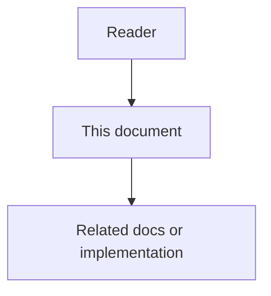

# Global Architecture HLD

## Purpose

This document defines the system-wide high-level architecture for Astloom. It explains the platform control plane, core services, data flows, boundaries, project isolation model, automation model, observability model, and quality attributes that all phase-level designs must respect.

## Document flow

| Step | Actor | Action | Outcome |
| --- | --- | --- | --- |
| 1 | Reader | Opens this design document | Understands scope and constraints |
| 2 | Reader | Follows the Mermaid flow | Sees primary component interactions |
| 3 | Reader | Uses Related Documents / linked symbols | Reaches deeper design or implementation |

## Architectural Mission

Astloom's architectural mission starts with code-connected output improvement: ingest repositories into structured knowledge, assemble task-scoped context packs, deliver them to external IDE assistants and agent runtimes, and retain evidence of whether outputs improved. On that foundation, Astloom is an enterprise control plane for AI-assisted work. It coordinates external agents, humans, tools, repositories, documentation, memory, rules, tickets, and audit evidence through structured records and governed workflows. It does not execute work as an agent and does not replace an agent runtime. Execution crosses a versioned adapter boundary; Astloom retains deterministic control of authorization, routing constraints, ticket state, approvals, and audit.

## Primary Architectural Principles

- Structured records are more important than raw chat history.
- Current truth is preferred over historical event dumps.
- Project isolation is enforced before retrieval, ranking, graph traversal, prompt assembly, or reporting.
- Cross-project composition requires explicit ProjectGroup policy.
- Services communicate through APIs, events, SDKs, or documented projections.
- Durable state changes produce auditable events.
- High-risk actions require policy evaluation, approval, or human review.
- Installation, connector onboarding, validation, repair, and reporting should be automated where safe.
- Product workflows must expose state, evidence, correction, and recovery paths.

## System Context

Astloom sits between agents, humans, repositories, docs, CI, ticketing systems, approval systems, model providers, and enterprise tools.

External actors:

- developers and reviewers.
- autonomous coding, documentation, QA, DevOps, and security agents.
- IDE extensions.
- CI systems.
- source control systems.
- ticket and approval systems.
- model and embedding providers.
- platform operators.
- product and engineering leaders.

## High-Level Service Model

Core services:

- api-gateway: external API entrypoint and request composition.
- core-data-service: Activity, WorkLog, Decision, Issue, Task, evidence, and lifecycle records.
- memory-service: memory classification, consolidation, retrieval, question intelligence, FAQ memory, and WorkBatch consolidation.
- docs-sync-service: documentation graph, anchors, frontmatter, drift detection, and documentation drafts.
- code-graph-service: repository ingestion, symbols, graph edges, impact analysis, and graph-guided context.
- rule-engine-service: deterministic and semantic rules, risk scoring, escalation, and approvals.
- broker-service: event delivery, retry, dead-letter, replay, and subscription management.
- adapter-service: external tool, provider, IDE, ticket, approval, and agent adapters.
- config-service: environment profiles, feature flags, port allocation, and runtime settings.
- audit-service: immutable evidence, audit search, compliance exports, and cross-project access evidence.
- admin-console: web control surface for tracking, memory, tasks, rules, batches, reports, feedback, and audit.

## System Layers

Layer model:

1. User and agent surfaces: admin-console, CLI, IDE extension, external agents.
2. API and integration layer: api-gateway, SDK, adapter-service.
3. Domain services: core-data, memory, docs-sync, code-graph, rule-engine.
4. Event layer: broker-service, event contracts, retry, dead-letter, replay.
5. Persistence layer: relational stores, graph store, vector index, object storage, cache.
6. Operations layer: config, observability, audit, automation control plane, reporting.

## Core Runtime Flows

### Agent Work Recording Flow

1. Agent performs work through IDE, CLI, API, or adapter.
2. api-gateway validates identity, scope, and payload.
3. core-data-service records Activity and evidence.
4. broker-service publishes ActivityRecorded.
5. memory-service, rule-engine-service, docs-sync-service, audit-service, and reporting consumers process the event.
6. admin-console shows the activity timeline with correlation and evidence.

### Memory And Context Flow

1. Task or agent request asks for context.
2. memory-service applies tenant, workspace, and project scope.
3. retrieval combines SemanticFacts, Decisions, docs, code graph, WorkBatch, and QuestionMemory.
4. ContextBundle is built with token budget and omitted-item explanations.
5. Prompt cache is used for stable sections where safe.
6. Feedback updates retrieval quality after task outcome.

### Docs And Code Graph Flow

1. code-graph-service ingests repository changes.
2. symbol and edge changes are versioned.
3. docs-sync-service maps changed symbols to documentation anchors.
4. drift findings create Issues, Tasks, or DocumentationDrafts.
5. documentation updates are reviewed and linked back to code and decisions.

### Rule And Approval Flow

1. A command, code change, connector action, or automation job requests evaluation.
2. rule-engine-service runs deterministic checks first.
3. semantic evaluator is used only when policy requires judgment.
4. high-risk results create ApprovalRequest or Escalation.
5. approval outcome is recorded with evidence and audit references.

### Automation And Connectivity Flow

1. installer or admin-console starts setup, connector registration, repair, or upgrade job.
2. automation control plane validates prerequisites and scope.
3. generated configuration, ports, registries, credentials, and smoke tests are produced.
4. connector capabilities are discovered and validated.
5. readiness or failure evidence report is stored.

## Data Ownership

- core-data-service owns work records and task lifecycle.
- memory-service owns memory, question intelligence, FAQ, feedback-derived retrieval signals, and WorkBatch consolidation state.
- docs-sync-service owns documentation anchors, drift findings, and documentation drafts.
- code-graph-service owns repository graph, symbols, edges, snapshots, and impact analysis.
- rule-engine-service owns rules, evaluations, risk scores, and approval routing decisions.
- adapter-service owns connector registry, provider mappings, and external references.
- audit-service owns immutable evidence and compliance views.
- reporting owns derived MeasurementRun, MetricResult, and report views, not source truth.

## Project Isolation And Composition

Every record and query must include tenant, workspace, and project or ProjectGroup scope. Scope must be applied before retrieval, ranking, graph traversal, prompt assembly, report aggregation, or UI rendering.

ProjectGroup composition is allowed only through explicit policy that defines:

- member projects.
- allowed data types.
- allowed query directions.
- allowed actors.
- allowed memory, graph, docs, tasks, reports, connectors, and audit behavior.
- approval and expiration rules.

Cross-project access must create audit evidence.

## Event Architecture

Every event envelope should include:

    event_id
    event_type
    event_version
    occurred_at
    producer
    tenant_id
    workspace_id
    project_id
    project_group_id
    actor_ref
    correlation_id
    causation_id
    idempotency_key
    payload
    evidence_refs

Event consumers must be idempotent. Replay must not duplicate domain state.

## Observability Architecture

Astloom must provide:

- structured logs.
- metrics.
- distributed traces.
- domain events.
- audit records.
- health and readiness checks.
- diagnostics endpoints.
- explainability output for memory, rules, graph impact, reports, and batching.

## Security Architecture

Security controls:

- authentication at every public API.
- authorization before data retrieval.
- project isolation before ranking or prompt assembly.
- secret redaction before logs, prompts, events, reports, and docs.
- least-privilege connector credentials.
- approval gates for high-risk changes.
- audit records for privileged and cross-project operations.

## Deployment And Configuration

Deployment must support local-dev, single-node, production-cluster, air-gapped, upgrade, and connector-only modes. Configuration must be typed, validated, environment-specific, and free from hard-coded ports, credentials, provider names, scoring weights, or project IDs.

Development ports must avoid framework defaults and be validated through port preflight.

## Global Acceptance Criteria

The global architecture is acceptable when:

- each major capability maps to an owning service or package.
- every cross-service interaction uses APIs, events, SDKs, or documented projections.
- project isolation is enforced consistently.
- high-risk actions are governed by rules, approval, and audit.
- memory, docs, graph, rules, connectors, automation, and reports share evidence references.
- admin-console can track, correct, and supervise agent work.
- installation, onboarding, validation, repair, and reporting are automatable.
- phase-level HLD and LLD documents can derive concrete implementation details from this architecture.
