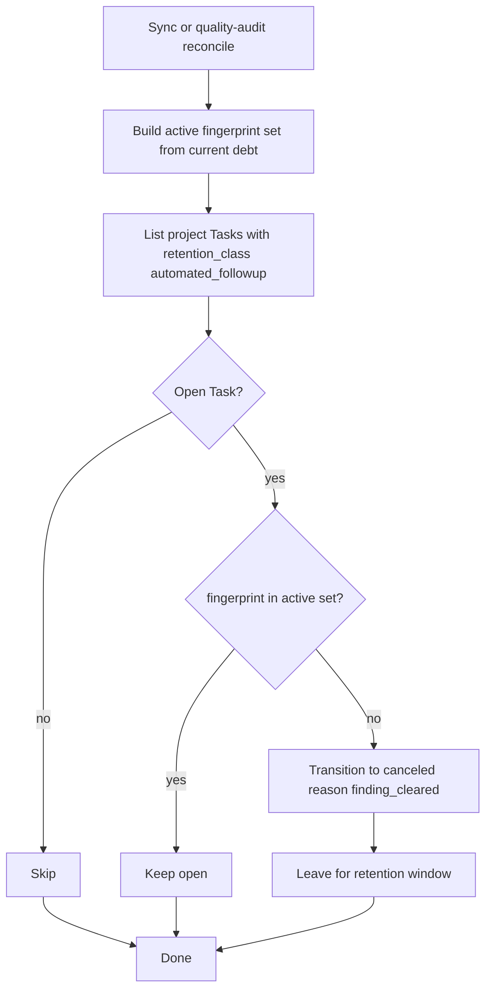

# Automated Follow-Up Task Lifecycle and Retention

## Purpose

Define how Astloom **must** manage durable `Task` records created automatically
by sync follow-up and quality-audit flows: stable identity, no duplicate open
tasks, cancel when debt clears, and time-bounded retention after terminal states.
Also clarify that these Tasks are **not** MemoryItems and do not use memory
decay/TTL semantics.

## Goals and Non-Goals

### Goals

- One open automated Task per stable debt fingerprint (project-scoped).
- Re-running sync or quality-audit **must not** grow an unbounded `proposed` pile
  for the same debt.
- When the underlying finding is gone, the matching open automated Task **must**
  move to `canceled` (finding cleared) on the next reconcile pass.
- After a configurable retention window, terminal automated Tasks (`canceled` /
  `done`) **may** be hard-deleted so CoreData stays operable.
- Agents and operators can distinguish automated follow-ups from human Tasks via
  explicit payload metadata.

### Non-Goals

- Replacing the full Task state machine in CoreData HLD (proposed → … → done).
- Applying MemoryItem `expires_at` / WeightProfile decay to Tasks.
- Purging human-authored Tasks, Decisions, Issues, or audit Activities.
- Cross-tenant retention or legal hold workflows (out of scope for this slice).

## Memory Versus Task (Hard Boundary)

| Concern | Memory (`MemoryItem`) | Automated follow-up `Task` |
| --- | --- | --- |
| Purpose | Retrieval / context for prompts | Executable work assignment |
| Store | memory-service | core-data-service records |
| Softening | decay, weights, `expires_at` | lifecycle transitions |
| Cleared when | policy / decay / explicit delete | debt cleared → `canceled`; then retention purge |
| Prompt visibility | scored into ContextBundle | listed on Task board / MCP task tools |

Automated follow-up Tasks **must not** be written into memory-service as a
substitute for CoreData. Local mirror
`.astloom/quality-followup-tasks.json` is a **convenience snapshot only**;
CoreData is source of truth for durability and retention.

## Origins

| Origin value | Producer | Typical debt |
| --- | --- | --- |
| `sync-followup` | `astloom sync` → `create_sync_followup_tasks` | standards-skipped docs/code; code.sync_debt aggregates |
| `mcp-quality` | `astloom_quality_audit` with `create_tasks=true` | per-path high/medium quality findings |

Human or other MCP `create_task` calls without `retention_class=automated_followup`
are **out of policy** for this document’s reconcile/purge rules.

## Identity and Idempotency

Every automated follow-up Task **must** carry payload fields:

- `origin` — `sync-followup` or `mcp-quality`
- `followup_kind` — e.g. `docs.standards_skipped`, `code.sync_debt`, or quality category
- `paths` — list of relative paths (may be empty only if kind is aggregate and paths unknown)
- `fingerprint` — stable string identity within the project
- `retention_class` — always `automated_followup`

### Fingerprint rules

| Origin | Fingerprint |
| --- | --- |
| `sync-followup` | `sync-followup:{followup_kind}` |
| `mcp-quality` | `mcp-quality:{category}:{relative_path}` |

Idempotency-Key for `CoreData.create` **must** be derived only from
`project_id` + fingerprint (truncated to store limits). It **must not** include
per-run `correlation_id`, list length, or finding index — those caused unbounded
duplicate Tasks historically.

If an open Task with the same fingerprint already exists, create **must** be a
no-op (return existing via idempotency or explicit skip). Instructions/title
**should** be refreshed when the path set for an aggregate kind changes, without
creating a second open Task.

## Lifecycle Reconcile

### Open statuses

Treat as open (eligible for reconcile cancel): `proposed`, `ready`,
`in_progress`, `blocked`, `review`, `reopened`.

### Terminal statuses

`done`, `canceled` — not re-opened by reconcile automatically.

### Reconcile algorithm



| Step | Actor | Input | Output | Failure |
| --- | --- | --- | --- | --- |
| 1 | CLI sync / MCP quality | Current gate + audit findings | Active fingerprint set | Soft-fail; never fail sync |
| 2 | CoreData list | Project scope | Automated Tasks | Soft-fail |
| 3 | CoreData transition | Open Task whose fingerprint absent | status=`canceled` | Soft-fail per Task; continue |
| 4 | Mirror write (sync only) | Specs still owed | `.astloom/quality-followup-tasks.json` | Soft-fail |

Cancel transition from `proposed` is valid in the CoreData Task state machine.
Reason **must** be recorded in transition reason / `last_transition` as
`finding_cleared` (or equivalent stable token).

Reconcile **must** run on every `astloom sync` that reaches follow-up handling,
even when zero new specs are created, so cleared debt closes Tasks.

Reconcile **must** be origin-scoped: sync only cancels `origin=sync-followup`;
quality-audit only cancels `origin=mcp-quality`. Cross-origin cancel is forbidden.

## Retention After Terminal

| Class | After terminal | Default |
| --- | --- | --- |
| `automated_followup` | Hard-delete when `updated_at` older than retention days | 30 days |
| Human / unmarked Tasks | Not purged by this policy | N/A |

Configuration:

- Environment: `ASTLOOM_FOLLOWUP_TASK_RETENTION_DAYS` (integer ≥ 0).
- `0` means **never purge** (cancel-only mode).
- Missing / invalid → default `30`.

Purge **must** only delete records where:

1. `kind=task`
2. `data.retention_class=automated_followup`
3. `status` ∈ {`canceled`, `done`}
4. `updated_at` ≤ now − retention days

Purge **must not** delete idempotency rows required for unrelated commands in a
way that breaks non-followup creates; deleting the Task record is enough for
board hygiene. Re-create after purge for the same fingerprint is allowed if debt
returns.

## When Producers Run Policy

| Event | Create | Reconcile (origin-scoped) | Purge |
| --- | --- | --- | --- |
| `astloom sync` follow-up | Yes (if specs) | Always (`sync-followup` only) | Always (if retention days > 0) |
| `astloom_quality_audit` + `create_tasks=true` | Yes (high/medium) | Yes (`mcp-quality` only) | Yes (if retention days > 0) |
| `astloom_quality_audit` without create | No | Optional (`reconcile_tasks=true`) | Optional same flag |
| `astloom followup-tasks reconcile` | No | Yes (origin filter) | No |
| `astloom followup-tasks purge` | No | No | Yes (`--days` / env) |
| `astloom followup-tasks adopt-legacy` | Stamp metadata | Cancel fingerprint dupes | No |

## Operator Visibility

Sync UI **should** report counts:

- `tasks_created`
- `tasks_canceled` (reconcile)
- `tasks_purged` (retention)
- `create_errors` (import/store failures)

CLI operators can inspect and run lifecycle steps without a full sync:

```text
astloom followup-tasks list [--status open|terminal|all] [--origin sync-followup|mcp-quality|all]
astloom followup-tasks status [--origin …]
astloom followup-tasks adopt-legacy [--dry-run|--yes]
astloom followup-tasks reconcile [--origin …] [--dry-run]
astloom followup-tasks purge [--days N] [--dry-run|--yes]
```

`status` compares open Task fingerprints to the current active debt set and
lists `stale_open_fingerprints` (candidates for cancel). `purge` requires
`--yes` unless `--dry-run`.

Operator catalog entry: `docs/08-software-engineering-architecture/42-astloom-cli-command-reference-continued-continued-continued.md`
(`astloom followup-tasks`). MCP: `astloom_quality_audit` args `create_tasks` /
`reconcile_tasks` in `backend/configs/usage-profiles/programming-cursor-mcp.json`.

`adopt-legacy` is a one-time operator migration: stamp `retention_class` /
`fingerprint` / `origin` onto pre-lifecycle `Quality: {category} — {path}` and
sync-style titles (`Remediate … sync-skipped`, `Code graph debt:`), cancel
duplicate fingerprints (keep newest), and cancel unparseable open `Quality:`
orphans. Run before the first reconcile on a store that accumulated Tasks
without lifecycle metadata.

## Failure Model

- All lifecycle steps are **best-effort** relative to sync/audit success.
- Import or store errors **must** be surfaced in result payloads (`create_errors`
  / `reconcile_errors`) and **must not** abort ingest.
- Fail closed only for tenant scope mismatch (never cancel/purge outside scope).

## Acceptance Criteria

1. Re-running quality-audit with `create_tasks=true` for the same path/category
   does not create a second open Task.
2. After debt for a fingerprint disappears, the next sync reconcile cancels the
   open automated Task.
3. With retention days = 30, a Task canceled 31 days ago is purged; one canceled
   yesterday is kept.
4. With retention days = 0, terminal Tasks are never purged.
5. Memory decay APIs are never invoked as part of this policy.
6. Unit tests cover fingerprint stability, reconcile cancel, and purge bounds.
7. CLI `followup-tasks list|status|reconcile|purge|adopt-legacy` is registered and
   dry-run safe for destructive steps.

## Implementation Map

| Area | Path |
| --- | --- |
| Shared policy | `backend/packages/astloom_cli/followup_task_lifecycle.py` |
| Sync producer | `backend/packages/astloom_cli/sync_followup_tasks.py` |
| CLI operator | `backend/packages/astloom_cli/commands/followup_tasks.py` + `parser/governance.py` |
| Quality producer | `backend/services/mcp-gateway-service/src/mcp_gateway_service/backends/quality.py` |
| CoreData transitions | `backend/services/core-data-service/src/core_data_service/core.py` |
| Store delete | `postgres_store.py` / `testing.InMemoryStore` + `Store` protocol |
| Tests | `tests/backend/tools/astloom-cli/test_followup_task_lifecycle.py`, `test_followup_tasks_cli.py` |

## Related Documents

- `docs/01-core-data-model/02-high-level-design.md` — Task product states
- `docs/01-core-data-model/07-agent-collaboration-work-surface.md` — agent work surface
- `docs/02-memory-and-context/06-detailed-section-design.md` — Memory working/decay model
- `docs/09-platform-governance-operations/04-data-retention-backup-and-disaster-recovery.md` —
  data-class retention principles
- `docs/06-technical-logic/01-core-data-model-technical-logic.md` — Task transitions
