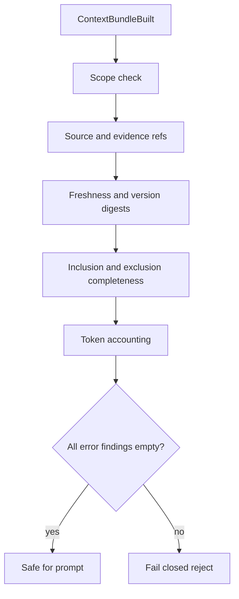

# 13 - Context Bundle Audit And Verification

## Purpose

Close **GAP-T04**: prove that a `ContextBundle` is scoped, source-referenced, fresh against
candidate memory, complete versus the retrieval candidate list, and within token budget before
prompt packing trusts it.

## Verification Flow

| Step | Actor | Action | Outcome |
| --- | --- | --- | --- |
| 1 | memory-service | Emit `ContextBundle` public payload | Auditable bundle shape |
| 2 | `verify_context_bundle` | Compare tenant/workspace/project on bundle and items | Scope mismatch → error |
| 3 | `verify_context_bundle` | Require non-empty `source_refs` or `evidence_refs`; reject malformed refs | Missing/malformed → error |
| 4 | `verify_context_bundle` | Digest `version`/`updated_at`/`body` vs live candidates | Stale-after-build → error |
| 5 | `verify_context_bundle` | Every candidate id in `items` or `excluded` with reason | Omitted high scorer → error |
| 6 | `verify_context_bundle` | Sum `token_estimate` ≤ `token_budget`; recompute estimates | Overflow/mismatch → error |
| 7 | caller | Treat `ok=false` as fail-closed | Bundle must not feed prompts |

## Audit Schema

Canonical JSON Schema: `backend/configs/schemas/context-bundle-audit.schema.json`.

It mirrors `ContextBundle.public()` from memory-service:

- Identity: `bundle_id`, `tenant_id`, `workspace_id`, `project_id`, `query`, `built_at`
- Budgets and profiles: `token_budget`, `weight_profile`, `prompt_cache`
- Selection: `items[]` (`memory`, `score`, `selection_reason`, `token_estimate`)
- Omissions: `excluded[]` (`id`, `reason`, `score`)

## Verifier Module

Implementation: `memory_service.domain.bundle_verifier`.

Checks (error severity unless noted):

| Code | Meaning |
| --- | --- |
| `scope_mismatch` | Bundle or included memory outside expected scope |
| `malformed_source_ref` | Ref not a non-empty string / control characters |
| `missing_source_or_evidence_refs` | Included memory has neither source nor evidence refs |
| `stale_after_build` | Candidate digest or version advanced after build |
| `omitted_from_inclusion_and_exclusion` | Candidate id missing from both lists |
| `omitted_high_scorer` | Eligible high score not explained in `excluded` |
| `restricted_memory_in_prompt` | Restricted kind/state present in `items` |
| `token_accounting_overflow` | Sum of estimates exceeds budget |
| `token_estimate_mismatch` | Stated estimate ≠ recomputed word estimate |
| `schema_validation_failed` | Payload fails audit JSON Schema |

## Prompt Safety Suite

Executable tests under `tests/backend/services/memory-service/`:

- **Stale-after-build** — mutate candidate version/body after retrieve; verifier fails.
- **Omitted high scorer** — drop a high-scoring candidate from both lists; verifier fails.
- **Restricted / redaction** — restricted memory never in `items`; secrets redacted at create.
- **Malformed refs** — empty/control-character refs rejected.
- **Schema fuzz** — random invalid payloads rejected by JSON Schema.

## Acceptance

- [x] Audit JSON Schema matches `ContextBundle.public()` fields.
- [x] Fail-closed verifier covers scope, refs, freshness, completeness, tokens.
- [x] Prompt-safety unit tests + small schema fuzz.
- [x] Contract doc links this standard.

## Related Documents

- [04 - Data Contracts And Events](./04-data-contracts-and-events.md)
- [03 - Low Level Design](./03-low-level-design.md)
- [GAP-T04 technical gaps](../10-gap-analysis/03-technical-implementation-gaps.md)
