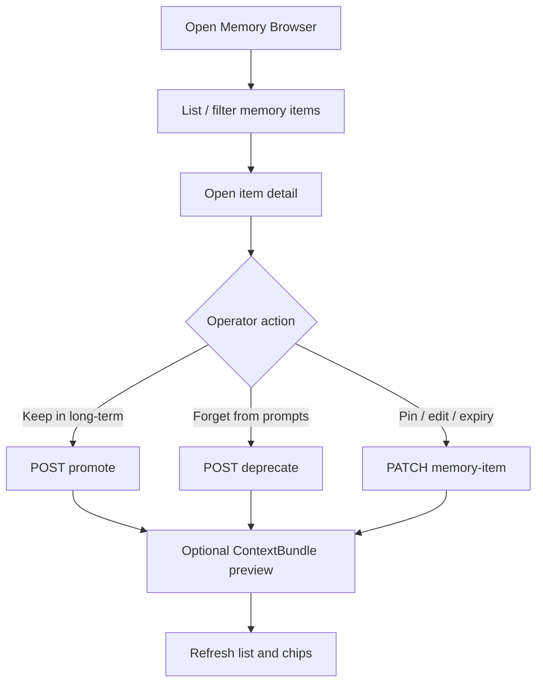

# 14 - Memory Browser And Long-Term Selection UI

## Purpose

Specify the operator/human UI for Astloom memory so a user can **see what the system remembers**, understand why something appears in prompts, and **explicitly choose** what should stay in long-term memory versus what should be forgotten from default context.

This document is UI/product guidance only. Backend remember/forget APIs are already owned by `memory-service` (see Implementation Anchors).

## Document flow



| Step | Actor | Action | Outcome |
| --- | --- | --- | --- |
| 1 | Operator | Opens `/projects/{project_id}/memory` | Scoped Memory Browser loads |
| 2 | Operator | Filters by kind / state / pinned / search | Matching rows listed |
| 3 | Operator | Opens a non-restricted row | Detail drawer shows body and prompt explainer |
| 4a | Operator | Chooses Keep in long-term | UI calls promote; item becomes durable semantic |
| 4b | Operator | Chooses Forget from prompts | UI calls deprecate; item excluded from default prompts |
| 4c | Operator | Pins, edits, or sets working expiry | UI calls PATCH; list chips update |
| 5 | Operator | Runs optional context preview | Included vs excluded items shown with reasons |
| 6 | Operator | Returns to list | Soft-forget history remains browsable under Forgotten |

## Product principle

Memory must feel human:

- **Browse** everything in project scope (working, episodic, semantic, stale, deprecated).
- **Keep** selected items as long-term semantic truth.
- **Forget** items from default ContextBundles without pretending history never existed (soft deprecate).
- **Pin** critical items so they stay visible and preferred in retrieval.
- Never show restricted secrets in the browser body; show a redacted/restricted placeholder.

## Primary surface: Memory Browser

Route suggestion: `/projects/{project_id}/memory`

### First viewport

One composition, not a dashboard:

1. Project / memory brand title (**Memory**).
2. One short line: “What Astloom keeps for this project.”
3. Primary CTA group: **Browse all**, **Show long-term**, **Show forgotten**.
4. Optional search field (maps to `q`).

Do not put stats strips, schedule cards, or multi-panel clutter in the hero.

### List / table content

Each row shows:

| Field | Source |
|---|---|
| Title | `title` |
| Kind chip | `working` / `episodic` / `semantic` |
| State chip | `candidate` / `active` / `stale` / `deprecated` / … |
| Pinned | `pinned` |
| Expires | `expires_at` (working only) |
| Updated | `updated_at` |
| Confidence | `confidence` |
| Tags | `tags` |

Filters (required):

- kind
- state
- pinned only
- text search (`q`)
- “In default prompts” vs “Excluded from default prompts”

Empty states:

- No memory yet → CTA to create note / run agent write.
- Filters match nothing → clear filters.

### Detail drawer / page

Selecting a row opens detail with:

- Full body (unless restricted → redacted message).
- Evidence / source refs as links when available.
- “Why it may appear in prompts” explainer (kind + state + pin + expiry).
- Actions (see below).

## Human actions (must-have)

| UI action | Meaning | Backend |
|---|---|---|
| **Keep in long-term** | Promote to durable semantic truth | `POST .../memory-items/{id}:promote` or bulk `POST .../memory-promotions` |
| **Forget from prompts** | Soft-forget; leave history browsable | `POST .../memory-items/{id}:deprecate` |
| **Mark stale / decay** | Temporary sidelining (not full forget) | `POST .../memory-decays` |
| **Pin / Unpin** | Prefer in retrieval / always visible in browser | `PATCH .../memory-items/{id}` with `pinned` |
| **Edit note** | Correct title/body/tags | `PATCH .../memory-items/{id}` |
| **Set working expiry** | Session-like TTL for working notes | `PATCH` / create with `expires_at` (working only) |

Bulk select:

- Multi-select rows → Keep in long-term / Forget from prompts.
- Confirm destructive-feeling actions with a short dialog stating soft-forget keeps history.

## Long-term selection mental model

Present three buckets in copy (not necessarily three boards):

1. **Working** — short-lived task notes; may expire.
2. **Episode history** — past events; searchable, usually not default prompt.
3. **Long-term** — semantic truths the project should keep remembering.

When the user clicks **Keep in long-term**, UI copy should say:

> This note becomes durable project knowledge (`semantic` + `active`) and is preferred in future context packs.

When the user clicks **Forget from prompts**:

> Agents will stop using this by default. You can still find it under Forgotten / deprecated.

## Context preview (optional but recommended)

A side panel “What would an agent see?” that:

1. Accepts a sample query.
2. Calls ContextBundle build/explain.
3. Lists included vs excluded with reasons (`stale_memory_excluded`, `inactive_memory_state`, `working_memory_expired`, …).

This teaches the remember/forget model without exposing internals as primary UX.

## Accessibility and safety

- Scope always from current project; never cross-tenant browse.
- Restricted items: no secret body; show state only.
- Every mutation requires actor identity (service headers already enforce this).
- Show idempotent success toasts; surface `409` version conflicts for concurrent edits.

## Non-goals (this UI doc)

- Building the React/Vue implementation in this change.
- Full AnythingLLM-style chat UI.
- Hard physical delete of memory rows as the default forget action.
- Automatic multi-signal GC visualization beyond showing stale/deprecated states.

## Acceptance criteria (UI)

- [ ] User can list all in-scope memory items with kind/state filters.
- [ ] User can open any non-restricted item and read its body.
- [ ] User can promote working/episodic (or candidate) items to long-term semantic.
- [ ] User can deprecate items and see them under forgotten, excluded from default preview.
- [ ] User can pin/unpin items and filter pinned.
- [ ] Working expiry is visible; expired working appears as stale after refresh/list.
- [ ] Copy never conflates ExternalTicket / AgentTicket with MemoryItem.

## Implementation anchors (backend already)

```text
GET    /api/v1/projects/{project_id}/memory-items
GET    /api/v1/projects/{project_id}/memory-items/{memory_item_id}
PATCH  /api/v1/projects/{project_id}/memory-items/{memory_item_id}
POST   /api/v1/projects/{project_id}/memory-items/{memory_item_id}:promote
POST   /api/v1/projects/{project_id}/memory-items/{memory_item_id}:deprecate
POST   /api/v1/projects/{project_id}/memory-promotions
POST   /api/v1/projects/{project_id}/memory-decays
POST   /api/v1/projects/{project_id}/context-bundles
GET    /api/v1/projects/{project_id}/stale-memory
```

Contract: `backend/services/memory-service/docs/phase-2-api-contract.md`.

## Related Documents

- [Memory index](00-index.md)
- [Feature specification](01-feature-specification.md)
- [Detailed section design](06-detailed-section-design.md)
- Technical logic: `../06-technical-logic/02-memory-context-technical-logic.md`
