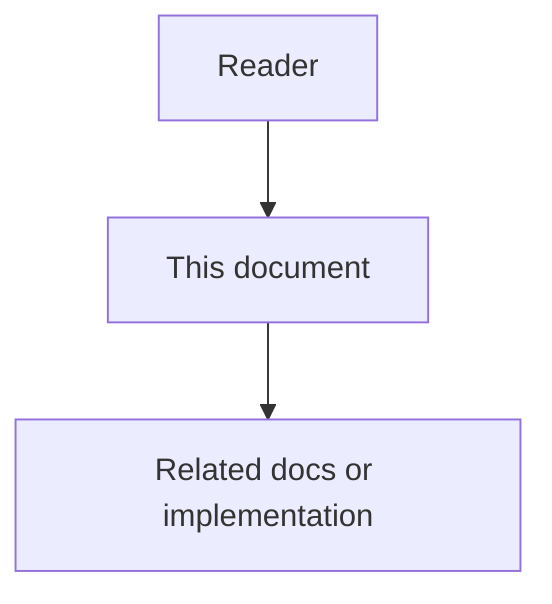

# Rule Engine And Orchestration - Low-Level Design

## Purpose

This low-level design translates the Rule Engine And Orchestration architecture into implementation-ready technical design. It defines internal modules, commands, queries, events, state machines, persistence rules, validation rules, algorithms, idempotency behavior, observability, tests, and edge cases.

## Document flow

| Step | Actor | Action | Outcome |
| --- | --- | --- | --- |
| 1 | Reader | Opens this design document | Understands scope and constraints |
| 2 | Reader | Follows the Mermaid flow | Sees primary component interactions |
| 3 | Reader | Uses Related Documents / linked symbols | Reaches deeper design or implementation |

## Implementation Boundary

The implementation boundary for this phase includes:

- rule-engine-service.
- policy-registry.
- deterministic-evaluator.
- semantic-evaluator.
- risk-scorer.
- escalation-router.
- anomaly-detector.
- task-router.

Boundary rules:

- Internal modules are private to the owning service.
- Public integration happens through commands, queries, events, SDKs, or documented projections.
- No service may read another service database directly.
- Every command, query, event, and persistence operation must carry tenant, workspace, and project or ProjectGroup scope.

## Internal Module Layout

Recommended service layout:

    src/
      api/
        controllers/
        routes/
        serializers/
      application/
        commands/
        queries/
        handlers/
        workflows/
      domain/
        entities/
        value-objects/
        policies/
        services/
        events/
      infrastructure/
        persistence/
        messaging/
        external-clients/
        configuration/
        observability/
      workers/
        consumers/
        scheduled-jobs/
        projectors/
      bootstrap/
        dependency-injection/
        service-startup/

## Domain Entities

The implementation must define or integrate with these domain objects:

- Rule.
- RuleVersion.
- RuleEvaluation.
- PolicyEvidence.
- RiskScore.
- Escalation.
- ApprovalRequest.
- AnomalySignal.

Entity rules:

- Entities protect lifecycle invariants through named operations.
- Value objects validate identifiers, scope, timestamps, evidence references, and confidence values.
- Domain events are created by domain/application logic and published by infrastructure through outbox.
- Entities should not depend on HTTP, broker, database, filesystem, model provider, or UI concepts.

## Commands

Required command surface:

- EvaluateRules.
- CreateRule.
- UpdateRuleVersion.
- RunRuleInShadowMode.
- RequestApproval.
- RouteTask.
- RecordRuleFeedback.

Command rules:

- Commands validate actor, scope, idempotency key, required evidence, and permission.
- Commands that change state emit domain events.
- Retryable commands must preserve idempotency and detect key reuse with different payloads.
- High-risk commands call rule-engine-service or approval workflow before execution.

## Queries

Required query surface:

- ExplainRuleDecision.
- ListRuleEvaluations.
- GetApprovalQueue.
- ListAnomalies.
- GetRuleHealth.

Query rules:

- Queries are read-only and must not create side effects.
- Queries enforce scope before selecting data.
- Query results include enough metadata for UI state, evidence drilldown, and audit references.
- Large query results must support pagination, filters, and stable sort order.

## Events

Required event surface:

- RuleEvaluationCompleted.
- RuleViolationDetected.
- ApprovalRequested.
- ApprovalResolved.
- TaskRouted.
- AnomalyDetected.
- RuleFeedbackRecorded.

Event envelope fields:

    event_id
    event_type
    event_version
    occurred_at
    producer
    tenant_id
    workspace_id
    project_id
    project_group_id
    actor_ref
    correlation_id
    causation_id
    idempotency_key
    payload
    evidence_refs

Event rules:

- Producers own event schemas.
- Consumers must be idempotent.
- Events must be versioned and validated by contract tests.
- Event replay must not create duplicate domain state.

## State Machines

The implementation must support these state machines:

- Rule: draft, shadow, active, disabled, deprecated.
- Evaluation: pending, running, passed, failed, escalated, errored.
- Approval: requested, approved, rejected, expired, canceled.

State transition rules:

- Each transition has an actor, reason, timestamp, and optional evidence reference.
- Invalid transitions return structured conflict errors.
- High-risk transitions require policy evaluation or approval.
- Reopened, superseded, canceled, and failed states remain auditable.

## Core Algorithms And Workflows

Workflow implementation steps:

1. changed code to deterministic and semantic evaluation.
2. high-risk finding to approval request.
3. rule violation to Task routing.
4. false positive feedback to rule improvement suggestion.

Algorithm rules:

- Prefer deterministic checks before model-assisted reasoning.
- Record why an item was selected, excluded, deferred, or escalated.
- Use configurable profiles for weights, thresholds, retention, batching, and scoring.
- Avoid hard-coded ports, model names, scoring weights, connector IDs, or project IDs.

## Persistence Design

Persistence requirements:

- The owning service controls writes for owned entities.
- Schema changes require migrations with validation and rollback or no-rollback notes.
- State changes and outbox events should be committed atomically where possible.
- Processed event IDs should be recorded for idempotent consumers.
- Indexes must support primary query patterns and scope filters.

Recommended indexes:

- tenant_id, workspace_id, project_id.
- lifecycle_state or status.
- actor_ref.
- created_at and updated_at.
- correlation_id.
- related entity references such as task_id, decision_id, symbol_id, document_id, or connector_id.

## Validation And Error Handling

Validation rules:

- Required scope fields must be present.
- Actor must be authorized for the requested scope.
- Evidence references must point to accessible records.
- Payloads must match versioned schemas.
- Commands must reject stale versions when optimistic concurrency applies.

Structured error categories:

- validation_error.
- authentication_error.
- authorization_error.
- conflict_error.
- not_found_error.
- dependency_error.
- policy_error.
- rate_limit_error.
- internal_error.

## Idempotency And Concurrency

- Retryable commands require idempotency keys.
- Duplicate events must not duplicate state.
- Concurrent updates should use optimistic locking or state transition guards.
- Workers must safely resume after interruption.
- Batch and replay operations must record progress checkpoints.

## Observability

Required logs, metrics, and traces:

- command_started and command_completed.
- query_started and query_completed.
- event_published and event_consumed.
- state_transition_attempted and state_transition_completed.
- validation_failed.
- policy_evaluation_requested.
- dependency_call_failed.
- retry_scheduled.
- dead_letter_created.

Metrics should include latency, throughput, error rate, retry count, dead-letter count, backlog size, and high-risk workflow count.

## Test Strategy

Required tests:

- deterministic rule tests.
- semantic evaluator contract tests.
- approval workflow tests.
- shadow-mode tests.
- false positive feedback tests.
- audit tests.

Additional tests:

- command validation tests.
- query scope tests.
- event schema compatibility tests.
- state transition tests.
- idempotency and duplicate delivery tests.
- persistence migration tests.
- security and permission tests.
- UI query model tests.
- audit evidence tests.

## LLD Edge Cases

The implementation must explicitly handle:

- LLM judge low confidence.
- conflicting rules.
- approval timeout.
- false positive spike.
- rule disabled without permission.
- missing evidence.

## LLD Acceptance Criteria

The LLD is complete when:

- internal modules, commands, queries, events, entities, and state machines are defined.
- persistence and migration expectations are clear.
- validation, error handling, idempotency, and concurrency behavior are specified.
- observability and audit requirements are implementation-ready.
- tests cover domain logic, contracts, persistence, workers, security, and edge cases.
- engineers can implement the phase without asking for hidden behavior or missing lifecycle rules.
