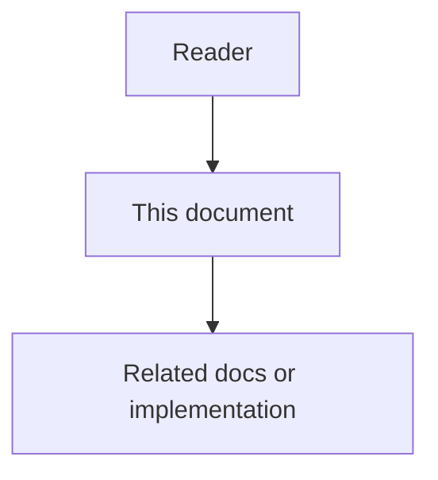

# Interoperability and Enterprise Ecosystem - Feature Specification

## Purpose

This phase connects different AI coding tools, models, IDEs, departments, humans, SDK clients, adapters, and external systems through a shared protocol, broker, developer platform, and operating model.

## Document flow

| Step | Actor | Action | Outcome |
| --- | --- | --- | --- |
| 1 | Reader | Opens this design document | Understands scope and constraints |
| 2 | Reader | Follows the Mermaid flow | Sees primary component interactions |
| 3 | Reader | Uses Related Documents / linked symbols | Reaches deeper design or implementation |

## Mission

This phase connects different AI coding tools, models, IDEs, departments, humans, SDK clients, adapters, and external systems through a shared protocol, broker, developer platform, and operating model.

## Feature 1 - Universal Agent JSON

A vendor-neutral message contract lets agents report intent, status, payload, dependencies, evidence, and next actions in a structured way.

## Feature 2 - Central Message Broker and Pub/Sub

Agents, IDE plugins, department workflows, SDK clients, adapters, and human systems communicate through authorized channels without direct coupling.

## Feature 3 - Vendor-Agnostic Adapters

Adapters normalize external tools and model providers into Astloom contracts and capability profiles.

## Feature 4 - Cross-Domain Operating System

Engineering events can trigger governed Tasks in DevOps, Marketing, Support, HR, Data, Security, Product, and Finance.

## Feature 5 - SDK And Developer Platform

Astloom provides first-class SDKs for agents, adapters, admin tools, browser clients, CLI tools, and tests. SDKs expose stable typed contracts, scoped clients, idempotency, retries, structured errors, event subscriptions, and audit-safe diagnostics.

## Feature 6 - Agent SDK And Adapter SDK

The Agent SDK helps agents report work, request context, submit evidence, request approval, and publish progress. The Adapter SDK helps connector authors declare capabilities, validate mappings, register connectors, normalize external errors, and report health.

## Functional Requirements

- Validate Universal Agent JSON messages.
- Route messages through authorized broker channels.
- Support replay and dead-letter handling.
- Normalize vendor-specific outputs.
- Inject scoped context into external tools.
- Enforce tenant and project boundaries.
- Provide TypeScript and Python SDK packages for first-party integration surfaces.
- Support scoped clients for organization, workspace, project, project group, actor, agent, and connector contexts.
- Support Agent SDK, Adapter SDK, Admin SDK, Browser SDK, CLI SDK, and Test SDK surfaces.
- Generate or validate SDK contracts from public API, event, and config schemas.
- Provide SDK test fakes, mock transport, contract fixtures, and live-test guardrails.
