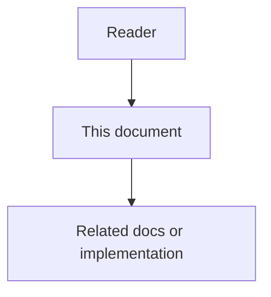

# Interoperability Ecosystem - High-Level Design

## Purpose

This HLD defines the system-level architecture for Interoperability Ecosystem. It explains the architectural intent, actors, components, data ownership, runtime flows, integration boundaries, operational expectations, and acceptance criteria. It is written for architects, senior engineers, product designers, reviewers, and operators who need enough context to implement the phase without relying on hidden assumptions.

## Document flow

| Step | Actor | Action | Outcome |
| --- | --- | --- | --- |
| 1 | Reader | Opens this design document | Understands scope and constraints |
| 2 | Reader | Follows the Mermaid flow | Sees primary component interactions |
| 3 | Reader | Uses Related Documents / linked symbols | Reaches deeper design or implementation |

## Mission

Connect agents, IDEs, model providers, repositories, ticket systems, approval systems, and enterprise tools through stable contracts, adapters, broker events, and capability discovery.

## Scope

The HLD covers:

- user and agent-facing responsibilities.
- service and component boundaries.
- data ownership and event ownership.
- high-level runtime flows.
- integration points with other Astloom phases.
- security, observability, reliability, and product-state requirements.
- acceptance criteria that prove the architecture is ready for implementation planning.

## Non-Goals

- It does not define framework-specific code structure.
- It does not define database migration syntax.
- It does not define command handlers, event handlers, persistence internals, or algorithm implementation details.
- It does not allow cross-project data access unless explicitly permitted by ProjectGroup policy.

## Primary Actors

- external agent.
- IDE extension.
- adapter-service.
- broker-service.
- api-gateway.
- ticket system.
- model provider.
- admin-console.

## Product And Engineering Capabilities

- Universal Agent JSON.
- connector registry.
- capability discovery.
- adapter mapping.
- Pub/Sub broker.
- event replay.
- external ticket sync.
- provider abstraction.

## High-Level Architectural Decisions

- The phase must expose behavior through service APIs, events, and documented contracts rather than shared database access.
- All records and queries must carry tenant, workspace, and project or ProjectGroup scope.
- Durable state changes must produce audit-friendly events with correlation and causation metadata.
- High-risk behavior must be reviewable through admin-console and auditable through audit-service.
- Documentation, memory, tasks, and reports must link back to source evidence.
- Batchable work should be deferred until meaningful boundaries unless policy requires immediate action.

## Component Model

The high-level component set is:

- api-gateway.
- adapter-service.
- broker-service.
- connector-registry.
- capability-registry.
- provider-adapters.
- ticket-adapters.
- IDE-adapter.

## Component Responsibilities

- api-gateway: owns the api gateway responsibility inside the Interoperability Ecosystem boundary.
- adapter-service: owns the adapter service responsibility inside the Interoperability Ecosystem boundary.
- broker-service: owns the broker service responsibility inside the Interoperability Ecosystem boundary.
- connector-registry: owns the connector registry responsibility inside the Interoperability Ecosystem boundary.
- capability-registry: owns the capability registry responsibility inside the Interoperability Ecosystem boundary.
- provider-adapters: owns the provider adapters responsibility inside the Interoperability Ecosystem boundary.
- ticket-adapters: owns the ticket adapters responsibility inside the Interoperability Ecosystem boundary.
- IDE-adapter: owns the IDE adapter responsibility inside the Interoperability Ecosystem boundary.

## Data Ownership

The phase owns or materially affects these data objects:

- UniversalAgentMessage.
- Connector.
- Capability.
- AdapterMapping.
- BrokerEvent.
- Subscription.
- DeadLetterRecord.
- ExternalRef.

Ownership rules:

- The owning service controls writes and lifecycle transitions for its entities.
- Other services consume public APIs, events, SDKs, or projections.
- Reports, memory retrieval, graph traversal, and prompt assembly must apply scope before selecting data.
- Audit records preserve evidence but do not become the write path for domain objects.

## High-Level Runtime Flows

The primary runtime flows are:

1. agent event to Universal Agent JSON to broker.
2. connector registration to capability discovery.
3. Task to external ticket and status sync.
4. provider callback to scoped platform event.

## Integration Boundaries

This phase integrates with:

- core-data-service for Activities, WorkLogs, Decisions, Issues, Tasks, and evidence references.
- memory-service when durable facts, retrieval context, repeated questions, or feedback are created.
- code-graph-service when code symbols, graph edges, ownership, or impact analysis are required.
- docs-sync-service when documentation anchors, drift findings, or documentation drafts are involved.
- rule-engine-service when policies, risk scoring, approvals, or escalations are required.
- broker-service for event delivery, replay, retry, and dead-letter behavior.
- admin-console for review, correction, approval, diagnostics, and operational control.
- audit-service for immutable evidence and compliance export.

## Security And Scope Model

Security requirements:

- All commands and queries require actor identity and scope.
- Project isolation is enforced before retrieval, ranking, aggregation, or prompt assembly.
- Cross-project access requires ProjectGroup policy and audit evidence.
- Sensitive fields are redacted before logs, prompts, reports, and external events.
- High-risk actions require approval or rule-engine evaluation.

## Observability Model

The phase must emit:

- structured logs with service, operation, scope, actor, correlation ID, and result.
- metrics for throughput, latency, failure count, retry count, and backlog.
- traces across API, worker, broker, persistence, and external calls.
- audit events for durable state changes, review decisions, corrections, and cross-project access.
- diagnostics that show effective config without secrets.

## Reliability And Failure Model

Reliability requirements:

- Commands that can be retried must be idempotent.
- Event consumers must tolerate duplicate and delayed delivery.
- Failed broker deliveries must move to retry and then dead-letter with evidence.
- Partial workflow failure must create visible operational state, Task, Gap, or alert.
- High-risk failure modes must not be hidden inside logs only.

## Product States

User-facing and operator-facing states should include:

- Connector: pending_configuration, validating, ready, degraded, disabled, failed, revoked.
- BrokerDelivery: pending, delivered, retrying, dead_lettered.
- AdapterMapping: draft, active, deprecated.

Additional UI states:

- loading.
- empty.
- permission_denied.
- degraded.
- failed.
- pending_review.
- partial_data.
- project_scope_warning.

## HLD Edge Cases

The architecture must explicitly handle:

- provider payload shape drift.
- duplicate callback.
- rate limit.
- expired credential.
- unsupported capability.
- dead-letter replay risk.

## HLD Acceptance Criteria

The HLD is complete when:

- actors, components, and data ownership are explicit.
- all major runtime flows have a named source, processor, output, and audit trail.
- cross-service communication happens through APIs, events, or contracts.
- project scope is enforced before data retrieval or aggregation.
- observability, security, and failure handling requirements are defined.
- product states and operator controls are clear enough for product design and implementation planning.
- implementation planning can derive commands, queries, events, state machines, and tests from this document.
