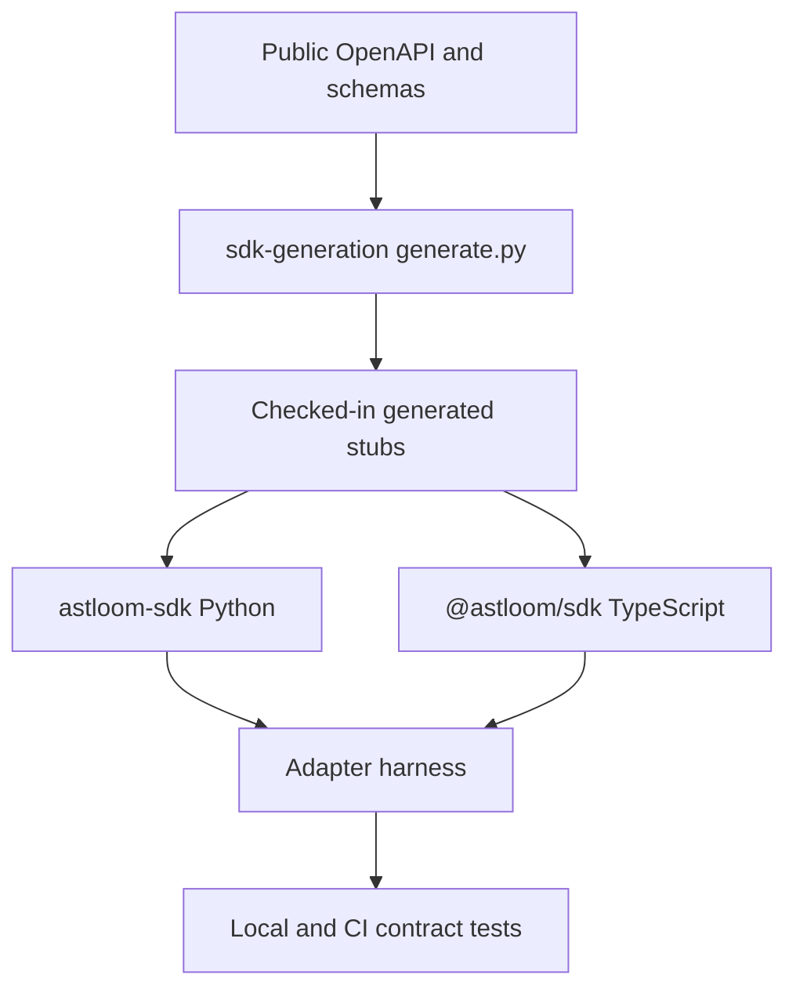

# 11 - SDK Release And Adapter Harness

## Purpose

Close GAP-T06 with binding decisions for first SDK languages, private registry naming,
generator ownership, and the adapter harness (capability declare/validate, secret-ref,
contract tests).

## Document flow

| Step | Actor | Action | Outcome |
| --- | --- | --- | --- |
| 1 | Platform | Publishes/contracts OpenAPI stub | Generator has a single input |
| 2 | Generator | Writes stubs under `sdk/generated/` | Checked-in artifacts stay reviewable |
| 3 | SDK packages | Wrap transport + headers | Python/TS clients stay parity |
| 4 | Adapter authors | Declare capabilities + secret-refs | Harness validates without secret values |
| 5 | CI / local | Runs contract runner + fixtures | Broken adapters fail before merge |

## Language prioritization

**Ship first (same milestone):** Python and TypeScript.

| Language | Package name | Install path |
| --- | --- | --- |
| Python | `astloom-sdk` (import `astloom_sdk`) | `backend/packages/astloom_sdk/` via `pip install -e '.[sdk]'` |
| TypeScript | `@astloom/sdk` | `backend/packages/sdk/typescript/` |

Rationale: web/admin and IDE plugins need TypeScript; automation and AI workflows need Python.
Other languages wait until the public contract surface stabilizes, then generate from the same OpenAPI/event/config schemas.

## Private registry and naming

| Surface | Registry | Artifact name |
| --- | --- | --- |
| Python | Private index (org PyPI / Artifactory) | `astloom-sdk` |
| TypeScript | Private npm scope | `@astloom/sdk` |

Rules:

- Do not publish Astloom SDK packages to public npm or public PyPI without explicit per-action consent.
- Version with semver aligned to the control-plane `astloom` version when possible.
- Source of truth remains this repository; registry packages are release mirrors.

## Generator ownership

| Output | Owner tool | Checked-in location |
| --- | --- | --- |
| Operation stubs (paths, methods, operationIds) | `backend/tools/sdk-generation/generate.py` | `backend/packages/sdk/generated/` |
| Hand-written transport clients | Platform SDK maintainers | `astloom_sdk`, `sdk/typescript/src/` |
| Event / config schema codegen | Same generator stack (extend later) | Same `generated/` tree |

Flow:

1. Edit the minimal OpenAPI stub (`backend/tools/sdk-generation/openapi-stub.yaml`).
2. Run `python backend/tools/sdk-generation/generate.py`.
3. Commit regenerated stubs; tests fail if regeneration drifts.

Generated clients do **not** replace domain helpers. Transport clients (`AstloomClient`) own URL joining, `X-Correlation-Id`, and `Idempotency-Key` parity across languages.

## Adapter harness

Path: `backend/packages/adapter_harness/`.

### Capability declare and validate

Adapters declare a capability map (`adapter_id`, `version`, capability ids). The harness
validates required capabilities are present and unknown required ids fail closed.

### Secret references

Adapters may reference secrets by **name only** (`SecretRef.name`). The harness and fixtures
must never accept, log, or serialize secret **values**. Resolution happens in the host
secrets plane outside the adapter process boundary.

### Contract tests

`run_contract_tests(adapter, cases)` executes declare → validate → optional invoke checks
against a mock adapter fixture. Unit tests under `tests/backend/packages/` cover the runner
and the mock fixture.

## First adapter plan

1. Implement harness + mock fixture (this change).
2. Next adapter: external VCS/tracker mirror (see `10-external-vcs-and-tracker-mapping.md`) using capability ids and secret-refs only.
3. Wire CI job to `pytest tests/backend/packages/test_adapter_harness.py` and SDK generation drift test.

## Verification

- `pytest tests/backend/packages/test_sdk.py tests/backend/packages/test_astloom_sdk.py tests/backend/packages/test_sdk_generation.py tests/backend/packages/test_adapter_harness.py`
- Regenerate stubs and confirm the generation test passes.
- Confirm TypeScript package name is `@astloom/sdk` and Python import is `astloom_sdk`.

## Related Documents

- `07-sdk-and-developer-platform.md` — SDK families and layering.
- `08-agent-communication-language-and-runtime-sdk.md` — runtime translators.
- `10-external-vcs-and-tracker-mapping.md` — first external adapter domain.
- `backend/packages/astloom_sdk/README.md` — Python package map.
- `backend/packages/adapter_harness/README.md` — harness package map.
