# 13 - External Ticketing Improvement Specification

## Purpose

Define the implemented hardening contract for the ExternalTicket slice verified in the live quality assessment.

## Implementation Status

**Implemented and verified on 2026-07-29; extended 2026-07-31; modularized 2026-08-01.** Adapter Service provides:

- scoped list/item queries with keyset pagination;
- optimistic concurrency, stale-update rejection, and same-state policy;
- per-mapping `status_map`, `reopen_policy`, `unknown_status_policy` / `fallback_status`, and `mapping_version`;
- dispatch create/retry/record plus outbox `TicketDispatchHandler`;
- optional outbound `:push-status` via `TrackerAdapter.update_remote_status`;
- local + env-gated Jira/Linear/GitHub Issues adapters under `backend/integrations/tickets/`;
- migrations `0003` (hardening) and `0004` (mapping policy);
- mandatory main-infrastructure live test and opt-in vendor sandbox;
- modular domain package `adapter_service/core/` (`models`, `tickets`, `connectors`, `broker`, `context`, `helpers`, `service`) with stable public imports.

AgentTicket lifecycle is implemented separately in `orchestration-service` and must not be conflated with ExternalTicket.

## Implementation Progress

Last updated: 2026-08-01

| ID | Spec anchor | Status | Code / tests |
|---|---|---|---|
| TKT-01 | Public API | [x] | Scoped list/item routes, filters, and keyset pagination |
| TKT-02 | Mutation Contract | [x] | Expected-version, stale-update, same-state, and reopening policy |
| TKT-03 | Data Contract | [x] | Entity in `core/models.py`, InMemory/PostgreSQL stores, and migration `0003` |
| TKT-04 | Events and Observability | [x] | Dispatch result/retry state and correlated outbox events |
| TKT-05 | Mandatory Unit and Integration Coverage | [x] | `test_adapter_service.py` + focused `test_external_tickets.py` for modular `core.tickets` |
| TKT-06 | Mandatory Local Live Coverage | [x] | Main PostgreSQL composition test and executable wrapper |
| TKT-07 | Contract and implementation documentation | [x] | Phase-5 module layout, READMEs, assessment, and this status table |
| TKT-08 | Optional Vendor Sandbox Coverage | [x] | Env-gated Jira/Linear/GitHub adapters + create/status push sandbox test |
| TKT-09 | Optional outbound status push | [x] | `TrackerAdapter.update_remote_status` + `:push-status` + `ExternalTicketStatusPushed` |

## Goals

- Make external-ticket state queryable through the public scoped API.
- Prevent silent lost updates.
- Make remote-state ordering and transition policy explicit.
- Distinguish local mirror persistence from remote tracker acknowledgement.
- Preserve portable base fields while supporting enterprise metadata.
- Provide repeatable live PostgreSQL and adapter-path verification.

## Non-Goals

- Replacing Astloom-native Issue, Task, or AgentTicket aggregates.
- Making Jira, Linear, GitHub, or another tracker the Astloom system of record.
- Embedding vendor-specific payloads into the portable core schema.
- Requiring cloud tracker credentials for the mandatory local test suite.
- Defining ticket-board frontend information architecture.

## Target Flow

```mermaid
flowchart LR
    A["Caller creates external-ticket mirror"] --> B["Adapter Service validates connector, scope, and idempotency"]
    B --> C["PostgreSQL stores local mirror"]
    C --> D["Outbox requests remote dispatch"]
    D --> E["Tracker adapter creates or updates remote ticket"]
    E --> F["Adapter normalizes acknowledgement or webhook"]
    F --> G["Version and remote timestamp checks"]
    G --> H["Mirror state and audit events update"]
    H --> I["Caller queries current ticket state"]
```



| Step | Actor | Action | Outcome |
|---|---|---|---|
| 1 | API caller | Creates a scoped mirror with an idempotency key | One local record exists |
| 2 | Adapter Service | Validates connector readiness and payload | Invalid work fails before persistence |
| 3 | PostgreSQL store | Persists the versioned mirror | Durable current state exists |
| 4 | Outbox relay | Dispatches through a tracker adapter | Delivery is retryable and observable |
| 5 | Tracker adapter | Normalizes remote acknowledgement or webhook | Vendor data cannot overwrite canonical scope |
| 6 | Adapter Service | Checks expected version and remote update ordering | Stale or conflicting updates are rejected |
| 7 | Query caller | Lists or retrieves the mirror | Operators see authoritative current state and dispatch health |

## Public API

Existing commands remain:

```text
POST /api/v1/projects/{project_id}/external-tickets
POST /api/v1/projects/{project_id}/external-tickets/{ticket_id}:sync-status
```

Implemented queries and dispatch commands:

```text
GET /api/v1/projects/{project_id}/external-tickets
GET /api/v1/projects/{project_id}/external-tickets/{ticket_id}
POST /api/v1/projects/{project_id}/external-tickets/{ticket_id}:retry-dispatch
POST /api/v1/projects/{project_id}/external-tickets/{ticket_id}:record-dispatch-result
POST /api/v1/projects/{project_id}/external-tickets/{ticket_id}:push-status
```

Connector registration may include mapping policy fields on the active `AdapterMapping`: `status_map`, `reopen_policy` (`allow_remote`|`deny`), `unknown_status_policy` (`reject`|`fallback`), `fallback_status`, and `mapping_version`.

List query parameters include:

- `connector_id`
- `status`
- `external_ref`
- `department`
- `updated_after`
- `page_size`
- `page_token`

Every query must enforce tenant, workspace, and project scope before returning existence information.

## Mutation Contract

Status synchronization accepts:

```json
{
  "status": "done",
  "expected_version": 3,
  "external_updated_at": "2026-07-28T19:00:00Z",
  "source": "webhook",
  "reason": "Remote tracker marked the issue complete"
}
```

Requirements:

1. `expected_version` must match the stored version.
2. `external_updated_at` must not be older than the last accepted remote update.
3. The same idempotency key and payload must return the prior result.
4. Reusing an idempotency key with different content must remain a conflict.
5. Same-state updates should not increment the version unless synchronization metadata changes.
6. Conflict responses must include current version, current status, and a stable reason code.

## Data Contract

The implementation retains the required identity fields and adds optional portable fields:

| Field | Purpose |
|---|---|
| `description_summary` | Short human-readable context without copying a full remote record |
| `priority` | Normalized project-defined priority |
| `severity` | Optional incident or defect impact |
| `assignee_ref` | Stable external or Astloom subject reference |
| `due_at` | Optional due or service-level target |
| `labels` | Normalized searchable categories |
| `remote_url` | Operator navigation to the external projection |
| `external_updated_at` | Ordering of remote status evidence |
| `last_sync_status` | `pending`, `succeeded`, `failed`, or `dead_lettered` |
| `last_sync_error` | Sanitized failure summary and reason code |
| `extension` | Size-bounded vendor data that cannot override canonical fields |

Secrets and raw authorization headers must never enter the record, outbox payload, error message, or extension field.

## State and Authority Policy

The portable states remain:

- `open`
- `in_progress`
- `done`
- `canceled`

The implementation must separate:

- local mirror lifecycle;
- remote tracker lifecycle;
- dispatch lifecycle.

A connector mapping may permit a remote direct transition such as `open → done`. The accepted transition records `mapping_version`, source, remote timestamp, correlation ID, and evidence reference on `ExternalStatusSynced`. Stale remote updates must not reverse newer state.

Reopen behavior is explicit per connector `reopen_policy` (`allow_remote` or `deny`). It must never be inferred from free-form text. Unknown vendor statuses follow `unknown_status_policy` (`reject` or `fallback` with `fallback_status`).

Outbound status updates use `:push-status`, which calls `TrackerAdapter.update_remote_status` and emits `ExternalTicketStatusPushed`.

## Events and Observability

The service keeps existing compatibility events and adds delivery-specific evidence:

- `ExternalTicketCreated` — local mirror persisted.
- `ExternalTicketDispatchRequested`
- `ExternalTicketDispatchSucceeded`
- `ExternalTicketDispatchFailed`
- `ExternalTicketStatusPushed`
- `ExternalStatusSynced`
- `ExternalStatusRejected`

Outbox events expose inputs for these operational metrics:

- create and status-sync latency;
- idempotency hit and conflict counts;
- expected-version conflict count;
- stale webhook rejection count;
- dispatch success, retry, dead-letter, and recovery counts;
- mirror-to-remote lag;
- query latency and pagination error count.

Structured event payloads contain record IDs, scope, connector ID, correlation ID, event type, and reason code without credentials or raw restricted payloads. A dashboard exporter is outside this service slice.

## Failure Behavior

| Failure | Implemented behavior |
|---|---|
| Connector not ready | Reject before local ticket creation |
| Duplicate command | Return the original record |
| Reused key with different payload | Return structured idempotency conflict |
| Expected-version mismatch | Return concurrency conflict without mutation |
| Stale remote update | Reject and emit `ExternalStatusRejected` |
| Remote tracker unavailable | Keep local mirror, mark dispatch failed, and retry through outbox policy |
| Permanent remote rejection | Dead-letter with sanitized reason and operator action |
| Cross-project ticket ID | Return scoped not-found without revealing existence |
| Unknown vendor status | Reject or map through an explicit configured fallback |

## Test Plan

### Mandatory Unit and Integration Coverage

- valid and invalid state mappings;
- optimistic concurrency conflict;
- stale remote timestamp rejection;
- same-state update behavior;
- list and item query filtering;
- stable pagination;
- cross-tenant, cross-workspace, and cross-project isolation;
- outbox dispatch success, retry, and dead-letter;
- redaction of credentials and restricted fields.

### Mandatory Local Live Coverage

A canonical `tests/live/adapter-service/` scenario should:

1. Start Adapter Service against real PostgreSQL.
2. Register and validate a deterministic local tracker adapter.
3. Create a ticket and repeat the command.
4. Synchronize status with `expected_version`.
5. Restart the application.
6. Retrieve the ticket through the item query.
7. Verify outbox events, remote acknowledgement, and exact persisted version.
8. Verify one concurrency conflict and one cross-project denial.

### Optional Vendor Sandbox Coverage

Jira, Linear, or GitHub Issues sandbox tests run only with explicit credentials and a dedicated test project. They are opt-in and not required for offline CI.

File: `tests/live/adapter-service/test_external_ticketing_vendor_sandbox.py`

Environment gates:

| Vendor | Required env |
|---|---|
| Jira | `ASTLOOM_JIRA_BASE_URL`, `ASTLOOM_JIRA_EMAIL`, `ASTLOOM_JIRA_API_TOKEN`, `ASTLOOM_JIRA_PROJECT_KEY` |
| Linear | `ASTLOOM_LINEAR_API_KEY`, `ASTLOOM_LINEAR_TEAM_ID` (+ `ASTLOOM_LINEAR_DONE_STATE_ID` for status push) |
| GitHub Issues | `ASTLOOM_GITHUB_TOKEN`, `ASTLOOM_GITHUB_OWNER`, `ASTLOOM_GITHUB_REPO` |

The sandbox covers remote create dispatch and outbound status push.

## Implementation Map

Implemented seams:

- routes and request models: `backend/services/adapter-service/src/adapter_service/api.py::build_app`
- entity and policy: `backend/services/adapter-service/src/adapter_service/core/models.py::ExternalTicket`
- commands and queries: `backend/services/adapter-service/src/adapter_service/core/tickets.py` / `core/service.py::AdapterService`
- focused unit regression: `tests/backend/services/adapter-service/test_external_tickets.py`
- tracker registry: `backend/services/adapter-service/src/adapter_service/trackers.py::build_tracker_registry`
- vendor HTTP adapters: `backend/integrations/tickets/{jira,linear,github-issues}/adapter.py`
- outbox dispatch: `backend/packages/outbox_relay/handlers.py::TicketDispatchHandler`
- persistence and pagination: `backend/services/adapter-service/src/adapter_service/postgres_store.py::PostgresStore`
- migrations: `0003_external_ticket_hardening.sql`, `0004_external_ticket_mapping_policy.sql`
- live regression: `tests/live/adapter-service/test_external_ticketing_main_infrastructure.py`
- process HTTP quality smoke: `tests/live/adapter-service/smoke_ticketing_quality.py`
- vendor sandbox: `tests/live/adapter-service/test_external_ticketing_vendor_sandbox.py`

## Acceptance Criteria

- [x] Scoped list and item queries return current persisted state.
- [x] Concurrent status writers cannot silently overwrite one another.
- [x] Stale remote updates cannot reverse newer accepted state.
- [x] Local persistence and remote dispatch status are independently observable.
- [x] Optional operational fields remain backward compatible.
- [x] Mandatory live tests pass without cloud credentials.
- [x] Opt-in vendor sandbox verification proves one real create and status round trip.
- [x] Process HTTP smoke against restarted adapter + orchestration services passes (`LIVE_SMOKE_PASS`, 2026-07-31).
- [x] Focused ExternalTicket unit suite for modular `core.tickets` passes (`test_external_tickets.py`, 2026-08-01).
- [x] Every mutation produces correlated, secret-safe audit evidence.
- [x] Product documentation continues to distinguish ExternalTicket from AgentTicket readiness.
- [x] Domain code is modular under `adapter_service/core/` with stable `adapter_service.core` imports.

## Related Documents

- [External Ticketing Live Quality Assessment](12-external-ticketing-live-quality-assessment.md)
- [External VCS And Tracker Mapping](10-external-vcs-and-tracker-mapping.md)
- [Agent Control Plane Product Boundary](../00-master-plan/07-agent-control-plane-product-boundary.md)
- `backend/services/adapter-service/docs/phase-5-api-contract.md`
