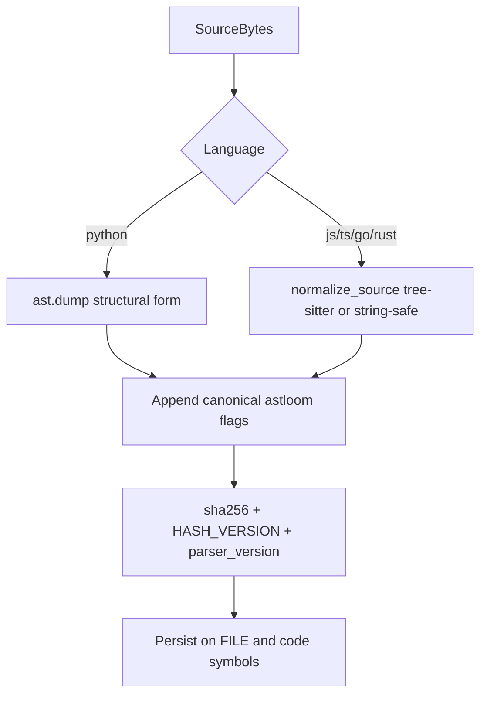

# 14 - AST Hash Stability Contract

## Purpose

Defines how Code-Knowledge Graph ingest computes **stable content hashes** so formatting-only
edits do not re-index files, while semantic edits and Astloom doc-flag comment changes do.
Resolves GAP-T01.

## Hash Pipeline

| Step | Actor | Action | Outcome |
| --- | --- | --- | --- |
| 1 | Ingest | Detect language; read source bytes | Language-scoped normalize path |
| 2 | `content_hash` | Build structural/normalized material + flags | `{hash, hash_version, parser_version}` |
| 3 | `file_ingest` / `file_symbols` | Upsert FILE and symbols with versions | Skip when hash+language unchanged |
| 4 | Operator | After `HASH_VERSION` bump, re-ingest roots | Cross-version digests not compared |

## Ownership

| Concern | Owner |
|---------|-------|
| Normalization + `content_hash` | `code_graph_service.domain.hashing` |
| Persist `hash_value` / versions | `file_ingest` / `file_symbols` + Store |
| Frozen regression corpus | `tests/.../hash_corpus/` |

## Algorithm Identity

| Field | Meaning | When to bump |
|-------|---------|--------------|
| `HASH_VERSION` | Normalization algorithm identity (constant in `hashing.py`, currently `3`) | Any intentional change to normalize rules or flag handling |
| `parser_version` | Parser backend identity (`stdlib_ast:X.Y` or `tree_sitter:<lang>:<pkg>`) | Interpreter major/minor or tree-sitter grammar package change |
| `hash` | `sha256` of language-correct hash material | Content / flag / algorithm change |

`content_hash(source, language)` returns `{hash, hash_version, parser_version}`.

Ingest **must** store `hash_version` and `parser_version` on FILE / code symbols (fields and
`metadata`) and include them on `FileIngested` events. After a `HASH_VERSION` bump, operators
re-ingest affected roots; stale digests are not compared across versions.

Client / server unchanged-skip publishes a FILE digest only when
`file_content_hash_publishable` is true: the file has function/method/class children,
**or** `metadata.ingest_complete` was stamped after a successful ingest (constants-only
modules). Incomplete FILE stubs written before a failed embed stay unpublished.

## Language-Correct Normalization

### Must not change the hash

- Indentation / blank-line / trailing-whitespace edits that preserve AST structure
- Ordinary comments that are **not** Astloom doc flags
- Insignificant token spacing that the language grammar elides

### Must change the hash

- Any semantic AST change (identifiers, literals, control flow, imports, signatures)
- Astloom doc-flag comment text changes (see below)
- Language switch for the same bytes (different normalizer)

### Python

1. Extract `# astloom:` comments via `tokenize` (string-safe).
2. Structural form = `ast.dump(ast.parse(source), annotate_fields=True, include_attributes=False)`.
3. On `SyntaxError`, tokenize fallback drops non-flag comments without splitting string literals.
4. Hash input = structural form + canonical flag lines.

**Forbidden:** `line.split("#")` style stripping (destroys `#` inside string literals).

### JavaScript / TypeScript / Go / Rust

1. Prefer tree-sitter parse; walk `comment` / `line_comment` / `block_comment` nodes.
2. Strip non-flag comment nodes from the byte stream; keep flag comments in the hash input.
3. Collapse remaining insignificant whitespace.
4. If tree-sitter is unavailable, use a string-aware regex fallback (never strip `//` / `/*`
   inside quotes).

## Astloom Doc-Flag Comments

Comments that **must** affect the hash (markers, case-insensitive):

- Python: `# astloom: ...`
- C-family: `// astloom: ...` or `/* astloom: ... */`

Canonical form in the hash input: `# astloom:<body>`.

Ordinary comments (`# note`, `// todo`) must **not** affect the hash.

## Generated-File Policy

| Marker / path cue | Policy |
|-------------------|--------|
| `@generated`, `Code generated by`, `DO NOT EDIT` headers | Still hash with this contract when ingested; do not invent a second algorithm |
| Build outputs under configured `exclude_dirs` / globs | Prefer **skip discovery** (not hashed) |
| Vendored / lockfile blobs | Prefer exclude; if forced ingest, opaque normalize still applies |

Generated sources are not exempt from flag rules: an `# astloom:` marker inside a generated
file still changes the digest.

## Persistence Contract

On FILE and parsed code symbols:

- `hash_value` — digest from `content_hash`
- `hash_version` — `HASH_VERSION`
- `parser_version` — `parser_version(language)`
- `metadata.hash_version` / `metadata.parser_version` — duplicate for Store ports that treat
  extras as metadata JSON

Equality for incremental skip: same `hash_value` **and** persisted language. Cross-version
compare is undefined; bump + full re-ingest.

## Verification

Frozen corpus: `tests/backend/services/code-graph-service/hash_corpus/`.

Required properties:

1. Format-only whitespace / ordinary-comment edit → **same** hash
2. Semantic edit → **different** hash
3. Astloom doc-flag edit → **different** hash
4. String literal containing `#` or `//` → **not** falsely stripped

## Related Documents

- `10-language-support-policy.md` — language matrix / parsers
- `48-ast-and-lsp-hybrid-parsing-adr.md` — durable AST SoT
- `03-ingestion-and-living-documentation-workflow.md` — ingest lifecycle
- `docs/10-gap-analysis/03-technical-implementation-gaps.md` — GAP-T01
