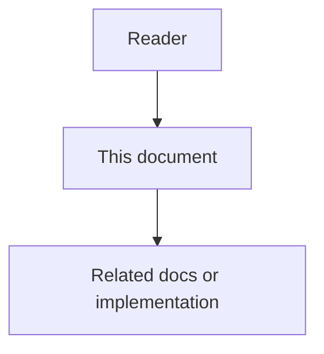

# 14 - Repository Code Wiki Feature Specification

## Purpose

This document specifies **Repository Code Wiki**: Astloom’s capability to generate and maintain holistic, structured, architecture-aware documentation for an entire connected repository — not only per-symbol living docs. It owns product requirements, workflows, permissions, and acceptance criteria. Runtime topology lives in the high-level design; algorithms live in the low-level design; wire shapes live in the contracts document.

Prior art (external): [Google Code Wiki](https://codewiki.google/) and the open-source [CodeWiki](https://github.com/FSoft-AI4Code/CodeWiki) framework ([paper](https://arxiv.org/abs/2510.24428)). Astloom does **not** vendor those products; it adopts the same job-to-be-done — repository-level wiki generation with hierarchy, cross-module analysis, and visual artifacts — as a governed platform capability on top of the Code-Knowledge Graph, LiteLLM routing, and Docs-as-Code sync.

## Document flow

## Professional Audience

Readers are expected to implement or review code-graph workers, LLM gateway profiles, docs-sync ingest, admin browse UX, and MCP retrieval tools without beginner tutorials on graphs or RAG.

## Problem Statement

Symbol-level living documentation answers “what does this function do?” It does **not** reliably answer:

- how the repository is structured end-to-end;
- how modules interact across files and packages;
- what the architecture and primary data/control flows are;
- where a new engineer or coding agent should start reading.

Without a repository-level wiki, humans and agents fall back to reading large trees of source, stale READMEs, or unbounded RAG dumps — high token cost and weak architecture awareness. External CodeWiki-style systems show that hierarchical decomposition plus multi-modal synthesis (text + diagrams) improves repository-level documentation quality; Astloom must deliver that outcome while remaining project-scoped, auditable, incremental, and integrated with existing graph and docs pipelines.

## Goals

- Generate a coherent **Repository Code Wiki** for a connected project: overview, module pages, cross-module interaction notes, and validated Mermaid (or equivalent) diagrams.
- Prefer **graph-grounded** structure (Code-Knowledge Graph module/file/symbol tree) over blind full-repo prompting.
- Support **full generate** and **incremental update** (regenerate only modules affected since a stored baseline commit or content hash).
- Expose the wiki to humans (admin / docs viewer) and agents (MCP query + context packs).
- Emit wiki pages as docs-sync-eligible Markdown with Full-tier frontmatter where applicable.
- Route all model calls through the LiteLLM application port and `ModelRoutingProfile` roles (cluster / main / leaf / diagram-validate).
- Keep generation jobs observable, cancellable, tenant-isolated, and cost-bounded.

## Non-Goals

- Replacing per-symbol living documentation on graph nodes (wiki **complements** it).
- Replacing Docs-as-Code drift detection or CI merge gates.
- Guaranteeing semantic correctness of generated prose without human review for high-risk surfaces.
- Shipping a fork of FSoft CodeWiki or embedding Google Code Wiki as a dependency.
- Executing project code during wiki generation.
- Auto-publishing generated wiki to public GitHub Pages without explicit operator action and policy.
- Claiming language coverage beyond the Code-Knowledge Graph language matrix (`10-language-support-policy.md`).

## Actors And Permissions

| Actor | Job | Permission notes |
| --- | --- | --- |
| Project admin | Configure wiki settings; trigger full/incremental generate; approve publish | Project write + generate + publish |
| Developer | Browse wiki; open linked symbols; propose corrections | Project read |
| Reviewer | Review generated pages before publish when policy requires | Review role; audit trail |
| Coding agent (MCP) | Resolve wiki overview / module page / search snippets into context | Usage Profile tool allow-list |
| Platform operator | Set org defaults for model profiles, budgets, retention | Org scope; audit required |
| Docs-sync / CI | Ingest published wiki Markdown; fail on invalid frontmatter | Service principal; read published tree |

## Product Workflow

### Configure

1. Operator enables Repository Code Wiki on a connected project (feature profile flag).
2. Operator sets include/exclude/focus patterns, doc style (`architecture` \| `api` \| `developer` \| `user-guide`), max depth, and model routing profile aliases.
3. Optional: custom agent instructions (bounded text) for tone and emphasis (for example “public APIs and usage examples”).

### Full generate

1. Operator or scheduled job starts `WikiGenerationJob` with mode `full`.
2. System builds or refreshes a hierarchical module tree from the Code-Knowledge Graph (and filesystem discovery for supported languages).
3. Recursive generation produces overview, module pages, and visual artifacts; Mermaid is validated before persist.
4. Job writes a draft wiki tree + `metadata.json` (commit SHA, module tree hash, model aliases, token usage).
5. Operator reviews (optional gate) then publishes; published pages become browsable and docs-sync eligible.

### Incremental update

1. Trigger: commit, PR update, manual “update wiki”, or CI with `--compare-to` semantics (baseline commit override).
2. System diffs module tree / file hashes against last successful generation metadata.
3. Only affected modules and dependent overview sections regenerate; unchanged pages keep prior content and ids.
4. Job records `updated_modules` and `skipped_modules` in metadata.

### Consume

1. Human opens wiki viewer: start at overview, navigate module tree, expand diagrams.
2. Coding agent calls MCP wiki tools (or receives wiki slices inside a context pack) instead of dumping the whole repo.
3. Corrections: human edits published page under docs-sync rules, or marks a page “stale” to force regenerate.

## Interaction State Model

| State | Meaning | UI / agent signal |
| --- | --- | --- |
| Disabled | Feature flag off | Hide generate; MCP tools absent |
| Empty | Never generated | CTA to run full generate |
| Queued / Running | Job in progress | Progress by stage + module; cancel available |
| DraftReady | Artifacts written, unpublished | Review + publish actions |
| Published | Browse + MCP resolve against published tree | Freshness badge vs HEAD commit |
| PartialSuccess | Some modules failed | Failed list + retry failed |
| Failed | Job aborted | Error class + diagnostics link |
| Stale | HEAD moved past baseline beyond policy threshold | “Update wiki” prompt |
| Degraded | Graph or LLM gateway unavailable | Fail closed on generate; serve last published if allowed |

## Information Architecture Impact

- Admin: project section **Code Wiki** (settings, jobs, draft/publish, viewer).
- Docs tree: published path convention under project docs root (design default `wiki/` sibling to human docs; exact path in LLD).
- MCP: wiki resolve / get-page / search tools under programming Usage Profiles.
- Context packs: optional `wiki_overview` and `wiki_module` slice kinds.

## System Behavior

- Generation must be idempotent per `(project_id, baseline_commit, config_hash)` for full mode: re-run with same inputs yields same page ids and stable filenames.
- Page ids are stable across incremental updates when the module key is unchanged.
- Diagrams that fail validation are not published; the page may ship with a placeholder and a `diagram_validation_failed` finding.
- Wiki prose must cite grounded anchors (file paths, qualified symbols) when claiming API or call edges; unsupported claims are omitted or marked low-confidence.
- Token and wall-clock budgets abort the job with `PartialSuccess` or `Failed` rather than unbounded spend.

## Owning Modules

| Concern | Owner |
| --- | --- |
| Module tree, change detection, graph reads | `code-graph-service` |
| Wiki job orchestration, page persist, publish | `code-graph-service` wiki subdomain **or** dedicated `code-wiki-service` (decision in HLD) |
| LLM calls | LiteLLM port via `llm_gateway` / `ModelRoutingProfile` |
| Published Markdown ingest + drift | `docs-sync-service` |
| MCP tool advertisement | `mcp-gateway-service` + Usage Profile allow-list |
| Admin viewer / job UI | Admin web interface |
| Object storage for large artifacts / HTML bundle | Platform object storage (optional viewer bundle) |

## Public Contracts

Normative shapes: [`17-repository-code-wiki-data-contracts-and-events.md`](17-repository-code-wiki-data-contracts-and-events.md). Minimum surface:

- REST/RPC: create job, get job, cancel job, publish draft, get page, list tree.
- MCP: `astloom_wiki_resolve`, `astloom_wiki_get_page`, `astloom_wiki_search`.
- Events: `WikiGenerationJobStarted`, `WikiGenerationJobCompleted`, `WikiPublished`, `WikiPageStale`.

## Data Model Impact

New entities: `WikiGenerationJob`, `WikiModuleTree`, `WikiPage`, `WikiArtifact`, `WikiPublishRecord`, generation `metadata` (baseline commit, compare-to, token usage, model aliases). Pages link to graph module/file/symbol ids where known. Published Markdown carries frontmatter (`doc_id`, `wiki_page_id`, `module_key`, `status`, `linked_symbols`).

## Event Flow

Job lifecycle events feed Activity/WorkLog. Publish emits docs-sync reindex hints. Stale detection emits `WikiPageStale` for orchestration or deferred-docs workflows. Failures emit structured findings consumable by Issues/Tasks when policy maps them.

## Configuration Impact

| Key (illustrative) | Purpose |
| --- | --- |
| `code_wiki.enabled` | Feature profile flag |
| `code_wiki.include` / `exclude` / `focus` | Path patterns (include replaces defaults; exclude merges) |
| `code_wiki.doc_type` | Style preset |
| `code_wiki.max_depth` | Hierarchical decomposition depth |
| `code_wiki.max_tokens*` | Output / per-module / leaf budgets |
| `code_wiki.model_profile` | LiteLLM aliases for cluster/main/leaf |
| `code_wiki.publish_requires_review` | Gate before browse/MCP published view |
| `code_wiki.stale_commit_threshold` | When to mark Stale |

## Security And Privacy Constraints

- Project isolation: no cross-project wiki read/write without project-group authorization.
- Treat generated and custom instructions as prompt-influencing content; audit who triggered jobs and who published.
- Redact secrets: generation must not copy `.env` / credential file contents into pages (exclude patterns mandatory).
- MCP tools inherit tenant/workspace/project scope; ignore client-supplied foreign ids.
- Optional HTML viewer bundles must not be world-readable by default.

## Failure Modes And Recovery

| Failure | Behavior |
| --- | --- |
| Graph incomplete / ingest lag | Refuse full generate or run with `degraded_graph=true` and lower confidence markers |
| LLM timeout / rate limit | Retry with backoff per gateway policy; mark module failed after budget |
| Mermaid validation fail | Keep text; drop invalid diagram; record finding |
| Partial module failures | `PartialSuccess`; allow retry-failed |
| Publish while job running | Reject publish |
| Docs-sync reject frontmatter | Block publish completion for offending pages; surface validation errors |

## Observability And Diagnostics

Emit job duration by stage, modules processed/skipped/failed, token usage by role, validation failure counts, publish latency, stale rate, MCP resolve latency, and cost estimates. Correlate with `job_id`, `project_id`, `baseline_commit`, and `correlation_id`.

## Testing And Verification

- Unit: module tree build, incremental selection, page id stability, frontmatter emission, Mermaid validation gate.
- Contract: job/page DTOs and MCP tool schemas.
- Live: generate wiki for a seeded sample repo; incremental update after one module change; MCP resolve returns overview; docs-sync indexes published pages.

## Rollout And Migration Notes

Documentation-first (this package). Implementation should land behind `code_wiki.enabled`, reuse code-graph ingest outputs, and avoid a second parser stack. Existing symbol-level docs remain authoritative for node detail; wiki pages should link down to symbols rather than duplicating full signatures when the graph already stores them.

## Product Metrics

- Time-to-first-overview for a newly connected mid-size repo.
- Share of coding sessions that fetch wiki overview/module before large refactors.
- Incremental vs full regenerate cost ratio.
- Stale wiki age distribution.
- Human edit rate on published pages (quality / trust signal).
- Diagram validation pass rate.

## Engineering Acceptance Criteria

- Full and incremental jobs are project-scoped, auditable, and budget-bounded.
- All LLM calls go through LiteLLM; no direct vendor SDKs in the wiki worker.
- Published pages are docs-sync eligible with stable `doc_id` / `wiki_page_id`.
- MCP tools are Usage Profile–gated and fail closed out of scope.
- Automated tests cover empty/running/partial/stale/degraded states.

## Product Acceptance Criteria

- A project admin can generate a browsable repository wiki with overview, at least one module page, and at least one validated architecture or flow diagram.
- After a scoped code change, incremental update regenerates affected modules without rewriting the entire tree.
- A coding agent can load wiki overview or a named module page via MCP without ingesting the full repository text.
- Operators can distinguish draft vs published and, when policy requires, block publish until review.

## Open Gaps

Tracked in [`18-repository-code-wiki-risks-challenges-and-acceptance.md`](18-repository-code-wiki-risks-challenges-and-acceptance.md).

## Related Documents

- [`15-repository-code-wiki-high-level-design.md`](15-repository-code-wiki-high-level-design.md) — system architecture and ownership.
- [`16-repository-code-wiki-low-level-design.md`](16-repository-code-wiki-low-level-design.md) — decomposition, agent recursion, incremental algorithms.
- [`17-repository-code-wiki-data-contracts-and-events.md`](17-repository-code-wiki-data-contracts-and-events.md) — DTOs, APIs, events.
- [`03-ingestion-and-living-documentation-workflow.md`](03-ingestion-and-living-documentation-workflow.md) — symbol-level living docs (complement).
- [`43-wiki-and-graph-composed-retrieval.md`](43-wiki-and-graph-composed-retrieval.md) — composed Wiki + graph Q&A (future).
- [`../03-docs-as-code-sync/01-feature-specification.md`](../03-docs-as-code-sync/01-feature-specification.md) — docs knowledge graph and drift.
- External: [CodeWiki](https://github.com/FSoft-AI4Code/CodeWiki), [codewiki.google](https://codewiki.google/).
