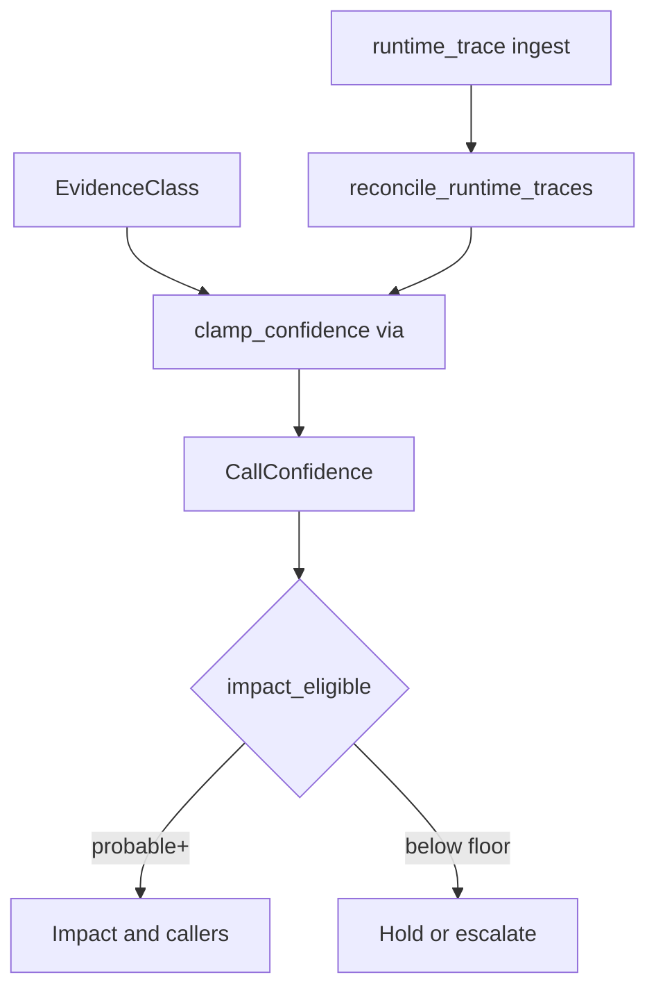

# 15 - Call Graph Confidence And Runtime Traces

## Purpose

Define how Astloom labels CALL-edge evidence, caps or boosts confidence, decides impact eligibility, and reconciles runtime-observed CALLS with static analysis (GAP-T02). Wrong high-confidence CALLS poison blast-radius tools; this standard keeps confidence honest.

## Evidence To Confidence Pipeline

| Step | Actor | Action | Outcome |
| --- | --- | --- | --- |
| 1 | Parser / DI / dispatch | Emit CALLS with provenance and proposed confidence | Static edge candidate |
| 2 | `confidence_policy.clamp_confidence` | Apply via caps or `runtime_trace` boost | Bounded `CallConfidence` |
| 3 | Impact / callers | Filter with `impact_eligible` (default floor `probable`) | Safe blast-radius edges |
| 4 | Runtime ingest | `ingest_runtime_traces` → reconcile | Boost matches, demote contradictions, emit observed |

## Evidence Classes

| Evidence class | Typical provenance / `via` | Confidence cap | Notes |
| --- | --- | --- | --- |
| `exact` | Direct AST name bind, unique target | `exact` | Same-language unique resolve |
| `ambiguous` | Multiple candidate targets | `ambiguous` | Keep all candidates; never invent a single winner |
| `di` | `di_injection`, framework inject | `probable` | FastAPI `Depends`, Nest constructor types |
| `dynamic` | `dynamic_dispatch` | `probable` | Interface / subclass synthesis |
| `reflection` | `reflection`, `monkeypatch` | `ambiguous` (or `unresolved`) | Never `exact` / `probable` |
| `unresolved` | Missing target symbol | `unresolved` | Placeholder `unresolved:*` nodes |
| `runtime_trace` | `runtime_trace` | up to `exact` via boost | Observed CALLS; reconcile with static |

Cross-language and package-manifest paths still cap at `probable` (see language support policy).

## Confidence Caps And Boosts

Implementation: `code_graph_service.domain.confidence_policy`.

- **Caps:** `di_injection` / `framework_route` / `dynamic_dispatch` → max `probable`; `reflection` / `monkeypatch` → max `ambiguous` (unchanged `unresolved` / `external`).
- **Boost:** `via=runtime_trace` raises one step on the ladder `unresolved → ambiguous → probable → exact`.
- **Demote:** contradicted static edges drop one step (and never remain `probable+` after contradiction).

## Impact Eligibility

Default floor for directed impact and ranked callers: **`probable`**
(`CallersRequest` / `ImpactRequest` / `rank_callers` / `directed_impact`).
Pass `min_confidence=null` only to disable the floor; use `ambiguous` to include
weaker static edges.

| Confidence | Default impact eligible? |
| --- | --- |
| `exact` | Yes |
| `probable` | Yes |
| `ambiguous` | Only when caller sets `min_confidence=ambiguous` |
| `external` | No (below default floor) |
| `unresolved` | No |

Runtime-confirmed edges that boost to `probable` / `exact` become impact-eligible under the default floor.

## Runtime Trace Hybrid Strategy

1. Client or harness POSTs observed CALLS to `POST .../graph/ingest-runtime-traces` (or calls `CodeGraphService.ingest_runtime_traces`).
2. Domain `parse_runtime_trace_payload` accepts `{ "calls": [ { source|caller, target|callee, call_site?, count? } ] }`.
3. `reconcile_runtime_traces`:
   - **Match** static CALLS → boost + `runtime_confirmed=true`, provenance `runtime_trace`.
   - **New** observed pair → emit CALLS with `provenance=runtime_trace`.
   - **Contradiction** (same `call_site` / caller-site key, different target) → demote static edge + `runtime_contradicted=true`.
4. Durable writers remain AST/runtime ingest only — never LSP dual-write (ADR 48).

## Accuracy Gate

Labeled corpus: `tests/backend/services/code-graph-service/call_graph_corpus/`.

Gate test computes precision/recall of predicted CALLS vs gold labels and fails below configured thresholds. Reflection / monkeypatch cases must stay at `ambiguous` or `unresolved`.

## Module Ownership

| Concern | Owner |
| --- | --- |
| Caps / boosts / impact eligibility | `domain/confidence_policy.py` |
| Parse + reconcile | `domain/runtime_traces.py` |
| Application ingest | `application/ingest/runtime_traces.py` |
| HTTP | `POST /api/v1/projects/{project_id}/graph/ingest-runtime-traces` |

## Acceptance Criteria

- Evidence class table above is implemented in `confidence_policy` / operating tests.
- `via=reflection` and `via=monkeypatch` never yield `exact` or `probable`.
- `via=runtime_trace` boosts confidence; reconcile boosts matches and demotes contradictions.
- HTTP or service ingest accepts runtime trace payloads.
- Corpus gate precision/recall thresholds pass.

## Related Documents

- `10-language-support-policy.md` — polyglot caps and DI provenance.
- `46-codebase-memory-neo4j-hybrid-low-level-design.md` — impact / callers algorithms.
- `48-ast-and-lsp-hybrid-parsing-adr.md` — durable SoR vs LSP session.
- `docs/10-gap-analysis/03-technical-implementation-gaps.md` — GAP-T02.
