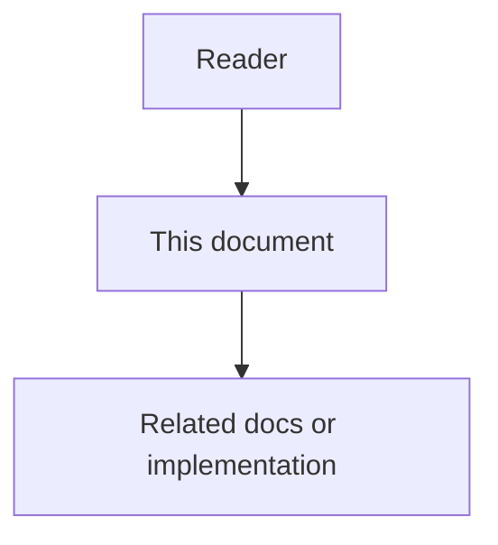

# 15 - Repository Code Wiki High-Level Design

## Purpose

This document defines the system-level architecture for Repository Code Wiki: how generation jobs, hierarchical module trees, publish, browse, and MCP delivery fit into Astloom. Algorithms and field-level models live in the low-level design; product requirements live in the feature specification.

## Document flow



| Step | Actor | Action | Outcome |
| --- | --- | --- | --- |
| 1 | Reader | Opens this design document | Understands scope and constraints |
| 2 | Reader | Follows the Mermaid flow | Sees primary component interactions |
| 3 | Reader | Uses Related Documents / linked symbols | Reaches deeper design or implementation |


## Architectural Decision

**Decision:** Implement Repository Code Wiki as a **wiki subdomain of `code-graph-service`** in the first delivery slice, with a clear internal package boundary so it can be extracted to `code-wiki-service` later if job volume or scaling requires isolation.

**Rationale:** Wiki generation depends on graph reads, hash diffs, language policy, and the same LiteLLM routing already owned by the code-graph vertical slice. A separate service too early duplicates ingest contracts and project scoping. Extraction criteria: sustained queue backlog, independent scaling of GPU/LLM workers, or a distinct release cadence.

**Alternatives considered:**

| Alternative | Rejected because |
| --- | --- |
| Shell out to upstream CodeWiki CLI | Breaks LiteLLM-only policy, project isolation, audit, and graph grounding |
| Docs-sync-service owns generation | Docs-sync owns indexing/drift, not multi-agent synthesis |
| Pure agent chat “write a wiki” | Non-deterministic, not incremental, not contract-tested |

## Architecture Overview

```text
Triggers (admin / CI / commit / schedule / MCP)
        |
        v
 Wiki Job Orchestrator (code-graph-service wiki package)
        |
        +---> Module Tree Builder <--- Code-Knowledge Graph (+ FS discovery)
        |
        +---> Hierarchical Planner (depth / token thresholds)
        |
        +---> Recursive Doc Agents ----- LiteLLM (cluster / main / leaf)
        |
        +---> Multi-Modal Synthesizer (Markdown + Mermaid validate)
        |
        +---> Draft Store (pages + artifacts + metadata)
        |
        +---> Publisher ---> project docs root / object storage
                    |
                    +---> docs-sync-service (reindex)
                    +---> Admin Wiki Viewer
                    +---> MCP Gateway (resolve / get-page / search)
```

Three conceptual stages (aligned with CodeWiki prior art, Astloom-owned):

1. **Hierarchical decomposition** — partition the repository into a coherent module tree while preserving architectural context.
2. **Recursive multi-agent processing** — generate documentation bottom-up or with controlled delegation under token/depth budgets.
3. **Multi-modal synthesis** — textual pages plus validated visual artifacts (architecture, data-flow, sequence, dependency).

## Main Components

| Component | Responsibility |
| --- | --- |
| Wiki Job Orchestrator | Create/cancel jobs; stage machine; budgets; idempotency keys |
| Module Tree Builder | Build `WikiModuleTree` from graph + include/exclude/focus |
| Hierarchical Planner | Decide cluster vs leaf work; max depth; fan-out |
| Recursive Doc Agents | Prompted generation per module with tool-limited edits |
| Diagram Validator | Node/Mermaid CLI or equivalent; reject invalid diagrams |
| Draft Store | Persist draft pages, artifacts, job metadata |
| Publisher | Atomic promote draft → published; write Markdown frontmatter |
| Wiki Query API | Tree list, get page, search for admin + MCP |
| MCP adapter | Map tools to query API under Usage Profile |

## Runtime Flow Full Generate

1. Client creates job `mode=full` with config snapshot (patterns, doc_type, depth, model profile).
2. Orchestrator records `baseline_commit` from the connected repo HEAD (or explicit SHA).
3. Module Tree Builder materializes tree; persists `module_tree.json`.
4. Planner assigns work units; workers generate leaf modules first, then aggregate parents, then overview.
5. Synthesizer attaches diagrams; validator gates artifacts.
6. Job reaches `DraftReady` (or `PartialSuccess` / `Failed`).
7. On publish, Publisher writes the published tree, emits `WikiPublished`, and notifies docs-sync.

## Runtime Flow Incremental Update

1. Job `mode=incremental` loads last successful `metadata.json` (or `compare_to` override).
2. Builder diffs file/module hashes and graph edges against baseline.
3. Planner marks dirty modules and parents that must refresh summaries.
4. Workers regenerate only dirty set; stable page ids retained for clean modules.
5. Metadata stores `updated_modules`, `skipped_modules`, new baseline.

## Boundary With Living Documentation

| Concern | Living docs (symbol) | Repository Code Wiki |
| --- | --- | --- |
| Grain | Function/class/method nodes | Module + repository |
| Trigger | Symbol hash change | Repo/module change set |
| Consumer | Context packs, symbol hover | Overview, architecture onboarding, MCP wiki tools |
| Storage | Neo4j node properties / side docs | Markdown wiki tree + job metadata |

Wiki pages **should link** to symbol docs and graph ids rather than re-generating full parameter tables when the graph already holds them.

## Boundary With Docs-as-Code Sync

Publisher emits human-readable Markdown that docs-sync indexes. Drift rules may treat wiki pages as machine-generated (`status: generated` or equivalent) with softer merge-block policy than human-owned architecture ADRs — exact policy is a project/org setting. Wiki generation must not bypass docs-sync frontmatter validation on publish.

## Boundary With LLM Gateway

All cluster/main/leaf/judge calls use LiteLLM aliases from `ModelRoutingProfile`. Subscription-CLI providers (Claude Code / Codex style) are out of scope unless a future ADR extends the gateway; default is API-compatible models already supported by Astloom.

## Security Boundary

- Job workers run with project-scoped credentials; no ambient host repo access outside the connected workspace roots.
- Prompt construction includes only allowlisted file excerpts and graph summaries; binary and secret-path excludes are enforced before prompt assembly.
- Published wiki ACL mirrors project documentation ACL.

## Operational Behavior

- Jobs are queued; concurrency limited per project and per tenant.
- Cancellation cooperative between stages.
- Retention: draft trees TTL configurable; published trees retained until replaced or project deleted.
- Optional static HTML bundle for offline browse is an export artifact, not the system of record.

## Performance And Scalability

- Prefer graph summaries and hierarchical aggregation over stuffing full file bodies into parent prompts.
- Cap parallel leaf workers; respect `max_tokens` / `max_token_per_module` / `max_token_per_leaf_module`.
- Large monorepos: require `focus` or path include filters when module count exceeds a configured threshold (fail with actionable error rather than silent truncation).

## Verification Strategy

Contract tests for job state machine and DTOs; integration tests with fixture repos; live test: full generate + incremental + MCP resolve on a seeded project. See risks/acceptance document for gates.

## Related Documents

- [`14-repository-code-wiki-feature-specification.md`](14-repository-code-wiki-feature-specification.md) — product requirements.
- [`16-repository-code-wiki-low-level-design.md`](16-repository-code-wiki-low-level-design.md) — algorithms.
- [`17-repository-code-wiki-data-contracts-and-events.md`](17-repository-code-wiki-data-contracts-and-events.md) — contracts.
- [`05-token-optimization-and-model-routing.md`](05-token-optimization-and-model-routing.md) — LiteLLM routing.
- [`../13-technology-stack-and-platform-decisions/09-litellm-llm-gateway.md`](../13-technology-stack-and-platform-decisions/09-litellm-llm-gateway.md) — gateway ADR.
