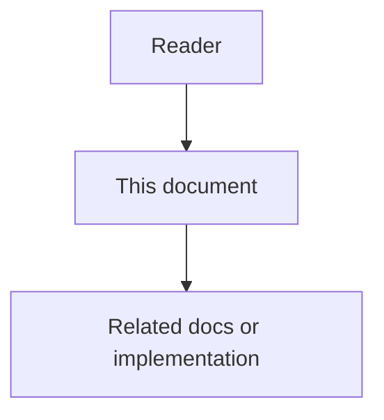

# 16 - Repository Code Wiki Low-Level Design

## Purpose

This document defines implementation-level algorithms and data shapes for Repository Code Wiki generation. System boundaries live in the high-level design; HTTP/MCP field contracts live in the contracts document.

## Document flow



| Step | Actor | Action | Outcome |
| --- | --- | --- | --- |
| 1 | Reader | Opens this design document | Understands scope and constraints |
| 2 | Reader | Follows the Mermaid flow | Sees primary component interactions |
| 3 | Reader | Uses Related Documents / linked symbols | Reaches deeper design or implementation |


## Module Key And Page Identity

| Field | Rule |
| --- | --- |
| `module_key` | Stable slash-separated path key from repo root, normalized (`src/api`), no trailing slash; root overview uses `module_key=""` or `"__root__"` (pick one in contracts; default `__root__`) |
| `wiki_page_id` | ULID/UUID assigned on first create; **immutable** across incremental updates for the same `module_key` |
| `doc_id` | `ac.wiki.<project_slug>.<module_key_slug>` for published Markdown; immutable while `module_key` lives |
| `content_hash` | Hash of normalized Markdown body + diagram source (excluding volatile timestamps) |

Renames: if graph/FS detects path rename with high confidence, migrate `module_key` and keep `wiki_page_id`; otherwise treat as delete+create.

## Include / Exclude / Focus Semantics

Aligned with CodeWiki CLI semantics for operator familiarity:

| Option | Behavior |
| --- | --- |
| `include` | When set, **replaces** default language/extension includes entirely |
| `exclude` | **Merged** with platform defaults (`.git`, `node_modules`, `__pycache__`, `dist`, `.venv`, secrets patterns, …) |
| `focus` | Modules documented in detail; non-focus ancestors may receive summary-only pages |
| `doc_type` | Prompt/style preset: `architecture` \| `api` \| `developer` \| `user-guide` |
| `instructions` | Optional bounded free-text appended to system/developer prompts (size-capped, audited) |

Glob support: `*.py`, `src/**/*.ts`, exact directory names, and comma-separated multi-patterns.

## Module Tree Construction

```text
1. List candidate files via graph File nodes ∩ include/exclude.
2. Map files → package/module nodes (language-aware: Python package, JS/TS folder, etc.).
3. Build tree by directory hierarchy; attach symbol counts, import edges, call edges aggregates.
4. Compute per-node `input_token_estimate` from summaries + top signatures (not full bodies by default).
5. Persist WikiModuleTree { nodes[], edges[], generated_at, baseline_commit }.
```

If the graph is empty or stale beyond threshold, optionally run a lightweight FS walk for tree structure only, mark `degraded_graph=true`, and restrict claims that require call/import edges.

## Hierarchical Decomposition

Inspired by dynamic-programming style clustering in CodeWiki prior art; Astloom uses **token thresholds + max depth** over the graph tree:

```text
function plan(node, depth, cfg):
  if depth >= cfg.max_depth or node.input_token_estimate <= cfg.max_token_per_leaf_module:
    return LeafWork(node)
  if node.input_token_estimate <= cfg.max_token_per_module:
    return ClusterWork(node, children=node.children)
  # too large: force split by children even if shallow
  return FanOut([plan(c, depth+1, cfg) for c in node.children])
```

Defaults (overridable): `max_depth=2`, `max_token_per_module≈36k`, `max_token_per_leaf_module≈16k`, `max_tokens` (output)≈32k — tune per model context via routing profile.

## Recursive Generation Order

1. Generate **leaves** in parallel (bounded concurrency).
2. Generate **clusters/parents** using child page summaries + selected edge highlights (not full child bodies).
3. Generate **overview** (`__root__`) from top-level module summaries + architecture template for `doc_type`.
4. Optional second pass: cross-links and “see also” using module_key references.

Each work unit prompt receives:

- module path and responsibility hypothesis from graph metadata;
- top-N symbols (name, signature, one-line living doc if present);
- import/call neighbors (capped);
- `doc_type` + `instructions`;
- schema for required sections (Purpose, Key types/APIs, Interactions, Risks).

Agents must not invent symbols absent from the supplied graph excerpt; if uncertain, omit or mark `confidence: low`.

## Multi-Modal Synthesis And Mermaid Validation

Allowed diagram kinds: `architecture`, `data_flow`, `dependency`, `sequence`.

```text
1. Model emits fenced mermaid (or structured diagram AST).
2. Validator parses syntax (Node mermaid-cli or equivalent service).
3. On failure: strip diagram; set page.flags.diagram_validation_failed; emit finding.
4. On success: store WikiArtifact { kind, source, content_hash } and embed in Markdown.
```

Do not publish invalid Mermaid into the published tree.

## Incremental Dirty-Set Algorithm

```text
baseline = metadata.baseline_commit or compare_to
changed_files = git_diff(baseline, head) ∩ include/exclude
dirty = modules covering changed_files
dirty |= parents(dirty) up to root   # summary refresh
dirty |= modules whose outbound/inbound edges to dirty changed (cap hop=1 default)
skip = all_modules - dirty
regenerate(dirty); keep pages for skip; update metadata
```

`--compare-to` / API `compare_to` overrides stored baseline and implies incremental mode (CI / squash-merge friendly).

## Published Tree Layout

Design default under the project documentation root:

```text
wiki/
  overview.md                 # __root__
  modules/
    <module_key_path>.md      # nested dirs allowed
  module_tree.json
  metadata.json
  artifacts/
    <wiki_page_id>/
      architecture.mmd
      ...
  index.html                  # optional export only
```

Each Markdown page frontmatter (minimum):

```yaml
doc_id: ac.wiki.example-project.src-api
title: "src/api"
doc_type: guide
status: generated
wiki_page_id: "..."
module_key: "src/api"
baseline_commit: "abc123"
linked_symbols: []
language: en
```

## Job State Machine

`queued → planning → generating → synthesizing → draft_ready → publishing → published`

Error forks: any stage → `failed`; generating with subset failures → `partial_success` (still may publish with gaps if policy allows).

Cancellation: set `cancel_requested`; workers checkpoint after each module; terminal `cancelled`.

## Idempotency

Full job idempotency key: `hash(project_id, baseline_commit, config_hash, mode=full)`. Duplicate create returns existing job. Incremental keys include `compare_to` and `head_commit`.

## Pseudo-Code Orchestrator

```python
def run_wiki_job(job):
    tree = build_module_tree(job.project_id, job.config)
    plan = hierarchical_plan(tree, job.config)
    dirty = all_modules(tree) if job.mode == "full" else compute_dirty(tree, job)
    for unit in order_units(plan, dirty):
        if job.cancel_requested:
            return cancelled(job)
        page = generate_page(unit, llm=job.model_profile)
        page = attach_validated_diagrams(page)
        save_draft(job, page)
    write_metadata(job, tree)
    return draft_ready(job)
```

## Related Documents

- [`15-repository-code-wiki-high-level-design.md`](15-repository-code-wiki-high-level-design.md) — components and boundaries.
- [`17-repository-code-wiki-data-contracts-and-events.md`](17-repository-code-wiki-data-contracts-and-events.md) — DTOs and events.
- [`03-ingestion-and-living-documentation-workflow.md`](03-ingestion-and-living-documentation-workflow.md) — symbol hash diffing reused for dirty hints.
