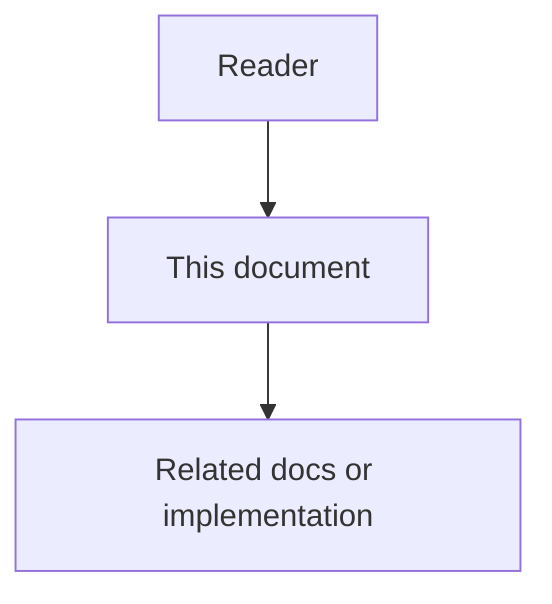

# 27 - Production Retrieval Stack Feature Specification

## Purpose

Make Code-Knowledge Graph **retrieval production-grade**: keyword search that
actually ranks like search engines, embeddings that are real models (not hash
stubs), multi-hop expansion via free Neo4j APOC, and community detection via
free Leiden — without commercial Neo4j GDS algorithm licenses.

## Document flow

| Step | Actor | Action | Outcome |
| --- | --- | --- | --- |
| 1 | Reader | Opens this design document | Understands scope and constraints |
| 2 | Reader | Follows the Mermaid flow | Sees primary component interactions |
| 3 | Reader | Uses Related Documents / linked symbols | Reaches deeper design or implementation |

## Goals

1. **BM25 lexical** for in-process ranking (`hybrid_search` / explore seeds).
2. **Store FTS**: Neo4j Lucene fulltext (v2 includes `file_path`) and Postgres
   `tsvector` / `ts_rank_cd` when the respective store is used.
3. **RRF hybrid** of BM25 + semantic + store FTS.
4. **Real embeddings by default**: `ASTLOOM_EMBEDDING_PROVIDER=local_bge`
   (BAAI/bge-large-en-v1.5, 1024-d) with LiteLLM optional and stub fallback.
5. **APOC expand** for neighbors / explore candidate growth when plugins exist.
6. **Free Leiden** via optional `scikit-network`; Louvain fallback otherwise.
7. **Transparency**: responses report `mode`, `embedding_backend`, `fts_method`,
   community `algorithm`, path `method`, neighbor `expansion`.

## Non-Goals

- Neo4j GDS **Enterprise** (paid key). GDS **Community** may be installed for optional `gds.degree` only; communities stay in-process — see [`32`](32-intentional-fallbacks-and-neo4j-plugin-licensing.md).
- GPL `leidenalg` / `igraph` dependencies.
- turbovec as Stage-1 SoR (forbidden — remains Stage-2 optional accelerator only).
- Replacing Neo4j SoR.

## User-visible behaviors

| Surface | Behavior |
| --- | --- |
| `search:hybrid` / MCP hybrid | BM25 + semantic + FTS → RRF; mode string names channels |
| `explore` | Hybrid seeds + CALLS flow + APOC expand when available |
| `neighbors` / structural | `apoc_expand` vs `one_hop` |
| `path` | Neo4j `shortestPath` when store supports it; else in-memory BFS |
| `architecture-overview` | Leiden (scikit-network) or Louvain; `algorithm` field |

## Acceptance sketch

- Unit tests green for BM25 ranking, hybrid modes, communities algorithm tag.
- Without GDS **Enterprise** key (and even without GDS plugin), architecture and expand still work; optional `gds.degree` only when Community plugin loads.
- Stub embeddings only when BGE/LiteLLM unavailable or provider=`stub`.
- Docs `27`–`32` match implemented APIs and intentional keepers.
