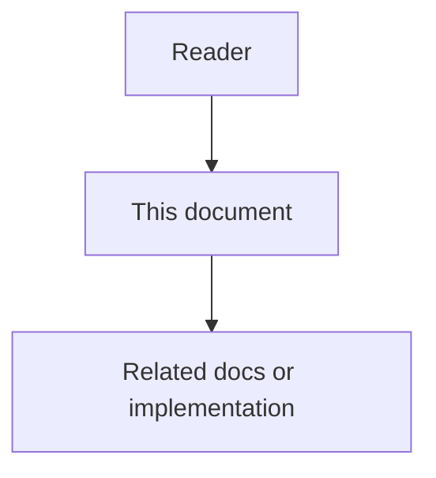

# 28 - Production Retrieval Stack High Level Design


## Purpose

Runtime topology for BM25, store FTS, BGE embeddings, RRF, APOC expand, and free Leiden communities inside code-graph-service.

## Document flow



| Step | Actor | Action | Outcome |
| --- | --- | --- | --- |
| 1 | Reader | Opens this design document | Understands scope and constraints |
| 2 | Reader | Follows the Mermaid flow | Sees primary component interactions |
| 3 | Reader | Uses Related Documents / linked symbols | Reaches deeper design or implementation |


## Topology

```text
Agent / MCP / HTTP
        │
        ▼
code-graph-service
  ├── IntelligenceUseCases.hybrid_search / explore / path / architecture
  ├── QueryUseCases.semantic_search / structural_query
  ├── HybridEmbeddings (local BGE → LiteLLM → stub)
  ├── domain.hybrid_search (BM25 + RRF)
  ├── domain.communities (scikit-network Leiden → Louvain)
  └── Store
        ├── Neo4jStore: Lucene FTS, APOC expand, Cypher shortestPath
        └── PostgresStore: tsvector FTS + (optional) pgvector via DATABASE_URL
```

## Channel fusion

`hybrid_search` builds three ranked id lists when available:

1. **BM25** over in-memory searchable documents (`searchable_text`).
2. **Semantic** via `semantic_search` (pgvector ANN when
   `ASTLOOM_CODE_GRAPH_DATABASE_URL` is set; else in-store cosine).
3. **Store FTS** via `Store.fulltext_search` (Neo4j Lucene or Postgres FTS).

Lists are fused with **Reciprocal Rank Fusion** (`k=60`).

## Embedding path

`bootstrap.build_embeddings` → `HybridEmbeddings`:

| Priority | Backend | Env |
| --- | --- | --- |
| 1 | Local BGE SentenceTransformer | `ASTLOOM_EMBEDDING_PROVIDER=local_bge` (default), optional extra `embeddings` |
| 2 | LiteLLM embed route | `ASTLOOM_LITELLM_EMBEDDINGS_ENABLED=true` |
| 3 | `LocalEmbeddingStub` | provider=`stub` or load failure |

Query embeddings use BGE query instruction (`is_query=True`); ingest passages stay raw.

## Graph traversal

| Capability | Implementation | License |
| --- | --- | --- |
| Multi-hop neighbors | `apoc.path.expandConfig` when `capabilities().apoc` | APOC Core (free with Community plugins) |
| Shortest path | Cypher `shortestPath` on `CODE_REL` | Neo4j core |
| Communities | `scikit-network` Leiden or in-process Louvain | BSD / clean-room (no GDS) |

## Module ownership

| Module | Path |
| --- | --- |
| BM25 / RRF | `domain/hybrid_search.py` |
| Communities | `domain/communities.py` |
| Embeddings wire | `llm_wiring.py`, `local_embeddings.py` |
| Neo4j FTS/APOC | `neo4j_store.py` |
| Postgres FTS | `postgres_store.py`, migration `0006_symbol_fts.sql` |
| Use cases | `application/intelligence.py`, `application/queries.py` |
