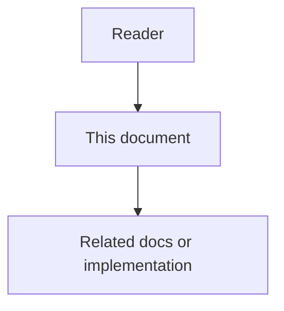

# 36 - Dead-Code Candidates And Cleanup Loop

## Purpose

This document specifies **dead-code intelligence** for the Astloom wedge: detect unused candidates from the Code-Knowledge Graph with **numeric confidence scores** and **evidence chains**, guide connected coding agents to remove proven-dead predecessors in the same change, and measure cleanup outcomes.

Astloom is not the executor. External IDE assistants and agent runtimes delete code. Astloom owns candidates, scoring, guidance seed content, freshness signals, and evidence for benefit measurement.

Product positioning: [`../00-master-plan/01-product-scope-and-feature-catalog.md`](../00-master-plan/01-product-scope-and-feature-catalog.md). Guidance seed: [`../15-agent-workspace-guidance/06-mcp-first-agent-skills-and-rules.md`](../15-agent-workspace-guidance/06-mcp-first-agent-skills-and-rules.md). Measurement: [`../09-platform-governance-operations/10-impact-reporting-and-benefit-measurement.md`](../09-platform-governance-operations/10-impact-reporting-and-benefit-measurement.md).

## Document flow



| Step | Actor | Action | Outcome |
| --- | --- | --- | --- |
| 1 | Reader | Opens this design document | Understands scope and constraints |
| 2 | Reader | Follows the Mermaid flow | Sees primary component interactions |
| 3 | Reader | Uses Related Documents / linked symbols | Reaches deeper design or implementation |

## Professional Audience

Engineers implementing `code-graph-service` and MCP gateway tools; product owners of the programming wedge; authors of Workspace Guidance seed packs.

## Goals

- Define unused candidates with explicit graph edge rules, **CallConfidence** policy, and **numeric scores**.
- Attach a machine-readable **evidence chain** on every finding.
- Scope cleanup to the task neighborhood or symbols touched by a replace; allow conservative **`project_scan`** for ranked discovery (never the agent default).
- Mark **live-until-proven** cases so agents skip unsafe deletes.
- Close the loop with guidance + measurable KPIs without Astloom mutating disk.

## Non-Goals

- Astloom auto-deleting files or rewriting the working tree (no CodemodService-style land).
- Claiming perfect unused detection across dynamic languages or string-based registries.
- Marketing unused detection beyond the v1 language matrix ([`10-language-support-policy.md`](10-language-support-policy.md)).
- Replacing IDE linters; this loop is graph-backed for AI coding sessions.
- Requiring external tools (Vulture/Knip) as the source of truth — the CKG remains SoT.

## Closed Loop

```mermaid
flowchart LR
  ingest[CKG ingest] --> graph[CODE_REL graph]
  graph --> score[DeadCodeScorer]
  score --> mcp[MCP unused_candidates]
  mcp --> agent[External agent]
  agent --> act[Prove and delete]
  act --> kpi[Activity KPIs]
```

| Step | Actor | Action | Outcome |
| --- | --- | --- | --- |
| 1 | Agent | Replaces or retires behavior | Graph may show orphans nearby |
| 2 | Astloom | Unused-candidate query + score | Ranked candidates with evidence |
| 3 | Guidance | Skill `astloom-remove-dead-code` | Agent proves then deletes |
| 4 | Agent | Deletes proven-dead code + exclusive tests | Working tree updated |
| 5 | Astloom | Activity / WorkLog KPI fields | Benefit measurement |

| Layer | Astloom owns | External agent owns |
| --- | --- | --- |
| Detect | Candidate query, score, evidence, blockers, freshness | Confirms dynamic/public API before delete |
| Guide | Seed always-on rule + `astloom-remove-dead-code` skill | Follows rule in the same coding change |
| Act | Never mutates repo | Deletes proven-dead code |
| Measure | KPIs and evidence linkage | Tests / acceptance as quality signals |

## Finding Kinds

| Kind | Meaning | Phase |
| --- | --- | --- |
| `unused_symbol` | Function/method/class with no qualifying inbound use from live roots | v1 |
| `unreachable_file` | No inbound `IMPORTS` to the file and all eligible exports unused | v1 |
| `dead_subgraph` | Mutual-only cluster with no inbound use from outside the cluster (SCARF whole-graph GC) | v1 |
| `flag_controlled_dead` | Stale feature-flag branch (Piranha-style) | v1 optional via `flag_states` |
| `zombie_package` | Package (≥2 files) with no external importers and all pool exports unused; default recommendation `retire` | v1 |
| `unwired_shared_package` | Same structural signal under `backend/packages/`, classified with `recommendation` `wire` or `keep_public` (never `safe_to_delete`). Full rules: [`79-shared-package-wiring-and-unwired-findings.md`](79-shared-package-wiring-and-unwired-findings.md) | v1 |
| `runtime_dead` | Reachable from live roots but zero `coverage_hits` | v1 optional via `coverage_hits` |

## Candidate Definition

### Reachability model (precision-first)

Within the declared scope and after the latest successful ingest:

1. **Live roots** = entrypoints in scope ∪ symbols with strong inbound use from **outside** the pool.
2. Propagate liveness along **strong use** edges (`exact` / `probable` confidence).
3. Symbols in the pool that remain unreachable from live roots are **unused candidates**.
4. Confidence is a **numeric score** (0.0–1.0) derived from visibility, freshness, blockers, and caps — scores only decrease via caps (Repowise/Vulture monotonic pattern).

### Scope

| Scope mode | Meaning |
| --- | --- |
| `task_neighborhood` | Symbols/files within N hops of anchors (default for agents) |
| `changed_symbols` | Symbols named in the change set |
| `explicit_paths` | Operator- or agent-supplied path prefixes |
| `project_scan` | Whole-project ranked discovery; requires a confidence floor (`min_confidence`, default `0.50` when omitted); hard `max_results`; **never** the programming-profile default |

Default for coding agents (MCP profile default): `task_neighborhood` with change-set anchors — that is anchors ∪ one-hop neighbors. Use `changed_symbols` only when the pool must be exactly the named symbols. Anchors required except for `project_scan`.

### Edge types consulted

Normative (see [`02-neo4j-schema-design.md`](02-neo4j-schema-design.md)):

- **Proof-of-live** inbound: `CALLS`, `IMPORTS`, `HTTP_CALLS`, `ASYNC_CALLS`, `ROUTES_TO`.
- **Not** proof of use: `CONTAINS`, `INHERITS_FROM`, `DOCUMENTED_BY`.
- **`CallConfidence` policy** (reuse domain `confidence_policy`):
  - `exact` / `probable` → strong use (propagates liveness).
  - `ambiguous` / `unresolved` → do **not** mark live; add evidence `weak_or_ambiguous_call_edge` and cap score.
  - `external` → treat target as live-until-proven (counts as strong use for safety).
- **`TESTED_BY` / test-path callers**: when the only strong references are from tests, **or** the symbol has outbound `TESTED_BY` to a test path with no production strong callers → `test_only: true`; not `safe_to_delete` unless production and tests are both unused.

### Numeric score and tiers

| Base | Condition |
| --- | --- |
| 0.95 | Private/unexported, no live-root reachability, fresh index, no blockers, containing file has other live importers |
| 0.80 | Same but public/exported within project |
| 0.70 | File-level orphan / `zombie_package` base |
| 0.65 | `unwired_shared_package` base (shared/contract surface; never `safe_to_delete`) |
| 0.55 | Recent / WIP path heuristics |

**Caps (evidence lines; score only decreases):**

| Cap | Max score | Evidence / blocker |
| --- | --- | --- |
| Hard blockers (entrypoint, HTTP, registry, `tsoc-defer`, external) | 0.40 | Matching blocker id |
| Freshness stale/pending | 0.50 | `freshness_*` |
| Dynamic-loader / config-path risk | 0.40 | `dynamic_import_nearby` / `runtime_load_path_risk` |
| WIP / scratch path heuristics | 0.55 | `wip_or_recent_path` |
| Recent file (`days_since_touch` < 30) | 0.55 | `recent_file_cap` |
| Weak / ambiguous call edge | 0.55 | `weak_or_ambiguous_call_edge` (always a blocker so the row surfaces) |
| Phase-2 string-name hit (graph corpus or injected search) | 0.45 | `string_name_reference` |
| Coverage runtime use (`coverage_hits` > 0) | 0.40 | `coverage_runtime_use` |

**Tiers:** `high` ≥ 0.80 · `medium` 0.50–0.79 · `low` &lt; 0.50.

**`safe_to_delete`:** `score ≥ 0.80` **and** empty hard blockers **and** `index_coverage.safe_absence_claims` **and** not `test_only`.

Agent default floor for acting on deletes: `min_confidence=0.80`. Discovery scans may use `0.50`.

### Evidence chain

Every finding includes `evidence: [{kind, detail}]`, for example `no_inbound_strong_use`, `unreachable_from_live_roots`, `freshness_ok`, `test_only`, `dead_subgraph_member`, `weak_or_ambiguous_call_edge`.

### Freshness

If freshness is `stale` or ingest is pending:

- Cap score; add freshness blockers.
- Do not claim live indexing (`safe_absence_claims=false`).
- Response includes `index_coverage` (`status`, `pending_count`, `safe_absence_claims`).

## Live-Until-Proven Exclusions

| Exclusion | Reason |
| --- | --- |
| `__getattr__` / lazy loaders / plugin registries | Dynamic resolution not visible as strong `CALLS` |
| String route / permission / feature-flag tables | Name referenced as data, not AST call |
| Public HTTP handlers, IAM permission strings, SDK exports | External callers outside the graph |
| Symbols referenced only from tests | `test_only`; delete tests **with** prod code when both are dead |
| Entrypoints (`__main__`, CLI `main`, framework `app`) | No inbound graph edges by design |
| User-approved `tsoc-defer:` stopgaps | Do not delete without root-cause fix |
| Ambiguous / unresolved `CALLS` | Cap score; do not treat as proof of life or of death alone |

Ambiguous candidates must appear with tier `low` or `medium`, non-empty `blockers` / evidence, and `safe_to_delete: false`.

## MCP Tool Contract

Tool name: `astloom_code_graph_unused_candidates`

### Request

| Field | Type | Required | Notes |
| --- | --- | --- | --- |
| `project_id` | string | no | Must match active MCP project when set |
| `scope_mode` | enum | yes | `task_neighborhood` \| `changed_symbols` \| `explicit_paths` \| `project_scan` |
| `anchor_symbols` | string[] | no | Required effectively for non-`project_scan` modes |
| `anchor_paths` | string[] | no | Repo-relative paths |
| `path_prefix` | string | no | Repo-relative directory/file prefix; **report** candidates only under this path. Liveness still uses the full project graph (cross-prefix callers keep callees live). Prefer for `project_scan` on large repos |
| `max_results` | int | no | Default 50; max 200 |
| `include_uncertain` | bool | no | Default false |
| `min_confidence` | number | no | Floor 0.0–1.0; default 0.0 for task modes; `project_scan` omits → `0.50`; agents acting on deletes should pass 0.80 |
| `triage` | bool | no | Advisory triage (local rules by default); cannot raise `safe_to_delete` |
| `disk_search` | bool | no | Bounded disk string-name search; requires `repo_root` |
| `repo_root` | string | no | Workspace/repo root for `disk_search` **and** shared-package disk classification (`wire` signals / `retire`) |
| `coverage_hits` | object | no | Map `symbol_id` → hit count; `>0` blocks delete; `0` is evidence only |
| `flag_states` | object | no | Feature-flag states for `flag_controlled_dead` (`constant_for_days` ≥ 90) |

### Response

```json
{
  "freshness": "ok|pending_sync|stale",
  "scope_mode": "changed_symbols",
  "path_prefix": "optional/when/set",
  "index_coverage": {
    "status": "ok|incomplete",
    "pending_count": 0,
    "safe_absence_claims": true,
    "note": "…"
  },
  "kpi_hints": {
    "dead_code_candidates_surfaced": 1,
    "dead_code_candidates_skipped_uncertain": 0,
    "dead_code_candidates_resolved": 0
  },
  "candidates": [
    {
      "symbol": "pkg.module.OldHelper",
      "symbol_id": "…",
      "path": "src/pkg/module.py",
      "kind": "function",
      "finding_kind": "unused_symbol",
      "score": 0.95,
      "confidence": "high",
      "test_only": false,
      "evidence": [{"kind": "unreachable_from_live_roots", "detail": ""}],
      "reasons": ["unreachable_from_live_roots"],
      "blockers": [],
      "safe_to_delete": true
    },
    {
      "symbol": "backend/packages/example_pkg",
      "symbol_id": "…",
      "path": "backend/packages/example_pkg",
      "kind": "package",
      "finding_kind": "unwired_shared_package",
      "recommendation": "wire",
      "score": 0.55,
      "confidence": "medium",
      "test_only": false,
      "evidence": [
        {"kind": "unwired_shared_package", "detail": ""},
        {"kind": "recommendation", "detail": "wire"}
      ],
      "blockers": ["unwired_shared_package", "recent_file_cap"],
      "safe_to_delete": false
    }
  ],
  "skipped_uncertain": []
}
```

**Status:** Tool is implemented and advertised on `programming-cursor-mcp` (`maps_to: code_graph.unused_candidates`). MCP default `scope_mode` is `task_neighborhood`; `project_scan` is opt-in discovery. Finding kinds include `zombie_package`, `unwired_shared_package` (with `recommendation`), and optional `runtime_dead` / `flag_controlled_dead`.

**`max_results` structure priority:** When truncating scored rows, prefer `unwired_shared_package` / `zombie_package`, then `unreachable_file`, then other kinds so package findings are not drowned by equal-score symbol noise. Details: doc 79.

## Configuration

Tuning is **per MCP call**, not via dedicated `.env` knobs:

| Knob | Where | Notes |
| --- | --- | --- |
| `min_confidence` | MCP request | Floor for returned rows; agents deleting should pass `0.8`. For `project_scan`, omitting the field applies discovery default `0.50`; an explicit `0.0` opts out of that floor. |
| `max_results` | MCP request | Hard cap (1–200) |
| `scope_mode` | MCP request | Task modes vs opt-in `project_scan` |
| `path_prefix` | MCP request | Report-only path filter; keep full-graph liveness |
| `include_uncertain` / `triage` | MCP request | Uncertain rows / advisory triage (`local_rules` engine) |
| `disk_search` + `repo_root` | MCP request | Disk string-name soft-blocker; `repo_root` also drives shared-package wire/retire classification (doc 79) |
| `coverage_hits` / `flag_states` | MCP request | Optional coverage / Piranha flag inputs |

Infrastructure env vars (`ASTLOOM_MCP_GRAPH_MODE`, Neo4j/Postgres URLs) already select the graph store. Do **not** add `ASTLOOM_DEAD_CODE_*` defaults unless an operator policy later requires org-wide floors without per-call args (YAGNI for v1).

## Phase roadmap (research-aligned)

| Phase | Deliverable |
| --- | --- |
| 1–3 (current) | Full scored loop: finding kinds (`unused_symbol`, `unreachable_file`, `dead_subgraph`, `zombie_package`, `unwired_shared_package`, `runtime_dead`, `flag_controlled_dead`), CallConfidence, graph+disk string-name, coverage/flags/triage ports, optional `path_prefix` report filter, quality-audit hint, MCP/skill/KPIs including `dead_code_candidates_resolved` placeholder. No separate Memory SoT for candidates. |

Scores only decrease via caps (monotonic). Agent MCP default scope is `task_neighborhood` (anchors ∪ one hop). Disk search remains opt-in.

## Agent Workflow (with guidance)

1. After replacing or retiring behavior, call unused-candidates **in the same change** (or `project_scan` with `min_confidence` and preferably `path_prefix` for discovery).
2. Prefer `safe_to_delete` and `score ≥ 0.80`; read `evidence` before acting.
3. Prove with repo search and non-Python callers (gateway, OpenAPI, frontend, deploy).
4. Delete symbol **and** exclusive tests / re-exports / docs that only described it.
5. Skip blockers / uncertain; optionally open a Task for human review. Do **not** treat Memory or chat notes as a durable unused-candidate queue — recompute from the graph (SoT).
6. Run the smallest verification that would fail if the delete were wrong.
7. Record cleanup in Activity / WorkLog using `kpi_hints` field names for instrumentation.

Normative skill text: `astloom-remove-dead-code` in phase 15 MCP-first seed pack.

## Measurement Hooks

Emit or attach to WorkLog / Activity (and echo on MCP as `kpi_hints`):

- `dead_code_candidates_surfaced` (count, scope).
- `dead_code_candidates_resolved` (removed after proof).
- `dead_code_candidates_skipped_uncertain`.

Blind deletes without tests/acceptance must not count as positive benefit.

## Risks And Acceptance

| Risk | Mitigation |
| --- | --- |
| False unused via dynamic dispatch | Exclusions + blockers + score caps; never auto-delete |
| Stale graph after local edits | Freshness caps; pending-sync banners |
| Agent deletes public API | Public/export/HTTP exclusions; score floors |
| Scope creep to whole repo | Default task/changed scope; `project_scan` opt-in only |
| LLM triage hallucination | Triage cannot raise `safe_to_delete`; graph remains SoT |

Acceptance:

- [x] Candidate definition, score model, and exclusions are unambiguous for implementers.
- [x] MCP request/response fields include score, evidence, finding_kind, project_scan, optional coverage/flags/disk_search/triage.
- [x] Finding kinds cover unused_symbol, unreachable_file, dead_subgraph, zombie_package, unwired_shared_package, runtime_dead, flag_controlled_dead.
- [x] Product docs state Astloom does not mutate the repo for cleanup.
- [x] Seed guidance references this loop and the skill name.
- [x] Impact KPIs name cleanup metrics; MCP returns `kpi_hints` including `dead_code_candidates_resolved` placeholder.
- [x] Optional `path_prefix` scopes reported candidates without dropping cross-prefix liveness; guidance forbids Memory as candidate SoT.
- [x] Shared-package `recommendation` and structure-priority truncation are specified (see doc 79).

## Related Documents

- [`80-phased-problematic-code-findings.md`](80-phased-problematic-code-findings.md) — future phased smell/risk findings on existing MCP hosts (docs-only until implemented).
- [`79-shared-package-wiring-and-unwired-findings.md`](79-shared-package-wiring-and-unwired-findings.md) — wiring `code-metadata` / `common-context` and package `recommendation` rules.
- [`78-stale-documentation-candidates-and-cleanup-loop.md`](78-stale-documentation-candidates-and-cleanup-loop.md) — sister stale-documentation loop.
- [`09-context-pack-retrieval-and-agent-workflow.md`](09-context-pack-retrieval-and-agent-workflow.md) — context packs around coding tasks.
- [`02-neo4j-schema-design.md`](02-neo4j-schema-design.md) — `CODE_REL` / `CALLS` / `IMPORTS`.
- [`22-code-intelligence-enhancements-feature-specification.md`](22-code-intelligence-enhancements-feature-specification.md) — explore / change-risk surfaces.
- [`../15-agent-workspace-guidance/06-mcp-first-agent-skills-and-rules.md`](../15-agent-workspace-guidance/06-mcp-first-agent-skills-and-rules.md) — seed rule and skill.
- [`../09-platform-governance-operations/10-impact-reporting-and-benefit-measurement.md`](../09-platform-governance-operations/10-impact-reporting-and-benefit-measurement.md) — cleanup KPIs.
