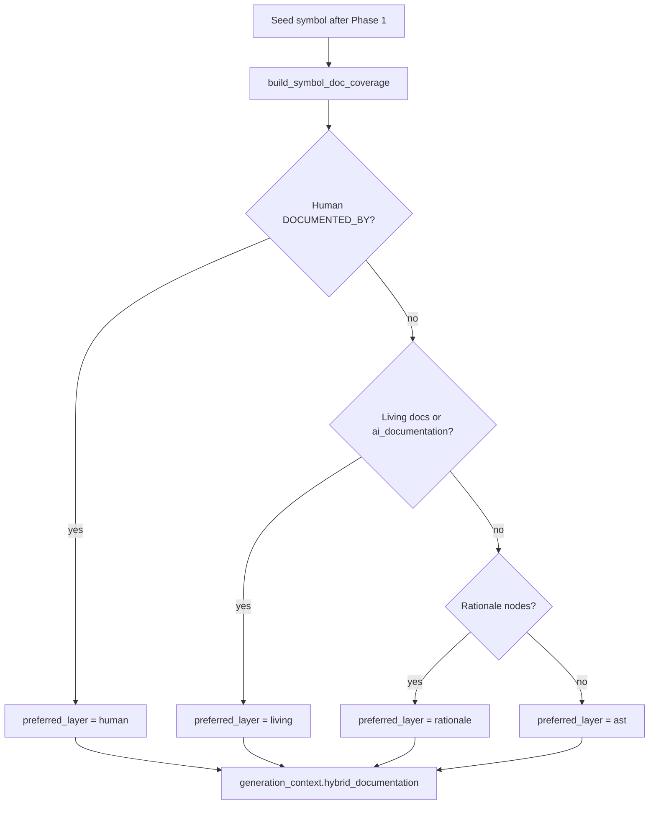
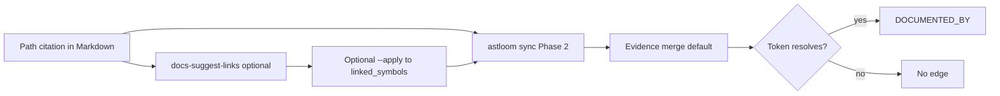

# Hybrid Documentation Coverage

## Purpose

Define how Astloom covers a code symbol with **layered documentation** so that missing
optional layers do not leave agents without context. This standard is the SSOT for the
hybrid **read path** (`generation_context.hybrid_documentation`) and the hybrid **write
path** (`astloom docs-suggest-links`). It also names every **optional** behavior so
operators and agents do not invent graph edges or silent shortcuts.

## Goals and Non-Goals

### Goals

- Always expose AST neighbor structure for ingested symbols.
- Prefer human Markdown when Phase 2 has resolved evidence `linked_symbols`.
- Fall back through living docs → rationale → AST when higher layers are absent.
- Keep link suggestions **evidence-only** (path citations / `path::Symbol` on disk).
- Document optional flags and skip cases so dry-run / apply behavior is predictable.

### Non-Goals

- NLP or embedding auto-pairing that writes `DOCUMENTED_BY` without resolve.
- Inventing symbol names that are not evidenced in Markdown or on disk.
- Replacing Full-tier authoring law or Phase 2 sync semantics.
- Requiring human docs, living LLM docs, or `# WHY:` comments for hybrid to function.

## Layer Model

| Layer | Required? | Source | Agent effect when present | When absent |
| --- | --- | --- | --- | --- |
| **AST** | Yes (after Phase 1 ingest) | Symbol + structural edges (`CALLS`, `IMPORTS`, `CONTAINS`, `INHERITS_FROM`, `ROUTES_TO`, `TESTED_BY`) | Neighbor list in hybrid pack | Symbol not ingested → out of scope for this pack |
| **Living** | Optional | Symbol `ai_documentation` and/or living `DOCUMENTED_BY` docs | Snippets when preferred | Prefer rationale, else AST |
| **Human** | Optional | `doc:human:…` via resolved `linked_symbols` after `astloom sync` Phase 2 | Highest preference for prompt snippets | Prefer living → rationale → AST |
| **Rationale** | Optional | `# WHY:` / `# NOTE:` / `# HACK:` → `RATIONALE` + `DOCUMENTED_BY` from file (or symbol) | Enrichment snippets | Prefer AST |

**Preference order (prompt snippets):** `human` → `living` → `rationale` → `ast`.

Pack fields (read path):

| Field | Meaning |
| --- | --- |
| `coverage` | Booleans for `ast` / `living` / `human` / `rationale` |
| `active_layers` | Layers present, in preference order |
| `gaps` | Optional layers not present (`living`, `human`, `rationale`) |
| `fallback_chain` | Fixed preference list |
| `preferred_layer` | First present layer in the chain |
| `layers.*` | Concrete neighbors / doc views (deduped by `symbol_id`) |
| `preferred_snippets` | Truncated texts from the preferred layer |
| `optional` | Operator hints for filling gaps (including deferred LLM pairing) |
| `invents_edges` | Always `false` on the read path |

## Read Path

Entry: `build_generation_context` → `build_symbol_doc_coverage`.

MCP tool: `astloom_code_graph_generation_context` returns the same pack under
`hybrid_documentation` and a short hybrid line in `prompt_context`.

| Step | Actor | Action | Outcome |
| --- | --- | --- | --- |
| 1 | Agent / CLI / MCP | Request generation context for a seed | Service loads seed + edges |
| 2 | Hybrid pack | Collect human / living / rationale / AST neighbors | Deduped layer lists |
| 3 | Hybrid pack | Choose preferred layer by chain | Snippets for prompts |
| 4 | Caller | Use pack; may still open source | No new graph edges |

## Write Path (evidence suggestions)

Command: `astloom docs-suggest-links` (dry-run / review).

**Also during `astloom sync` Phase 2:** the same evidence extractor runs by default,
merges new tokens into `linked_symbols` (optional FM write), then resolves — so operators
are not required to run `docs-suggest-links --apply` first when bodies already cite real paths.

| Mode | Behavior |
| --- | --- |
| Default dry-run | Scan `--docs-root` (default `docs`), report files with **new** evidence tokens |
| `--path FILE` | Single file; always reports that file (including zero suggestions) |
| `--docs-root DIR` | Optional alternate tree (e.g. `backend/docs`) |
| `--include-all` | Include files with zero new suggestions (already linked / no evidence) |
| `--apply` | Merge suggested tokens into YAML `linked_symbols` only |
| `--json` | Machine-readable report |
| Sync Phase 2 (default) | Same merge + resolve; catalog may reorder the docs queue |

**Hard rules:**

1. Tokens come only from path citations that resolve on disk (backtick `` `path` `` /
   `` `path::Symbol` ``, or the same path without backticks), where the file exists.
2. Suggest / apply **never** invent Neo4j edges; Phase 2 creates `DOCUMENTED_BY` only for tokens that resolve.
3. `--apply` (and sync FM apply) on Markdown **without** YAML frontmatter → `skipped_no_frontmatter` (no silent invent of frontmatter). Sync may still project provisional docs without edges until tokens resolve.
4. Unresolved tokens after sync still create **no** `DOCUMENTED_BY`.
5. Catalog tags/lanes never create edges.

| Step | Actor | Action | Outcome |
| --- | --- | --- | --- |
| 1 | Author | Cite real code paths in the body | Evidence on disk |
| 2 | Operator | Optional dry-run `docs-suggest-links` | Suggested `path::Symbol` list |
| 3 | Operator | Optional `--apply`, or rely on sync Phase 2 merge | Frontmatter updated or in-memory merge |
| 4 | Operator | `astloom docs-standards` then `astloom sync` | Edges only for resolved tokens |

## Optional Behaviors (explicit)

These are **supported or deferred** options. Hybrid works without them.

| Optional item | Status | Behavior |
| --- | --- | --- |
| Human Markdown + `linked_symbols` | Supported | Best prompt preference when resolved |
| Living LLM / heuristic `ai_documentation` | Supported when ingest fills it | Mid preference |
| `# WHY:` / `# NOTE:` / `# HACK:` | Supported on ingest | Rationale layer |
| `--docs-root` | Supported | Scan non-default doc trees |
| `--include-all` | Supported | Full scan visibility |
| Apply without frontmatter | Supported skip | Report `skipped_no_frontmatter`; do not invent FM |
| Already-linked evidence | Supported | Listed as `already_linked`; not re-suggested |
| Missing file for citation | Supported omit | Token not suggested (never invented) |
| Body-tier Markdown without Full-tier FM | Sync indexes provisionally | No `DOCUMENTED_BY` until FM + resolve |
| LLM / embedding free-form doc↔symbol pairing | **Deferred** | May *suggest* for humans later; **must not** auto-write `DOCUMENTED_BY` without evidence resolve. Use `docs-suggest-links` or sync Phase 2 evidence merge for evidence tokens today |
| Phase 2 catalog queue order | Supported | Prefer docs with evidence / `lifecycle_lane: current` when catalog cache exists |
| `ASTLOOM_SYNC_DOCS_EVIDENCE` / `_APPLY` | Supported | Disable evidence merge or FM write during sync |

## Operator Checklist

1. Write or fix Full-tier Markdown (authoring law).
2. Cite real code paths in the body when the doc explains code.
3. Optional: `astloom docs-suggest-links` (dry-run) → review → optional `--apply`.
4. `astloom docs-standards` → zero issues.
5. Optional: add `# WHY:` in source for rationale coverage.
6. `astloom sync` so Phase 1 + Phase 2 refresh AST / living / human edges (evidence merge on by default).
7. Agents / operators: `astloom_docs_catalog` to narrow Markdown by tags/lanes; then
   `astloom_code_graph_generation_context` (MCP) or `astloom graph generation-context`
   and read `hybrid_documentation`.

## Verification

| Check | How |
| --- | --- |
| Read pack prefers human | Unit: `tests/backend/services/code-graph-service/test_hybrid_doc_coverage.py` |
| Suggest evidence only | Unit: `tests/backend/tools/astloom-cli/test_docs_suggest_links.py` |
| Sync Phase 2 evidence | Unit: `tests/backend/tools/astloom-cli/test_docs_link_sync.py` |
| Doc standards | `astloom docs-standards` on this file |
| Edges only after sync | Manual / live: cite paths → sync → explore `DOCUMENTED_BY` |

## Related Documents

- [`03-ingestion-and-living-documentation-workflow.md`](./03-ingestion-and-living-documentation-workflow.md) — Phase 1 / Phase 2 sync.
- [`42-documentation-catalog-and-lane-cache.md`](./42-documentation-catalog-and-lane-cache.md) — catalog + sync queue.
- [`04-graph-guided-code-generation-workflow.md`](./04-graph-guided-code-generation-workflow.md) — generation context usage.
- [`09-context-pack-retrieval-and-agent-workflow.md`](./09-context-pack-retrieval-and-agent-workflow.md) — context packs.
- [`../agents/TEAM-HANDOUT-astloom-documentation-complete.md`](../agents/TEAM-HANDOUT-astloom-documentation-complete.md) — team LIST E hybrid.
- [`../08-software-engineering-architecture/42-astloom-cli-command-reference-continued-continued-continued.md`](../08-software-engineering-architecture/42-astloom-cli-command-reference-continued-continued-continued.md) — CLI detail for `docs-suggest-links`.
