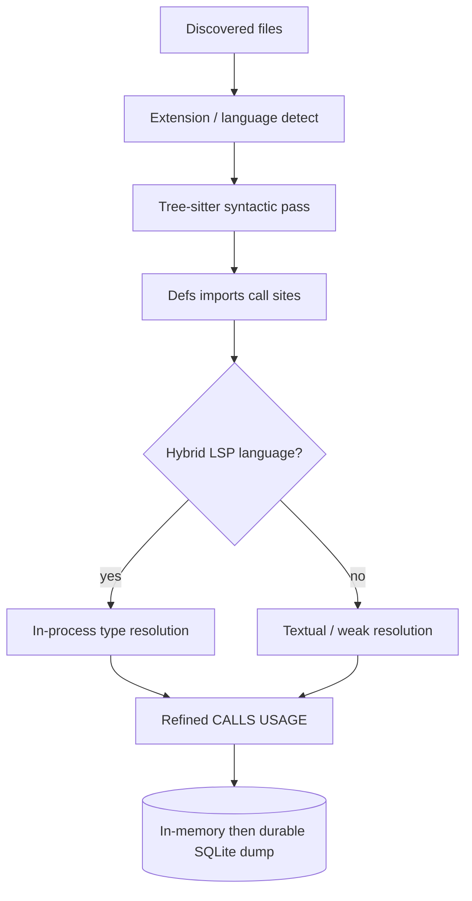
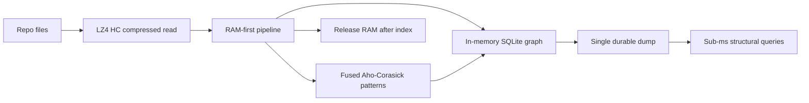

# 52 - Codebase-Memory Language Breadth And Indexing Speed

## Purpose

Document **how** upstream [DeusData/codebase-memory-mcp](https://github.com/DeusData/codebase-memory-mcp)
(MIT, Copyright (c) 2025 DeusData) supports on the order of **158 languages** and
achieves its published **indexing / query speed**, then map what Astloom should
**adopt as ideas**, **adapt**, or **avoid**.

This is prior-art analysis only. Astloom does **not** vendor the C binary,
vendored grammar tree, or Hybrid LSP C sources — see
[`21`](21-code-intelligence-prior-art-ideas-and-license.md) and
[`THIRD_PARTY_NOTICES.md`](THIRD_PARTY_NOTICES.md). Upstream numbers below are
**their** claims (README / BENCHMARK / arXiv:2603.27277), not Astloom SLOs.

## License And Evidence Basis

| Item | Value |
| --- | --- |
| Upstream | DeusData/codebase-memory-mcp |
| License | MIT — Copyright (c) 2025 DeusData |
| Primary sources | Upstream `README.md` (Languages, Hybrid LSP, Performance, Architecture), `docs/BENCHMARK.md`, paper arXiv:2603.27277 |
| Astloom policy | Ideas only; clean-room on Neo4j (`44`–`47`); language growth via [`10`](10-language-support-policy.md) |

## How ~158 Languages Work

### Mechanism (upstream)

Breadth is not “158 custom compilers.” It is:

1. **Vendored tree-sitter grammars** compiled into one **static Pure C binary**
   (`internal/cbm/` in upstream layout). Adding a language ≈ ship another grammar
   + extraction hooks, not a new runtime install.
2. **One syntactic pass for every language** — definitions, imports, call sites
   from the AST. Quality varies by grammar maturity; upstream still returns *some*
   graph for languages without deeper resolution.
3. **Optional second pass: Hybrid LSP** for a smaller set (~10 families: Python,
   TS/JS/JSX/TSX, PHP, C#, Go, C/C++, Java, Kotlin, Rust, Perl). This is a
   **lightweight in-process type-resolution layer** inspired by language-server
   algorithms — **not** spawning tsserver/pyright/gopls. It refines `CALLS` /
   `USAGE` / `RESOLVED_CALLS` using import graphs and cross-file registries.
4. **Quality tiers** (upstream BENCHMARK / README): Excellent (≥90%), Good
   (75–89%), Functional (<75%), plus many “supported but not yet benchmarked”
   languages (config/markup/DSL included: YAML, Dockerfile, HCL, Markdown, …).
5. **IaC as first-class nodes** — Dockerfiles, Kubernetes manifests, Kustomize
   overlays as graph nodes with cross-references (separate from “programming
   language” count but expands what agents can query).

| Step | Actor | Action | Outcome |
| --- | --- | --- | --- |
| 1 | Discover | Walk repo; apply ignore layers; skip symlinks | File set |
| 2 | Pipeline | Map path → grammar; run tree-sitter | Syntactic symbols/edges |
| 3 | Hybrid LSP (subset) | Import + type registry refine | Higher-confidence calls |
| 4 | Store | RAM graph → single dump | Queryable project graph |

### Why this feels “unlimited”

| Lever | Effect |
| --- | --- |
| Shared extraction engine + grammar plugins | Linear cost per language vs N parsers from scratch |
| Compile-time vendoring | Zero per-machine grammar installs; no npm/pip language packs |
| Degraded mode for non-Hybrid languages | Coverage without blocking on perfect types |
| Config/markup grammars counted | Headline “158” includes non-application languages |

### Astloom mapping (language breadth)

| Upstream choice | Astloom stance |
| --- | --- |
| 158 grammars in one binary | **Avoid** vendoring. Grow via [`10`](10-language-support-policy.md) matrix (Python required; TS/JS/Go/Rust/Java via adapters) |
| Hybrid LSP in-process C | **Adapt differently** — ADR [`48`](48-ast-and-lsp-hybrid-parsing-adr.md): durable edges from AST only; real IDE LSP is `ide_semantic` + reconcile (`49`), never dual-write SoR |
| Quality tiers / honesty | **Adopt** — publish Astloom language tiers from our evals, not upstream % |
| IaC nodes | **Adapt** later (CI-39); not v1 coding wedge |

## How Indexing And Queries Get So Fast

### Published upstream performance (their hardware)

Upstream README (Apple M3 Pro claims):

| Operation | Reported time | Scale note |
| --- | --- | --- |
| Linux kernel full index | ~3 min | 28M LOC, ~75K files → millions of nodes/edges |
| Linux kernel fast index | ~1m 12s | Smaller node set |
| Django full index | ~6s | ~49K nodes, ~196K edges |
| Cypher / structural query | sub-ms–tens of ms | Traversal on built graph |
| Name search | <10ms | Pre-filter then graph |
| Trace path (depth 5) | <10ms | BFS on edges |

Also claimed: five structural MCP queries ≈ **3.4k tokens** vs ≈ **412k** file-by-file
(≈99% reduction). Treat as prior-art motivation, not Astloom marketing copy
([`47`](47-codebase-memory-neo4j-hybrid-risks-and-acceptance.md)).

### Speed stack (upstream mechanisms)

| Step | Actor | Action | Outcome |
| --- | --- | --- | --- |
| 1 | Reader | LZ4 HC compressed reads | Less I/O wait |
| 2 | Pipeline | Multipass in RAM: structure → defs → calls → HTTP → config → tests | Few disk round-trips mid-index |
| 3 | Matcher | Fused Aho-Corasick for multi-pattern scans | Cheap route/config/test heuristics |
| 4 | Store | In-memory SQLite; one dump at end | Avoid per-edge fsync storms |
| 5 | Runtime | Pure C static binary; zero managed runtime | Low constant factors |
| 6 | Query path | Pre-built graph + indexes; BFS/Cypher subset | Agents pay once at index, not per Grep |
| 7 | Lifecycle | Release memory after indexing | Host stays usable |

Additional amplifiers:

- **Static binary / no language-server processes** during index (Hybrid LSP is in-process).
- **Git watcher / incremental re-index** after first full index (auto_watch).
- **Ignore layers** (hardcoded + `.gitignore` + `.cbmignore`) cut work early.
- **Token speed** for agents = structural MCP tools, not raw LOC/s alone.

### Astloom mapping (speed)

| Upstream lever | Astloom stance |
| --- | --- |
| RAM-first + in-memory SQLite SoR | **Avoid** as SoR (Neo4j + Postgres/pgvector). May still **adapt** batching / fewer fsync mid-ingest |
| Pure C single binary | **Avoid** as product shape; keep Python service + native parsers where justified |
| Multipass pipeline | **Adopt idea** — already mirrored in ingest phases; keep explicit sync (`03`, RPM `37`–`40`) |
| Aho-Corasick / fused heuristics | **Adapt** for route/HTTP/test linking (domain extractors), not a C port |
| Sub-ms local SQLite queries | **Adapt expectation**: Neo4j structural tools must stay **compact and hop-bounded** (`44`–`46`, CI-49) |
| Continuous watcher daemon | **Avoid** host-wide CBM daemon (CI-47); prefer explicit sync + pending freshness |
| Ignore layers (gitignore / project ignore) | **Shipped:** sync merges `.gitignore` + `.astloomignore` (CI-45); see [`53`](53-repomix-prior-art-ideas-and-license.md) |
| CPU/worker budgeting | Astloom path: [`50`](50-sync-cpu-budget-and-store-concurrency-lld.md) |

## Transfer Checklist (normative for engineers)

When citing CBM language breadth or speed in Astloom designs:

1. Attribute MIT DeusData; link this doc + `21` + `THIRD_PARTY_NOTICES`.
2. Do not promise 158 languages or 3-minute kernel indexes as Astloom SLOs.
3. Prefer incremental matrix growth ([`10`](10-language-support-policy.md)) over grammar vendoring.
4. Keep durable CALLS on AST; use IDE LSP only as `ide_semantic` ([`48`](48-ast-and-lsp-hybrid-parsing-adr.md)).
5. Invest speed in: ignore filters, incremental sync, bounded hops, compact MCP packs — not SQLite SoR replacement.

## Related Documents

- [`21-code-intelligence-prior-art-ideas-and-license.md`](21-code-intelligence-prior-art-ideas-and-license.md) — idea catalog CI-33…CI-53
- [`THIRD_PARTY_NOTICES.md`](THIRD_PARTY_NOTICES.md) — MIT notice text
- [`10-language-support-policy.md`](10-language-support-policy.md) — Astloom language matrix
- [`44`](44-codebase-memory-neo4j-hybrid-feature-specification.md)–[`47`](47-codebase-memory-neo4j-hybrid-risks-and-acceptance.md) — Neo4j hybrid pack
- [`48-ast-and-lsp-hybrid-parsing-adr.md`](48-ast-and-lsp-hybrid-parsing-adr.md) — AST vs LSP SoR
- [`50-sync-cpu-budget-and-store-concurrency-lld.md`](50-sync-cpu-budget-and-store-concurrency-lld.md) — Astloom sync speed levers
- External: [codebase-memory-mcp](https://github.com/DeusData/codebase-memory-mcp), [arXiv:2603.27277](https://arxiv.org/abs/2603.27277)
