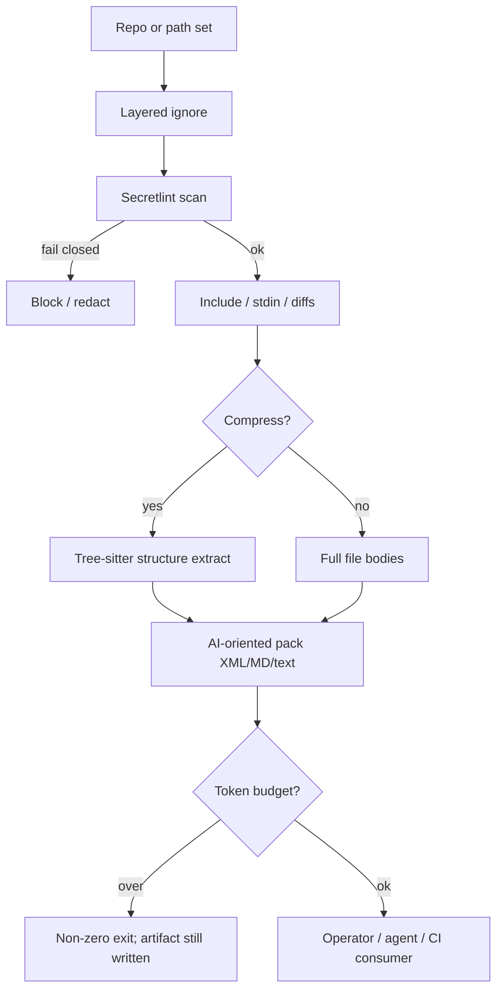

# 53 - Repomix Prior Art Ideas And License

## Purpose

Catalog **ideas** from [yamadashy/repomix](https://github.com/yamadashy/repomix) that
Astloom may adopt for **AI-oriented repository packing**, **token budgeting**,
**secret-safe export**, and **structure-preserving compression**. State MIT / IP rules
and map each idea to Astloom surfaces (context packs, explore skeletonization,
LiteLLM, sovereignty).

Default policy: **ideas only / clean-room**. Do not vendor the Repomix npm package or
CLI into Astloom unless an ADR + SBOM + notice update explicitly approve it.

This is not legal advice.

## License Snapshot (verified 2026-07-25)

| Source | License | Copyright | Verified commit | Safe use |
| --- | --- | --- | --- | --- |
| [yamadashy/repomix](https://github.com/yamadashy/repomix) | **MIT** (`LICENSE` on `main`) | Copyright 2024 Kazuki Yamada | `f0968929bc1cfd8aee61b89682b95e684d6e2c27` | Ideas freely. Code copy only under MIT + notices. Prefer clean-room |

Full permission notice text: [`THIRD_PARTY_NOTICES.md`](THIRD_PARTY_NOTICES.md).

### What “ideas” means

| Allowed without copying code | Not allowed without MIT compliance + ADR |
| --- | --- |
| Pack shape (XML preamble, directory tree, per-file sections) | Pasting Repomix TypeScript into Astloom |
| Token-budget CI gate concepts | Shipping `repomix` as a required Astloom runtime dep |
| Secretlint-before-export UX | Claiming “powered by Repomix” |
| Tree-sitter compress (signatures vs bodies) as a pattern | Hosted website packing of private Astloom trees |

## Upstream Product Snapshot (ideas only)

Repomix packs a repository (or selected paths) into one **AI-friendly** artifact
(default XML; also Markdown / plain text / JSON-ish metadata), with:

- AI-oriented header / usage instructions
- Directory structure section
- Per-file content (or compressed structure)
- Optional git diffs / git logs
- Token counts (per file + total; encoding selectable)
- Layered ignores: defaults + `.gitignore` + `.ignore` + `.repomixignore`
- Secretlint security scan (skippable via flag — Astloom must not skip by default)
- `--compress` via Tree-sitter (keep signatures / structure, drop bodies)
- Split output, stdin file lists, MCP mode, skill generation, remote clone-and-pack



| Step | Actor | Action | Outcome |
| --- | --- | --- | --- |
| 1 | Packer | Apply ignore layers | Reduced file set |
| 2 | Security | Secretlint (or equivalent) | Fail closed on secrets |
| 3 | Packer | Optional compress / split / diffs | Token-efficient artifact |
| 4 | Gate | Token budget check | CI/agent overflow signal |
| 5 | Consumer | LLM / agent / human | Answer without whole-repo Grep |

## Idea Catalog (transferable)

Tags: **Adopt** / **Adapt** / **Avoid**.

| ID | Idea | Tag | Astloom mapping |
| --- | --- | --- | --- |
| RM-01 | AI-oriented pack preamble + structured sections (directory + files) | Adapt | Export / offline pack artifact; not primary coding loop |
| RM-02 | Per-file + total token counts with encoding choice | Adopt | **Shipped:** explore `estimated_tokens`; pack review totals (chars÷4) |
| RM-03 | `--token-budget` non-zero exit when over limit | Adopt | **Shipped:** `astloom pack review --token-budget` |
| RM-04 | Token-count tree (hotspot files ≥ N tokens) | Adopt | **Shipped:** `pack review` `hotspots` + `--hotspot-min-tokens` |
| RM-05 | Layered ignore (defaults → gitignore → project ignore) | Adopt | **Shipped:** `.gitignore` + `.astloomignore` (+ `!` reinclude) |
| RM-06 | Secret scan before packing (Secretlint-class) | Adopt | **Shipped:** clean-room heuristic fail-closed on `pack review` |
| RM-07 | Tree-sitter compress: signatures/structure, drop bodies | Adapt | Already close to explore skeletonization (`render: signature\|full`); reuse, don’t fork Repomix |
| RM-08 | Per-glob compress / directoryStructureOnly patterns | Adapt | Pack profiles: docs compressed, secrets never, large generated dirs tree-only |
| RM-09 | Split large output by size | Adapt | Multi-part export when operators need dumps |
| RM-10 | Stdin / explicit file list for precise packs | Adapt | **Shipped:** `--files` and `--stdin` |
| RM-11 | Include working-tree / staged diffs in pack | Adapt | **Shipped:** `--from-git` / `--staged` / `--include-diff` |
| RM-12 | Optional git log context in pack | Adapt | Churn / rationale hints; keep bounded |
| RM-13 | XML tags for LLM component separation | Adapt | Structured `generation_context` / export XML; English-only |
| RM-14 | Custom instruction file embedded in pack | Adapt | Inject workspace guidance / skill excerpt into export |
| RM-15 | Remote config trust opt-in (default deny) | Adopt | **Shipped:** pack review local-only; remote/`://` roots denied |
| RM-16 | Parsable escaping for broken XML/Markdown | Adapt | Safe export serializers |
| RM-17 | stdout pipe for local tooling | Adapt | Operator CLI only; LLM calls still via LiteLLM |
| RM-18 | Whole-repo single file as **primary** agent UX | Avoid | Prefer graph structural tools + explore (`44`, CI-01/33/37) |
| RM-19 | Hosted website / remote clone-and-pack of private code | Avoid | Conflicts with no-cloud-exfiltration for private trees |
| RM-20 | Ship Repomix MCP as Astloom peer by default | Avoid | Prefer Astloom code-graph MCP; optional external tool is user choice |
| RM-21 | Watch-mode continuous re-pack daemon | Avoid / Adapt | Avoid as graph SoR; optional export watcher only if product asks |
| RM-22 | Auto-generate Claude skills from packed dump | Adapt | Prefer Astloom guidance skills grounded in graph/docs, not whole-repo paste |

## Mapping To Astloom Levers

| Lever | Ideas | Expected improvement |
| --- | --- | --- |
| Token efficiency | RM-02–RM-04, RM-07–RM-08 | Honest budgets; skeleton packs |
| Security / sovereignty | RM-06, RM-15, RM-19 Avoid | No secret-laden dumps; no cloud pack of private code |
| Surgical agents | Prefer graph over RM-18 | Fewer tokens than whole-repo paste |
| Review / export | RM-01, RM-09–RM-12, RM-14 | Optional offline artifacts for humans/CI |
| Platform fit | Avoid list | Neo4j SoR, LiteLLM, tenant scope |

## Shipped Astloom surfaces (2026-07-25)

Clean-room implementation lives in `backend/packages/repo_pack/` (listed in root `pyproject.toml`).

| Capability | Surface |
| --- | --- |
| Layered ignore (RM-05 / CI-45) | Sync merges `.gitignore` then `.astloomignore` into `exclude_globs` |
| Secret scan fail-closed (RM-06) | `astloom pack review` (default); `--allow-secrets` opt-out |
| Token totals + budget exit (RM-02 / RM-03) | Pack review `--token-budget`; explore response `estimated_tokens` |
| Token hotspots (RM-04) | Pack review `hotspots` / `--hotspot-min-tokens` |
| Change-scoped file list + diffs (RM-10 / RM-11) | `--files` / `--stdin` / `--from-git` / `--staged` / `--include-diff` |
| Ignore negation | `.gitignore` `!` lines → `layered_reinclude_globs` on sync + pack last-match rules |
| Remote deny (RM-15) | `pack review` rejects remote/`://` roots |

## Normative completion (this doc)

| Class | Status |
| --- | --- |
| **Adopt** rows above | Complete for Astloom (clean-room) |
| **Adapt** (RM-01, RM-07–09, RM-12–14, RM-16–17, RM-22) | Not required to ship as Repomix clones; explore/skeletonization covers RM-07; others remain optional future |
| **Avoid** (RM-18–21) | Must stay unimplemented as product SoT |

```bash
astloom pack review --files path/a.py,path/b.py --token-budget 8000 --json
astloom pack review --from-git --include-diff --out /tmp/review.md
```

Graph-first coding remains primary (`explore` / structural MCP). Whole-repo dump as agent UX stays **Avoid** (RM-18).

## Compliance Checklist (normative)

- [x] No vendored Repomix source/CLI unless ADR + SBOM + `THIRD_PARTY_NOTICES` updated. (clean-room)
- [x] Retain Copyright 2024 Kazuki Yamada + MIT permission notice if code is copied. (ideas + notices only)
- [x] Do not claim affiliation or “powered by Repomix.”
- [x] Pack/export paths that can leave the machine require secret scanning and explicit user consent for any cloud destination. (`pack review` fail-closed; no cloud pack)
- [x] Re-verify upstream `LICENSE` when bumping a vendored commit (last checked: MIT, `f096892`).

## Related Documents

- [`21-code-intelligence-prior-art-ideas-and-license.md`](21-code-intelligence-prior-art-ideas-and-license.md) — broader CI catalog
- [`THIRD_PARTY_NOTICES.md`](THIRD_PARTY_NOTICES.md) — MIT notice text
- [`05-token-optimization-and-model-routing.md`](05-token-optimization-and-model-routing.md) — token / LiteLLM law
- [`09-context-pack-retrieval-and-agent-workflow.md`](09-context-pack-retrieval-and-agent-workflow.md) — context packs
- [`44-codebase-memory-neo4j-hybrid-feature-specification.md`](44-codebase-memory-neo4j-hybrid-feature-specification.md) — structural-first alternative to whole-repo pack
- External: [yamadashy/repomix](https://github.com/yamadashy/repomix) (MIT)
