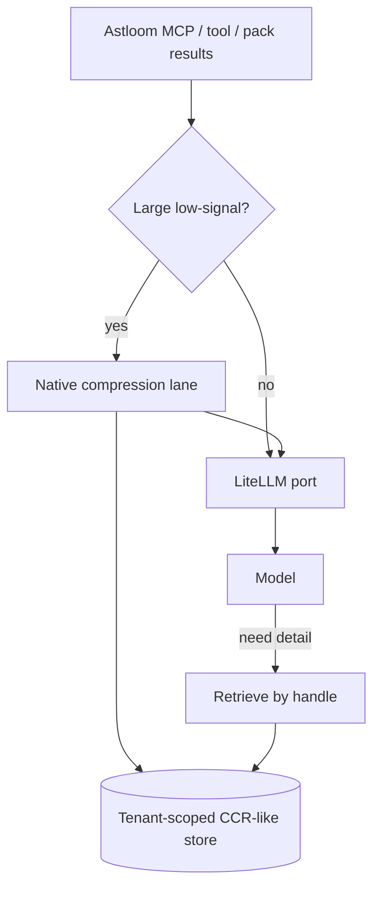

# 54 - Headroom Native Context Compression For Astloom

## Purpose

Require that **the Astloom software product** (platform services, MCP gateway, and
LiteLLM-mediated LLM calls) implements a **native** context-compression capability
inspired by [headroomlabs-ai/headroom](https://github.com/headroomlabs-ai/headroom).

Preserve upstream **Apache License 2.0** obligations. Catalog transferable ideas.
State explicitly what is **in scope** (Astloom) and **out of scope** (separate
IDE/dev helper stacks such as `ai-toolstack`).

This is not legal advice. Counsel must confirm before vendoring upstream source or
shipping a redistributed Headroom binary.

## Normative product law (Astloom must use this)

1. **Consumer is Astloom.** Connected coding agents, MCP clients of Astloom, and
   Astloom-internal LLM jobs **must** benefit from native compression when payloads
   are large and low-signal — not from a side IDE plugin as the product SoT.
2. **Native means in-process or Astloom-owned service.** Compression runs inside
   Astloom deployment boundaries (for example a library used by `mcp-gateway-service`
   and/or the LiteLLM application port). It is **not** satisfied by documenting Cursor
   `mcp-lazy` / `ai-toolstack` Headroom backends.
3. **LiteLLM remains the only LLM egress.** Compression happens **before** messages
   enter LiteLLM (or on tool results before they re-enter the agent turn). Do not add a
   third-party LLM proxy that bypasses LiteLLM.
4. **Local-first / sovereignty.** Originals and compressed forms stay on Astloom
   infrastructure (tenant-scoped). No cloud upload of payloads for compression.
5. **Complement, do not replace, the code graph.** Structural MCP tools and context
   packs remain the primary token-reduction strategy for code understanding; native
   compression handles residual bulky JSON, logs, RAG chunks, and oversized tool blobs.
6. **Reversible when lossy.** If compression drops detail, Astloom **must** expose a
   scoped retrieve-by-handle path (CCR-like) with TTL and ACL, or refuse lossy mode.

## License Snapshot (verified 2026-07-25)

| Source | License | Copyright notice | Verified commit | Safe use |
| --- | --- | --- | --- | --- |
| [headroomlabs-ai/headroom](https://github.com/headroomlabs-ai/headroom) | **Apache License 2.0** | Copyright 2025 Headroom Contributors | `a6d4921e82c1e9fe1a5ca8b90ffd16aa84a698d4` | Ideas freely. Code/package only under Apache 2.0 (NOTICE, LICENSE copy, modification notices). Prefer clean-room or ADR-approved dependency |

Attribution SSOT: [`THIRD_PARTY_NOTICES.md`](THIRD_PARTY_NOTICES.md).

### Apache 2.0 obligations (if shipping code)

If Astloom vendors or redistributes Headroom source/binaries (or creates Derivative
Works under Apache 2.0):

1. Include a copy of the Apache 2.0 license.
2. Retain copyright, patent, trademark, and attribution notices.
3. Include readable NOTICE file contents where the Work provides one.
4. Mark modified files with prominent change notices.
5. Do not use Headroom trademarks to imply affiliation.

**Default Astloom policy:** implement a **clean-room** compression lane matching the
idea catalog below, **or** accept `headroom-ai` (or a pinned subset) via ADR + SBOM +
notices. Either path still satisfies “Astloom must use compression natively.”

## Out of scope (explicit)

| Item | Why excluded |
| --- | --- |
| `ai-toolstack` / Cursor `mcp-lazy` Headroom backend | Separate developer tooling; not Astloom product runtime |
| `headroom wrap cursor` / agent wrap that routes around LiteLLM | Violates LLM gateway law |
| Upstream cross-agent memory as Astloom Memory BC | Different bounded context; use Astloom memory services |
| Hosted/cloud compression of private tenant payloads | Violates no-cloud-exfiltration |

## Upstream idea snapshot (prior art)

Headroom compresses tool outputs, logs, files, RAG chunks, and related context before
the LLM, with content-aware routers (JSON / code AST / prose), optional reversible
local cache (CCR), MCP tools (`compress` / `retrieve` / `stats`), and claimed large
savings on JSON (and modest savings on coding-agent traffic). Modes include library,
proxy, and MCP — **Astloom adopts the library/service pattern on its own seams**,
not the external wrap/proxy product shape.



| Step | Actor | Action | Outcome |
| --- | --- | --- | --- |
| 1 | MCP gateway / pack builder | Detect bulky JSON, logs, RAG, raw dumps | Compression candidate |
| 2 | Native compressor | Content-aware shrink; store original handle | Smaller prompt / tool echo |
| 3 | LiteLLM port | Send compressed turn only | Cost/latency down |
| 4 | Agent / service | Call retrieve if answer needs dropped detail | Correctness preserved |

## Idea Catalog (transferable)

| ID | Idea | Tag | Astloom mapping |
| --- | --- | --- | --- |
| HR-01 | Compress before LLM, not after failure | Adopt | **Shipped:** LiteLLM `complete` ingress hook |
| HR-02 | Content-aware routing (JSON vs code vs prose) | Adopt | **Shipped:** JSON + text compressors (`auto` detect); AST-code lane not required |
| HR-03 | Reversible cache + retrieve-by-hash | Adopt | **Shipped:** scoped TTL store + MCP retrieve |
| HR-04 | MCP compress / retrieve / stats surface | Adopt | **Shipped:** `astloom_context_*` on programming profile |
| HR-05 | Library embed in host process | Adopt | **Shipped:** `context_compression` package |
| HR-06 | External LLM proxy / agent wrap | Avoid | LiteLLM-only egress |
| HR-07 | Output-token ceremony trim | Adapt | Optional future via LiteLLM params + eval |
| HR-08 | Cross-agent shared memory store | Avoid | Use Astloom memory BC |
| HR-09 | `headroom learn` → local AGENTS.md | Adapt | Optional ops; not substitute for guidance BC |
| HR-10 | Stats / savings dashboard | Adapt | **Shipped enough:** CLI + MCP stats (not a UI dashboard) |
| HR-11 | Skip already-compressed / watermarked lanes | Adopt | **Shipped:** skip when `[astloom_context:` present |

## Ownership (implementation targets)

| Concern | Owner (Astloom) | Status (2026-07-25) |
| --- | --- | --- |
| Compress/retrieve API + TTL cache | `backend/packages/context_compression/` | Shipped (clean-room) |
| MCP tools | `astloom_context_compress` / `retrieve` / `stats` on `programming-cursor-mcp` | Shipped |
| CLI measure/stats | `astloom context measure` / `astloom context stats` | Shipped |
| Package install | `context_compression` in root `pyproject.toml` packages | Shipped |
| Wire on LLM message assembly | `backend/packages/llm_gateway/gateway.py` (`ASTLOOM_CONTEXT_COMPRESS`) | Shipped |
| Graph-first packs remain primary | `code-graph-service` (unchanged SoR) | Unchanged |
| License / SBOM if dependency | Clean-room — no Headroom package | Notices only |

## Operator commands

```bash
# One-shot savings on a fixture / dump
astloom context measure --file /path/to/blob.json
astloom context measure --file /path/to/blob.json --json

# Accumulated CLI totals (.astloom/cache/context-compression-metrics.json)
astloom context stats

# MCP (after Reload of Astloom-Programming profile ≥ 1.3.1)
# astloom_context_compress / astloom_context_retrieve / astloom_context_stats
```

Env: `ASTLOOM_CONTEXT_COMPRESS` (default on), `ASTLOOM_CONTEXT_COMPRESS_MIN_CHARS` (default 2000). See `.env.example`.

## Normative completion (this doc)

| Class | Status |
| --- | --- |
| **Adopt** HR-01…HR-05, HR-11 | Complete |
| Acceptance criteria § below | All **Met** |
| **Adapt** HR-07 / HR-09 / HR-10 UI dashboard | Not required; stats CLI/MCP satisfy HR-10 Adapt |
| **Avoid** HR-06 / HR-08 | Correctly not implemented |

## Acceptance Criteria

1. A documented Astloom API (HTTP and/or MCP) can compress and retrieve a fixture JSON blob without calling `ai-toolstack`. **Met** (MCP tools).
2. At least one production path (MCP tool result **or** LiteLLM-bound job) uses that API when payload size exceeds a configured threshold. **Met** (LiteLLM `complete` + MCP tools).
3. Docs and guidance state Astloom—not IDE toolstack—as the SoT for product compression. **Met** (this doc).
4. Apache 2.0 attribution present if any Headroom code/package is shipped; otherwise clean-room notice in `THIRD_PARTY_NOTICES`. **Met** (clean-room notice).
5. Unit tests cover threshold skip, JSON shrink, retrieve round-trip, and ACL/tenant isolation of cached originals. **Met**.
6. No LiteLLM bypass in the design or implementation. **Met**.

## Compliance Checklist (normative)

- [x] Product copy does not claim “powered by Headroom” without affiliation truth.
- [x] `THIRD_PARTY_NOTICES.md` updated for any Apache redistribution (ideas/clean-room notice; no vendored Headroom).
- [x] Sovereignty: no cloud compression of tenant payloads.
- [x] Re-verify upstream LICENSE when bumping a dependency (last checked: Apache 2.0, Copyright 2025 Headroom Contributors, `a6d4921`).

## Related Documents

- [`05-token-optimization-and-model-routing.md`](05-token-optimization-and-model-routing.md) — LiteLLM + token strategy
- [`09-context-pack-retrieval-and-agent-workflow.md`](09-context-pack-retrieval-and-agent-workflow.md) — context packs
- [`21-code-intelligence-prior-art-ideas-and-license.md`](21-code-intelligence-prior-art-ideas-and-license.md) — prior-art hub
- [`53-repomix-prior-art-ideas-and-license.md`](53-repomix-prior-art-ideas-and-license.md) — pack/export ideas (complementary)
- [`THIRD_PARTY_NOTICES.md`](THIRD_PARTY_NOTICES.md) — license notices
- External: [headroomlabs-ai/headroom](https://github.com/headroomlabs-ai/headroom) (Apache 2.0)
