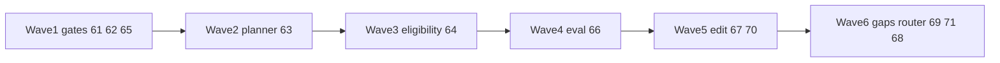
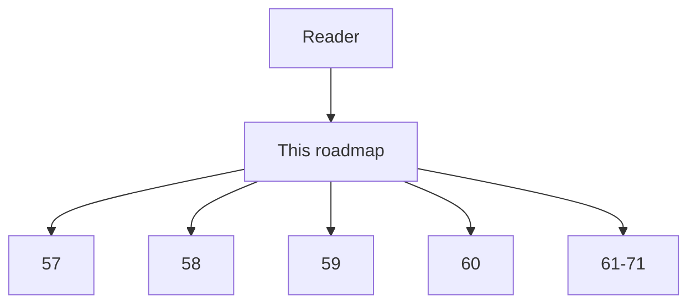

# 56 - Imperfect Graph Agent Decision Roadmap

## Implementation status

**Designed / not shipped.** Modular pack for safe agent decisions when the Neo4j
code-knowledge graph is incomplete, stale, sparse, or approximate. Wedge
structural MCP remains the current delivery surface. Supersedes the retired
research dump formerly at `docs/1.txt`.

## Purpose

Define the future architecture and implementation module map for a production
coding agent that combines an imperfect Neo4j code graph, MCP tools, hybrid
retrieval, confidence labels, freshness state, and source editing.

Recommendations are **evidence-backed transfers**, not claims that one published
system already validated this exact stack.

## Target architecture (normative intent)

1. Structural evidence remains the preferred precise channel.
2. Every structural result states its coverage and type of absence.
3. The agent decomposes the decision into required evidence claims or hops.
4. A separate sufficiency gate determines whether those claims are supported.
5. Only unsupported hops trigger targeted hybrid or source recovery.
6. High-risk decisions force freshness and coverage preconditions.
7. Hypothesized edges remain quarantined until independently validated.
8. The final edit is bound to source/edge provenance and checked through
   independent program tools.
9. Evaluation deletes, corrupts, and stales graph evidence and measures
   **unsafe-action risk at a given coverage**, not only clean-graph accuracy.

Invariant: metadata-first must never become metadata-only; uncertainty must
never become invented structure.

## Module map

| Doc | Module | Role |
| --- | --- | --- |
| `57` | Failure modes | Product failure taxonomy + operational implications |
| `58` | Research evidence map | Papers, transferability, integrity, eval inputs |
| `59` | Policy challenges | Deltas vs shipped escalate / confidence / gaps / freshness |
| `60` | Deferred capabilities | Promising but not ready for truth-graph / auto-verify |
| `61` | `DecisionEvidenceGate` | Claim-level sufficiency (rank 1) |
| `62` | `StructuralResultStatus` | Typed absence / sparse contract (rank 2) |
| `63` | `EvidenceHopPlanner` | Atomic-hop planner + recovery (rank 3) |
| `64` | `EdgeEvidenceEnvelope` | Operation-conditioned edge eligibility (rank 4) |
| `65` | `FreshnessEligibilityPolicy` | High-risk freshness + targeted re-sync (rank 5) |
| `66` | `CodeGraphFaultBench` | Incompleteness / corruption harness (rank 6) |
| `67` | `UncertaintyAwareCodePlan` | Incremental impact-and-edit plan (rank 7) |
| `68` | `EvidenceRoutePolicy` | Outcome-trained tool router (rank 8) |
| `69` | `GapDiagnosisPipeline` | Missing-edge root-cause lane (rank 9) |
| `70` | `GroundedEditPacket` | Provenance-bound edit + verification (rank 10) |
| `71` | `GapValueQueue` | Active gap triage without auto truth repair (rank 11) |

## Recommended implementation waves

| Step | Actor | Action | Outcome |
| --- | --- | --- | --- |
| 1 | Platform | Implement `62`, `61`, harden `65` | Typed absence + sufficiency + freshness gate |
| 2 | Platform | Implement `63` | Targeted hop recovery |
| 3 | Platform | Implement `64` | Edge eligibility by provenance × risk |
| 4 | QA / platform | Implement `66` | Unsafe-action metrics under faults |
| 5 | Platform | Implement `67`, `70` | Re-query after edits; grounded packets |
| 6 | Platform | Implement `69`, `71`, later `68` | Gap diagnosis, quarantine, learned router |

Impact × feasibility scores in sibling docs are engineering judgment, not
paper-reported scores.

## Document flow

| Step | Actor | Action | Outcome |
| --- | --- | --- | --- |
| 1 | Reader | Opens this roadmap | Sees architecture, waves, module map |
| 2 | Reader | Reads `57`–`60` | Problems, evidence, policy deltas, deferrals |
| 3 | Implementer | Picks a `61`–`71` module | Implements one bounded capability |

## Non-goals

- Replacing shipped wedge tools before Wave 1 gates exist.
- Autonomous insertion of LLM/KGE edges into the production truth graph.
- Treating self-reflection or multi-agent agreement as final edit verification.
- Claiming peer-reviewed proof for the exact empty MCP code-graph fallback
  (see `58`: insufficient direct evidence).

## Related Documents

- [`57-imperfect-graph-failure-modes.md`](57-imperfect-graph-failure-modes.md)
- [`58-imperfect-graph-research-evidence-map.md`](58-imperfect-graph-research-evidence-map.md)
- [`59-imperfect-graph-policy-challenges.md`](59-imperfect-graph-policy-challenges.md)
- [`60-imperfect-graph-deferred-capabilities.md`](60-imperfect-graph-deferred-capabilities.md)
- Modules `61`–`71` in this folder
- Current: [`07-metadata-first-code-understanding.md`](07-metadata-first-code-understanding.md),
  [`09-context-pack-retrieval-and-agent-workflow.md`](09-context-pack-retrieval-and-agent-workflow.md),
  [`15-call-graph-confidence-and-runtime-traces.md`](15-call-graph-confidence-and-runtime-traces.md),
  [`44-codebase-memory-neo4j-hybrid-feature-specification.md`](44-codebase-memory-neo4j-hybrid-feature-specification.md)
