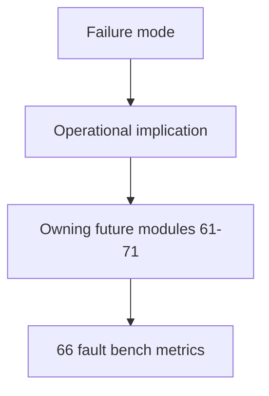

# 57 - Imperfect Graph Failure Modes

## Implementation status

**Designed / not shipped.** Taxonomy for future gates and eval. Current wedge
still exposes escalate hints and confidence floors without this full taxonomy.

## Purpose

Name the failure mechanisms that break production coding-agent decisions when
the code-knowledge graph is imperfect, and record the operational implication
each mechanism imposes on Astloom.

## Evidence-strength rubric (shared with `58`)

| Strength | Meaning |
| --- | --- |
| **Strong** | Peer-reviewed work evaluates the failure mechanism, or a repository/program-analysis paper evaluates a closely analogous SE problem |
| **Medium** | Directly relevant but unreviewed preprint, or peer-reviewed evidence transferred from QA/RAG to code decisions |
| **Weak** | Official system report gives a useful pattern but no direct evidence for imperfect code graphs |

## Failure mode catalog

### FM1 — Missing structural edges create false negatives

The graph can return no callers, no impact path, or a disconnected community even
though a relation exists in source. Empty structural results often look more
authoritative than ambiguous ones. BRINK shows KG-RAG methods degrade under
controlled missing knowledge and may silently substitute parametric memory;
practical call-graph studies show high precision can coexist with substantial
missed-edge recall.

**Operational implication:** `0 rows` must not mean “no dependency” unless the
analyzer can state that relevant language features, files, build units, and edge
classes were completely covered.

**Primary modules:** `62`, `61`, `63`, `66`.

### FM2 — False-positive or spuriously resolved edges create false impact

Approximate analyzers may over-approximate callees; name-based or cross-language
resolution can attach calls to plausible but wrong symbols. CS-RAG identifies
retrieval drift through plausible but unsupported structure; AutoPruner and
static-analysis literature treat false-positive call edges as distinct from
missing edges.

**Operational implication:** a single scalar confidence tier cannot fully
represent whether an edge is uncertain due to over-approximation, unresolved
dispatch, name collision, stale evidence, or unsupported features.

**Primary modules:** `64`, `61`, `70`.

### FM3 — Dynamic calls, reflection, generated code, frameworks, language boundaries

Dynamic property access, callbacks, DI, runtime registration, reflection,
framework conventions, native bindings, RPC, generated clients, and language
boundaries defeat or weaken static call-graph construction.

**Operational implication:** unresolved call sites must remain first-class
evidence rather than disappearing or being forced into one callee.

**Primary modules:** `64`, `69`, `71`.

### FM4 — Stale or partially rebuilt indexes

A structurally correct graph can become temporally incorrect after source,
parser, build-config, generated-code, failed partial ingest, or incomplete
embedding refresh. There is **insufficient evidence** for a published
code-agent-specific rule for exact in-loop re-sync thresholds. Closest transfer:
CodePlan incremental dependency analysis and sufficient-context work.

**Operational implication:** freshness is part of decision eligibility for
high-risk operations, not only presentation metadata.

**Primary modules:** `65`, `61`, `67`.

### FM5 — Empty, sparse, or distracting retrieval

Structural tools can return too little; hybrid retrievers can return semantically
similar but operationally irrelevant code; broad retrieval can distract.
Adaptive-RAG and Repoformer support selective routing; Sufficient Context
separates model-use failure from insufficient evidence.

**Direct evidence for what an agent should do after an MCP code-graph tool
returns empty/sparse: INSUFFICIENT EVIDENCE.** Strongest transfer: classify
sparsity reason, measure sufficiency, select a targeted next action — not a
fixed fallback ladder.

**Primary modules:** `62`, `61`, `63`, `68`.

### FM6 — Multi-hop evidence fragmented across graph, text, config, and source

Chains such as
`changed interface → implementation → registration → caller → test → deploy config`
often span channels. PullNet, IRCoT, and CS-RAG support iterative retrieval
conditioned on earlier hops.

**Operational implication:** sufficiency is per required evidence hop/claim, not
merely node/chunk counts.

**Primary modules:** `63`, `61`, `67`.

### FM7 — Miscalibrated confidence and overconfident action under shift

Model confidence, retrieval score, edge score, and answer stability are different
signals. Selective-QA shows raw probabilities overconfident under domain shift;
Sufficient Context ties answerability to evidence sets; semantic entropy misses
some consistently wrong beliefs.

**Operational implication:** confidence floors must be calibrated against task
outcomes and risk, not treated as universal correctness probabilities.

**Primary modules:** `61`, `64`, `68`, and deferred `60` (entropy / P(True)).

### FM8 — Final decision or edit not traceable to independent evidence

Agents may generate impact claims or edits not entailed by retrieved source.
WebGPT, monitor-guided decoding, and SWE-agent support provenance-bound decisions
plus independent program checks — none alone proves edit safety.

**Operational implication:** bind edits to provenance; verify with independent
tools; never treat generator self-critique as independent evidence.

**Primary modules:** `70`, `61`, `67`.

## Document flow

| Step | Actor | Action | Outcome |
| --- | --- | --- | --- |
| 1 | Designer | Maps incident to FM1–FM8 | Named failure class |
| 2 | Designer | Reads operational implication | Policy constraint |
| 3 | Implementer | Implements owning modules | Mitigations + eval coverage |

## Related Documents

- [`56-imperfect-graph-agent-decision-roadmap.md`](56-imperfect-graph-agent-decision-roadmap.md)
- [`58-imperfect-graph-research-evidence-map.md`](58-imperfect-graph-research-evidence-map.md)
