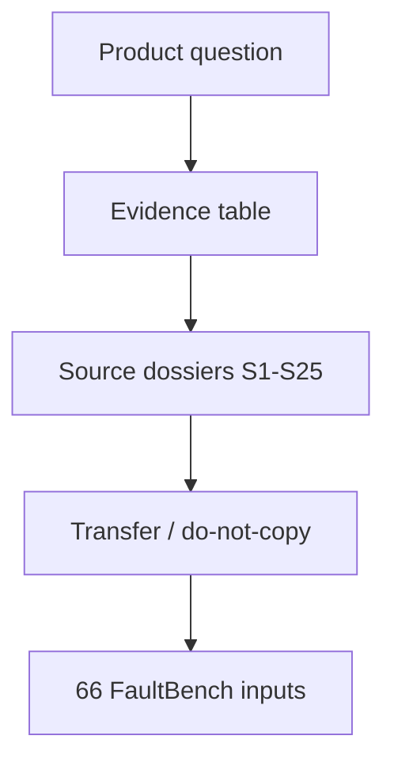

# 58 - Imperfect Graph Research Evidence Map

## Implementation status

**Designed / not shipped.** Future-lane design transferred from the retired
research dump formerly at `docs/1.txt`. Do not treat as live product behavior.

## Purpose

Preserve the transferable scientific and engineering evidence that justifies the
future imperfect-graph decision pack (`56`–`71`), and turn it into an
**implementable research corpus** for later eval and citation in product docs.

No verified peer-reviewed paper answers exactly: “what should an MCP coding
agent do after a code-graph tool returns empty or sparse results?”
(**INSUFFICIENT EVIDENCE** for that exact question). Strongest transferable
combination: typed absence (soundiness), claim-level sufficiency, iterative
graph/text recovery, selective abstention, and repository incremental replanning.

## Document flow

| Step | Actor | Action | Outcome |
| --- | --- | --- | --- |
| 1 | Researcher | Maps failure mode to method family | Evidence row |
| 2 | Implementer | Reads transfer + do-not-copy | Safe adaptation bounds |
| 3 | QA | Encodes controllable faults from dossiers | `CodeGraphFaultBench` scenarios |

## Transferability table

| Failure mode | Method family | Best paper/report | URL | Strength | Transfer to code-KG agents |
| --- | --- | --- | --- | --- | --- |
| Missing KG edges | Controlled incompleteness | BRINK | https://aclanthology.org/2026.eacl-long.114/ | Strong | Edge-deletion/noise fault injection; warns against parametric memory as graph reasoning |
| Missing hop but source exists | Iterative graph+text | PullNet | https://aclanthology.org/D19-1242/ | Strong | Expand only unsupported frontier into source/text |
| Spurious/missing structure | Constraint + sufficiency | CS-RAG / Toward Robust GraphRAG | https://arxiv.org/abs/2603.14828 | Medium | Unsupported hops → textual recovery, not invented edges (preprint) |
| Approximate call graph | Soundiness assumptions | In Defense of Soundiness | https://dl.acm.org/doi/10.1145/2644805 | Strong conceptual | Machine-readable analyzer assumptions; ban treating approximate analysis as complete |
| Dynamic/missed call edges | Static/dynamic diagnosis | Missing Edges ECOOP 2022 | https://drops.dagstuhl.de/entities/document/10.4230/LIPIcs.ECOOP.2022.3 | Strong | Classify why expected edge absent; prioritize analyzer work |
| Empty/sparse retrieval | Sufficiency + abstention | Sufficient Context | https://research.google/pubs/sufficient-context-a-new-lens-on-retrieval-augmented-generation-systems-2/ | Strong indirect | Separate sufficiency gate after retrieval; needs code-specific labels |
| Fixed retrieval ladder | Selective routing | Adaptive-RAG; Repoformer | https://aclanthology.org/2024.naacl-long.389/ ; https://openreview.net/forum?id=moyG54Okrj | Strong indirect | Route among no/one-step/iterative/repo retrieval by utility |
| Fragmented multi-hop | Interleaved reason+retrieve | IRCoT | https://aclanthology.org/2023.acl-long.557/ | Strong indirect | Iterative chains; generated reasoning is not evidence |
| Overconfident impact | Selective prediction | Selective QA under Domain Shift | https://aclanthology.org/2020.acl-main.503/ | Strong indirect | Risk–coverage for proceed vs abstain |
| Repo-wide edit planning | Incremental may-impact | CodePlan | https://dl.acm.org/doi/10.1145/3643757 | Strong | Replan after edits; propagate graph uncertainty |
| Ungrounded generation | Static monitor | Monitor-Guided Decoding | https://arxiv.org/abs/2306.10763 | Strong | Deterministic constraints during generation |
| False-positive edges | Edge classification | AutoPruner | https://dl.acm.org/doi/10.1145/3540250.3549175 | Medium production | Rank candidates; unsafe as auto deletion authority |
| Active repair triage | Human-budgeted calibration | ACTC | https://aclanthology.org/2023.acl-short.158/ | Strong KGC / weak code transfer | Select informative candidates for validation, not autonomous insertion |

## Source dossiers (implementable cards)

Each card is a future implementation input: cite in eval docs, encode transfer
limits in policy tests, do not copy architectures blindly.

### B.1 Incomplete graphs and multi-hop

**S1 BRINK (EACL 2026)** — Zhou et al. Controlled incompleteness for KG-RAG;
separates retrieval vs reasoning under missing facts; parametric fallback risk.
URL: https://aclanthology.org/2026.eacl-long.114/
Transfer: blueprint for deleted/corrupted/disconnected edge tests.
Do not copy: QA tasks ≠ code edits; triple deletion ≠ parser/dynamic/partial ingest.

**S2 PullNet (EMNLP 2019)** — Sun et al. Iterative heterogeneous subgraph expansion
from incomplete KB or text. URL: https://aclanthology.org/D19-1242/
Transfer: expand only unresolved frontier from Neo4j into hybrid/source.
Do not copy: trained QA node-expansion is not code-dependency truth authority.

**S3 Microsoft GraphRAG (2024)** — Edge et al. LLM entity graph, communities,
hierarchical summaries. URL: https://www.microsoft.com/en-us/research/publication/from-local-to-global-a-graph-rag-approach-to-query-focused-summarization/
Transfer: architecture discovery second view when structural paths sparse.
Do not copy: never impact-eligible without source provenance (see `60`).

**S4 CS-RAG (arXiv 2603.14828)** — Ma et al. Ordered atomic constraints;
sufficiency before binding; textual recovery when graph insufficient.
Transfer: closest published policy shape to Astloom needs.
Do not copy: unreviewed preprint; multi-hop QA ≠ repo impact/edit.

**S5 IRCoT (ACL 2023)** — Trivedi et al. Interleave reasoning step with retrieval.
URL: https://aclanthology.org/2023.acl-long.557/
Transfer: iterative caller/config/test discovery.
Do not copy: generated reasoning can misdirect; only retrieved/validated evidence counts.

**S6 FLARE / Active RAG (EMNLP 2023)** — Jiang et al. Retrieve when upcoming
tokens low-confidence. URL: https://aclanthology.org/2023.emnlp-main.495/
Transfer: active retrieval at uncertainty, not front-loading all chunks.
Do not copy: token probability ≠ structural completeness or edit safety.

### B.2 Selective retrieval, uncertainty, abstention

**S7 Adaptive-RAG (NAACL 2024)** — Jeong et al. Classifier routes no/single/iterative
retrieval. URL: https://aclanthology.org/2024.naacl-long.389/
Transfer: replace universal structural→hybrid→read ladder with conditioned router.
Do not copy: query complexity ≠ code risk or graph incompleteness.

**S8 Sufficient Context (ICLR 2025 / Google)** — Joren et al. Evidence-set
sufficiency classifier + selective abstention.
URL: https://research.google/pubs/sufficient-context-a-new-lens-on-retrieval-augmented-generation-systems-2/
Transfer: dedicated `evidence_sufficiency` independent of edge/model scores.
Do not copy: QA answerability ≠ multi-file edit safety.

**S9 Selective QA under Domain Shift (ACL 2020)** — Kamath et al.
URL: https://aclanthology.org/2020.acl-main.503/
Transfer: risk–coverage curve for impact/edit proceed vs abstain.
Do not copy: extractive QA; OOD labels known in paper, not open repos.

**S10 Semantic Entropy (Nature 2024)** — Farquhar et al.
URL: https://www.nature.com/articles/s41586-024-07421-0
Transfer: auxiliary uncertainty for high-risk NL impact explanations.
Do not copy: latency; misses consistently wrong beliefs (see `60`).

**S11 P(True) / P(IK) (Anthropic 2022)** — Kadavath et al.
URL: https://arxiv.org/abs/2207.05221
Transfer: self-estimated uncertainty as router feature.
Do not copy: never override missing source, failed analysis, unresolved edge.

### B.3 Repository retrieval, planning, tools, grounded generation

**S12 Repoformer (ICML 2024)** — Wu et al. Selective cross-file retrieval for
completion. URL: https://openreview.net/forum?id=moyG54Okrj
Transfer: “retrieve more” is not always correct under uncertainty.
Do not copy: completion ≠ impact/edit safety.

**S13 RepoCoder (EMNLP 2023)** — Zhang et al. Iterative retrieval↔generation.
URL: https://aclanthology.org/2023.emnlp-main.151/
Transfer: partial hypothesis reveals missing identifiers for targeted retrieval.
Do not copy: wrong generation reinforces wrong neighborhood; never graph evidence.

**S14 CodePlan (FSE 2024)** — Bairi et al. Incremental dependency + may-impact +
replanning. URL: https://dl.acm.org/doi/10.1145/3643757
Transfer: re-query after material edits; multi-file planning.
Do not copy: must propagate missing/ambiguous/stale relations.

**S15 SWE-agent (NeurIPS 2024)** — Yang et al. Agent-computer interface for
nav/edit/test. URL: https://papers.nips.cc/paper_files/paper/2024/hash/5a7c947568c1b1328ccc5230172e1e7c-Abstract-Conference.html
Transfer: MCP must expose typed uncertainty, truncation, scope, next-action affordances.
Do not copy: better UI ≠ complete retrieval or test coverage.

**S16 Monitor-Guided Decoding (NeurIPS 2023)** — Agrawal et al.
URL: https://arxiv.org/abs/2306.10763
Transfer: high-confidence static facts as generation constraints.
Do not copy: monitor silence ≠ correctness.

**S17 Toolformer (NeurIPS 2023)** — Schick et al.
URL: https://papers.nips.cc/paper_files/paper/2023/hash/d842425e4bf79ba039352da0f658a906-Abstract-Conference.html
Transfer: tool routing from observed utility.
Do not copy: no typed empty/stale/safety handling; next-token utility.

**S18 WebGPT (2021)** — Nakano et al. URL: https://arxiv.org/abs/2112.09332
Transfer: decisions carry explicit evidence references from tool use.
Do not copy: citation ≠ entailment; code needs span + structural provenance.

### B.4 Approximate program analysis and edge quality

**S19 Soundiness manifesto (CACM 2015)** — Livshits et al.
URL: https://dl.acm.org/doi/10.1145/2644805
Transfer: every edge/empty result inherits analyzer coverage contract.
Do not copy: manifesto ≠ calibration algorithm.

**S20 Approximate JS call graphs (ICSE 2013)** — Feldthaus et al.
URL: https://dl.acm.org/doi/10.5555/2486788.2486887
Transfer: useful structural tools without being complete impact oracles.
Do not copy: IDE jump-to-def tolerance ≠ security-sensitive edits.

**S21 PyCG (ICSE 2021)** — Salis et al. URL: https://arxiv.org/abs/2103.00587
Transfer: high precision does not justify absent-edge as no-call.
Do not copy: benchmark/oracle limits; reflection/native/framework remain.

**S22 Missing-edge root cause (ECOOP 2022)** — Chakraborty et al.
URL: https://drops.dagstuhl.de/entities/document/10.4230/LIPIcs.ECOOP.2022.3
Transfer: turn `knowledge_gaps` into diagnosable remediation.
Do not copy: unobserved dynamic edge remains unknown, not false.

**S23 AutoPruner (ESEC/FSE 2022)** — Le-Cong et al.
URL: https://dl.acm.org/doi/10.1145/3540250.3549175
Transfer: rank ambiguous candidates / prioritize inspection.
Do not copy: auto-prune can destroy recall (see `60`).

### B.5 Active completion and self-reflection

**S24 Self-RAG (ICLR 2024)** — Asai et al. URL: https://arxiv.org/abs/2310.11511
Transfer: reflection labels for retrieval telemetry / router training.
Do not copy: same model generates and critiques; not independent verifier.

**S25 ACTC (ACL 2023 short)** — Sedova & Roth.
URL: https://aclanthology.org/2023.acl-short.158/
Transfer: prioritize informative unresolved candidates for human/deterministic validation.
Do not copy: generic KG plausibility ≠ program semantics; not sole decision basis.

## Source integrity checklist

| Metric | Value |
| --- | --- |
| Sources included | 25 |
| Peer-reviewed scientific papers | 21 |
| Company research / arXiv-only | 4 |
| Large-lab co-authored (conservative) | 10 |
| Direct peer-reviewed papers on exact empty MCP code-graph fallback | **0 — INSUFFICIENT EVIDENCE** |

### Sources considered and discarded

| Source | Reason discarded |
| --- | --- |
| GitHub Docs — indexing for Copilot | No retrieval algorithm, empty fallback, or controlled eval |
| GitHub Blog — Copilot smarter finding | Deployed embedding story; no imperfect-index decision policy |
| Neo4j “What is GraphRAG?” / Essential GraphRAG | Overview/guides, not incomplete-graph decision evidence |
| Efficient Tool Selection for LLM Agents (2025) | Tool efficiency, not empty/sparse interpretation |
| SURE-RAG | Very recent QA preprint; Sufficient Context already covers direction |
| KG²RAG | Graph-guided retrieval, not incomplete-code-graph safe-negative problem |
| ToolScope | Not stable peer-reviewed sparse-result fallback evidence |
| Medium/Reddit/ResearchGate SEO | Rejected under source-quality rules |

### Search audit (queries → result)

| Query theme | Best hits | Audit |
| --- | --- | --- |
| GraphRAG incomplete KG | BRINK; CS-RAG | Useful; CS-RAG preprint |
| Selective prediction / uncertainty | Sufficient Context; Selective QA; Semantic Entropy | Strong but mostly QA transfer |
| Approximate call graph confidence | Soundiness; JS CG; PyCG; Missing-edge | Strong analysis; no single confidence score |
| Agent tool empty retrieval fallback | Adaptive-RAG, Repoformer, Toolformer closest | **Failed inclusion target** |
| KGC + RAG code graph | ACTC + general KGC | **Failed:** no safe autonomous code-call insertion |
| Grounded code generation + graph | CodePlan; Monitor-Guided; RepoCoder; Repoformer | Strong repo evidence; not Neo4j missing-edge states |
| Abstention / hallucination + tools | Sufficient Context; Selective QA; P(True); WebGPT | Strong abstention; not full edit safety |
| Microsoft GraphRAG | MSR publication | Architecture transfer only |
| GitHub Copilot retrieval paper | Docs/blog only | **Failed inclusion target** |
| site:neo4j.com GraphRAG incomplete | Blogs/guides | **Failed inclusion target** |

## Future implementation note (research → product)

When implementing `66` and policy tests:

1. Encode BRINK-style edge deletion/noise as first-class fault classes.
2. Encode ECOOP missing-edge root-cause labels into `69` gap cases.
3. Keep dossier “Do not copy” lines as negative acceptance tests.
4. Refresh this map when a peer-reviewed empty-tool-result code-agent paper appears.

## Related Documents

- [`56-imperfect-graph-agent-decision-roadmap.md`](56-imperfect-graph-agent-decision-roadmap.md)
- [`57-imperfect-graph-failure-modes.md`](57-imperfect-graph-failure-modes.md)
- [`60-imperfect-graph-deferred-capabilities.md`](60-imperfect-graph-deferred-capabilities.md)
- [`66-code-graph-fault-bench.md`](66-code-graph-fault-bench.md)
