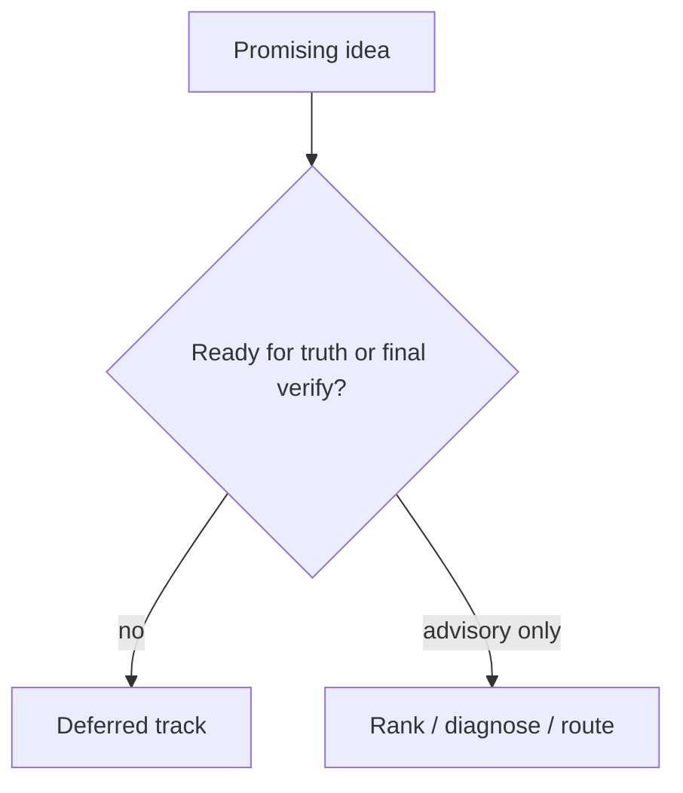

# 60 - Imperfect Graph Deferred Capabilities

## Implementation status

**Designed / not shipped.** Future-lane design transferred from the retired
research dump formerly at `docs/1.txt`. Do not treat as live product behavior.

## Purpose

Record research-backed ideas that **must not** ship as truth-graph or final
verification authorities yet, while keeping them as future implementation tracks
(quarantined ranking, optional diagnostics, architecture lanes).

## Document flow

| Step | Actor | Action | Outcome |
| --- | --- | --- | --- |
| 1 | Product | Classifies idea against this list | Deferred vs advisory |
| 2 | Implementer | Builds only allowed advisory surface | No truth pollution |
| 3 | Research revisit | Re-opens when evidence upgrades | Possible promotion |

## Deferred tracks (still implementable later under constraints)

### D1 — Automatic completion of missing code edges (KGE / LLM)

KGC can rank plausible triples; ACTC calibrates with limited labels. Generic
plausibility ≠ executable program semantics. BRINK shows incompleteness remains
hard; CS-RAG recovers from text rather than depending on KG repair.

**Allowed future build:** candidate ranking into quarantined namespace (`71`).
**Forbidden until evidence upgrades:** automatic promotion into production truth
or impact-eligible edges.

Links: https://aclanthology.org/2023.acl-short.158/ ;
https://aclanthology.org/2026.eacl-long.114/ ;
https://arxiv.org/abs/2603.14828

### D2 — LLM-extracted GraphRAG communities as exact impact graph

Microsoft GraphRAG helps global architecture questions. LLM-derived entities,
relations, and summaries must not replace exact call/import/configuration
evidence.

**Allowed:** architecture retrieval lane.
**Forbidden:** impact oracle / blast-radius SoT.

Link: https://www.microsoft.com/en-us/research/publication/from-local-to-global-a-graph-rag-approach-to-query-focused-summarization/

### D3 — Neural auto-prune / auto-promote of call edges

AutoPruner shows semantic+structural features help false-positive classification.
Distribution shift and asymmetric recall costs make production auto-prune unsafe
for high-risk coding agents.

**Allowed:** rank candidates; request inspection.
**Forbidden:** mutate authoritative edges autonomously.

Link: https://dl.acm.org/doi/10.1145/3540250.3549175

### D4 — Semantic entropy or model self-confidence on every decision

Useful for unstable meanings / self-eval; costly; neither verifies source
entailment; semantic entropy misses some consistently wrong outputs.

**Allowed:** selected high-risk or diagnostically ambiguous cases.
**Forbidden:** universal gate replacing sufficiency/provenance.

Links: https://www.nature.com/articles/s41586-024-07421-0 ;
https://arxiv.org/abs/2207.05221

### D5 — Self-reflection or multi-agent agreement as final verification

Self-RAG helps adaptive retrieval; agreement among similarly prompted agents can
reproduce shared retrieval/stale/graph errors.

**Allowed:** routing and diagnostics.
**Forbidden:** authority that approves high-risk edits (`70` requires independent
program tools).

Links: https://arxiv.org/abs/2310.11511 ;
https://papers.nips.cc/paper_files/paper/2023/hash/d842425e4bf79ba039352da0f658a906-Abstract-Conference.html

## Related Documents

- [`58-imperfect-graph-research-evidence-map.md`](58-imperfect-graph-research-evidence-map.md)
- [`71-gap-value-queue.md`](71-gap-value-queue.md)
- [`70-grounded-edit-packet.md`](70-grounded-edit-packet.md)
