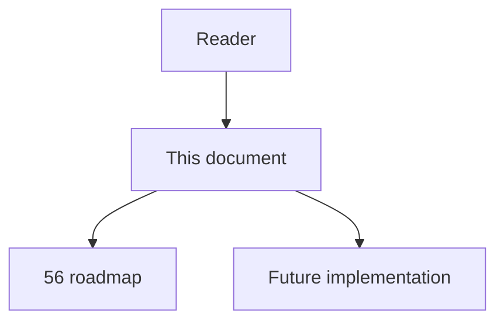
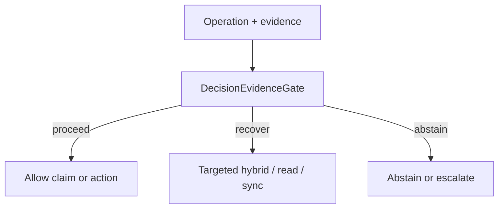

# 61 - Decision Evidence Gate

## Implementation status

**Designed / not shipped.** Future-lane design transferred from the retired
research dump formerly at `docs/1.txt`. Do not treat as live product behavior.

## Purpose

Before every impact decision or edit, compile an explicit decision object of required claims and decide retrieve_more | targeted_read | targeted_sync | proceed | abstain per claim sufficiency — not node counts, average edge confidence, or model self-confidence.

## Document flow



| Step | Actor | Action | Outcome |
| --- | --- | --- | --- |
| 1 | Reader | Opens this module | Understands scope and non-goals |
| 2 | Reader | Follows primary flow Mermaid + table | Sees intended decision path |
| 3 | Implementer | Uses contracts + acceptance | Builds and verifies the module |

## Rank and scoring

Engineering judgment: **5 × 5 = 25** (impact × feasibility). Not a score
reported by cited papers.

## What to build

Implement `DecisionEvidenceGate` with operation-specific policies: architecture exploration may tolerate unsupported peripheral claims; destructive or security-sensitive edits cannot proceed while required claims remain unsupported. Claims examples: `target_symbol_uniquely_resolved`, `direct_callers_covered`, `registration_paths_checked`, `affected_tests_identified`, `source_read_for_low_confidence_claims`.

## Contract sketch

```json
{
  "operation": "edit_high_risk",
  "claims_required": [
    "target_symbol_uniquely_resolved",
    "direct_callers_covered",
    "registration_paths_checked",
    "affected_tests_identified",
    "source_read_for_low_confidence_claims"
  ],
  "claims_supported": [],
  "claims_unsupported": [],
  "conflicts": [],
  "freshness": {},
  "coverage_assumptions": [],
  "decision": "retrieve_more | targeted_read | targeted_sync | proceed | abstain"
}
```

## Primary decision flow



| Step | Actor | Action | Outcome |
| --- | --- | --- | --- |
| 1 | Agent / MCP | Collect structural and ancillary evidence | Inputs for the module |
| 2 | DecisionEvidenceGate | Apply module policy | proceed / recover / abstain |
| 3 | Agent | Act only within allowed decision | Safe next step |

## Failure modes attacked

FM1 missing edges; FM5 sparse retrieval; FM4 stale; FM6 multi-hop; FM7 miscalibration; FM8 ungrounded edits.

## Supporting sources

- Sufficient Context
- Selective QA under Domain Shift
- CS-RAG sufficiency-before-binding

## Dependencies / prerequisites

Task-risk taxonomy; claim schemas; source-span IDs; edge provenance; logged adjudicated outcomes.

## Eval metrics that would prove it works

- Unsafe-action rate at fixed coverage
- Risk–coverage and accuracy–coverage curves
- % high-risk decisions with every required claim supported
- False-abstention rate
- Calibration error for `P(decision_safe)` by language/framework/risk

## Risk if done wrong

Simplistic gate becomes another confidence threshold (blocks everything or permits unsafe actions). Training on agent self-judgments creates circular validation.

## Related Documents

- [`56-imperfect-graph-agent-decision-roadmap.md`](56-imperfect-graph-agent-decision-roadmap.md)
- [`57-imperfect-graph-failure-modes.md`](57-imperfect-graph-failure-modes.md)
- [`58-imperfect-graph-research-evidence-map.md`](58-imperfect-graph-research-evidence-map.md)
