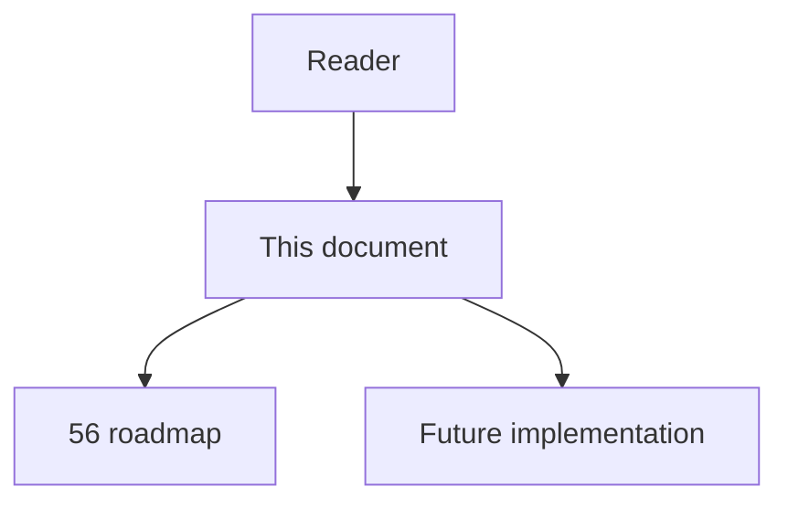
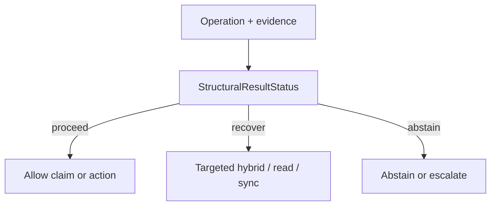

# 62 - Structural Result Status

## Implementation status

**Designed / not shipped.** Future-lane design transferred from the retired
research dump formerly at `docs/1.txt`. Do not treat as live product behavior.

## Purpose

Make “nothing found” diagnostically meaningful: every structural MCP tool returns typed `result_status`, `empty_reason`, coverage, unresolved frontier, and machine-readable `recommended_next_action`. `escalate_hint` becomes deterministic diagnosis, not “try hybrid”.

## Document flow



| Step | Actor | Action | Outcome |
| --- | --- | --- | --- |
| 1 | Reader | Opens this module | Understands scope and non-goals |
| 2 | Reader | Follows primary flow Mermaid + table | Sees intended decision path |
| 3 | Implementer | Uses contracts + acceptance | Builds and verifies the module |

## Rank and scoring

Engineering judgment: **4 × 5 = 20** (impact × feasibility). Not a score
reported by cited papers.

## What to build

Extend structural MCP responses. `complete_empty` may support a negative conclusion; `incomplete_empty` must not. Cover reasons: no_seed, unsupported_language, unresolved_dispatch, stale_scope, partial_ingest, traversal_limit, excluded_external, no_path_under_constraints, tool_error.

## Contract sketch

```json
{
  "result_status": "complete_empty | incomplete_empty | sparse | partial | error",
  "empty_reason": "none | no_seed | unsupported_language | unresolved_dispatch | stale_scope | partial_ingest | traversal_limit | excluded_external | no_path_under_constraints | tool_error",
  "coverage": {
    "files_expected": 120,
    "files_indexed": 118,
    "languages_supported": ["python"],
    "unsupported_constructs_seen": 7,
    "truncated": false
  },
  "unresolved_frontier": [],
  "recommended_next_action": "hybrid_query | source_read | targeted_sync | runtime_trace | abstain"
}
```

## Primary decision flow



| Step | Actor | Action | Outcome |
| --- | --- | --- | --- |
| 1 | Agent / MCP | Collect structural and ancillary evidence | Inputs for the module |
| 2 | StructuralResultStatus | Apply module policy | proceed / recover / abstain |
| 3 | Agent | Act only within allowed decision | Safe next step |

## Failure modes attacked

FM1 missing edges; FM3 dynamics; FM5 empty retrieval; partial ingest; overconfident negative impact.

## Supporting sources

- Soundiness manifesto
- Missing-edge ECOOP 2022
- PyCG precision/recall separation

## Dependencies / prerequisites

Analyzer capability registry; ingestion accounting; truncation metadata; stable MCP schema.

## Eval metrics that would prove it works

- `empty_reason` accuracy vs injected causes
- % empty results triggering correct next action
- Unsafe “no impact” rate after incomplete-empty
- Extra latency/tool calls per correct diagnosis

## Risk if done wrong

Emitting `complete_empty` without completeness proof encodes false certainty worse than today’s banner.

## Related Documents

- [`56-imperfect-graph-agent-decision-roadmap.md`](56-imperfect-graph-agent-decision-roadmap.md)
- [`57-imperfect-graph-failure-modes.md`](57-imperfect-graph-failure-modes.md)
- [`58-imperfect-graph-research-evidence-map.md`](58-imperfect-graph-research-evidence-map.md)
