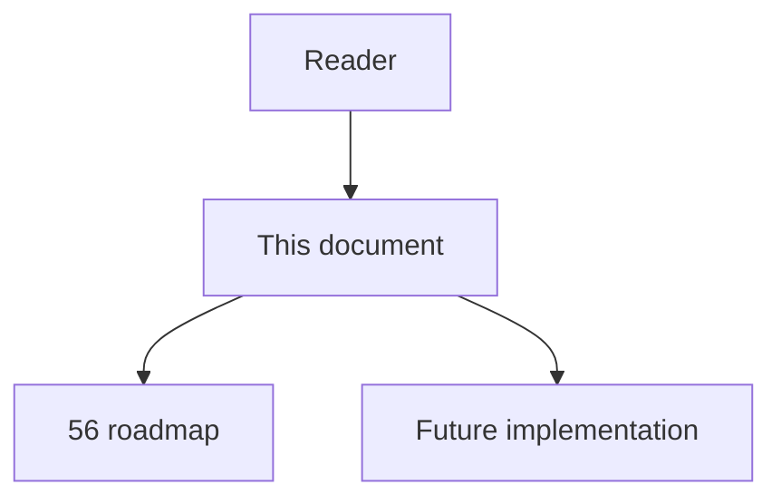
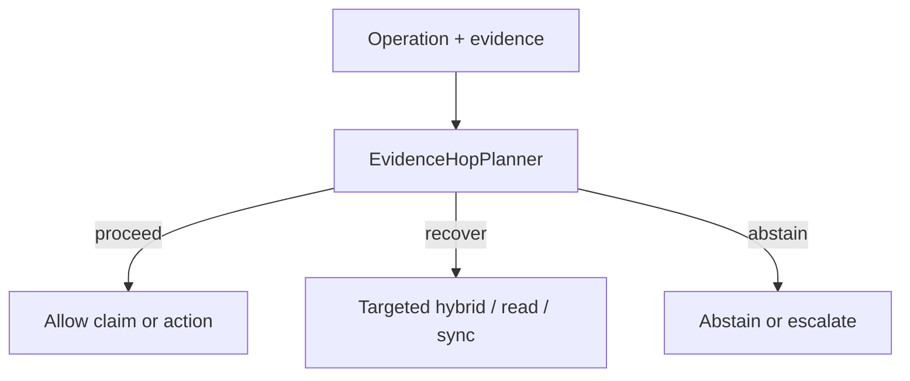

# 63 - Evidence Hop Planner

## Implementation status

**Designed / not shipped.** Future-lane design transferred from the retired
research dump formerly at `docs/1.txt`. Do not treat as live product behavior.

## Purpose

Convert impact/edit questions into ordered evidence constraints; execute graph retrieval per hop; propagate bindings only when supported; for unsupported hops use hybrid or targeted source reads; never replace missing graph relations with LLM-proposed edges.

## Document flow



| Step | Actor | Action | Outcome |
| --- | --- | --- | --- |
| 1 | Reader | Opens this module | Understands scope and non-goals |
| 2 | Reader | Follows primary flow Mermaid + table | Sees intended decision path |
| 3 | Implementer | Uses contracts + acceptance | Builds and verifies the module |

## Rank and scoring

Engineering judgment: **5 × 4 = 20** (impact × feasibility). Not a score
reported by cited papers.

## What to build

Plan templates for common ops, e.g. H1 resolve symbol; H2 direct dependents; H3 registration/dispatch; H4 runtime entry points; H5 validation/build/test obligations. Free-form hops are hypotheses.

## Contract sketch

```text
H1: resolve changed symbol exactly
H2: enumerate direct structural dependents
H3: identify registration/dispatch mechanism
H4: connect dependents to runtime entry points
H5: identify validation/build/test obligations
```

## Primary decision flow



| Step | Actor | Action | Outcome |
| --- | --- | --- | --- |
| 1 | Agent / MCP | Collect structural and ancillary evidence | Inputs for the module |
| 2 | EvidenceHopPlanner | Apply module policy | proceed / recover / abstain |
| 3 | Agent | Act only within allowed decision | Safe next step |

## Failure modes attacked

FM1 missing edges; retrieval drift; FM6 multi-hop; cross-language gaps; unsupported structural continuation.

## Supporting sources

- CS-RAG
- PullNet
- IRCoT

## Dependencies / prerequisites

Typed absence (`62`); query-plan state store; source-span retrieval; deterministic symbol anchoring.

## Eval metrics that would prove it works

- Evidence-chain recall under 1%/5%/10%/20% edge deletion
- Unsupported-binding rate
- Invented intermediate dependency rate
- Retrieval calls/latency per correct chain
- Exact source-span recall for recovered hops

## Risk if done wrong

LLM decomposition can omit essential hops; keep deterministic templates.

## Related Documents

- [`56-imperfect-graph-agent-decision-roadmap.md`](56-imperfect-graph-agent-decision-roadmap.md)
- [`57-imperfect-graph-failure-modes.md`](57-imperfect-graph-failure-modes.md)
- [`58-imperfect-graph-research-evidence-map.md`](58-imperfect-graph-research-evidence-map.md)
