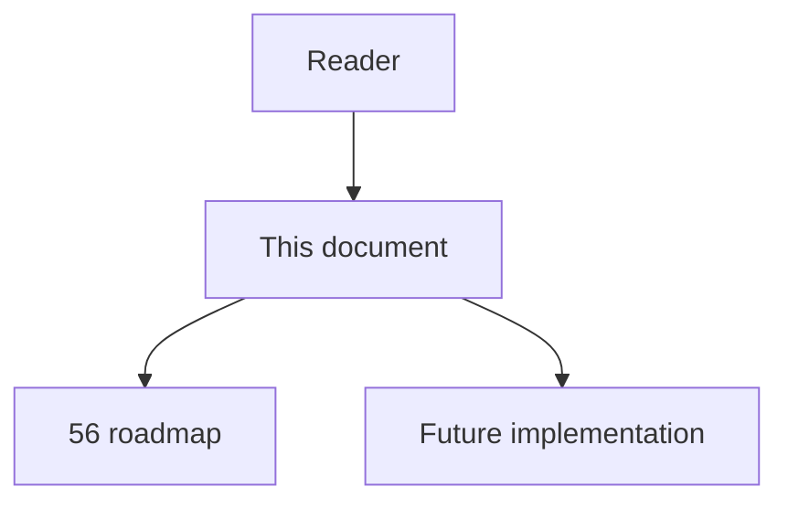
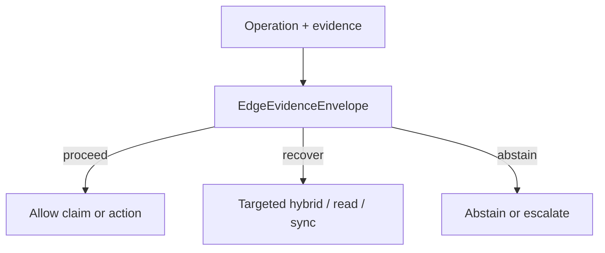

# 64 - Edge Evidence Envelope

## Implementation status

**Designed / not shipped.** Future-lane design transferred from the retired
research dump formerly at `docs/1.txt`. Do not treat as live product behavior.

## Purpose

Extend each edge beyond exact/probable/ambiguous/unresolved with analyzer version, resolver strategy, call-site span, candidate set, origin class, coverage assumptions, freshness versions, positive/counter evidence, and over/under/direct approximation class; then apply per-operation eligibility.

## Document flow



| Step | Actor | Action | Outcome |
| --- | --- | --- | --- |
| 1 | Reader | Opens this module | Understands scope and non-goals |
| 2 | Reader | Follows primary flow Mermaid + table | Sees intended decision path |
| 3 | Implementer | Uses contracts + acceptance | Builds and verifies the module |

## Rank and scoring

Engineering judgment: **5 × 4 = 20** (impact × feasibility). Not a score
reported by cited papers.

## What to build

Neo4j schema migration + ingest provenance. Policy examples: probable OK for exploratory search but not to exclude a file from impact; ambiguous requires inspecting all candidates; unresolved expands uncertainty frontier.

## Contract sketch

```text
EdgeEvidenceEnvelope =
  confidence_tier
  + analyzer_id/version
  + resolver_strategy
  + source_call_site_span
  + candidate_targets[]
  + origin (static|generated|runtime_observed|human_confirmed)
  + coverage_assumptions
  + created_at + source/index versions
  + positive_evidence + counterevidence
  + approximation_class (over|under|direct_syntactic)
```

## Primary decision flow



| Step | Actor | Action | Outcome |
| --- | --- | --- | --- |
| 1 | Agent / MCP | Collect structural and ancillary evidence | Inputs for the module |
| 2 | EdgeEvidenceEnvelope | Apply module policy | proceed / recover / abstain |
| 3 | Agent | Act only within allowed decision | Safe next step |

## Failure modes attacked

FM2 false positives; FM1 ambiguity; FM3 dynamics; cross-language; FM4 stale; overconfident impact.

## Supporting sources

- Soundiness
- AutoPruner complementary evidence
- Missing-edge heterogeneous causes

## Dependencies / prerequisites

Schema migration; provenance at ingest; source-span stability; operation classes.

## Eval metrics that would prove it works

- Edge precision/recall by provenance class
- Impact precision/recall by operation and tier
- ECE / Brier for candidate ranking
- % high-risk decisions using ineligible evidence

## Risk if done wrong

Detailed schema creates false precision if heuristic scores are treated as calibrated probabilities.

## Related Documents

- [`56-imperfect-graph-agent-decision-roadmap.md`](56-imperfect-graph-agent-decision-roadmap.md)
- [`57-imperfect-graph-failure-modes.md`](57-imperfect-graph-failure-modes.md)
- [`58-imperfect-graph-research-evidence-map.md`](58-imperfect-graph-research-evidence-map.md)
