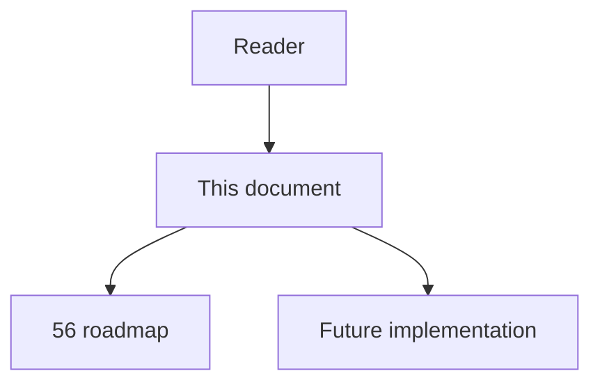
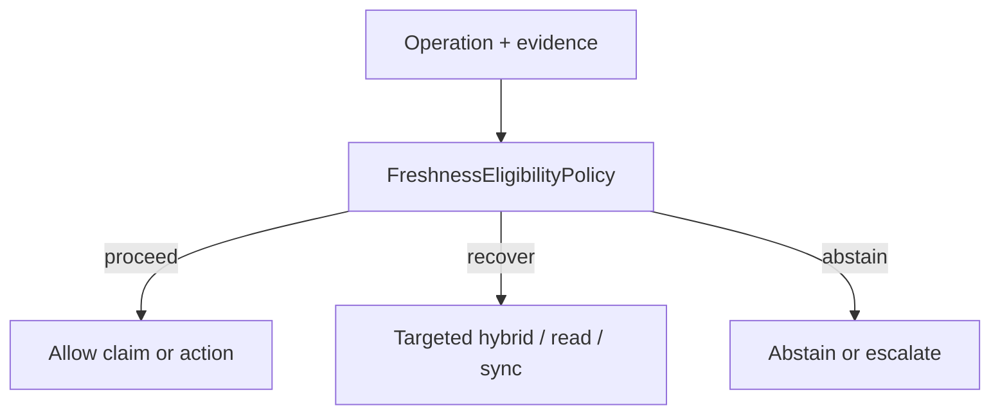

# 65 - Freshness Eligibility Policy

## Implementation status

**Designed / not shipped.** Future-lane design transferred from the retired
research dump formerly at `docs/1.txt`. Do not treat as live product behavior.

## Purpose

Keep informational freshness banners for exploration, but require targeted re-index/reparse before high-risk impact/edit when required scope is stale, parser-mismatched, partially ingested, missing embeddings/anchors, build/generated changed, or freshness unknown.

## Document flow



| Step | Actor | Action | Outcome |
| --- | --- | --- | --- |
| 1 | Reader | Opens this module | Understands scope and non-goals |
| 2 | Reader | Follows primary flow Mermaid + table | Sees intended decision path |
| 3 | Implementer | Uses contracts + acceptance | Builds and verifies the module |

## Rank and scoring

Engineering judgment: **5 × 4 = 20** (impact × feasibility). Not a score
reported by cited papers.

## What to build

Re-sync smallest defensible closure: changed files, containing modules, import/registration neighbors, affected generated artifacts. If sync cannot complete, fail closed for claims needing fresh structure while allowing source-based investigation. Evidence qualification: no verified paper validates exact forced-resync thresholds — engineering inference.

## Contract sketch

```text
if high_risk and scope_stale_or_unknown:
  targeted_sync(closure) or abstain
elif medium_risk:
  targeted_sync unless claim independent of stale structure
else:
  banner + downgrade claims
```

## Primary decision flow



| Step | Actor | Action | Outcome |
| --- | --- | --- | --- |
| 1 | Agent / MCP | Collect structural and ancillary evidence | Inputs for the module |
| 2 | FreshnessEligibilityPolicy | Apply module policy | proceed / recover / abstain |
| 3 | Agent | Act only within allowed decision | Safe next step |

## Failure modes attacked

FM4 stale graph; partial ingest; missing embeddings; false-negative impact; obsolete architecture context.

## Supporting sources

- CodePlan incremental analysis
- Sufficient Context (block when evidence inadequate)

## Dependencies / prerequisites

Source revision tracking; parser-policy versioning; ingest manifests; targeted sync; idempotency.

## Eval metrics that would prove it works

- Unsafe-edit rate when source changes between retrieval and edit
- % stale high-risk decisions correctly blocked
- p50/p95 targeted-sync latency
- Full-repo syncs avoided
- False blocking from harmless metadata changes

## Risk if done wrong

Overbroad closures → sync storms; bad idempotency → “successful” sync replays stale results.

## Related Documents

- [`56-imperfect-graph-agent-decision-roadmap.md`](56-imperfect-graph-agent-decision-roadmap.md)
- [`57-imperfect-graph-failure-modes.md`](57-imperfect-graph-failure-modes.md)
- [`58-imperfect-graph-research-evidence-map.md`](58-imperfect-graph-research-evidence-map.md)
