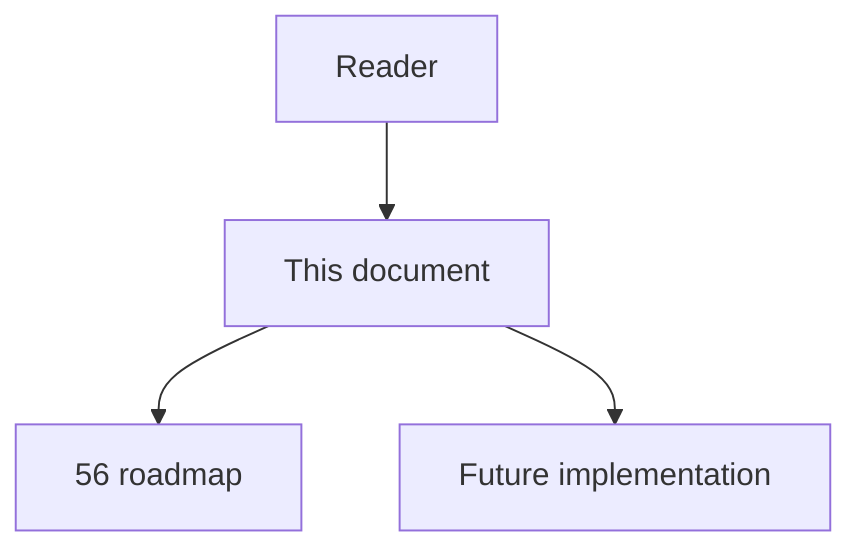
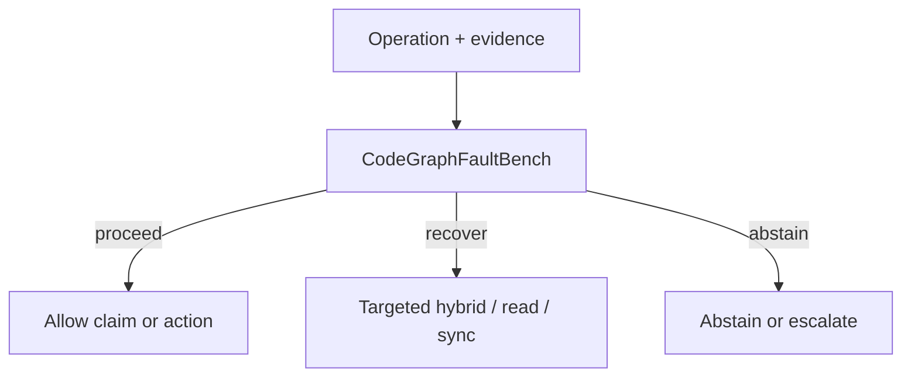

# 66 - Code Graph Fault Bench

## Implementation status

**Designed / not shipped.** Future-lane design transferred from the retired
research dump formerly at `docs/1.txt`. Do not treat as live product behavior.

## Purpose

BRINK-style incompleteness and corruption harness over repositories with known call/import/configuration truth. Measure complete agent decisions, not only graph retrieval.

## Document flow



| Step | Actor | Action | Outcome |
| --- | --- | --- | --- |
| 1 | Reader | Opens this module | Understands scope and non-goals |
| 2 | Reader | Follows primary flow Mermaid + table | Sees intended decision path |
| 3 | Implementer | Uses contracts + acceptance | Builds and verifies the module |

## Rank and scoring

Engineering judgment: **5 × 4 = 20** (impact × feasibility). Not a score
reported by cited papers.

## What to build

Inject: deleted exact edges; plausible false edges; ambiguous same-name targets; missing language adapters; dynamic registration ± traces; stale file versions; partial ingest/embedding loss; cross-language RPC gaps; truncated traversal; renamed symbols (anti-memorization). Compare structural-only, fixed fallback, sufficiency-gated, iterative recovery.

## Contract sketch

```text
FaultClass ∈ {
  delete_exact_edge, add_false_edge, ambiguous_name,
  missing_adapter, dynamic_reg, stale_file, partial_ingest,
  embedding_loss, rpc_gap, truncate_traversal, rename_symbol
}
Metric focus = unsafe_action_rate @ coverage
```

## Primary decision flow



| Step | Actor | Action | Outcome |
| --- | --- | --- | --- |
| 1 | Agent / MCP | Collect structural and ancillary evidence | Inputs for the module |
| 2 | CodeGraphFaultBench | Apply module policy | proceed / recover / abstain |
| 3 | Agent | Act only within allowed decision | Safe next step |

## Failure modes attacked

All FM1–FM8, especially silent incompleteness and parametric substitution.

## Supporting sources

- BRINK
- Missing-edge ECOOP
- PyCG precision/recall

## Dependencies / prerequisites

Fixtures; ground-truth oracles; mutation tooling; isolated Neo4j/Postgres scopes; task-level evaluation.

## Eval metrics that would prove it works

- Degradation curves vs deletion/noise
- Unsafe action vs graph completeness
- Recovery recall / unsupported-claim rate
- Risk–coverage per fault class
- Parametric-leakage score (rename/synthetic)
- Latency/cost per recovered task

## Risk if done wrong

Synthetic faults may be too easy; include production audit-log failures; hold out repos/frameworks.

## Related Documents

- [`56-imperfect-graph-agent-decision-roadmap.md`](56-imperfect-graph-agent-decision-roadmap.md)
- [`57-imperfect-graph-failure-modes.md`](57-imperfect-graph-failure-modes.md)
- [`58-imperfect-graph-research-evidence-map.md`](58-imperfect-graph-research-evidence-map.md)
