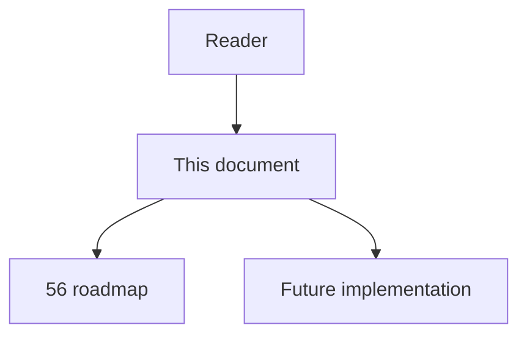
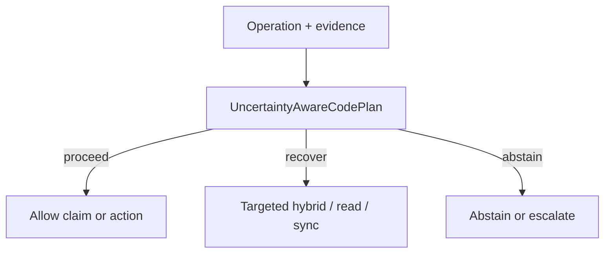

# 67 - Uncertainty Aware Code Plan

## Implementation status

**Designed / not shipped.** Future-lane design transferred from the retired
research dump formerly at `docs/1.txt`. Do not treat as live product behavior.

## Purpose

Represent repository editing as a persistent plan graph. After each material edit: reparse, update structural relations, recompute may-impact, re-evaluate remaining steps, run narrowest deterministic checks, stop/branch when ambiguous dependencies exceed policy.

## Document flow



| Step | Actor | Action | Outcome |
| --- | --- | --- | --- |
| 1 | Reader | Opens this module | Understands scope and non-goals |
| 2 | Reader | Follows primary flow Mermaid + table | Sees intended decision path |
| 3 | Implementer | Uses contracts + acceptance | Builds and verifies the module |

## Rank and scoring

Engineering judgment: **5 × 3 = 15** (impact × feasibility). Not a score
reported by cited papers.

## What to build

Never let the initial graph snapshot define the complete edit set for a long-running change. Each step states target, evidence, assumptions, obligations, unresolved dependencies.

## Contract sketch

```text
PlanStep = {
  target, evidence_refs, assumptions,
  affected_obligations, unresolved_deps, status
}
on_material_edit -> reparse -> update_edges -> may_impact -> replan -> checks
```

## Primary decision flow



| Step | Actor | Action | Outcome |
| --- | --- | --- | --- |
| 1 | Agent / MCP | Collect structural and ancillary evidence | Inputs for the module |
| 2 | UncertaintyAwareCodePlan | Apply module policy | proceed / recover / abstain |
| 3 | Agent | Act only within allowed decision | Safe next step |

## Failure modes attacked

Staleness during editing; missed downstream files; FM6; plan drift; ungrounded edits.

## Supporting sources

- CodePlan
- SWE-agent interface
- Monitor-Guided Decoding

## Dependencies / prerequisites

Fast incremental ingest; idempotent invalidation; plan persistence; revision pinning; deterministic test/build tools.

## Eval metrics that would prove it works

- Repo tasks passing build/test/semantic validity
- Required-file recall / unnecessary-file precision vs oracle
- Plan revisions from newly discovered evidence
- Regressions per successful task
- Cost/latency vs one-shot planning

## Risk if done wrong

Replanning can amplify false deps into edit cascades; expansions must keep provenance/confidence.

## Related Documents

- [`56-imperfect-graph-agent-decision-roadmap.md`](56-imperfect-graph-agent-decision-roadmap.md)
- [`57-imperfect-graph-failure-modes.md`](57-imperfect-graph-failure-modes.md)
- [`58-imperfect-graph-research-evidence-map.md`](58-imperfect-graph-research-evidence-map.md)
