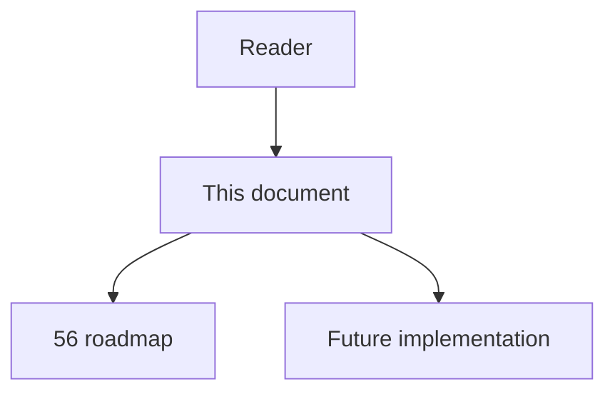
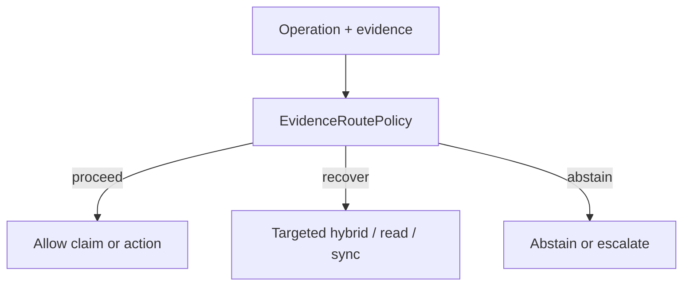

# 68 - Evidence Route Policy

## Implementation status

**Designed / not shipped.** Future-lane design transferred from the retired
research dump formerly at `docs/1.txt`. Do not treat as live product behavior.

## Purpose

Train or calibrate a lightweight router from observed task outcomes to choose structural, narrow hybrid, iterative multi-hop, targeted read, targeted sync, build/static check, existing-test runtime trace, or abstention/human escalation.

## Document flow



| Step | Actor | Action | Outcome |
| --- | --- | --- | --- |
| 1 | Reader | Opens this module | Understands scope and non-goals |
| 2 | Reader | Follows primary flow Mermaid + table | Sees intended decision path |
| 3 | Implementer | Uses contracts + acceptance | Builds and verifies the module |

## Rank and scoring

Engineering judgment: **4 × 3 = 12** (impact × feasibility). Not a score
reported by cited papers.

## What to build

Inputs: operation risk, graph result status, edge provenance, unresolved-frontier size, freshness, language coverage, retriever score distribution, query type, previous tool outcomes, expected cost. Start with interpretable rules + offline replay; promote to learned policy only after reliable labels. High-risk safeguards override router.

## Contract sketch

```text
Route ∈ {
  structural, narrow_hybrid, iterative_multihop,
  targeted_read, targeted_sync, build_static_check,
  runtime_trace, abstain_or_human
}
```

## Primary decision flow



| Step | Actor | Action | Outcome |
| --- | --- | --- | --- |
| 1 | Agent / MCP | Collect structural and ancillary evidence | Inputs for the module |
| 2 | EvidenceRoutePolicy | Apply module policy | proceed / recover / abstain |
| 3 | Agent | Act only within allowed decision | Safe next step |

## Failure modes attacked

Fixed fallback errors; FM5; unnecessary broad retrieval; tool loops; latency; wrong escalation.

## Supporting sources

- Adaptive-RAG
- Repoformer
- Toolformer

## Dependencies / prerequisites

Typed tool outcomes; task-success labels; cost telemetry; offline replay; high-risk overrides.

## Eval metrics that would prove it works

- Correct-route accuracy vs adjudicated oracle
- Task success per unit cost/latency
- Tool calls per successful task
- Wrong-source-read / unnecessary-sync rates
- OOD route failure by language/framework
- Unsafe route rate for high-risk actions

## Risk if done wrong

Labels may reward shallow-test passes; learned routers drift as analyzers/repos/models change.

## Related Documents

- [`56-imperfect-graph-agent-decision-roadmap.md`](56-imperfect-graph-agent-decision-roadmap.md)
- [`57-imperfect-graph-failure-modes.md`](57-imperfect-graph-failure-modes.md)
- [`58-imperfect-graph-research-evidence-map.md`](58-imperfect-graph-research-evidence-map.md)
