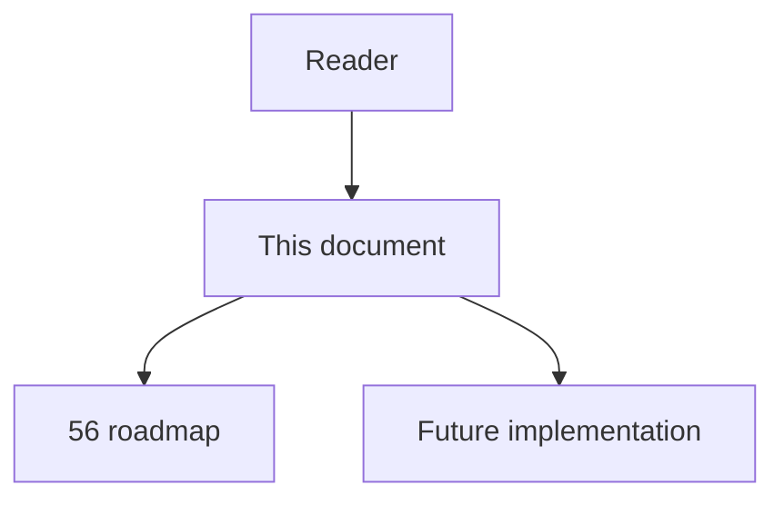
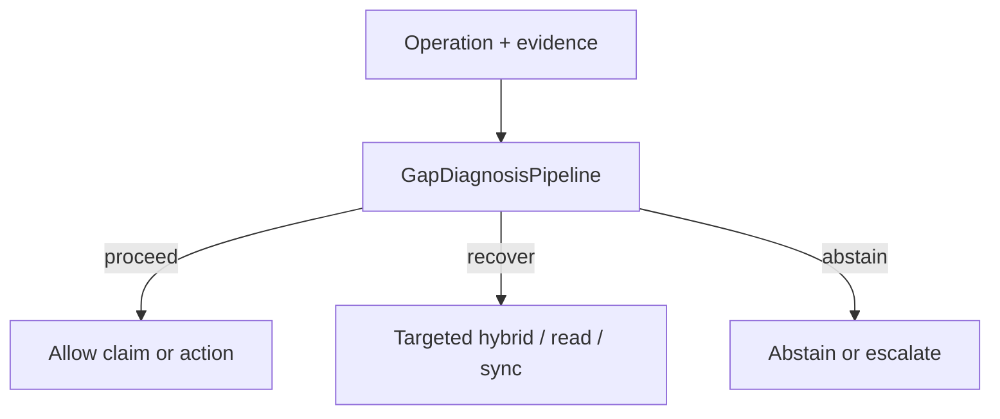

# 69 - Gap Diagnosis Pipeline

## Implementation status

**Designed / not shipped.** Future-lane design transferred from the retired
research dump formerly at `docs/1.txt`. Do not treat as live product behavior.

## Purpose

When graph and source disagree, create persistent gap cases with call site, relation class, analyzer coverage, candidates, language feature, build context, and runtime observations; classify root causes; store runtime-observed edges as scoped observations, not universal exact.

## Document flow



| Step | Actor | Action | Outcome |
| --- | --- | --- | --- |
| 1 | Reader | Opens this module | Understands scope and non-goals |
| 2 | Reader | Follows primary flow Mermaid + table | Sees intended decision path |
| 3 | Implementer | Uses contracts + acceptance | Builds and verifies the module |

## Rank and scoring

Engineering judgment: **4 × 3 = 12** (impact × feasibility). Not a score
reported by cited papers.

## What to build

Cause classes: dynamic/reflection; DI/registration; generated code; external framework callback; import/build config; cross-language/RPC; parser failure; scope exclusion; stale/partial index. Safe traces from existing tests or controlled executions where allowed.

## Contract sketch

```text
GapCase = {
  call_site, expected_rel, coverage, candidates,
  language_feature, build_context, runtime_obs[],
  root_cause_hypothesis, status
}
```

## Primary decision flow



| Step | Actor | Action | Outcome |
| --- | --- | --- | --- |
| 1 | Agent / MCP | Collect structural and ancillary evidence | Inputs for the module |
| 2 | GapDiagnosisPipeline | Apply module policy | proceed / recover / abstain |
| 3 | Agent | Act only within allowed decision | Safe next step |

## Failure modes attacked

FM3 dynamics; recurrent missing edges; passive knowledge gaps; cross-language; analyzer blind spots.

## Supporting sources

- Missing-edge ECOOP
- PyCG
- Approximate JS CG (useful when assumptions explicit)

## Dependencies / prerequisites

Gap persistence; test-run provenance; safe execution env; static/dynamic namespaces; analyzer capability metadata.

## Eval metrics that would prove it works

- % recurring gaps with correct root cause
- Reduction in repeated escalations for same construct
- Edge recall after analyzer remediation
- False universalization of runtime-observed edges
- Mean time first gap → deterministic repair

## Risk if done wrong

Dynamic traces mistaken for complete behavior; tests cover subsets of paths/envs/plugins.

## Related Documents

- [`56-imperfect-graph-agent-decision-roadmap.md`](56-imperfect-graph-agent-decision-roadmap.md)
- [`57-imperfect-graph-failure-modes.md`](57-imperfect-graph-failure-modes.md)
- [`58-imperfect-graph-research-evidence-map.md`](58-imperfect-graph-research-evidence-map.md)
