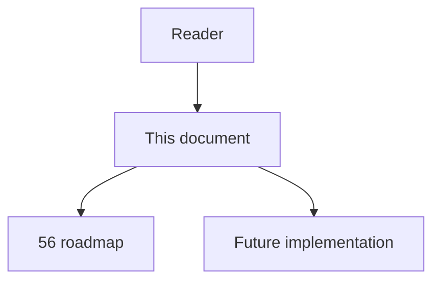
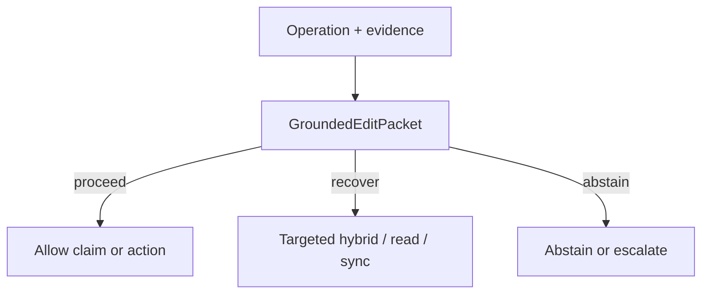

# 70 - Grounded Edit Packet

## Implementation status

**Designed / not shipped.** Future-lane design transferred from the retired
research dump formerly at `docs/1.txt`. Do not treat as live product behavior.

## Purpose

Before applying an edit, produce a machine-readable packet binding each change to source spans, structural edges, eligibility/provenance, assumptions, unsupported claims, and expected compile/type/test obligations; after edit run independent checks. Generator self-critique is not independent evidence.

## Document flow



| Step | Actor | Action | Outcome |
| --- | --- | --- | --- |
| 1 | Reader | Opens this module | Understands scope and non-goals |
| 2 | Reader | Follows primary flow Mermaid + table | Sees intended decision path |
| 3 | Implementer | Uses contracts + acceptance | Builds and verifies the module |

## Rank and scoring

Engineering judgment: **4 × 3 = 12** (impact × feasibility). Not a score
reported by cited papers.

## What to build

Verifier rejects claims lacking source span or deterministic derived fact. Independent checks: parser, compiler/type checker, repo static rules, affected tests, graph re-ingest.

## Contract sketch

```json
{
  "planned_changes": [],
  "source_spans_read": [],
  "edges_used": [],
  "edge_eligibility": [],
  "assumptions": [],
  "unsupported_claims": [],
  "obligations": ["compile", "types", "tests"]
}
```

## Primary decision flow



| Step | Actor | Action | Outcome |
| --- | --- | --- | --- |
| 1 | Agent / MCP | Collect structural and ancillary evidence | Inputs for the module |
| 2 | GroundedEditPacket | Apply module policy | proceed / recover / abstain |
| 3 | Agent | Act only within allowed decision | Safe next step |

## Failure modes attacked

FM8 hallucinated impact; edits unsupported by evidence; citation laundering; self-confirming loops.

## Supporting sources

- WebGPT references
- Monitor-Guided Decoding
- SWE-agent edit/test interface
- Sufficient Context

## Dependencies / prerequisites

Stable source-span IDs; edge provenance; deterministic tool outputs; revision pinning; verifier ≠ generator.

## Eval metrics that would prove it works

- Unsupported-claim rate in edit plans
- Source-span entailment accuracy
- Compile/type/test pass rates
- Semantic regression after apparently successful tests
- Verifier FN/FP rates
- % claims validated by independent evidence

## Risk if done wrong

Same LLM generate+verify; passing weak tests mistaken for proof.

## Related Documents

- [`56-imperfect-graph-agent-decision-roadmap.md`](56-imperfect-graph-agent-decision-roadmap.md)
- [`57-imperfect-graph-failure-modes.md`](57-imperfect-graph-failure-modes.md)
- [`58-imperfect-graph-research-evidence-map.md`](58-imperfect-graph-research-evidence-map.md)
