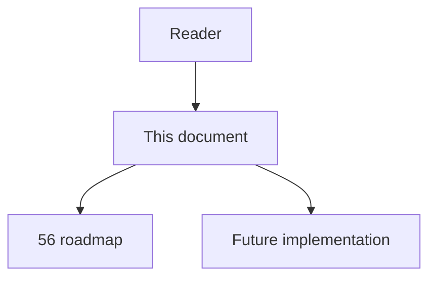
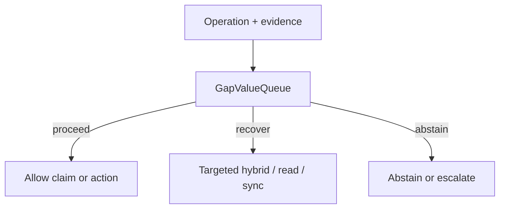

# 71 - Gap Value Queue

## Implementation status

**Designed / not shipped.** Future-lane design transferred from the retired
research dump formerly at `docs/1.txt`. Do not treat as live product behavior.

## Purpose

Convert `architecture.knowledge_gaps` into a prioritized evidence-acquisition queue. Score by recurrence, high-risk ops affected, blocked decisions, expected analyzer-repair value, and validation cost. Candidates live only in quarantined namespace.

## Document flow



| Step | Actor | Action | Outcome |
| --- | --- | --- | --- |
| 1 | Reader | Opens this module | Understands scope and non-goals |
| 2 | Reader | Follows primary flow Mermaid + table | Sees intended decision path |
| 3 | Implementer | Uses contracts + acceptance | Builds and verifies the module |

## Rank and scoring

Engineering judgment: **3 × 4 = 12** (impact × feasibility). Not a score
reported by cited papers.

## What to build

Candidate fields: relation, supporting spans, competing candidates, root-cause category, requested validation action, expiration, source revision. Promote only after deterministic static evidence, controlled runtime observation with correct scope semantics, or explicit human approval.

## Contract sketch

```text
CandidateEdge (quarantine) = {
  relation, spans[], competitors[],
  root_cause, validation_action,
  expires_at, source_revision
}
truth_graph ∩ quarantine = ∅
```

## Primary decision flow



| Step | Actor | Action | Outcome |
| --- | --- | --- | --- |
| 1 | Agent / MCP | Collect structural and ancillary evidence | Inputs for the module |
| 2 | GapValueQueue | Apply module policy | proceed / recover / abstain |
| 3 | Agent | Act only within allowed decision | Safe next step |

## Failure modes attacked

Repeated missing edges; unresolved architecture gaps; passive warnings; annotation inefficiency.

## Supporting sources

- ACTC
- Missing-edge ECOOP prioritization
- PullNet selective frontier expansion

## Dependencies / prerequisites

Candidate quarantine; validation workflows; root-cause labels; audit logs; relation-specific quality metrics.

## Eval metrics that would prove it works

- Confirmed-edge yield per validation action
- Candidate promotion precision
- Reduction in repeat sparse-result escalations
- High-risk tasks unblocked per validation hour
- Invalid candidate expiration rate

## Risk if done wrong

Plausibility models invent convincing false edges; candidate and truth graphs must stay distinct.

## Related Documents

- [`56-imperfect-graph-agent-decision-roadmap.md`](56-imperfect-graph-agent-decision-roadmap.md)
- [`57-imperfect-graph-failure-modes.md`](57-imperfect-graph-failure-modes.md)
- [`58-imperfect-graph-research-evidence-map.md`](58-imperfect-graph-research-evidence-map.md)
