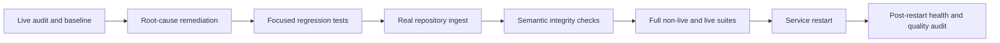

# 72 - Live Ingest Remediation and Verification Index

## Purpose

This documentation pack records the completed live-ingest audit, the defects found and fixed, the regression and live tests executed, the recovery from a power interruption, and the final operational state.

It is an as-built evidence set. It complements the Code Knowledge Graph architecture documents; it does not replace them or redefine product behavior.

## Final Status

| Area | Final result | Primary evidence |
|---|---|---|
| HTTP MCP responsiveness | Passed | Health returned `200` in `0.084502s` while a blocking audit remained active for more than `10.417s`; cold repetition returned in `0.096281s` during more than `12.217s` of tool work |
| Call-edge semantic integrity | Passed | No `CALLS` edge targeted `FakeClock.set` in the final Neo4j query |
| Semantic embedding completeness | Passed | `8,979 / 8,979` eligible nodes indexed; `0` missing and `0` orphan records |
| Incremental ingest recovery | Passed | Recovery run processed `39 / 39` files with `files_failed=0` |
| Automated non-live regression | Passed | Combined aggregate: `766 passed`, `24 deselected`; final CLI suite: `348 passed`, `2 deselected` |
| Complete live suite | Passed | `24 passed`, `767 deselected` in `153.56s` |
| Post-restart health | Passed | PostgreSQL, Neo4j, and MCP Gateway healthy; HTTP health returned `200` in `0.003188s` |
| Final quality audit | Passed | `0` documentation findings and `0` code findings across all severities |

## Evidence Flow

| Step | Actor | Action | Required outcome |
|---|---|---|---|
| 1 | Auditor | Exercise HTTP, ingest, graph, semantic, and live-test paths | Reproducible failures or an explicit pass |
| 2 | Engineer | Fix the shared root cause and add regression coverage | Small, traceable changes with a failing-path test |
| 3 | Test runner | Run focused and broad suites | No unexplained failure in the covered scope |
| 4 | Ingest operator | Run sync against real repository data | Successful files, explicit failure count, durable usage record |
| 5 | Graph verifier | Compare eligible graph nodes with stored embeddings and inspect suspect edges | Exact set equality and no known false edge |
| 6 | Operator | Restart dependencies and MCP Gateway | Healthy services and responsive health endpoint |
| 7 | Auditor | Run the quality audit after restart | Zero unresolved findings in the final state |

## Module Map and Reading Order

1. [Live Audit Defect Remediation Record](73-live-audit-defect-remediation-record.md) explains each defect, its root cause, the code seam changed, and direct proof of the fix.
2. [Verification Test Matrix and Results](74-verification-test-matrix-and-results.md) lists focused, aggregate, CLI, and live suites with exact outcomes.
3. [Sync Semantic Integrity and Recovery Evidence](75-sync-semantic-integrity-and-recovery-evidence.md) records graph counts, semantic coverage, failure recovery, and power-interruption continuity.
4. [Post-Restart Operations Verification Runbook](76-post-restart-operations-verification-runbook.md) provides the repeatable operational procedure.

For raw historical narratives, see:

- `tests/artifacts/code-graph-live/INGEST_LIVE_AUDIT_2026-07-28_FA.md`
- `tests/artifacts/code-graph-live/REMAINING_FEATURE_AUDIT_2026-07-28_FA.md`

The raw reports preserve the audit chronology. The modules in this pack are the normalized, durable, English-language record.

## Scope

The verified scope includes:

- MCP Gateway liveness during blocking tool execution.
- Python and polyglot call-target resolution.
- Confidence-aware call-edge consumption.
- Freshness and invalidation state.
- Incremental ingest, stale-node pruning, and human-document synchronization.
- Semantic embedding batching, reuse, refresh parallelism, and set completeness.
- PostgreSQL connection lifecycle under multi-phase sync.
- Compatibility with legacy Neo4j nodes containing a null version.
- CLI operation with an isolated Astloom state root.
- Live-test isolation, full regression suites, service restart, and final quality audit.

The evidence does not claim proof for behavior outside this repository, unsupported model providers, or production traffic volumes not exercised by these scenarios.

## Evidence Rules

- A defect is considered closed only when a regression test and a real-path verification both support the result.
- Counts are tied to the final graph state on `2026-07-28` and may change after later repository edits.
- Failed intermediate runs remain part of the record because they prove the recovery paths and explain the subsequent fixes.
- Secrets, bearer tokens, and database credentials are excluded from documentation and captured output.
- Temporary files under `/tmp` are not durable evidence; their summarized results are recorded here instead.

## Code Evidence Anchors

- `backend/services/code-graph-service/src/code_graph_service/application/service.py::CodeGraphService`
- `backend/services/code-graph-service/src/code_graph_service/application/ingest/repo_ingest.py::RepoIngestMixin`
- `backend/services/code-graph-service/src/code_graph_service/application/embedding_refresh.py::EmbeddingRefreshMixin`

## Acceptance Status

All acceptance gates defined for this remediation cycle passed:

- No remaining known defect from the live audits.
- No failed file in the successful recovery and final sync runs.
- Exact semantic eligibility/index equality.
- Complete live suite passing after the isolated-import correction.
- Healthy services after the final restart.
- Zero findings in the final post-restart quality audit.

## Related Documents

- [Code Knowledge Graph Index](00-index.md)
- [Live Audit Defect Remediation Record](73-live-audit-defect-remediation-record.md)
- [Verification Test Matrix and Results](74-verification-test-matrix-and-results.md)
- [Sync Semantic Integrity and Recovery Evidence](75-sync-semantic-integrity-and-recovery-evidence.md)
- [Post-Restart Operations Verification Runbook](76-post-restart-operations-verification-runbook.md)
