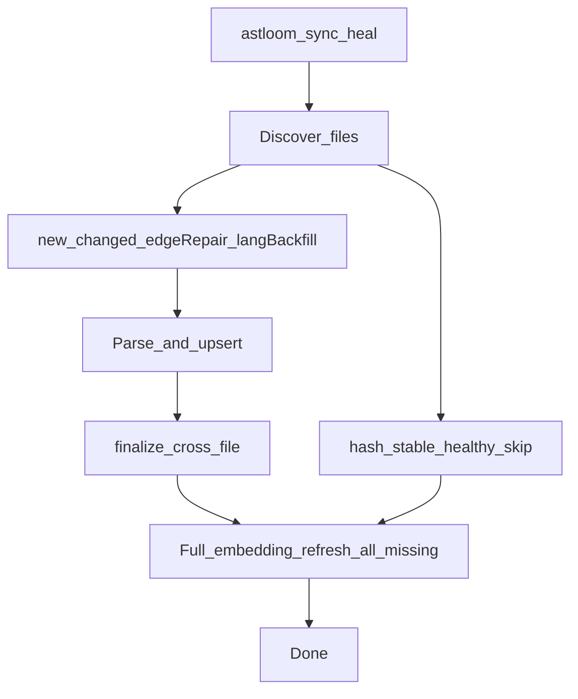

# 77 - Sync Embedding Heal Operator Runbook

## Purpose

Define how Astloom keeps the semantic index healthy after code sync: everyday `astloom sync` must stay cheap for hash-stable trees, while `astloom sync heal` drains the full-project missing/mismatch embedding backlog without force-reparsing healthy sources.

## Product contract

| Command / API | File ingest | Embedding refresh |
| --- | --- | --- |
| `astloom sync` | Incremental: new / changed / lang-backfill / structural edge-repair only. Hash-stable healthy files are skipped. | **Touched** files from this run. On noop (no file work), drains a **capped** backlog (`ASTLOOM_EMBEDDING_REFRESH_MAX_PENDING`, default **256**). |
| `astloom sync heal` | Same incremental file pass as `sync` (never force-reparses healthy hash-stable files). | **Full** project: missing rows, model mismatch, orphan cleanup; **uncapped**. |
| MCP `astloom_code_graph_sync` | Same as service `sync_repo`. | Optional `embedding_refresh_mode`: `"touched"` (default) or `"full"` (heal parity). |

**Out of scope for heal:** force re-ingest / re-parse of content-hash-stable healthy files. That remains a future force-rebuild command.

### Heal flow



| Step | Actor | Action | Outcome |
| --- | --- | --- | --- |
| 1 | CLI / MCP | Start sync with `heal` or `embedding_refresh_mode=full` | Payload carries full refresh mode |
| 2 | Discovery | Queue only new/changed/edge-repair/lang-backfill | Healthy hash-stable files skipped |
| 3 | Ingest | Parse and upsert queued files | Graph symbols/edges updated |
| 4 | Finalize | Cross-file resolution | Edges repaired |
| 5 | Embedding refresh | Whole-scope missing/mismatch + orphan cleanup | Semantic index converges; may take hours on large backlogs |

## When operators should heal

Run `astloom sync heal` when any of these is true:

1. `astloom stats` / `inventory` / sync **Before sync** preflight shows **Need embedding heal** with `missing > 0`.
2. `astloom quality-audit` reports `code.missing_embeddings`.
3. Hybrid / semantic search returns empty or thin results while the graph already has searchable symbols.
4. After a model change that should re-embed the project (also covered by refresh-policy model mismatch).

Do **not** use heal for ordinary day-to-day code edits — plain `astloom sync` is enough for touched files.

## Operator guidance surfaces

Shared helper: `embedding_heal_guidance` (CLI package). When `summary.embeddings.missing_symbols > 0`:

| Surface | Behavior |
| --- | --- |
| `astloom stats` | Totals include Embeddings coverage; section **Need embedding heal** with missing count and `Do this: astloom sync heal`. Saved text reports include the same lines. |
| `astloom inventory` | Same section after Embeddings totals. |
| Plain `astloom sync` | **Before sync** preflight prints **Need embedding heal** and tells the operator that plain sync only heals touched files. |
| `astloom sync heal` | Preflight still shows the backlog, but **This run** states full-project heal (no redundant “Do this”). |
| Client remote SSH sync | No local graph inventory; prints **Embeddings (server)** note (plain → suggest `sync heal`; heal → this-run full heal) before SSH. |
| Sync banner / complete | Banner states embeddings mode; complete report prints `embedding_refresh` stats (`refreshed`, `scanned`, `orphans`, `deferred`). |
| Quality audit | `code.missing_embeddings` fix hint points at `astloom sync heal`. |

Example preflight (plain sync, backlog present):

```text
Need embedding heal
  Missing   90 of 100 searchable symbols  (indexed=10)
  Note      Plain sync only refreshes embeddings for files touched this run …
  Do this   astloom sync heal
```

## CLI and remote client

```bash
astloom sync
astloom sync heal
astloom sync heal max-file 200
```

- Word `heal` is peeled like `max-file` (`peel_sync_words` → `args.sync_mode=heal` → `embedding_refresh_mode=full`).
- Thin client over SSH forwards `heal` on the remote argv (`remote_sync`).
- Filter file still required at each sync root (`astloom.sync.yaml`); heal does not bypass filters.

## Service payload

`sync_repo` / `ingest_repo` accept:

| Field | Values | Default |
| --- | --- | --- |
| `embedding_refresh_mode` | `touched` \| `full` | `touched` |

Implementation: `refresh_embeddings_after_ingest(..., mode=...)`.

- `touched` + non-empty `file_paths` → scoped refresh (no whole-project orphan wipe).
- `touched` + empty paths → capped backlog.
- `full` → `refresh_embeddings` without `file_paths` / `max_pending` (orphan cleanup allowed).

Env overrides:

| Env | Effect |
| --- | --- |
| `ASTLOOM_EMBEDDING_REFRESH_FULL=1` | Forces full heal regardless of mode |
| `ASTLOOM_EMBEDDING_REFRESH_MAX_PENDING` | Cap for noop/touched backlog (default 256) |
| `ASTLOOM_EMBEDDING_REFRESH_WORKERS` | Parallel embed chunk workers (capped at 16) |

### pgvector URL for Neo4j + embeddings

Semantic SoR needs a PostgreSQL URL even when the graph store is Neo4j:

| Env | Role |
| --- | --- |
| `ASTLOOM_CODE_GRAPH_DATABASE_URL` | Preferred graph-specific pgvector / outbox URL |
| `ASTLOOM_DATABASE_URL` | Shared platform URL; **Settings falls back here** when the graph-specific URL is empty |

Compose and `local_mcp` also copy `ASTLOOM_DATABASE_URL` into `ASTLOOM_CODE_GRAPH_DATABASE_URL` when the latter is unset. Cursor `mcp.json` may set only the shared URL; after this fallback, MCP heal/sync can write embeddings without a duplicate env key. Empty both → no `embedding_index` → heal reports `embedding_index_unavailable` and hybrid may return BM25-only with `semantic_error`.

Normative env tables: [12 - LiteLLM Environment Configuration](../13-technology-stack-and-platform-decisions/12-litellm-environment-configuration.md).

## MCP

Usage Profile tool `astloom_code_graph_sync`:

- `embedding_refresh_mode`: `"touched"` \| `"full"` (default touched).
- Gateway `write.sync_repo` forwards the field into the graph service payload and echoes it on the result.
- Ensure MCP process env has `ASTLOOM_CODE_GRAPH_DATABASE_URL` **or** `ASTLOOM_DATABASE_URL` (plus Neo4j credentials when `ASTLOOM_CODE_GRAPH_STORE=neo4j`).

Prefer CLI `astloom sync heal` for interactive operators; MCP `full` for automation.

## Failure and progress

| Concern | Behavior |
| --- | --- |
| Progress | Embeddings phase uses `phase=embeddings` on the sync progress tracker |
| Partial heal | Interrupted heal is safe to re-run; already-written rows stay; missing set shrinks |
| Report | `embedding_refresh.state` is `complete` or `failed`; inspect `error` / `reasons` |
| No pgvector | `reasons.embedding_index_unavailable` / error text naming the URL envs; `scanned=0`, `refreshed=0` |
| Hybrid search | When semantic channel is empty without an index, payload may include `semantic_error` (e.g. `embedding_index_unavailable:…`) while lexical results still return |
| Tenant scope | Incomplete tenant/workspace/project fails closed |

## Verification

1. `astloom stats` — Embeddings `missing=0` (or backlog dropping after heal).
2. Sync result JSON — `embedding_refresh.state=complete`, `embedding_refresh_mode` matches the command; no `embedding_index_unavailable`.
3. Hybrid / semantic explore — non-zero semantic hits (or mode includes semantic), not BM25-only with `semantic_error`.
4. `astloom quality-audit` — `code.missing_embeddings` cleared for healed scope.
5. Optional integrity evidence — see [75 - Sync Semantic Integrity](./75-sync-semantic-integrity-and-recovery-evidence.md).

## Related Documents

| Document | Role |
| --- | --- |
| [36 - Astloom CLI](../08-software-engineering-architecture/36-astloom-cli.md) | Everyday operator entry |
| [42 CLI reference — Sync vs sync heal](../08-software-engineering-architecture/42-astloom-cli-command-reference-part-4.md#sync-vs-sync-heal) | Catalog summary |
| [14 - Embedding lifecycle](../13-technology-stack-and-platform-decisions/14-embedding-lifecycle-and-refresh.md) | SoR / refresh-policy law |
| [12 - LiteLLM env](../13-technology-stack-and-platform-decisions/12-litellm-environment-configuration.md) | `CODE_GRAPH_DATABASE_URL` / `DATABASE_URL` contract |
| [75 - Semantic integrity evidence](./75-sync-semantic-integrity-and-recovery-evidence.md) | Quantitative acceptance evidence |
| [76 - Post-restart verification](./76-post-restart-operations-verification-runbook.md) | Restart / interrupt recovery |
