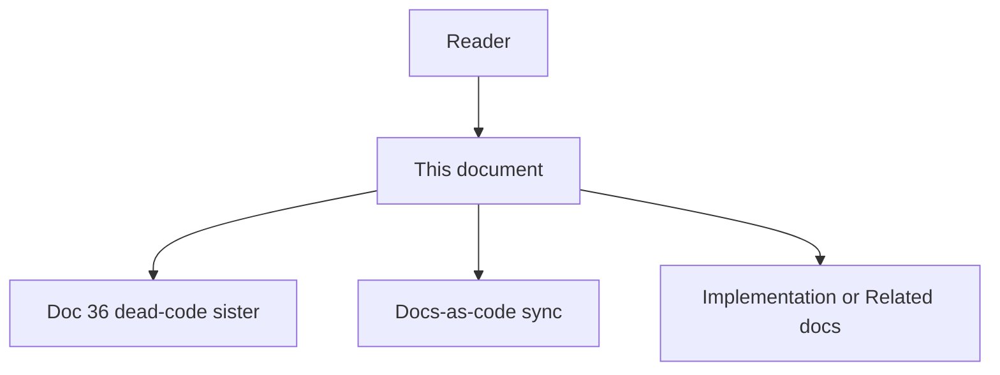

# 78 - Stale Documentation Candidates And Cleanup Loop

## Purpose

This document specifies **stale-documentation intelligence** for the Astloom wedge: detect documentation candidates that are orphaned, ghost-linked, hash-stale, or unsafe to retrieve as current truth, attach **numeric confidence scores** and **evidence chains**, guide connected coding agents to remediate or retire proven-stale docs in the same change when appropriate, and measure cleanup outcomes.

This is the **sister capability** to dead-code candidates ([`36-dead-code-candidates-and-cleanup-loop.md`](36-dead-code-candidates-and-cleanup-loop.md)). Dead-code finds unused **code**. This loop finds unused or misleading **documentation**. The two share scoring/evidence/KPI patterns and must not share a Memory candidate queue.

**Implementation status:** Full finding-kind set shipped; precision hardened after live dogfood (skip normative / `future` / `historical` empty-link orphans; resolve path-only and `path::Class.method` `linked_symbols`; ignore blank tokens; path-only unresolved ≠ ghost). Scorer, MCP `astloom_docs_stale_candidates`, skill/rule/audit hint, unit + live HTTP probe.

Astloom is not the executor. External IDE assistants and agent runtimes edit or delete Markdown. Astloom owns candidates, scoring, guidance seed content, freshness/catalog signals, and evidence for benefit measurement.

Product positioning: [`../00-master-plan/01-product-scope-and-feature-catalog.md`](../00-master-plan/01-product-scope-and-feature-catalog.md). Docs-as-code foundation: [`../03-docs-as-code-sync/00-index.md`](../03-docs-as-code-sync/00-index.md). Hybrid layers: [`41-hybrid-documentation-coverage.md`](41-hybrid-documentation-coverage.md). Guidance seed: [`../15-agent-workspace-guidance/06-mcp-first-agent-skills-and-rules.md`](../15-agent-workspace-guidance/06-mcp-first-agent-skills-and-rules.md). Measurement: [`../09-platform-governance-operations/10-impact-reporting-and-benefit-measurement.md`](../09-platform-governance-operations/10-impact-reporting-and-benefit-measurement.md).

## Document flow



| Step | Actor | Action | Outcome |
| --- | --- | --- | --- |
| 1 | Reader | Opens this design document | Understands scope and constraints |
| 2 | Reader | Contrasts with doc 36 | Sees sister vs reuse boundaries |
| 3 | Reader | Follows Mermaid + Related Documents | Reaches sync, hybrid coverage, guidance |

## Professional Audience

Engineers implementing docs-sync, catalog, quality-audit, and MCP gateway tools; product owners of the programming wedge; authors of Workspace Guidance seed packs; agents that remediate documentation debt.

## Goals

- Define stale-documentation candidates with explicit graph / catalog / frontmatter rules and **numeric scores**.
- Attach a machine-readable **evidence chain** on every finding.
- Scope cleanup to task-neighborhood docs (symbols touched by a change) by default; allow conservative **`project_scan`** with **`path_prefix`** over docs roots for ranked discovery.
- Mark **live-until-proven** docs so agents skip unsafe deletes or unlinks.
- Close the loop with guidance + measurable KPIs without Astloom mutating disk.
- Reuse existing docs-sync **drift** and quality-audit **standards** signals as inputs — not replace Full-tier authoring law.

## Non-Goals

- Astloom auto-deleting or rewriting Markdown on disk.
- Inventing `DOCUMENTED_BY` edges without Phase 2 resolve / evidence `linked_symbols`.
- Replacing Full-tier documentation authoring (`astloom-documentation-authoring`) or Body-tier docs-sync validate.
- Treating Memory or chat notes as a durable stale-doc candidate queue (graph + catalog remain SoT).
- Equating “missing documentation” (coverage gap) with “stale documentation” (misleading or orphaned docs) — both may appear as finding kinds, but remediation differs (write vs retire/update).
- Shipping speculative finding kinds without score/act policy (kinds below are normative when emitted).

## Relationship To Existing Surfaces

| Existing surface | Owns today | Stale-docs loop adds |
| --- | --- | --- |
| Docs-as-code drift | Hash mismatch when a **linked** symbol changes | Ranked **retire / unlink / split** candidates; ghost links; orphan docs with no edges |
| `astloom_docs_drift_check` / `docs_status` | Drift and coverage status | Optional deep-link into scored stale candidates |
| Quality-audit `docs.*` | Standards, size, linking gap, lanes, revision | New hint category for scored cleanup opportunity |
| Hybrid coverage (doc 41) | Read-path layers; evidence link suggestions | Does not invent edges; stale loop consumes resolved graph state |
| Dead-code (doc 36) | Unused **code** candidates | Sister pattern only; separate MCP tool and skill |

## Closed Loop

```mermaid
flowchart LR
  sync[astloom sync Phase1+2] --> graph[CKG + Doc registry]
  graph --> catalog[Docs catalog lanes]
  catalog --> score[StaleDocScorer]
  score --> mcp[MCP stale_docs_candidates]
  mcp --> agent[External agent]
  agent --> act[Prove then remediate]
  act --> kpi[Activity KPIs]
```

| Step | Actor | Action | Outcome |
| --- | --- | --- | --- |
| 1 | Operator / agent | Syncs code + human docs | Graph/catalog reflect disk |
| 2 | Astloom | Stale-doc query + score | Ranked candidates with evidence |
| 3 | Guidance | Skill `astloom-remove-stale-docs` | Agent proves then remediates |
| 4 | Agent | Updates, unlinks, splits, or deletes proven-stale docs | Working tree updated |
| 5 | Astloom | Activity / WorkLog KPI fields | Benefit measurement |

| Layer | Astloom owns | External agent owns |
| --- | --- | --- |
| Detect | Candidate query, score, evidence, blockers, freshness | Confirms human intent / supersession before delete |
| Guide | Seed always-on rule + skill `astloom-remove-stale-docs` | Follows rule in the same coding/docs change |
| Act | Never mutates repo | Remediates Markdown / frontmatter |
| Measure | KPIs and evidence linkage | Tests / docs-standards / acceptance |

## Finding Kinds

| Kind | Meaning | Phase |
| --- | --- | --- |
| `orphan_doc` | Indexed Markdown with no resolved `DOCUMENTED_BY` and empty or unresolvable `linked_symbols`, while claiming product/code authority | v1 |
| `ghost_link` | One or more `linked_symbols` / anchors point at missing, retired, or never-ingested symbols | v1 |
| `stale_anchor` | `DocAnchor` recorded hash ≠ current symbol hash (classic docs-sync drift, scored for cleanup ranking) | v1 |
| `superseded_retrieval_risk` | Doc is `lifecycle_lane: historical` / superseded but still surfaced as current-like in catalog or packs | v1 |
| `coverage_gap` | Symbol marked doc-required (or public API policy) with no human layer after sync | optional (`include_coverage_gaps`) |
| `duplicate_authority` | Two or more `authority: normative` + `lifecycle_lane: current` docs share a SoT topic (`linked_symbols` / resolved symbols / `primary_entities`) without declared `related_docs` / `relations_declared` / `depends_on` split | shipped |
| `wiki_orphan` | Repository wiki page (`wiki/` path, wiki tags, or `wiki_page_id`/`module_key`) with no durable code anchors after publish | shipped |

## Candidate Definition

### Precision-first model

Within the declared scope and after the latest successful sync (code Phase 1 + docs Phase 2 when applicable):

1. **Live docs** = Markdown under governed roots with valid frontmatter, `lifecycle_lane` in `{current, transition}` (or `initial` when still binding), and either resolved `DOCUMENTED_BY` or an explicit catalog role that does not claim code SoT.
2. Candidates are docs (or doc↔symbol pairs) that fail liveness / truthfulness tests above.
3. Confidence is a **numeric score** (0.0–1.0). Scores **only decrease** via caps (same monotonic rule as dead-code).
4. Graph + docs registry + catalog are SoT. Recompute on each call — **no** durable Memory candidate queue.

### Scope

| Scope mode | Meaning |
| --- | --- |
| `task_neighborhood` | Docs linked to (or citing) symbols/files within N hops of anchors (default for agents) |
| `changed_symbols` | Docs whose anchors / `linked_symbols` intersect the change set |
| `explicit_paths` | Operator- or agent-supplied doc path prefixes |
| `project_scan` | Ranked discovery over governed docs roots; **prefer `path_prefix`** (e.g. `docs/07-code-knowledge-graph/`) |

### Strong vs weak evidence

| Signal | Role |
| --- | --- |
| Resolved `DOCUMENTED_BY` + matching anchor hash | Strong proof the doc is live for that symbol |
| Catalog lanes + `authority` / `lifecycle_lane` | Strong retrieval policy input |
| Evidence-only `linked_symbols` tokens on disk | Input to resolve; not an edge until Phase 2 |
| Embedding similarity alone | **Never** sufficient for `safe_to_delete` or unlink |
| Quality-audit standards failures | Soft signals / blockers; not automatic delete |

## Score Model

### Base scores (illustrative defaults)

| Situation | Base |
| --- | --- |
| All linked symbols missing + no `DOCUMENTED_BY` + non-normative or future lane | 0.90 |
| Ghost links majority + remaining anchors hash-stale | 0.80 |
| Classic stale_anchor only (doc still useful) | 0.65 |
| coverage_gap (missing human layer) | 0.55 (prefer write, not delete) |
| duplicate_authority / superseded_retrieval_risk | 0.70 |
| wiki_orphan (published wiki page, no durable anchors) | 0.80 |

### Caps and blockers (scores only decrease)

| Cap / blocker | Effect |
| --- | --- |
| `authority: normative` + `lifecycle_lane: current` | Cap ≤ 0.55 unless ghost/orphan fully proven; never `safe_to_delete` without human Task |
| Recent `updated_at` / revision stamp (≤ N days) | `recent_doc_cap` ≤ 0.55 |
| `decision_refs` / ADR / runbook tags | Soft blocker |
| `supersedes` chain still referenced | Soft blocker |
| Incomplete index / pending sync | `freshness_*` blocker; demote `safe_to_delete` |
| Standards size/lane/revision findings alone | Never raise delete confidence |

### Tiers and Act policy

| Tier | Score | Agent default |
| --- | --- | --- |
| high | ≥ 0.80 | May remediate when `safe_to_delete` or `safe_to_unlink` and blockers empty |
| medium | 0.50–0.79 | Surface; prefer update / Task |
| low | < 0.50 | Skip or uncertain only |

**Act flags:**

- `safe_to_delete` — retire file only when orphan/ghost fully proven and not normative-current.
- `safe_to_unlink` — remove dead `linked_symbols` / anchors while keeping the doc.
- `safe_to_update` — classic drift, wiki orphan (add anchors), or duplicate authority (split / declare relation); prefer over delete.
- `wiki_orphan` / `duplicate_authority` never set `safe_to_delete`; duplicates carry `needs_human_task`.

Agents acting on destructive remediations must pass `min_confidence` ≥ **0.80** and prefer `safe_to_unlink` / `safe_to_update` over `safe_to_delete`.

## Live-Until-Proven Exclusions

| Exclusion | Reason |
| --- | --- |
| Normative `current` standards / contracts | Wrong delete breaks the law corpus |
| Operator runbooks and connect guides | External ops readers; may lag intentionally |
| Docs with open `decision_refs` / Issues | Human ownership in flight |
| Catalog-only indexes (`00-index.md`) | Structural maps; remediate via index edit, not orphan delete |
| Fixture / live-QA docs matching known noise patterns | Already purged by registry hygiene — do not score as product debt |
| Incomplete sync / pending Phase 2 | Absence of edges is not proof of orphanhood |
| `lifecycle_lane: future` (and empty-link `historical` without supersede signal) | Intentional backlog / archive; linking-gap is not delete orphan |
| Blank / whitespace `linked_symbols` tokens | Noise — ignored at resolve time |

Ambiguous candidates must appear with tier `low` or `medium`, non-empty `blockers` / evidence, and `safe_to_delete: false`.

## MCP Tool Contract

Tool name: `astloom_docs_stale_candidates`  
`maps_to`: `docs.stale_candidates`  
Advertised on `programming-cursor-mcp`. Default `scope_mode=task_neighborhood`.

### Request

| Field | Type | Required | Notes |
| --- | --- | --- | --- |
| `project_id` | string | no | Must match active MCP project when set |
| `scope_mode` | enum | yes | `task_neighborhood` \| `changed_symbols` \| `explicit_paths` \| `project_scan` |
| `anchor_symbols` | string[] | no | Required effectively for non-`project_scan` modes |
| `anchor_paths` | string[] | no | Code or doc path prefixes |
| `path_prefix` | string | no | Docs-root relative prefix; report-only filter; prefer for `project_scan` |
| `max_results` | int | no | Default 50; max 200 |
| `include_uncertain` | bool | no | Default false |
| `min_confidence` | number | no | Floor 0.0–1.0; `project_scan` omit → `0.50`; destructive act → `0.80` |
| `triage` | bool | no | Advisory only; cannot raise `safe_to_delete` / `safe_to_unlink` |
| `include_coverage_gaps` | bool | no | Default false; opt-in missing-doc findings |

### Response

```json
{
  "freshness": "ok|pending_sync|stale",
  "scope_mode": "task_neighborhood",
  "path_prefix": "optional/when/set",
  "index_coverage": {
    "status": "ok|incomplete",
    "pending_count": 0,
    "safe_absence_claims": true,
    "note": "…"
  },
  "kpi_hints": {
    "stale_docs_candidates_surfaced": 1,
    "stale_docs_candidates_skipped_uncertain": 0,
    "stale_docs_candidates_resolved": 0
  },
  "candidates": [
    {
      "doc_id": "as.doc.example.retired-feature",
      "path": "docs/example/retired-feature.md",
      "finding_kind": "ghost_link",
      "score": 0.85,
      "confidence": "high",
      "evidence": [{"kind": "linked_symbol_missing", "detail": "path::GoneSymbol"}],
      "blockers": [],
      "safe_to_delete": false,
      "safe_to_unlink": true,
      "safe_to_update": false
    }
  ],
  "skipped_uncertain": []
}
```

**Status:** Tool is implemented and advertised on `programming-cursor-mcp` (`maps_to: docs.stale_candidates`). Finding kinds: `orphan_doc`, `ghost_link`, `stale_anchor`, `superseded_retrieval_risk`, `wiki_orphan`, `duplicate_authority`, optional `coverage_gap`.

## Configuration

Tuning is **per MCP call**, not via dedicated `.env` knobs (YAGNI, same rule as doc 36):

| Knob | Where | Notes |
| --- | --- | --- |
| `min_confidence` | MCP request | Floor; destructive act → 0.8 |
| `max_results` | MCP request | Hard cap 1–200 |
| `scope_mode` / `path_prefix` | MCP request | Discovery vs task default |
| `include_uncertain` / `triage` / `include_coverage_gaps` | MCP request | Optional surfaces |

## Guidance And Quality Audit

1. Seed skill **`astloom-remove-stale-docs`**: after code replace/retire **and** after material doc edits, call stale-docs candidates; prefer `safe_to_update` / `safe_to_unlink`; delete only when `safe_to_delete` and score ≥ 0.8; same-change when possible; graph/catalog SoT — not Memory.
2. Always-on MCP-first rule: deep-link from docs work and from dead-code cleanup when exclusive docs only described removed symbols.
3. Quality-audit category: `docs.stale_cleanup_hint` — after linking-gap inventory, point agents at `astloom_docs_stale_candidates`.
4. Optional human `Task` for normative-current uncertain rows — not a candidate Memory SoT.

## Agent Workflow (with guidance)

1. After replace/retire of code **or** after discovering drift/linking gaps, call stale-docs candidates in the same change when docs are in scope.
2. Prefer `safe_to_update` and `safe_to_unlink` over `safe_to_delete`.
3. Prove with catalog lanes, `rg` on `doc_id` / path citations, and Related Documents edges.
4. Remediations: refresh hash anchors, fix `linked_symbols`, split soft-budget docs, mark `historical` + `superseded_by`, or delete true orphans.
5. Skip blockers / uncertain; optionally open a Task for human review.
6. Run `astloom docs-standards` / quality-audit on touched paths.
7. Record Activity/WorkLog using `kpi_hints` field names.

## Measurement Hooks

Emit or attach to WorkLog / Activity (and echo on MCP as `kpi_hints`):

- `stale_docs_candidates_surfaced`
- `stale_docs_candidates_resolved` (remediated after proof)
- `stale_docs_candidates_skipped_uncertain`

Blind deletes without standards/acceptance must not count as positive benefit. Align with existing `repeated_documentation_drift_count` / drift KPIs in impact reporting without double-counting the same remediation.

## Phase Roadmap

| Phase | Deliverable |
| --- | --- |
| Design | Normative finding kinds, score policy, MCP contract, guidance plan |
| Implement | Scorer + MCP + skill/rule/audit hint; unit + live HTTP probe on fixture docs |
| Harden | `path_prefix` discovery; ghost_link / orphan_doc precision gates; no Memory SoT; Class.method + blank-token resolve |
| Optional kinds | `wiki_orphan`, richer `duplicate_authority` (shared symbols / primary_entities; skip when related) — **shipped** |

## Risks And Acceptance

| Risk | Mitigation |
| --- | --- |
| False orphan when Phase 2 not run | Freshness / incomplete index blockers |
| Agent deletes normative standard | Normative-current cap; Task required |
| Drift tool vs stale tool confusion | Clear ownership table; stale ranks retire/unlink; drift remains hash update path |
| Embedding-only false couples | Forbidden as sole evidence |
| Double-counting KPIs with docs-sync drift | Single remediation event; shared measurement notes |

Acceptance:

- [x] Candidate definition, score model, and exclusions are unambiguous for implementers.
- [x] MCP request/response fields include score, evidence, finding_kind, act flags, path_prefix.
- [x] Product docs state Astloom does not mutate the repo for cleanup.
- [x] Seed guidance references this loop and the skill name.
- [x] Live probe proves orphan/ghost fixtures without deleting normative fixtures.
- [x] `lifecycle_lane` of this file is `current` after v1 ships and gates pass.

## Implementation progress

Last updated: 2026-08-04

| ID | Spec anchor | Status | Code / tests |
| --- | --- | --- | --- |
| 1 | Score model + finding kinds v1 | [x] | `domain/stale_docs/scoring.py`, `find.py` |
| 2 | MCP `astloom_docs_stale_candidates` | [x] | gateway `docs.py` + profile + dispatch |
| 3 | Skill / always-rule / `docs.stale_cleanup_hint` | [x] | seed pack + quality_audit + Cursor skill |
| 4 | Unit + MCP contract tests | [x] | `test_stale_docs_candidates.py` (positives + healthy/related negatives), MCP store mode |
| 5 | Live HTTP probe | [x] | per-`doc_id` kind binding + healthy/related negatives; artifact `stale-docs-live.json` |
| 6 | Product catalog / guidance 06 / impact KPIs | [x] | docs 01, 06, 10 aligned to sister loop |
| 7 | wiki_orphan + richer duplicate_authority | [x] | `find.py` / `scoring.py` + unit tests |

## Related Documents

- [`36-dead-code-candidates-and-cleanup-loop.md`](36-dead-code-candidates-and-cleanup-loop.md) — sister dead-code loop.
- [`41-hybrid-documentation-coverage.md`](41-hybrid-documentation-coverage.md) — hybrid layers; no invented edges.
- [`42-documentation-catalog-and-lane-cache.md`](42-documentation-catalog-and-lane-cache.md) — catalog filters and lanes.
- [`../03-docs-as-code-sync/00-index.md`](../03-docs-as-code-sync/00-index.md) — docs-sync foundation and drift.
- [`../03-docs-as-code-sync/01-feature-specification.md`](../03-docs-as-code-sync/01-feature-specification.md) — drift before merge.
- [`../15-agent-workspace-guidance/06-mcp-first-agent-skills-and-rules.md`](../15-agent-workspace-guidance/06-mcp-first-agent-skills-and-rules.md) — seed skills/rules.
- [`../09-platform-governance-operations/10-impact-reporting-and-benefit-measurement.md`](../09-platform-governance-operations/10-impact-reporting-and-benefit-measurement.md) — cleanup / drift KPIs.
- [`../agents/documentation-authoring.md`](../agents/documentation-authoring.md) — Full-tier authoring law.
