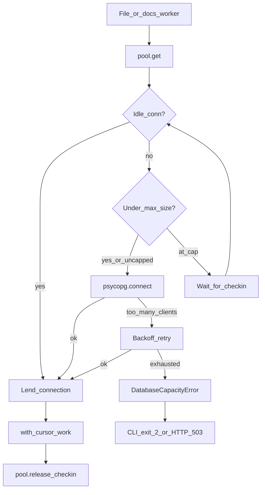

# 79 - Postgres Connection Pool And Capacity Low-Level Design

## Purpose

Define how Astloom Postgres adapters (pgvector embeddings, outbox mirror,
optional Postgres graph store, docs-sync store) borrow and return `psycopg`
clients under parallel `astloom sync`, how pool size is sized from live server
capacity, and how slot exhaustion fails as a typed capacity error instead of an
unhandled traceback.

## Implementation status

**Implemented** in `code_graph_service.pg_thread_local` (vendored twin under
`docs_sync_service.pg_thread_local`), wired from Postgres embedding/outbox/store
constructors and docs-sync `PostgresStore`. CLI `cmd_sync` maps
`DatabaseCapacityError` to a clean non-zero exit; HTTP maps `capacity_error` to
`503` with `retryable=true`.

## Design flow

| Step | Actor | Action | Outcome |
| --- | --- | --- | --- |
| 1 | Worker | `pool.get()` for a store/embedding op | Re-entrant hold on this thread |
| 2 | Pool | Prefer idle connection; else create if under max | No new client when idle exists |
| 3 | Cursor exit | Auto `release()` → checkin to idle | Worker does not keep an idle client forever |
| 4 | Connect fail | Detect capacity markers; retry with wait | Absorb short contention |
| 5 | Retries exhausted | Raise `DatabaseCapacityError` | Typed failure, not raw `OperationalError` crash |
| 6 | CLI / HTTP | Map capacity to message + exit `2` / `503` | Operator can retry after freeing clients |

## Root cause this design closes

Parallel sync used **thread-local connections that never returned**. Every
worker that ever touched Postgres kept an idle client until process exit. Long-
lived `code-graph` HTTPS / MCP processes therefore accumulated dozens of idle
backends and eventually hit `FATAL: sorry, too many clients already` during the
docs phase (see FIX-005 in the live remediation record). Capping docs workers
to `store_concurrency` alone was incomplete while idle clients remained leased.

## Pool sizing (`resolve_pg_pool_max`)

| `ASTLOOM_PG_POOL_MAX` | Behavior |
| --- | --- |
| unset / `auto` | Probe `SHOW max_connections` and `pg_stat_activity` count; reserve headroom; divide free slots by `ASTLOOM_PG_POOL_SHARE` (default `3`) |
| `none` / `unlimited` / `off` | No artificial pool max (still checkout/checkin) |
| positive int | Explicit per-pool live-client cap |

Rules:

- Do **not** clamp pool max to Neo4j `store_concurrency` (that would invent a
  second bottleneck). `LockedStore` already bounds concurrent store mutations.
- Probe failure → uncapped pool (lifecycle still prevents per-worker leaks).
- Tight server (`free < 1` after reserve) → soft floor of `2` live clients.

## Capacity error contract

| Surface | Behavior |
| --- | --- |
| Markers | `too many clients`, `remaining connection slots are reserved`, `connection limit exceeded` |
| Retries | `ASTLOOM_PG_CAPACITY_RETRIES` (default `6`) with short condition waits |
| Domain type | `DatabaseCapacityError` (`code=database_capacity`, `category=capacity_error`) |
| CLI | `astloom sync` prints a capacity message and returns exit code `2` (no full traceback) |
| HTTP | `CodeGraphError` handler → `503`, `retryable=true` |

## Operator knobs

| Knob | Effect |
| --- | --- |
| `ASTLOOM_PG_POOL_MAX` | unset/`auto` = probe server; `none`/`unlimited`/`off` = no cap; positive int = explicit per-pool max |
| `ASTLOOM_PG_POOL_SHARE` | Divider for free slots under auto (default `3`) |
| `ASTLOOM_PG_CAPACITY_RETRIES` | Connect retries on slot exhaustion before `DatabaseCapacityError` (default `6`) |

Companion CPU/worker knobs remain in the LiteLLM environment standard and doc 50.

## Operator response

1. Inspect `pg_stat_activity` for idle `astloom` clients.
2. Restart long-lived graph HTTPS / MCP if they hold leaked pre-fix processes.
3. Retry `astloom sync` (do not raise `max_connections` as the first fix).
4. Optional: set `ASTLOOM_PG_POOL_MAX` only when you need an explicit ceiling.

## Verification

| Check | Expectation |
| --- | --- |
| Unit | `tests/backend/services/code-graph-service/test_pg_thread_local.py` (reuse, bound, capacity raise/retry) |
| Unit | Docs worker cap still covered by `test_docs_link_sync.py` |
| Live | Under contention, sync exits with capacity message or completes without traceback |
| Host | After sync / phase reset, process client count does not climb toward `max_connections` solely from idle workers |

## Related Documents

- [`50` Sync CPU budget and store concurrency LLD](50-sync-cpu-budget-and-store-concurrency-lld.md)
- [`39` RPM session parallel sync LLD](39-rpm-session-parallel-sync-low-level-design.md)
- [`73` Live audit defect remediation record](73-live-audit-defect-remediation-record.md) (FIX-005)
- [`76` Post-restart operations verification runbook](76-post-restart-operations-verification-runbook.md)
- LiteLLM / sync env knobs (includes Postgres pool vars)
