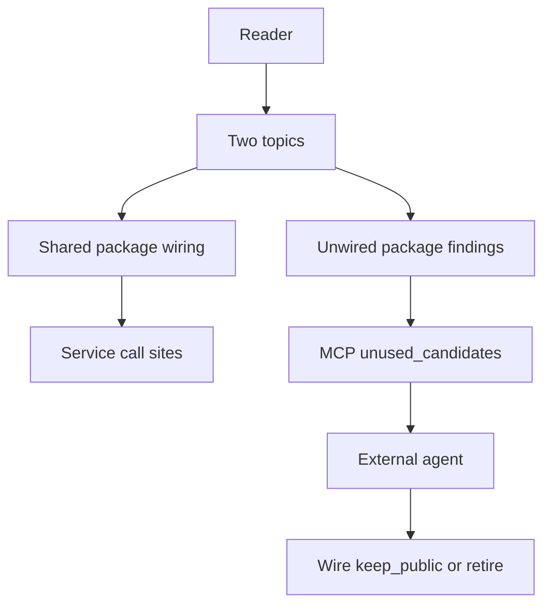

# 79 - Shared Package Wiring And Unwired Findings

## Purpose

This document covers **two related surfaces** under `backend/packages/`:

1. **Wiring** shared libraries into deployable services so contracts are not dead libraries.
2. **Findings** from `astloom_code_graph_unused_candidates` that classify package zombies as `unwired_shared_package` (wire / keep_public) or `zombie_package` (retire) — never as automatic deletes.

Sister normative loop: [`36-dead-code-candidates-and-cleanup-loop.md`](36-dead-code-candidates-and-cleanup-loop.md). Astloom surfaces and scores; agents wire or retire; Astloom never mutates the tree for cleanup.

## Document flow



| Step | Actor | Action | Outcome |
| --- | --- | --- | --- |
| 1 | Reader | Opens this feature spec | Sees wiring vs finding scopes |
| 2 | Engineer | Follows wiring ownership | Imports packages from services |
| 3 | Agent | Calls unused-candidates on packages | Gets `recommendation` without `safe_to_delete` |
| 4 | Agent | Acts per recommendation | Wires, keeps public, or retires with proof |

## Professional Audience

Engineers owning `code-graph-service`, `common-context-service`, and `backend/packages/*`; agents following `astloom-remove-dead-code`.

## Goals And Non-Goals

### Goals

- Keep shared contracts (`code-metadata`, `common-context`, …) reachable from services that need them.
- Distinguish **library not imported** (often wire) from **orphan package** (retire) and **published SDK** (keep_public).
- Expose classification on the existing MCP tool — no second dead-code tool.
- Prefer structural package rows when `max_results` would otherwise drown them in symbol noise.

### Non-Goals

- Auto-wiring or auto-deleting packages from Astloom.
- Treating every unused file under `backend/packages/` as a package finding (package rows need ≥2 files, no external `IMPORTS`, all pool exports unused — see doc 36 / `findings.py`).
- Claiming `safe_to_delete` for any `unwired_shared_package` or `zombie_package` row.

## Topic A — Shared package wiring

### Decision

For libraries that already have tests/profiles/contracts and a clear consumer service: **wire, do not retire**.

### As-built wiring (Astloom)

| Package | Consumer | Behavior |
| --- | --- | --- |
| `code-metadata` | `code-graph-service` | `code_metadata_bridge` builds/validates file and symbol metadata; ingest attaches validated `metadata.code_metadata`. Generation uses `should_escalate_to_source` (+ profile) for source-read escalation. |
| `common-context` | `common-context-service` | `score_item` + `load_profile` for propose scoring; `select_within_budget` for `resolve_bundle`. |

Import path ownership: `pyproject.toml` package dirs, `ensure_service_import_paths`, MCP `_paths.py`, usage-profile / local MCP loaders, and service conftest `pythonpath`.

### Wiring flow

```mermaid
flowchart LR
  pkg[backend/packages lib] --> svc[Deployable service]
  svc --> graph[CKG edges IMPORTS]
  graph --> scan[unused_candidates]
  scan --> gone[No package zombie for that top]
```

| Step | Actor | Action | Outcome |
| --- | --- | --- | --- |
| 1 | Engineer | Import shared API from service module | Runtime dependency exists |
| 2 | Sync / ingest | Index `IMPORTS` into CKG | Package is not an external-importer zombie |
| 3 | Agent | Scans `path_prefix=backend/packages/<top>` | No `unwired_shared_package` / `zombie_package` for that top |

### Verification

- Unit: package tests + service tests for ingest/generation/propose paths.
- Live: after sync, `project_scan` + `path_prefix=backend/packages/code-metadata` (and `common-context`) returns **no** package-level unwired/zombie row for those tops.

## Topic B — Unwired shared package findings

### Structural signal (same as zombie)

A package finding requires (normative in `zombie_package_candidates`):

- Package key = parent directory of eligible symbols (≥2 distinct file paths).
- No inbound `IMPORTS` from a **different** package.
- Every pool member is unused (in `dead_ids`).

Under `backend/packages/<top>/…`, classification replaces a blunt retire signal.

### Classification (`package_class.py`)

| Condition | `finding_kind` | `recommendation` |
| --- | --- | --- |
| Top in published set (`adapter_harness`, `astloom_sdk`, `sdk`) | `unwired_shared_package` | `keep_public` |
| Disk wire signals (package tests under `tests/backend/packages/…` or `*-profiles` configs) | `unwired_shared_package` | `wire` |
| `repo_root` present, no wire signals | `zombie_package` | `retire` |
| No `repo_root` | `unwired_shared_package` | `wire` (prefer wire over delete) |
| Path not under `backend/packages/` | `zombie_package` | `retire` |

Wire signals are **disk heuristics**, not proof of a missing call site. Agents still decide how to wire.

### Scoring and safety

| Rule | Value |
| --- | --- |
| Base score for `unwired_shared_package` | 0.65 (then monotonic caps) |
| `safe_to_delete` | Always `false` for `unwired_shared_package`, `zombie_package`, `runtime_dead`, `flag_controlled_dead` |
| Evidence | Includes finding kind; `recommendation` also appears as evidence `kind=recommendation` |

### MCP contract delta (doc 36)

Same tool: `astloom_code_graph_unused_candidates`.

Extra response fields on package rows:

| Field | Notes |
| --- | --- |
| `finding_kind` | `unwired_shared_package` or `zombie_package` |
| `recommendation` | `wire` \| `keep_public` \| `retire` |
| `kind` | `package` |
| `path` / `symbol` | Package path key |

Pass `repo_root` so disk wire signals and retire classification apply. Prefer `scope_mode=project_scan` with `path_prefix=backend/packages` (or a single top) for discovery.

### `max_results` structure priority

Equal-score symbol / `unreachable_file` rows can fill `max_results` and hide package findings. Slice order prefers:

1. `unwired_shared_package` / `zombie_package`
2. `unreachable_file`
3. Remaining finding kinds

Implemented in `find.py` (`_take_with_structure_priority`).

### Agent actions by recommendation

| Recommendation | Agent action |
| --- | --- |
| `wire` | Import the shared API from the intended service (or document why keep unused); re-sync; confirm package finding disappears |
| `keep_public` | Do not delete; treat as published/SDK surface |
| `retire` | Only after proving no external/SDK use; remove package + exclusive tests/docs in the same change |

Skill: `astloom-remove-dead-code` — never delete on `unwired_shared_package`.

### Live examples (Astloom repo)

| Path | Observed recommendation | Note |
| --- | --- | --- |
| `backend/packages/adapter_harness` | `keep_public` | Published top; no service importers |
| Wired `code-metadata` / `common-context` | (no package finding) | Service `IMPORTS` present |
| Temporary probe with package tests, no importers | `wire` | Proof of classification path; not left in tree |

## Risks And Acceptance

| Risk | Mitigation |
| --- | --- |
| False `wire` on abandoned package | Wire signals are heuristics; human/agent proof before large refactors |
| False `retire` when tests live elsewhere | Expand signals only with evidence; prefer `wire` when `repo_root` missing |
| Package finding hidden under noise | Structure-priority slice under `max_results` |
| Agents delete SDK trees | `keep_public` + never `safe_to_delete` |

Acceptance:

- [x] Classification table is implementable from `package_class.py`.
- [x] MCP exposes `recommendation` on package findings; never `safe_to_delete` for those kinds.
- [x] `code-metadata` and `common-context` are wired into named service call sites.
- [x] Doc 36 links here; index lists this file.
- [x] Structure-priority behavior is documented and unit-covered.

## Related Documents

- [`36-dead-code-candidates-and-cleanup-loop.md`](36-dead-code-candidates-and-cleanup-loop.md) — dead-code loop, score model, MCP base contract.
- [`07-metadata-first-code-understanding.md`](07-metadata-first-code-understanding.md) — metadata-first product intent.
- [`08-code-metadata-schema-and-lifecycle.md`](08-code-metadata-schema-and-lifecycle.md) — metadata records and escalation.
- [`00-index.md`](00-index.md) — CKG section index.
- [`../15-agent-workspace-guidance/06-mcp-first-agent-skills-and-rules.md`](../15-agent-workspace-guidance/06-mcp-first-agent-skills-and-rules.md) — seed skills/rules.
- [`../00-master-plan/01-product-scope-and-feature-catalog.md`](../00-master-plan/01-product-scope-and-feature-catalog.md) — product catalog.
