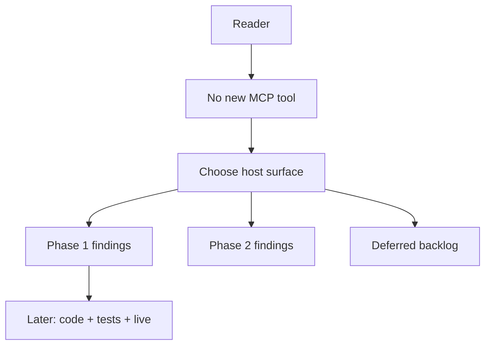
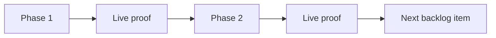

# 80 - Phased Problematic Code Findings

## Purpose

This document is the **implementation-ready design** for expanding Astloom’s “problematic code” intelligence **without a new MCP tool**. New signals ship as:

- `finding_kind` rows on `astloom_code_graph_unused_candidates`, and/or
- `category` rows on `astloom_quality_audit` / `astloom quality-audit`.

Status: **docs only** (`lifecycle_lane: future`). Do not treat categories below as shipped until their phase checkbox is closed in code + tests + live proof.

Sister loops: [`36-dead-code-candidates-and-cleanup-loop.md`](36-dead-code-candidates-and-cleanup-loop.md), [`79-shared-package-wiring-and-unwired-findings.md`](79-shared-package-wiring-and-unwired-findings.md).

## Document flow



| Step | Actor | Action | Outcome |
| --- | --- | --- | --- |
| 1 | Product / eng | Read placement and phase rules | Avoid tool sprawl and big-bang noise |
| 2 | Implementer | Build one phase at a time | Scored findings with evidence |
| 3 | Agent | Remediates via existing skills | Debt clears or Tasks created |

## Professional Audience

Engineers extending `code-graph-service` unused-candidates and `astloom_cli` quality-audit; authors of MCP-first skills; product owners of the programming wedge.

## Goals And Non-Goals

### Goals

- Detect **actionable** structural / process risks from the CKG and sync inventory already owned by Astloom.
- Reuse score + evidence + `must_remediate` / Task patterns already used by quality-audit and dead-code.
- Ship **one or two** findings per phase; prove live before adding more.
- Keep agent trust high: prefer false negatives over noisy false positives.

### Non-Goals

- A new MCP tool named like `problematic_code` / `code_smells`.
- Full static analysis suites (Bandit, Semgrep, mypy) as Astloom SoT — optional later adapters only.
- Auto-refactoring or auto-deletes by Astloom.
- Implementing every backlog row in v1.

## Product Decision — Host Surface

| Kind of signal | Host | Why |
| --- | --- | --- |
| Unreachable / unused / package zombie / export deadness | `unused_candidates` | Same reachability / pool model as doc 36 |
| Session debt, inventory gaps, structural risk that should block “done” | `quality_audit` | Already drives `must_remediate` + follow-up Tasks |
| Blast-radius / “what breaks if I change X” Q&A | Existing graph tools (`impact`, `neighbors`, `explore`) — **not** a smell catalog | Different question shape |

**Law:** do not invent a third catalog MCP. Extend the two hosts above.

## Phasing Law



| Step | Actor | Action | Outcome |
| --- | --- | --- | --- |
| 1 | Engineer | Implements only the current phase set | Unit + focused regression |
| 2 | Engineer | Runs live Neo4j/MCP scan on Astloom | Evidence JSON / chat report |
| 3 | Product | Accepts noise level | Unlock next phase or tighten thresholds |

Rules:

1. Never enable more than **two** new categories in one change without explicit product override.
2. Default severity for new structural smells: **medium** until live false-positive rate is known; promote to high only with evidence.
3. Every finding needs `evidence[]` and a one-line `fix_hint`.
4. Graph freshness caps apply (same spirit as doc 36): stale/pending → do not claim strong absence; lower score / add blockers.

## Phase 1 (implement first)

### 1A — `code.cyclic_deps` (quality_audit)

| Field | Spec |
| --- | --- |
| Category id | `code.cyclic_deps` |
| Meaning | Strong dependency cycle among packages/modules using `IMPORTS` (and optionally `CALLS` for same-file clusters — **v1 = IMPORTS only**) |
| Scope | Prefer `path_prefix` / service package roots; whole-repo scan opt-in |
| Score | Base 0.70; cap if cycle length > N (config default N=8 → still report but note `large_cycle`) |
| Severity | medium (initial) |
| `must_remediate` | Yes when severity ≥ medium and freshness ok |
| Agent action | Break cycle at the weakest edge (extract interface / move type); do not “delete cycle” |
| Evidence | Cycle node path list (bounded), edge types, representative symbol ids |
| Exclusions | Test↔prod only cycles may be downgraded or skipped when both sides are `test_only` |

### 1B — `code.missing_tests_for_change` (quality_audit)

| Field | Spec |
| --- | --- |
| Category id | `code.missing_tests_for_change` |
| Meaning | Changed production symbols (anchors / recent sync stamp / explicit paths) lack nearby `TESTED_BY` or test-path coverage for the change neighborhood |
| Scope | Default **task_neighborhood** of anchors; not whole-repo |
| Inputs | `anchor_symbols` / `anchor_paths` and/or sync “edited since” set already known to quality-audit / inventory |
| Score | Base 0.75 when production symbol changed and zero test edges; 0.55 when only weak/ambiguous links |
| Severity | medium; high only if symbol is on a trust boundary (HTTP handler, auth, ingest write) — v1 may omit auto-high |
| `must_remediate` | Yes for medium+ in task scope |
| Agent action | Add or update tests under repository `tests/` (never service-local runnable tests) |
| Evidence | Changed symbol ids, missing `TESTED_BY`, suggested test path heuristic |
| Exclusions | Docs-only, generated, pure type-alias, `tsoc-defer` paths |

Phase 1 acceptance (when coding later):

- [ ] Categories registered in quality-audit category catalog + MCP payload.
- [ ] Unit tests for cycle detection and missing-test neighborhood.
- [ ] Live scan on Astloom produces ≤ tolerable noise (document threshold in PR).
- [ ] Skill `astloom-quality-audit` mentions the new categories.
- [ ] Doc 80 phase checkbox closed; bump `doc_version`; set `lifecycle` items to current when shipped.

## Phase 2

### 2A — `code.god_module` (quality_audit)

| Field | Spec |
| --- | --- |
| Category id | `code.god_module` |
| Meaning | File/module exceeds structural fan-in **and** size/symbol-count thresholds (both required) |
| Thresholds (defaults) | ≥ 40 eligible symbols **or** ≥ 800 LOC **and** inbound `IMPORTS` from ≥ 8 distinct packages |
| Score | 0.60 base; +evidence for each threshold crossed |
| Severity | low or medium (not high by default — often intentional hubs) |
| `must_remediate` | Optional medium only when fan-in and size both crossed; else advisory |
| Agent action | Split by seam (standard 50 package README / module deepen); do not blind-split |
| Exclusions | Generated clients, `migrations/`, vendored trees, seed prompt corpora |

## Deferred backlog (do not implement until prior phases prove out)

| Id | Host | One-line meaning |
| --- | --- | --- |
| `duplicate_impl` | unused_candidates or quality | Near-duplicate symbol bodies / twin qualified names across packages |
| `orphaned_test_only` | unused_candidates | Production API only referenced from tests while a newer twin exists (needs replace/retire anchors) |
| `unused_export_public` | unused_candidates | Public/exported symbol with no inbound strong use (stricter public-API exclusions) |
| `dead_config_key` | quality_audit | Config/profile key never read by indexed loaders |
| `code.hotspot_complexity` | quality_audit | Extreme cyclomatic / nesting from optional metrics table — needs metric pipeline first |
| `code.trust_boundary_gap` | quality_audit | HTTP/ingest entrypoint missing authz or validation edges — needs explicit edge types |
| `stale_flag_branch` | unused_candidates | Strengthen existing `flag_controlled_dead` UX only |

Backlog items require a short ADR addendum in this doc (new H2) before coding.

## Shared Finding Shape

Align with existing hosts:

```json
{
  "category": "code.cyclic_deps",
  "severity": "medium",
  "score": 0.7,
  "path": "backend/services/example-service/src/...",
  "evidence": [{"kind": "import_cycle", "detail": "A→B→A"}],
  "fix_hint": "Break IMPORTS cycle at the weakest package edge.",
  "fingerprint": "stable-hash-for-tasks"
}
```

For unused-candidates-hosted kinds, reuse doc 36 row shape (`finding_kind`, `score`, `evidence`, `blockers`, `safe_to_delete`).

**`safe_to_delete`:** always `false` for smell/risk categories unless a future kind is explicitly a delete candidate under doc 36 rules.

## Agent Workflow

1. Session / after edits: `astloom_quality_audit` — remediate high/medium (skill `astloom-quality-audit`).
2. After replace/retire: `unused_candidates` as today (skill `astloom-remove-dead-code`).
3. On `code.cyclic_deps` / `code.god_module`: refactor at seams; re-audit.
4. On `code.missing_tests_for_change`: add tests; smallest pytest command.
5. Optional `create_tasks=true` for leftover medium+ (follow-up Task lifecycle doc).

Do **not** queue smells in Memory as SoT — recompute from graph/audit.

## Risks And Acceptance (design)

| Risk | Mitigation |
| --- | --- |
| Alert fatigue | Phased enablement; medium default; structure-priority / caps |
| False cycles via type-only imports | v1 IMPORTS from CKG only; allowlist stub packages later |
| Missing-tests noise on refactors | Task neighborhood only; exclude docs/generated |
| Premature god_module refactors | Advisory unless both thresholds crossed |
| Tool sprawl | Explicit ban on new MCP smell tool |

Design acceptance (this doc):

- [x] Host-surface decision recorded.
- [x] Phase 1 and Phase 2 contracts are implementable without new MCP tools.
- [x] Backlog is deferred with a gate.
- [x] Linked from CKG index as future work.

## Implementation Checklist (for the coding session later)

1. Register Phase 1 categories + detectors behind feature flags or profile allow-list if needed.
2. Unit tests with tiny synthetic graphs (cycle of 3; changed symbol without `TESTED_BY`).
3. Wire into quality-audit aggregation and MCP `astloom_quality_audit`.
4. Update skill text + usage-profile descriptions.
5. Live scan; tune thresholds; then Phase 2.
6. Bump this doc: mark phases shipped; move `lifecycle_lane` to `current` when Phase 1 is production-default.

## Related Documents

- [`36-dead-code-candidates-and-cleanup-loop.md`](36-dead-code-candidates-and-cleanup-loop.md) — unused-candidate host and score model.
- [`79-shared-package-wiring-and-unwired-findings.md`](79-shared-package-wiring-and-unwired-findings.md) — package recommendation pattern (extend-in-place precedent).
- [`../01-core-data-model/09-automated-followup-task-lifecycle-and-retention.md`](../01-core-data-model/09-automated-followup-task-lifecycle-and-retention.md) — quality-audit Tasks.
- [`../15-agent-workspace-guidance/06-mcp-first-agent-skills-and-rules.md`](../15-agent-workspace-guidance/06-mcp-first-agent-skills-and-rules.md) — skills/rules seed.
- [`00-index.md`](00-index.md) — CKG index.
- [`../00-master-plan/01-product-scope-and-feature-catalog.md`](../00-master-plan/01-product-scope-and-feature-catalog.md) — product catalog.
