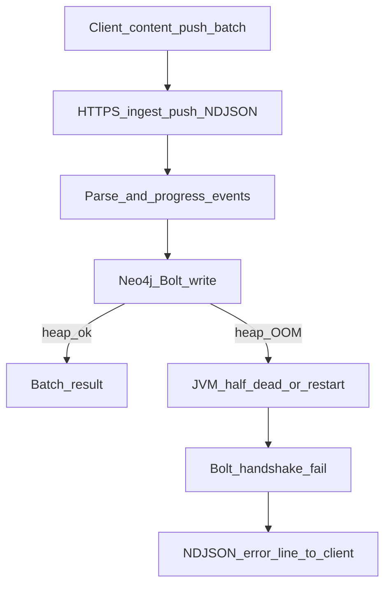

# 81 - Neo4j Memory And Content-Push OOM Runbook

## Purpose

Operators **must** treat `ingest-push` Bolt handshake failures after a long
content-push sync as a **Neo4j memory** incident until proven otherwise.
This runbook states Compose defaults, env overrides, diagnosis steps,
remediation, and verification.

## Symptoms

| Surface | Typical message |
| --- | --- |
| Client (`astloom-client` / content-push) | `error: ingest-push stream: Couldn't connect to 127.0.0.1:32287` … `Failed to read four byte Bolt handshake` |
| Progress UI | Code phase may show **100%** (`code N/N`) before the stream error; parse finished, Neo4j write/connect did not |
| Neo4j container logs | `java.lang.OutOfMemoryError: Java heap space` on Bolt / scheduler threads |
| Port check | Host still listens on `ASTLOOM_NEO4J_BOLT_PORT` (default `32287`) while Bolt is half-dead |

Progress at 100% is **not** proof the graph write succeeded. Content-push
batches print `push batch i/total` around each HTTPS `ingest-push`; Neo4j
can die mid-batch or between batches.

## Failure flow



| Step | Actor | Input | Decision / output |
| --- | --- | --- | --- |
| 1 | Client | File batch | `POST …/ingest-push` with NDJSON Accept |
| 2 | code-graph-service | Sources | Parse/upsert; emit progress (may reach 100% for code phase) |
| 3 | Neo4j | Bolt writes | Persist symbols/edges under JVM heap + pagecache |
| 4 | Neo4j | Sustained load + small heap | `OutOfMemoryError`; Bolt accept may still bind |
| 5 | Driver | New session / write | Handshake read fails |
| 6 | Stream | Exception | ERROR line; client exits with `ingest-push stream: …` |

## Compose defaults (normative)

`backend/deployments/compose/compose.yaml` **must** size Neo4j via env with
these defaults:

| Variable | Compose maps to | Default |
| --- | --- | --- |
| `ASTLOOM_NEO4J_HEAP_INITIAL_SIZE` | `NEO4J_server_memory_heap_initial__size` | `4G` |
| `ASTLOOM_NEO4J_HEAP_MAX_SIZE` | `NEO4J_server_memory_heap_max__size` | `4G` |
| `ASTLOOM_NEO4J_PAGECACHE_SIZE` | `NEO4J_server_memory_pagecache_size` | `1G` |

A historical hard-coded **512M** heap OOMs on ThinkingSOC-scale multi-hour
content-push. Hosts with little RAM **may** lower the vars; large graphs
**should** raise heap (for example `4G` → `8G`) before re-running sync.

Template comments: `backend/deployments/compose/neo4j.example.env` and
repo-root `.env.example`. Persistence notes:
`backend/platform/persistence/neo4j/README.md`.

## Diagnosis

1. Confirm the client error mentions Bolt / `Couldn't connect` / handshake on
   the Neo4j host port (default `32287`).
2. Inspect Neo4j logs for heap OOM:

```bash
docker logs astloom-neo4j-1 2>&1 | rg -n "OutOfMemoryError|Java heap space|Bolt"
```

3. Confirm running memory env:

```bash
docker inspect astloom-neo4j-1 --format '{{json .Config.Env}}' \
  | python3 -c "import sys,json; print(*(x for x in json.load(sys.stdin) if 'memory' in x), sep='\n')"
```

4. If heap is still `512M` (or far below the defaults above), treat that as
   the root cause — not a flaky client timeout.

## Remediation

1. Set or raise sizes in `backend/deployments/compose/.env.local` (gitignored),
   for example:

```bash
ASTLOOM_NEO4J_HEAP_INITIAL_SIZE=4G
ASTLOOM_NEO4J_HEAP_MAX_SIZE=4G
ASTLOOM_NEO4J_PAGECACHE_SIZE=1G
```

2. Recreate Neo4j so JVM picks up the new limits:

```bash
docker compose --env-file backend/deployments/compose/.env.local \
  -f backend/deployments/compose/compose.yaml --profile core up -d neo4j
backend/deployments/compose/wait-healthy.sh --timeout 300 astloom-neo4j-1
```

3. Restart any long-lived `code-graph-service` process that held a dead driver
   era (new Bolt sessions reconnect; a stuck worker still **should** be
   restarted after prolonged OOM).
4. Re-run the client content-push / `astloom-client sync` for the project.
   Partial batches already ingested remain; discovery hash-skip reduces
   rework for unchanged files.

## Operator-facing error hint

When the ingest-push worker fails with Bolt / connect language,
`ingest_push_stream._format_push_error` **must** append a short hint pointing
at heap OOM and `ASTLOOM_NEO4J_HEAP_MAX_SIZE` /
`ASTLOOM_NEO4J_PAGECACHE_SIZE`. That is UX only; raising Compose memory is
the root-cause fix.

## Verification

- [ ] `docker inspect` shows heap max `4G` (or the overridden value)
- [ ] `wait-healthy.sh` reports `astloom-neo4j-1` healthy
- [ ] Bolt connectivity succeeds (`GraphDatabase.driver(…).verify_connectivity()`)
- [ ] Content-push / sync completes without handshake errors on a representative batch
- [ ] Regression: `tests/backend/deployments/test_neo4j_compose_memory.py`
- [ ] Stream hint: `tests/backend/services/code-graph-service/test_ingest_push_stream.py::test_run_push_with_progress_annotates_neo4j_bolt_handshake_failures`

## Rollback

To temporarily lower memory on a small host, set the three `ASTLOOM_NEO4J_*_SIZE`
vars downward and recreate `neo4j`. Do **not** reintroduce a hard-coded `512M`
in `compose.yaml`.

## Related failure: code-graph HTTPS down

If the client shows `HTTP ingest-push failed: [Errno 111] Connection refused`
(and often empty remote `file-hashes`) while `astloom service start` reported
success, the server likely started **only** Compose + MCP HTTP. Content-push
requires **code-graph HTTPS** on `ASTLOOM_CODE_GRAPH_PORT` (default `32140`).
Current `astloom service start` starts that listener; verify with
`astloom service status` and `.astloom/run/code-graph-https.log`.

## Related Documents

- [12 - Neo4j Runtime Plugins](./12-neo4j-runtime-plugins.md)
- [39 - Local Install Runbook](../08-software-engineering-architecture/39-local-install-runbook.md)
- [Client push progress stream design](../superpowers/specs/2026-08-05-client-push-progress-stream-design.md)
- [Neo4j persistence README](../../backend/platform/persistence/neo4j/README.md)
