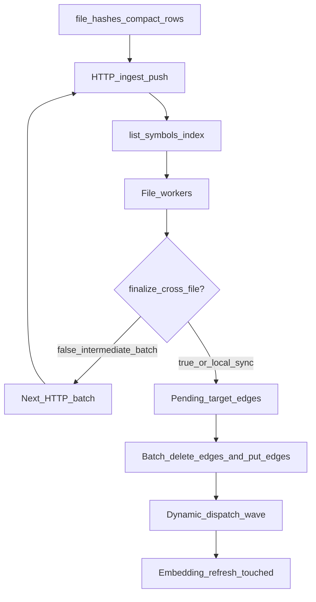

# 82 - Sync Finalizing And Provider Cost Runbook

## Purpose

Operators and agents **must** use this runbook when:

1. Progress shows **code 100%** with `parallel 0 active`, RPM idle, and elapsed keeps rising (`status=finalizing`), or
2. Sync / content-push is Provider-bound (many LiteLLM `complete` calls) despite healthy Neo4j, or
3. `astloom-client` multi-batch push appears to re-hang after each HTTP batch, or
4. Small content-push (few changed files) spends tens of seconds on `file-hashes`,
   `building resolution indexes`, or finalize before any Provider work.

This is **not** the Neo4j heap OOM path — see [`81`](81-neo4j-memory-and-content-push-oom-runbook.md) for Bolt handshake / OOM.

## Symptoms

| Surface | Signal |
| --- | --- |
| Local `astloom sync` | Bar at `code N/N` 100%; `status=finalizing` in `.astloom/sync-progress.json`; py-spy in `delete_edge` / `_relink_unresolved_calls` |
| Client content-push | Stream idle between batches or long silence after last files; UI looks stuck at 100% |
| Client prep | Long pause on `fetching remote file hashes` or `building resolution indexes` / `loading graph snapshots` before `%` moves |
| Client stall at 0% | `parallel 0 active / N workers`, RPM idle after indexes — often per-file full-graph `list_symbols` holding LockedStore slots (fixed via shared resolution maps) |
| Provider | High `complete` count ≈ changed **symbols** (legacy) rather than changed **files** |

## Root causes (shipped fixes)

| Cause | Fix (code) |
| --- | --- |
| One Neo4j `delete_edge` + `put_edge` per unresolved CALL during finalize | Batched `delete_edges` / `put_edges` in `finalize_cross_file_resolution` |
| One LiteLLM `complete` per changed symbol for living docs | `LlmBackedDocGenerator.generate_many` — budgeted adaptive chunks (`pack_docs_batches`) |
| Provider SSL hang ignored `ASTLOOM_LITELLM_TIMEOUT_SECONDS` (workers/RPM wedged) | Hard wall-clock deadline in `LiteLlmGateway.complete`/`embed`; docs chunk falls back to heuristic |
| Large-file living docs (many symbols / long bodies) hung Provider on mega-prompts | Adaptive `pack_docs_batches` under prompt-char budget; split+retry on timeout before heuristic |
| LLM-hot worker cap `RPM // 6` undersized after batching | `_LLM_HOT_CALLS_PER_FILE = 2` → `RPM // 2` when docs/cloud embeds are on |
| Content-push ran full-project finalize after **every** HTTP batch | `finalize_cross_file=false` on intermediate batches; `true` on last only |
| Progress silent during finalize | `status=finalizing` + step `file=` for local sync, content-push, and CLI render |
| Partial push dumped full `list_symbols` (with bodies) before workers | Prune dump only when `inventory_complete`; resolution uses `list_symbols_index` |
| `file-hashes` scanned full symbols (or slow `EXISTS` correlated subquery) | Neo4j `content_hash_maps` via compact `LIST_CONTENT_HASH_ROWS` |
| Finalize loaded **all** CALL/IMPORT edges | Relink reads `target_id_prefixes` (`unresolved:` / `ext:`) first; dispatch still needs broader CALL reads |
| Per-file DI/HTTP emit re-ran full `list_symbols` / unfiltered `list_edges` under LockedStore | Pass shared `short_names` / `routes_by_path`; HTTP uses `list_symbols_for_file` + `ROUTES_TO`-scoped edge fallback |
| Constants-only FILE hashes never published (no function/class/method children) | Publish when `metadata.ingest_complete` **or** code children exist (`file_content_hash_publishable`) |
| Bulk `delete_edges` / MERGE by `CODE_REL.id` scanned ~all relationships (no rel index) | `CREATE RANGE INDEX code_rel_id` (+ scope/rel_type) in `ensure_schema`; `DELETE_EDGES` uses `WHERE r.id IN $ids` |
| Progress silent for minutes during first finalize flush | `status=finalizing` chunk notes `flushing edge deletes N/M` |

## Diagnosis

1. Read progress snapshot:

```bash
python3 -c "import json; print(json.load(open('.astloom/sync-progress.json'))['status'],
  json.load(open('.astloom/sync-progress.json')).get('file'))"
```

2. If `finalizing` and process CPU/IO high for > a few minutes on a mid-size graph, sample stacks:

```bash
.venv/bin/py-spy dump --pid "$(jq -r .pid .astloom/sync-progress.json)"
```

Expect modern builds to spend time in bulk Cypher / **index** snapshot load, **not**
thousands of single `delete_edge` calls and **not** `LIST_SYMBOLS` with bodies.

3. Count unresolved CALLS (Neo4j):

```cypher
MATCH ()-[r:CODE_REL {project_id:$project, rel_type:'CALLS'}]->(t)
WHERE t.id STARTS WITH 'unresolved:'
RETURN count(r) AS unresolved
```

4. Distinguish Provider vs Neo4j prep vs finalize:

| Observation | Likely layer |
| --- | --- |
| `rpm_inflight` / `starts_in_window` saturated while `files_in_flight` > 0 | Provider / living docs + embeds |
| Long wall on `file-hashes` / `building resolution indexes` with RPM idle | Neo4j listing — expect compact hash/index paths after `56dc4ce` |
| `rpm_*` = 0, `files_in_flight` = 0, `status=finalizing` | Cross-file finalize / Neo4j |
| py-spy in `delete_edges` / Bolt `recv` for many minutes on a large graph | Missing `code_rel_id` relationship index — confirm `SHOW INDEXES` includes it |
| Bolt handshake / Neo4j dead | Heap OOM → doc [`81`](81-neo4j-memory-and-content-push-oom-runbook.md) |

## Flow (agent-readable)



| Step | Actor | Action | Outcome |
| --- | --- | --- | --- |
| 0 | Client | `GET …/file-hashes` | Compact FILE digests for hash-skip (children **or** `ingest_complete`) |
| 1 | File pool | Ingest with `defer_cross_file_pass` + index snapshot | Symbols + unresolved placeholders |
| 2 | Living docs | `generate_many` per changed file | One Provider `complete` per file (chunked) |
| 3 | Client batches | Intermediate: `finalize_cross_file=false` | Skip whole-graph relink |
| 4 | Finalize | Pending-target edge filter + batched deletes/puts | Relink without full CALL dump / per-edge RTT |
| 5 | Embeds | Touched refresh (or skip when mode=`skip`) | Vectors for searchable symbols |

## Remediation

1. Confirm code includes batch finalize + batch docs + Neo4j index/hash fast path
   (`list_symbols_index`, `content_hash_maps`, `target_id_prefixes` on `list_edges`).
2. Restart code-graph HTTPS so content-push hits the new process:

```bash
astloom service restart
```

3. Re-run sync / `astloom-client sync`. Expect a distinct **finalizing** progress block with steps such as `relinking unresolved calls`, then finish — not an indefinite 100% bar with zero RPM. Prep should show `building resolution indexes` (not a multi-minute body dump).
4. For Provider-bound wall time (not a hang): raise `ASTLOOM_LITELLM_RPM` carefully; prefer faster docs model via `ASTLOOM_LITELLM_MODEL_DOCS`; keep embeds on OpenRouter/local per operator policy. Do **not** disable living docs unless the operator explicitly wants a structural-only sync (`ASTLOOM_LITELLM_DOCS_ENABLED=false`).

## Verification

| Check | Expectation |
| --- | --- |
| Unit | `test_finalize_batches_edge_rewrites.py`, `test_neo4j_rel_id_index.py`, `test_llm_batch_docs.py`, `test_sync_index_and_hash_fastpath.py`, `test_content_push_http.py` (constants-only skip), client `_batches` finalize flags |
| Live local | Finalize wall time seconds–tens of seconds on ~5k–8k unresolved CALLS after batching (not tens of minutes of single deletes) |
| Live client | `tests/live/code-graph-service/test_client_content_push_speed_live.py` — finalize events only on last batch; push completes |
| Ops (ThinkingSOC-scale) | `file-hashes` ~1–3s (not ~7s+ body dump); resolution index ~5–8s; remaining multi-minute wall on small pushes is usually Provider docs/embeds |
| Ops (hash-skip) | Second scoped client sync: `push=0` / `unchanged_skip=N` including constants-only modules; incomplete FILE stubs still unpublished |

## Related Documents

- [`50` sync CPU budget LLD](50-sync-cpu-budget-and-store-concurrency-lld.md) — LLM-hot worker cap `RPM // 2`; compact symbol listings
- [`03` ingestion and living documentation](03-ingestion-and-living-documentation-workflow.md)
- [`40` RPM parallel sync risks](40-rpm-session-parallel-sync-risks-challenges-and-acceptance.md) — C-15 finalization
- [`81` Neo4j memory / content-push OOM](81-neo4j-memory-and-content-push-oom-runbook.md)
- [`83` MCP tool budget / small-batch sync](83-mcp-tool-budget-and-small-batch-sync.md) — HTTP `-32001`, FILE-index sync, quality_audit soft deadlines
- LiteLLM env: [`12-litellm-environment-configuration.md`](../13-technology-stack-and-platform-decisions/12-litellm-environment-configuration.md)
- Client content-push design: [`2026-08-04-client-direct-ingest-no-stage-design.md`](../superpowers/specs/2026-08-04-client-direct-ingest-no-stage-design.md)
