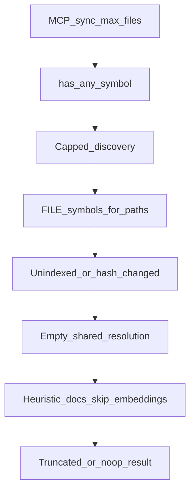

# 83 - MCP Tool Budget And Small-Batch Sync

## Purpose

HTTP MCP tools share a hard gateway timeout. Large Neo4j projects and sshfs-mounted pins
(e.g. Astloom) previously hit `-32001` on `astloom_code_graph_sync` and
`astloom_quality_audit` because handlers dumped whole-graph symbol lists or walked entire
trees. This runbook documents the **root-cause** contracts operators and agents must rely on.

## Symptoms

| Symptom | Likely cause (historical) |
| --- | --- |
| `-32001 tool timed out after 25s (astloom_code_graph_sync)` | Full `list_symbols_index` (~150k nodes) before any file work; or per-file rebuild of resolution indexes when `shared_resolution.indexes` was `None` |
| Sync always re-ingests one file even when content is unchanged | Index listing stripped `hash_version` / `parser_version` → every FILE looked dirty |
| `quality_audit` `degraded=true` / `truncated_phases=["code"]` | Inventory used wrong project scope (CLI defaults) and/or `max_files=2000` sshfs walk ate the soft budget |
| Cascade timeouts after one slow tool | Thread from `asyncio.to_thread` kept running after HTTP timeout and held store slots |

## Hard vs soft budgets

| Knob | Default | Role |
| --- | --- | --- |
| `ASTLOOM_MCP_TOOL_TIMEOUT_SECONDS` | `25` | Hard JSON-RPC timeout in `http_app._handle_message_bounded`. Reply includes the tool name when known. |
| `ASTLOOM_MCP_QUALITY_AUDIT_BUDGET_SECONDS` | `18` (capped to `tool_timeout - 6`) | Soft collect deadline for `quality_audit` so the HTTP reply wins before `-32001`. |

Full CLI `astloom sync` / `astloom quality-audit` without MCP soft deadlines keep uncapped discovery.

## Small-batch sync (`astloom_code_graph_sync`)

When `max_files` is set and **below** the ingest default (`DEFAULT_MAX_FILES`):

1. `sync_repo` uses `has_any_symbol` (not a full dump) for empty-graph detection.
2. `ingest_repo` loads **FILE nodes for discovered paths only** (`list_file_symbols_for_paths` / `LIST_FILE_SYMBOLS_FOR_PATHS`), or `list_file_symbols_index` for inventory-style paths.
3. Discovery is capped and deadline-bounded (~8s discovery headroom).
4. Shared resolution passes an **empty** index object (not `None`) so file ingest does not rebuild whole-graph indexes.
5. Heuristic docs + `skip_embeddings` when `embedding_refresh_mode` is `off`/`skip`/`none`/`disabled`, or automatically when MCP sets `max_files < 50`.
6. Language backfill / CONTAINS edge-repair scans are skipped (CLI full sync still heals).
7. `LIST_SYMBOLS_INDEX` **must** return real `hash_value`, `hash_version`, and `parser_version` so change detection is honest.

Prefer repeated `max_files=1` (or small N) under MCP rather than one uncapped sync through the HTTP tool path.



| Step | Actor | Action | Outcome |
| --- | --- | --- | --- |
| 1 | MCP `write.sync_repo` | Pass `max_files`, default `embedding_refresh_mode=off` when `<50` | Small-batch payload |
| 2 | `SyncMixin.sync_repo` | Cheap presence check; skip unbounded pending ingest | Enter capped `ingest_repo` |
| 3 | `ingest_repo` | Discover with limit/deadline; FILE lookups only | Queue ≤ `max_files` |
| 4 | Workers | Empty resolution + heuristic docs; optional skip embeddings | Finish under hard timeout |
| 5 | Client | Re-run sync while `truncated=true` | Continues indexing |

## Quality audit (`astloom_quality_audit`)

Root contracts:

1. **Scope:** MCP passes `backends.graph_scope(scope)` into `build_quality_audit_report` → inventory. Never invent findings against another project's symbols.
2. **Order:** Code inventory runs **before** docs standards under a shared soft deadline (docs must not starve code).
3. **Under deadline:** Inventory uses `list_file_symbols_compact` and caps discovery at **200** files (sshfs-safe).
4. **Docs discovery:** Prefer sync `doc_match_globs` with `literal_dir_prefixes` so walks stay under `docs/` / configured roots — not a whole-repo `**/*.md` crawl.
5. Soft deadline may still set `degraded` / `truncated_phases` if wall time is exhausted; live gates expect **`degraded` is not true** on a healthy demo-app pin after these fixes.

## Verification

```bash
astloom service restart
.venv/bin/python -m pytest tests/live/mcp-gateway-service/ -m live -v
```

| Check | Expect |
| --- | --- |
| `astloom_code_graph_sync` `max_files=1` | Completes well under 25s on astloom and Astloom |
| `astloom_quality_audit` | `ok=true`, `degraded` not true; no `-32001` |
| Matrix | `tests/live/mcp-gateway-service/test_mcp_read_tools_matrix_live.py` — no tool ≥24s / `-32001` |

Unit anchors: `test_repo_ingest.py` (small-batch / no resolution rebuild), `test_sync_index_and_hash_fastpath.py` (hash fields kept), `test_quality_audit_scope.py`, `test_quality_audit_budget.py`, `test_doc_discovery_prefixes.py`.

## Related Documents

- [82 - Sync Finalizing And Provider Cost Runbook](./82-sync-finalizing-and-provider-cost-runbook.md)
- [77 - Sync Embedding Heal Operator Runbook](./77-sync-embedding-heal-operator-runbook.md)
- [50 - Sync CPU Budget LLD](./50-sync-cpu-budget-and-store-concurrency-lld.md)
- [35 - Usage Profile And Cursor MCP Onboarding](../08-software-engineering-architecture/35-usage-profile-and-cursor-mcp-onboarding.md)
- Service README: `backend/services/mcp-gateway-service/README.md`
- Live tests: `tests/live/mcp-gateway-service/README.md`
