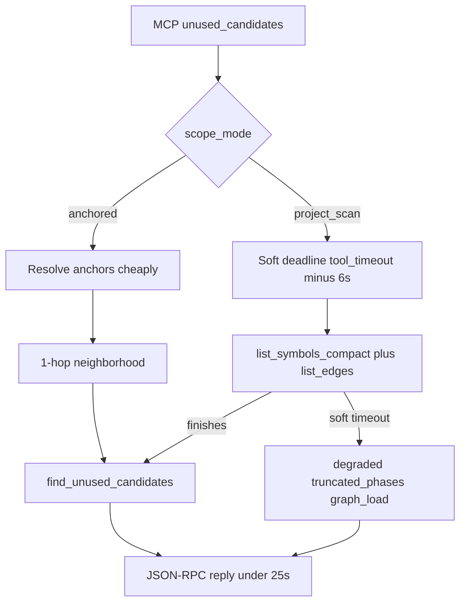
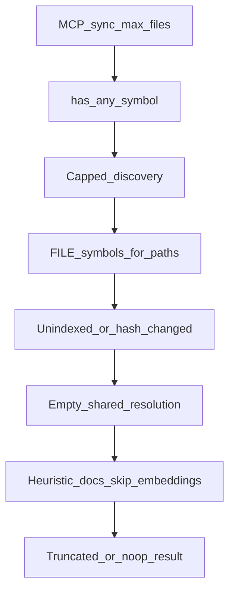

# 83 - MCP Tool Budget And Small-Batch Sync

## Purpose

HTTP MCP tools share a hard gateway timeout. Large Neo4j projects and sshfs-mounted pins
(e.g. Astloom) previously hit `-32001` on `astloom_code_graph_sync` and
`astloom_quality_audit` because handlers dumped whole-graph symbol lists or walked entire
trees. The same class of bug later hit `astloom_code_graph_unused_candidates` on
ThinkingSOC-sized graphs: anchored modes still dumped `list_symbols_compact` + `list_edges`
while `astloom_code_graph_callers` stayed cheap. This runbook documents the **root-cause**
contracts operators and agents must rely on.

## Symptoms

| Symptom | Likely cause (historical) |
| --- | --- |
| `-32001 tool timed out after 25s (astloom_code_graph_sync)` | Full `list_symbols_index` (~150k nodes) before any file work; or per-file rebuild of resolution indexes when `shared_resolution.indexes` was `None` |
| Sync always re-ingests one file even when content is unchanged | Index listing stripped `hash_version` / `parser_version` → every FILE looked dirty |
| `quality_audit` `degraded=true` / `truncated_phases=["code"]` | Inventory used wrong project scope (CLI defaults) and/or `max_files=2000` sshfs walk ate the soft budget |
| `-32001 (astloom_code_graph_unused_candidates)` on large projects | Anchored modes dumped full `list_symbols`+`list_edges`; `project_scan` had no soft deadline |
| Cascade timeouts after one slow tool | Thread from `asyncio.to_thread` kept running after HTTP timeout and held store slots |

## Hard vs soft budgets

| Knob | Default | Role |
| --- | --- | --- |
| `ASTLOOM_MCP_TOOL_TIMEOUT_SECONDS` | `25` | Hard JSON-RPC timeout in `http_app._handle_message_bounded`. Reply includes the tool name when known. |
| `ASTLOOM_MCP_QUALITY_AUDIT_BUDGET_SECONDS` | `18` (capped to `tool_timeout - 6`) | Soft collect deadline for `quality_audit` so the HTTP reply wins before `-32001`. |
| `ASTLOOM_MCP_UNUSED_CANDIDATES_BUDGET_SECONDS` | `18` (capped to `tool_timeout - 6`) | Soft graph-load deadline for `unused_candidates` (`project_scan`). |

Full CLI `astloom sync` / `astloom quality-audit` without MCP soft deadlines keep uncapped discovery.

## Unused candidates (`astloom_code_graph_unused_candidates`)

Product scoring contract remains doc `36`. This runbook owns **how the graph is loaded** under the HTTP MCP hard timeout.

### Root cause (historical)

`QueryUseCases.unused_candidates` always called unscoped `list_symbols_compact` + `list_edges` for every non-empty request, including `changed_symbols` with a handful of anchors and `project_scan` with a tight `path_prefix`. Scoring then filtered in Python. `callers` already used `_structural_edges_for_seed` (Neo4j neighborhood / per-id `list_edges`). On a ThinkingSOC-sized Neo4j dump the unused path exceeded 25s; callers did not.

A first soft-budget used `ThreadPoolExecutor` with `with` / `wait=True`. On timeout the HTTP handler still waited for the Neo4j dump worker, so the JSON-RPC hard timeout won (`-32001`) before `degraded` could return. The dump thread must **not** block the reply (`shutdown(wait=False)`).

### Load contract

| `scope_mode` | Graph load | Must not |
| --- | --- | --- |
| `changed_symbols` / `task_neighborhood` / `explicit_paths` | Resolve anchors (id / qualified_name / name / `list_symbols_for_file`) then **1-hop neighborhood** via `_subgraph_around_seeds` (same class as `callers`) | Unscoped `list_edges`; full `list_symbols_compact` |
| `project_scan` | Full compact listing (liveness under `path_prefix` is still project-wide) | Exceed hard 25s without a JSON-RPC body |



| Step | Actor | Action | Outcome |
| --- | --- | --- | --- |
| 1 | MCP `query.unused_candidates` | Cap soft budget with `_unused_candidates_budget_seconds`; pass `deadline_monotonic` | Headroom under hard timeout |
| 2 | `QueryUseCases.unused_candidates` | Branch on `scope_mode` | Anchored vs full dump |
| 3a | `_load_unused_anchored_graph` | Neighborhood only | Completes like `callers` |
| 3b | `_load_unused_project_scan_graph` | Dump under remaining budget; on timeout return empty graph + `degraded` without waiting for the worker | Reply wins; dump may still run in the background |
| 4 | `find_unused_candidates` | Score the loaded subgraph | Ranked rows or empty + note |
| 5 | Agent | Prefer `changed_symbols` + anchors on large projects; if `degraded`, do not treat empty candidates as “nothing unused” | Cleanup loop stays usable |

### Agent contract

- Dead-code loop on large graphs: `scope_mode=changed_symbols` (or `task_neighborhood`) with `anchor_symbols`, `max_results` small, `min_confidence=0.8`.
- `path_prefix` only filters **reported** rows. It does **not** make `project_scan` cheap.
- If the payload has `degraded=true` and `truncated_phases` includes `graph_load`, retry with anchors. Do not interpret `candidates: []` as a safe absence claim for the whole prefix.
- Restart MCP / code-graph after deploying this handler (`astloom service restart`); in-process Python does not hot-reload.

### Live evidence (2026-09-09, host Neo4j + MCP HTTPS `:32500`)

| Project | Symbols | Edges | Compact dump wall time | Notes |
| --- | --- | --- | --- | --- |
| ThinkingSOC (`mir`/`dev`) | ~149 946 | ~372 339 | ~36.6s (symbols ~11.6s + edges ~25.0s) | Exceeds 25s hard budget |
| astloom (`mir`/`dev`) | ~17 831 | ~50 428 | ~6.8s | Fits under 25s when Neo4j is idle |

| Tool / mode | Before (old handler) | After reload of this contract |
| --- | --- | --- |
| `callers` (ThinkingSOC) | ~0.2–0.7s, OK | ~0.2s, OK |
| `unused_candidates` `changed_symbols` + ~6–8 executive anchors | `-32001` at 25s | ~0.6–3s, candidates returned, no `-32001` |
| `unused_candidates` `project_scan` + `path_prefix=frontend/app/dashboard/executive/data` | `-32001` at 25s | ~18s, `degraded=true`, `graph_load=project_scan_timeout`, **no** `-32001` |
| `unused_candidates` `project_scan` on astloom (idle Neo4j) | n/a | Completes with candidates (measured ~15s) |

Gateway access log for the verification window: `POST /mcp` → HTTP 200; no `-32001` / `timed out after 25` strings in `.astloom/run/mcp-http.log`.

**Residual:** a `project_scan` dump that times out still occupies a Neo4j session until the worker finishes. A second `project_scan` immediately after ThinkingSOC may also degrade. That is the same store-slot class as cascade timeouts in this runbook; canceling Bolt mid-dump is not in this change.

## Small-batch sync (`astloom_code_graph_sync`)

When `max_files` is set and **below** the ingest default (`DEFAULT_MAX_FILES`):

1. `sync_repo` uses `has_any_symbol` (not a full dump) for empty-graph detection.
2. `ingest_repo` loads **FILE nodes for discovered paths only** (`list_file_symbols_for_paths` / `LIST_FILE_SYMBOLS_FOR_PATHS`), or `list_file_symbols_index` for inventory-style paths.
3. Discovery is capped and deadline-bounded (~8s discovery headroom).
4. Shared resolution passes an **empty** index object (not `None`) so file ingest does not rebuild whole-graph indexes.
5. Heuristic docs + `skip_embeddings` when `embedding_refresh_mode` is `off`/`skip`/`none`/`disabled`, or automatically when MCP sets `max_files < 50`.
6. Language backfill / CONTAINS edge-repair scans are skipped (CLI full sync still heals).
7. `LIST_SYMBOLS_INDEX` **must** return real `hash_value`, `hash_version`, and `parser_version` so change detection is honest.

Prefer repeated `max_files=1` (or small N) under MCP rather than one uncapped sync through the HTTP tool path.



| Step | Actor | Action | Outcome |
| --- | --- | --- | --- |
| 1 | MCP `write.sync_repo` | Pass `max_files`, default `embedding_refresh_mode=off` when `<50` | Small-batch payload |
| 2 | `SyncMixin.sync_repo` | Cheap presence check; skip unbounded pending ingest | Enter capped `ingest_repo` |
| 3 | `ingest_repo` | Discover with limit/deadline; FILE lookups only | Queue ≤ `max_files` |
| 4 | Workers | Empty resolution + heuristic docs; optional skip embeddings | Finish under hard timeout |
| 5 | Client | Re-run sync while `truncated=true` | Continues indexing |

## Quality audit (`astloom_quality_audit`)

Root contracts:

1. **Scope:** MCP passes `backends.graph_scope(scope)` into `build_quality_audit_report` → inventory. Never invent findings against another project's symbols.
2. **Order:** Code inventory runs **before** docs standards under a shared soft deadline (docs must not starve code).
3. **Under deadline:** Inventory uses `list_file_symbols_compact` and caps discovery at **200** files (sshfs-safe).
4. **Docs discovery:** Prefer sync `doc_match_globs` with `literal_dir_prefixes` so walks stay under `docs/` / configured roots — not a whole-repo `**/*.md` crawl.
5. Soft deadline may still set `degraded` / `truncated_phases` if wall time is exhausted; live gates expect **`degraded` is not true** on a healthy demo-app pin after these fixes.

## Verification

```bash
astloom service restart
.venv/bin/python -m pytest \
  tests/backend/services/code-graph-service/test_unused_candidates_budget.py \
  tests/backend/services/mcp-gateway-service/test_unused_candidates_mcp_budget.py \
  tests/backend/services/code-graph-service/test_unused_candidates_freshness.py \
  -q
.venv/bin/python -m pytest tests/live/mcp-gateway-service/ -m live -v
.venv/bin/python -m pytest tests/live/code-graph-service/test_unused_candidates_mcp_http_live.py -m live -v
```

| Check | Expect |
| --- | --- |
| `astloom_code_graph_sync` `max_files=1` | Completes well under 25s on astloom and Astloom |
| `astloom_quality_audit` | `ok=true`, `degraded` not true; no `-32001` |
| Matrix | `tests/live/mcp-gateway-service/test_mcp_read_tools_matrix_live.py` — no tool ≥24s / `-32001` |
| Unit `test_changed_symbols_does_not_full_dump_project` | No unscoped `list_edges` / no full `list_symbols` on anchored unused |
| Unit `test_project_scan_soft_budget_returns_degraded_instead_of_hanging` | Returns `degraded` soon after the soft deadline (does not wait for a slow dump) |
| Live ThinkingSOC `changed_symbols` | Completes &lt;25s with a JSON-RPC result (not `-32001`) |
| Live ThinkingSOC `project_scan` | Completes &lt;25s; either ranked rows **or** `degraded` + `truncated_phases=["graph_load"]` — never `-32001` |
| Tiny fixture live | `tests/live/code-graph-service/test_unused_candidates_mcp_http_live.py` (project `deadcode-live`) — scoring contract, not ThinkingSOC dump size |

Unit anchors: `test_repo_ingest.py` (small-batch / no resolution rebuild), `test_sync_index_and_hash_fastpath.py` (hash fields kept), `test_quality_audit_scope.py`, `test_quality_audit_budget.py`, `test_doc_discovery_prefixes.py`, `test_unused_candidates_budget.py`, `test_unused_candidates_mcp_budget.py`.

## Related Documents

- [36 - Dead-Code Candidates And Cleanup Loop](./36-dead-code-candidates-and-cleanup-loop.md) — scoring / MCP product contract
- [82 - Sync Finalizing And Provider Cost Runbook](./82-sync-finalizing-and-provider-cost-runbook.md)
- [77 - Sync Embedding Heal Operator Runbook](./77-sync-embedding-heal-operator-runbook.md)
- [50 - Sync CPU Budget LLD](./50-sync-cpu-budget-and-store-concurrency-lld.md)
- [35 - Usage Profile And Cursor MCP Onboarding](../08-software-engineering-architecture/35-usage-profile-and-cursor-mcp-onboarding.md)
- Service README: `backend/services/mcp-gateway-service/README.md`
- Live tests: `tests/live/mcp-gateway-service/README.md`
