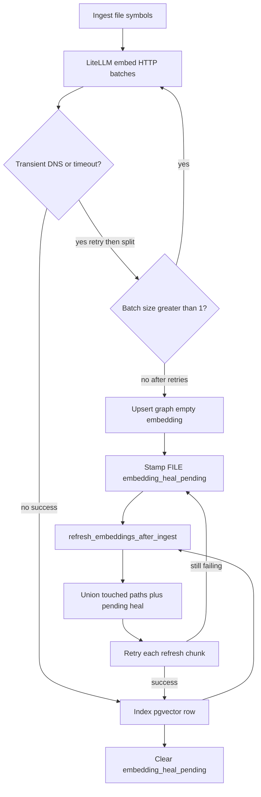

# 84 - Embedding Retry And Self-Heal

## Purpose

Define how code-graph ingest **must** behave when hosted LiteLLM / OpenRouter embedding
calls flake (DNS `name resolution`, connect/read timeout). Graph structure **must** land.
Embeddings **must** retry, then self-heal on later sync without forcing `astloom sync heal`
or re-embedding the whole project.

This closes the operator failure mode `Push ingested=N failed=2` with
`LiteLLM embedding batch failed` while docs still upsert.

## Goals And Non-Goals

### Goals

- Retry transient embed errors (DNS, timeout, 502/503/504, connection reset) at the HTTP
  batch seam before failing the call.
- Time out **per HTTP batch**, not the entire file's `embed_many` list (default wall
  `ASTLOOM_EMBED_TIMEOUT_SECONDS=180`, aligned with LiteLLM).
- Split an oversized/slow batch in half on timeout instead of failing the file.
- Keep FILE / symbol / documentation nodes when embeddings still fail (fail-open graph).
- Stamp `metadata.embedding_heal_pending` on the FILE so later `touched` refresh includes
  that path even if content-hash skip omits it from the current batch.
- Retry post-ingest refresh (per chunk and the after-ingest job) on the same transient class.
- Leave empty vectors **unindexed** so pgvector has no fake model row and refresh sees
  `missing_embedding_row`.

### Non-Goals

- Replacing `astloom sync heal` for whole-project model mismatch or operator-forced
  re-embed.
- Draining the entire missing-embedding backlog on every incremental sync (that remains
  `full` mode / noop capped backlog).
- Falling back to stub vectors while LiteLLM embeddings are enabled (fail-closed at
  `HybridEmbeddings`; ingest catches that and defers).
- Changing Stage-1 dims (`vector(1024)`) or TurboVec replica rules.

## Ownership

| Concern | Owner |
| --- | --- |
| Transient classify / per-batch timeout / split | `code_graph_service.llm_wiring` (`HybridEmbeddings`) |
| Ingest retry then defer; FILE heal flag | `FileSymbolsMixin` + `GraphServiceSupport` |
| After-ingest union of touched + pending paths; chunk retry | `EmbeddingRefreshMixin` |
| SoR rows | PostgreSQL `code_graph.symbol_embeddings` (pgvector) |
| Operator heal vs everyday sync | Runbook `77` |

## Retry And Self-Heal Flow

| Step | Actor | Action | Outcome |
| --- | --- | --- | --- |
| 1 | Ingest | Parse and upsert symbols; call `embed` / `embed_many` | Graph write is independent of embed success |
| 2 | `HybridEmbeddings` | Send texts in HTTP batches of 32; 180s wall per batch; 3 transient retries with backoff | DNS blip recovers without failing the file |
| 3 | `HybridEmbeddings` | On timeout with batch size &gt; 1, halve the batch and retry | Large files finish instead of timing out the whole list |
| 4 | Ingest | If embed still fails: empty vectors, no pgvector upsert, print `embedding deferred` | FILE/symbols remain; `files_failed` does not increment for embed-only failure |
| 5 | Ingest | Set FILE `metadata.embedding_heal_pending=true` | Durable heal hint across process restarts |
| 6 | After ingest | `refresh_embeddings_after_ingest` unions `file_paths` with pending-heal FILE paths (pending list capped by `ASTLOOM_EMBEDDING_REFRESH_MAX_PENDING`) | Next push heals skipped hash-stable files that still lack vectors |
| 7 | Refresh | Each embed chunk retries 3 times; one chunk failure does not abort other chunks | Partial heal; leftover missing rows stay pending |
| 8 | Refresh | When all searchable symbols for a pending FILE have SoR rows, clear the flag | Self-heal completes |

## Transient Error Class

A failure **must** be treated as transient when the exception type or message matches any of:

- timeout / timed out (including the wrapper `embedding call timed out after Ns`)
- `name resolution`, `temporary failure`, `errno -3`, `eai_again`
- connection reset / aborted / broken pipe / network unreachable
- HTTP 502 / 503 / 504

Permanent failures (invalid API key, context-length after shrink attempts, quota trip)
**must not** spin the transient loop. Quota still trips the process-wide LiteLLM breaker.

## FILE Heal Flag

Key: `embedding_heal_pending` (constant `EMBEDDING_HEAL_PENDING`).

| Event | Flag |
| --- | --- |
| FILE or symbol embed deferred after retries | Set on the FILE node |
| All searchable symbols under that path have pgvector rows | Cleared |
| Everyday `touched` refresh | Includes pending-heal paths even when they are not in this run's ingest batch |
| Incremental sync of an unrelated file | **Must not** re-embed healthy files that were never flagged (wipe-the-index tests stay valid) |

Compact FILE index listings **must** keep `metadata_json` so pending paths are discoverable
without a full symbol dump. In-memory test store `list_file_symbols_index` keeps metadata
for the same reason.

## Configuration

| Env | Default | Role |
| --- | --- | --- |
| `ASTLOOM_EMBED_TIMEOUT_SECONDS` | `180` (capped at 180) | Wall clock **per HTTP embed batch**, not the whole file |
| `ASTLOOM_LITELLM_TIMEOUT_SECONDS` | `180` | Gateway `_run_with_deadline` around each LiteLLM call |
| `ASTLOOM_LITELLM_NUM_RETRIES` | `3` | SDK retries when `tenacity` is installed; HybridEmbeddings still retries transients |
| `ASTLOOM_EMBEDDING_REFRESH_MAX_PENDING` | `256` | Cap for noop backlog **and** how many pending-heal paths are merged into a touched refresh |
| `ASTLOOM_EMBEDDING_REFRESH_WORKERS` | `4` (max 16) | Parallel refresh chunks |

Operators **should not** lower `ASTLOOM_EMBED_TIMEOUT_SECONDS` below the LiteLLM timeout
unless they also shrink batch size; a tighter outer wall around a multi-item `embed_many`
is what produced whole-file embed timeouts on large sources.

## Failure And Operator Signals

| Signal | Meaning | Recovery |
| --- | --- | --- |
| `embedding deferred (RuntimeError): … name resolution` | Ingest kept the graph; flag stamped | Same run's after-ingest refresh retries; later syncs include the path |
| `embedding_refresh.state=complete` with `reasons.embed_chunk_retry_exhausted` | Some chunks still failed; others indexed | Next sync self-heals remaining pending FILEs |
| `embedding_refresh.state=failed` | All refresh work failed (or tenant scope invalid) | After-ingest retries the job twice more on transient errors; then `astloom sync heal` if the backlog is project-wide |
| `files_failed` with LiteLLM embed in the detail | **Must not** happen for embed-only failure after this contract | If seen, treat as a regression in ingest fail-open |
| `embedding_index_unavailable` | No pgvector URL | Set `ASTLOOM_CODE_GRAPH_DATABASE_URL` or `ASTLOOM_DATABASE_URL` (runbook `77`) |

## Logical Example

A content-push of a large tree discovers thousands of files, ingest a few dozen, skip the
rest. Two large sources hit OpenRouter `Temporary failure in name resolution` and a batch
timeout.

1. HybridEmbeddings retries DNS, then splits the slow batch.
2. If the provider is still down, those two FILEs upsert with empty embeddings and
   `embedding_heal_pending`.
3. Push totals show `failed=0` for embed-only issues; CLI may print `embedding deferred`.
4. `refresh_embeddings_after_ingest` retries those paths in the same process.
5. The next push, even if the client skips the two hash-stable files, still unions their
   pending paths and fills pgvector.

This is not a full-project heal: a third file whose embeddings were wiped in a test and
never flagged stays untouched on an `a.py`-only incremental sync.

## Verification

| Check | Command / seam |
| --- | --- |
| Timeout default 180s; DNS retries then succeeds; permanent errors do not retry | `tests/backend/services/code-graph-service/test_embed_timeout_retry.py` |
| HTTP batching and split-on-timeout | `test_hybrid_embeddings_fallback.py` |
| Ingest keeps symbols; stamps heal flag; retries then succeeds; after-ingest heals a path not in `file_paths` | `test_ingest_embedding_defer.py` |
| Refresh chunk retry; incremental sync still does not re-embed unflagged backlog | `test_embedding_refresh.py` |
| Operator | `astloom stats` missing embeddings dropping after a later `astloom sync` without `heal` |

## Related Documents

| Document | Role |
| --- | --- |
| [77 - Sync embedding heal runbook](./77-sync-embedding-heal-operator-runbook.md) | `touched` vs `full`; when operators still run `sync heal` |
| [14 - Embedding lifecycle](../13-technology-stack-and-platform-decisions/14-embedding-lifecycle-and-refresh.md) | pgvector SoR and regenerate triggers |
| [03 - Ingestion workflow](./03-ingestion-and-living-documentation-workflow.md) | Parse / docs / embed failure policy |
| [12 - LiteLLM env](../13-technology-stack-and-platform-decisions/12-litellm-environment-configuration.md) | Timeout and retry knobs |
