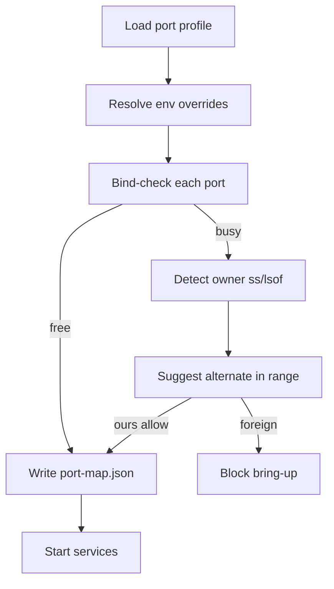

# Development Port Management

## Purpose

Astloom development environments must avoid port conflicts. Many tools use common default ports. If Astloom services also use those defaults, developers will hit conflicts with databases, dashboards, local servers, IDE helpers, model runtimes, and other projects.

The architecture must therefore require project-scoped, configurable, non-default development ports, plus a blocking preflight before bring-up.

## Core Rule

Default vendor ports must be changed for Astloom development unless the developer explicitly overrides them.

The system must not assume that common default ports are available.

## Why Default Ports Must Change in Development

Common local defaults are frequently occupied by other tools:

- API frameworks often use common web ports.
- PostgreSQL, Redis, Neo4j, and other databases have well-known defaults.
- Dashboards and admin UIs often collide.
- Local LLM runtimes and vector services may already be running.
- Multiple projects may run at the same time.

Using default ports makes the development experience fragile and makes failures look like application bugs when they are actually environment conflicts.

## Required Behavior

### 1. Ports Must Be Configurable

Every service port must come from configuration:

- environment variable,
- local development config file,
- tenant/project runtime profile,
- Docker Compose override,
- orchestration configuration.

Ports must not be hard-coded in source code, scripts, tests, or documentation examples.

### 2. Development Ports Must Be Project-Scoped

Astloom should define a development port profile that is unlikely to conflict with common defaults. The profile should use a dedicated range for the project.

Recommended pattern:

```text
ASTLOOM_DEV_PORT_BASE=32xxx
service_port = ASTLOOM_DEV_PORT_BASE + service_offset
```

The exact base value should be configurable per developer machine. Canonical profile: `backend/configs/port-profiles/astloom-dev.json`.

### 3. Startup Must Check Port Availability (Preflight)

Before starting services, the development launcher must run port preflight.

Implementation (GAP-T07):

| Surface | Behavior |
| --- | --- |
| Library | `port_profile.run_preflight` — bind check, owning process, alternate suggestion |
| CLI | `astloom ports check [--write-map] [--allow-ours]` |
| Install | `run_port_preflight` in `scripts/install/common.sh` (stage 04 before Compose up) |
| Service start | `astloom service start` runs preflight with `--allow-ours` semantics |

If a port is occupied by a foreign process, startup **blocks** with a clear error:

```text
Port 32xxx is already in use by another process (name=…, pid=…).
Suggested alternate: ASTLOOM_<SERVICE>_PORT=32yyy
See .astloom/run/port-map.json
```

Owning-process detection on Linux uses `ss -lptn` first, then `lsof` (best-effort when tools are missing). Because `ss` reports native services only by comm name (`python`), preflight additionally checks `/proc/<pid>` cmdline and cwd: a listener launched from this checkout (for example `.venv/bin/python -m adapter_service`, including orphans that survived a gateway crash) counts as ours and does not block `--allow-ours` bring-up.

### 4. Resolved Port-Map Artifact

Successful or failed preflight writes `.astloom/run/port-map.json` for startup consumers. The artifact includes resolved ports, per-key availability, owner hints, suggested alternates, and conflict keys.

### 5. Services Must Log Their Bound Ports

Every service should log the host and port it binds to at startup. This helps developers identify incorrect configuration quickly.

### 6. Documentation Examples Must Use Non-Default Ports

Documentation should not teach developers to use common defaults for development. Examples should use Astloom-specific development ports and explain how to override them.

### 7. Tests Must Not Depend on Fixed Ports

Automated tests should use ephemeral ports or test-specific allocated ports. Fixed ports in tests create flaky behavior on shared machines and CI runners. Preflight regression tests bind an ephemeral socket and assert conflict + suggestion + map write.

## Recommended Development Port Profile

The following is a documentation profile, not a hard-coded requirement. Values should be changed if they conflict on a developer machine.

```text
ASTLOOM_API_PORT=32100
ASTLOOM_ADMIN_PORT=32101
ASTLOOM_CORE_DATA_PORT=32110
ASTLOOM_MEMORY_PORT=32120
ASTLOOM_DOCS_SYNC_PORT=32130
ASTLOOM_CODE_GRAPH_PORT=32140
ASTLOOM_RULE_ENGINE_PORT=32150
ASTLOOM_BROKER_PORT=32160
ASTLOOM_ADAPTER_PORT=32170
ASTLOOM_WORKER_METRICS_PORT=32180
ASTLOOM_NEO4J_BOLT_PORT=32287
ASTLOOM_NEO4J_HTTP_PORT=32474
ASTLOOM_REDIS_PORT=32379
ASTLOOM_OBJECT_STORE_PORT=32390
```

These values intentionally avoid common defaults. They are still examples and must remain overrideable.

## Environment Variable Naming

Use explicit names:

```text
ASTLOOM_API_PORT
ASTLOOM_ADMIN_PORT
ASTLOOM_NEO4J_BOLT_PORT
ASTLOOM_NEO4J_HTTP_PORT
ASTLOOM_BROKER_PORT
ASTLOOM_REDIS_PORT
```

Avoid generic names such as `PORT` in multi-service development because they become ambiguous.

## Port Allocation Algorithm

```text
load development port profile
apply local overrides
for each service:
    validate port is numeric and in allowed range
    check port availability (bind probe)
    if unavailable:
        report owning process when possible (ss / lsof)
        suggest next available project-scoped port
        fail startup unless allow-ours matches Astloom/docker-proxy
        or the owning pid was launched from this checkout (/proc cmdline+cwd)
write resolved port map to .astloom/run/port-map.json
start services with resolved ports
```



| Step | Actor | Action | Outcome |
| --- | --- | --- | --- |
| 1 | CLI / install | Load `astloom-dev.json` + env | Resolved port map |
| 2 | `run_preflight` | Bind probe each port | available true/false |
| 3 | `find_port_owner` | `ss` then `lsof` | pid/name or unknown |
| 4 | `suggest_alternate_port` | Scan project range | Suggested free port |
| 5 | Install / service start | Exit non-zero on foreign conflict | Bring-up blocked |
| 6 | Consumers | Read `.astloom/run/port-map.json` | Shared runtime evidence |

## Auto-Reassignment Policy

Automatic reassignment can be useful, but it must be explicit. Silent reassignment makes debugging hard because services may start on unexpected ports.

Allowed behavior:

- explicit `ASTLOOM_AUTO_PORT=1` enables automatic reassignment,
- runtime summary prints final assigned ports,
- generated local `.env` or runtime file records resolved ports,
- dependent services receive updated ports through service discovery or config injection,
- preflight may **suggest** an alternate without applying it unless auto-reassign is enabled.

Disallowed behavior:

- silently choosing random ports without logging,
- hard-coding fallback ports,
- changing ports in one service without updating dependents,
- documenting default vendor ports as Astloom development defaults.

## Operator Commands

```text
astloom ports show
astloom ports check
astloom ports check --write-map
astloom ports check --write-map /tmp/port-map.json --allow-ours
```

Install stage 04 calls `run_port_preflight` before Compose `up`. Conflict exit code blocks bring-up.

## CI and Staging Behavior

CI should not rely on developer port profiles. It should use isolated network namespaces, ephemeral ports, or orchestration-level service discovery.

Staging and production should use service discovery rather than manually assigned local ports, except for explicitly exposed ingress endpoints.

## Acceptance Criteria

- No development service requires a hard-coded port.
- Common vendor defaults are not used as Astloom development defaults.
- Startup validates port availability before binding.
- Port conflicts produce clear errors, owning-process hints, and alternate-port suggestions.
- Preflight writes `.astloom/run/port-map.json` for consumers.
- Install and `astloom service start` block on foreign conflicts.
- Tests use ephemeral or test-allocated ports; occupied-port regression covers map + suggestion.
- Documentation examples use Astloom-specific non-default ports.
- Developers can override every service port without changing code.

## Related Documents

- [Local venv, Docker, and port policy](../13-technology-stack-and-platform-decisions/06-local-venv-docker-and-port-policy.md)
- [Local development and environment engineering](13-local-development-and-environment-engineering.md)
- [Modular project structure](05-modular-project-structure.md)
- [Zero-touch installation and bootstrap automation](19-zero-touch-installation-and-bootstrap-automation.md)
