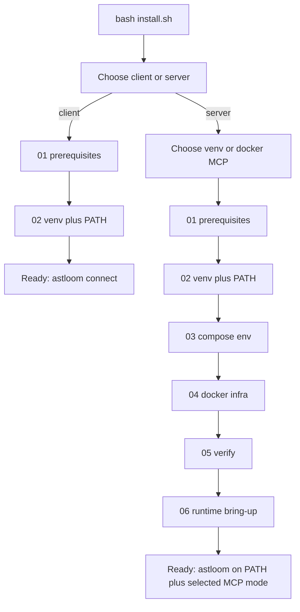

# 39 - Local Install Runbook

## Purpose

This runbook explains how to install Astloom for **local development** with one command. The installer is modular: every stage **checks** first, then **fixes**, then **re-checks**. It is designed so a first-time operator can succeed without memorizing Docker, venv, or Compose details.

Implementation status: **shipped** for local-dev bootstrap (OS deps on Debian/Ubuntu, `.venv`, Compose Postgres + Neo4j, `astloom doctor`). Full zero-touch production modes remain covered by [19-zero-touch-installation-and-bootstrap-automation.md](./19-zero-touch-installation-and-bootstrap-automation.md).

## Quick start

### Empty machine (recommended)

One line downloads Astloom from GitHub, then runs the installer menus:

```bash
curl -fsSL https://raw.githubusercontent.com/Mohammad-Mirasadollahi/Astloom/refs/heads/main/scripts/get-astloom.sh | bash
```

Use `refs/heads/main` in the raw URL (not bare `/main/`). GitHub’s raw CDN often serves a stale tip for `/main/` for several minutes after push.

You will be asked:

1. **Channel**
   - **release** — latest GitHub Release (immutable semver tag + source tarball; recommended)
   - **main** — tip of the `main` branch (may include unreleased commits). Re-running on an existing git checkout resets tracked files to `origin/main` (same overwrite intent as the release tarball sync). Operator state under preserve paths (`.astloom`, `.env`, `.venv`, compose `.env.local`, …) is kept.
2. **Install root** (default `/opt/Astloom`)
3. Then `install.sh` menus: install/upgrade (no default) → **y/n confirm** (no default; `y`/`yes` or `n`/`no`) → client/server/both (no default) → server MCP mode → **data root** (Enter = sibling `<install>-data`, e.g. `/opt/Astloom-data`). Unattended: pass `--role` / `--data-root` (and `--non-interactive --yes`) or explicit `--yes --non-interactive`.

Non-interactive fetch + install examples:

```bash
# Server
curl -fsSL https://raw.githubusercontent.com/Mohammad-Mirasadollahi/Astloom/refs/heads/main/scripts/get-astloom.sh \
  | bash -s -- --channel main --root /opt/Astloom --role server --runtime venv

# Client (CLI only)
curl -fsSL https://raw.githubusercontent.com/Mohammad-Mirasadollahi/Astloom/refs/heads/main/scripts/get-astloom.sh \
  | bash -s -- --channel main --role client
```

Publishing a product cut: create a GitHub Release with a new immutable tag (for example `v0.1.3`). Do not move or reuse old tags; `releases/latest` always points at the newest published release.

### Already cloned

From the repository root:

```bash
bash install.sh
```

On a TTY the installer **asks in order**:

1. **install or upgrade?** (must choose `1` or `2` — no Enter default)
2. Confirm with **`y`/`yes`** or **`n`/`no`** (no default; empty re-prompts)
3. If **install**: **client, server, or both?** (no default)
4. If **server/both**: **venv or docker** for MCP? (no default)
   - **venv** — MCP HTTP from this machine’s Python `.venv` (recommended; formerly labeled `host`)
   - **docker** — MCP HTTP in the `mcp-gateway` Compose container
5. If **server/both**: **data root** (Enter = sibling `<install>-data`)
6. If **server/both** on **install**: **mint an API key?** (`y`/`n`, no default). JWT signing
   secret and connect-bootstrap secret are **always auto-created** when missing.
   **Upgrade** preserves existing auth secret files and skips API key mint unless you pass
   `--mint-api-key`.

### Server auth secrets (JWT + bootstrap + optional API key)

On server/both bring-up (stage 06), the installer ensures:

| Material | Path | Env | Behavior |
| --- | --- | --- | --- |
| JWT signing secret | `.astloom/mcp-http.secret` | `ASTLOOM_MCP_TOKEN_SECRET` | Auto-create if missing; **never overwrite** on upgrade |
| Connect bootstrap secret | `.astloom/connect-bootstrap.secret` | `ASTLOOM_CONNECT_BOOTSTRAP_SECRET` | Auto-create if missing; **never overwrite** on upgrade |
| Optional API key (`as1.*`) | `.astloom/install-api-key.secret` (once file) | — | Only when operator answers yes / `--mint-api-key`; printed once; `ttl_seconds=0` = non-expiring |

Keys are also upserted into repo `.env` and compose `.env.local` when those files exist and the values are missing/placeholder. Upgrade backs up auth files under `.astloom/upgrade-backups/…/auth/` without regenerating live secrets.

**Quick Setup — what to do with a minted API key (client host):**

1. Do **not** paste the key into `connect.yaml`.
2. On the client, run `astloom-client connect` — it **prompts for the API key** (Enter keeps an existing `.astloom/access_token`; paste to replace).
3. Non-interactive: write `<checkout>/.astloom/access_token` (`chmod 600`) or export `ASTLOOM_TOKEN`.
4. Full checklist: [41 — Quick Setup — where the access token goes](./41-one-command-cross-platform-agent-onboarding.md#quick-setup--where-the-access-token-goes-client).

### MCP HTTPS (default)

Host MCP (`astloom service start` / install stage 06) and Compose `mcp-gateway` serve
**HTTPS by default** using the same leaf certs under `{data_root}/certs/` as profile/graph.
`ASTLOOM_MCP_HTTP_PUBLIC_URL` defaults to `https://…:32500` (set `ASTLOOM_PUBLIC_HOSTNAME`
for the advertise host clients should use). Escape hatch: `ASTLOOM_MCP_TLS=0` (plain HTTP;
clients then need `ASTLOOM_ALLOW_INSECURE_HTTP=1`).

The same `astloom service start` **must** also start **code-graph HTTPS** on
`ASTLOOM_CODE_GRAPH_PORT` (default `32140`). Remote `astloom-client sync` calls
`server.graph_url` for `file-hashes` / `ingest-push`; databases + MCP alone are a
false “Astloom is up” for content-push (`Connection refused` on ingest-push).

Client certificate validation is separate: see
[52 - Client TLS Trust And Certificate Verify](./52-client-tls-trust-and-verify.md)
(`auth.tls_verify` defaults to **false**; set `true` + `auth.ca_file` to pin the server CA).

```bash
# Non-interactive: create JWT+bootstrap only (no API key)
bash install.sh --non-interactive --role server --runtime venv

# Non-interactive: also mint a non-expiring API key for scope mir/dev/ThinkingSOC
bash install.sh --non-interactive --yes --role server --runtime venv \
  --mint-api-key --api-key-ttl 0 \
  --api-key-tenant mir --api-key-workspace dev --api-key-project ThinkingSOC
```

Non-interactive / CI (skips menus and the `yes` confirm):

```bash
bash install.sh --non-interactive --role server --runtime venv
bash install.sh --upgrade --yes --non-interactive
bash install.sh --non-interactive --role client
```

Legacy: `--runtime host` is an alias for `--runtime venv`. `--skip-infra` is an alias for `--role client`.

Then open a new shell if needed (so `~/.local/bin` is on `PATH`) and run:

```bash
astloom doctor          # server / both (full CLI)
astloom-client connect  # client-only (thin CLI; no bare astloom on PATH)
```

**Client-only (`role=client`):** PATH exposes **`astloom-client` only** (bare `astloom` is removed from `~/.local/bin` if present). Allowed: connect, profile/project, sync, purge, status, doctor, client wire helpers, path, `upgrade client`. Sync/purge/status use the remote Astloom server via `connect.yaml`.

**Server / both:** PATH exposes **`astloom` only** (full CLI). Client workflows (`connect`, and so on) work on the same host without installing a separate client package; `astloom-client` is not required on PATH.

App Docker details: [43-app-docker-and-wheelhouse-runbook.md](./43-app-docker-and-wheelhouse-runbook.md).

## Install flow



| Step | Actor / Action | Outcome |
| --- | --- | --- |
| 1 | Operator chooses role | `role=client`, `role=server`, or `role=both` in install-state |
| 2 | If server or both: choose MCP mode | `runtime=venv` or `runtime=docker` |
| 3 | Stages 01–06 (client skips infra) | CLI on PATH; server/both also bring up stores + MCP |

| Step | Stage | What it checks | What it does if missing |
| --- | --- | --- | --- |
| 0 | role + runtime + data root | `--role` / `--runtime` / `--data-root` / prompts / defaults | Persists `role=`, `runtime=`, and `data_root=` in `.astloom/install-state.env`; stamps `.astloom/data-root` |
| 1 | `01_prerequisites` | Python 3.12+, curl, git, Docker daemon, Compose plugin | `apt` install on Debian/Ubuntu; enable Docker (interactive installs always run this) |
| 2 | `02_venv` | `.venv` + PATH shim | `ensure-venv.sh`; seed `.env` / `astloom.sync.yaml`; install `~/.local/bin/astloom-client` when `role=client`, else `~/.local/bin/astloom` |
| 3 | `03_compose_env` | Compose `.env.local` with real secrets | Generate secrets from example templates (server) |
| 4 | `04_docker_infra` | Postgres + Neo4j `healthy` | `docker compose --profile core up -d` + `wait-healthy.sh` (server) |
| 5 | `05_verify` | `astloom doctor` + PATH + infra | Fail with stage hint; optional ai-toolstack |
| 6 | `06_runtime_bringup` | venv MCP or `mcp-gateway` healthy | `astloom service start` **or** wheelhouse + Compose `--profile app` |

Module map: [`scripts/install/README.md`](../../scripts/install/README.md).

## Flags

| Flag | Meaning |
| --- | --- |
| `--role ROLE` | `client`, `server`, or `both` (skips first prompt). `client` = thin CLI only (no Compose). `server` = full CLI + stack. `both` = same-host dogfood: Compose + full CLI (includes client workflows; no second client install) |
| `--runtime MODE` | Server MCP: `venv` or `docker` (alias: `host`→`venv`) |
| `--data-root PATH` | Durable data dir for Postgres/Neo4j/usage/cache/backup (default sibling `<install>-data`) |
| `--yes` / `-y` | Skip the interactive y/n confirmation |
| `--upgrade` | Upgrade path (interactive still requires y/n unless `--yes` / `--non-interactive`) |
| `--non-interactive` | No prompts; default `action=install`, `role=server`, `runtime=venv` |
| `--check` | Verify only; do not install packages or change Compose |
| `--prerequisites-only` | Stop after OS deps (always installs/checks prerequisites) |
| `--skip-prerequisites` | Do not apt-install (CI/non-interactive only; ignored for interactive full installs) |
| `--skip-infra` | Same as `--role client` (venv/CLI/PATH only) |
| `--with-frontend` | Also ensure Node.js 18+ for `frontend/` |
| `--with-ai-toolstack` | After verify, run `ai-toolstack/scripts/install-astloom.sh` |
| `--stage NAME` | Run one stage (see `--list-stages`) |
| `--list-stages` | Print stage ids |
| `--compose-timeout SEC` | Health wait timeout (default `180`) |

Examples:

```bash
bash install.sh
bash install.sh --role server --runtime docker
bash install.sh --role server --data-root /srv/astloom-data
bash install.sh --role both --runtime venv
bash install.sh --non-interactive --role server --runtime venv
bash install.sh --non-interactive --role client
bash install.sh --upgrade --runtime venv
bash install.sh --check --non-interactive --role server --runtime venv
bash install.sh --skip-infra --non-interactive
bash install.sh --prerequisites-only
bash install.sh --stage 02_venv
bash install.sh --with-frontend --with-ai-toolstack
```

## Prerequisites (manual, non-Debian)

Automatic OS package install supports **Debian/Ubuntu** via `apt` only. Elsewhere, install manually before `bash install.sh --skip-prerequisites`:

- Python 3.12+ with the `venv` module
- `curl`, `git`, `ca-certificates`, `openssl`
- Docker Engine and the Docker Compose **v2** plugin
- Optional: Node.js 18+ when using `--with-frontend`

## Secrets and Compose

- Local env file: `backend/deployments/compose/.env.local` (gitignored)
- Example template: `backend/deployments/compose/neo4j.example.env`
- The installer **never prints** generated passwords
- Default ports come from the port profile / example env (Postgres `32232`, Neo4j Bolt `32287`)
- Neo4j Compose defaults: heap **4G**, pagecache **1G** (`ASTLOOM_NEO4J_HEAP_*_SIZE`, `ASTLOOM_NEO4J_PAGECACHE_SIZE`). Under-sized heaps cause Bolt handshake failures during long content-push — see [81 - Neo4j Memory And Content-Push OOM Runbook](../07-code-knowledge-graph/81-neo4j-memory-and-content-push-oom-runbook.md)

Start infra alone (after env exists):

```bash
docker compose --env-file backend/deployments/compose/.env.local \
  -f backend/deployments/compose/compose.yaml --profile core up -d postgres neo4j
backend/deployments/compose/wait-healthy.sh --timeout 300 \
  astloom-postgres-1 astloom-neo4j-1
```

## HTTPS edge (optional)

For client-facing HTTPS, terminate TLS at Caddy (or similar) and proxy to loopback MCP and connect APIs. Auto-generate cert material under `<ASTLOOM_DATA_ROOT>/certs/` before starting the edge:

```bash
export ASTLOOM_DATA_ROOT=/opt/Astloom-data
export ASTLOOM_PUBLIC_HOSTNAME=astloom.example.internal
source scripts/install/tls_edge/ensure_certs.sh
```

Recipe, example Caddyfile, and routing table: [`scripts/install/tls_edge/README.md`](../../scripts/install/tls_edge/README.md).

## Failure recovery

| Symptom | Likely cause | Fix |
| --- | --- | --- |
| Python 3.12 missing | Old OS / no deadsnakes | Re-run without `--skip-prerequisites`, or install Python 3.12 manually |
| `ensurepip is not available` / venv create fails | `python3.12-venv` missing (Python binary present) | Re-run without `--skip-prerequisites` (stage 01 installs `python3.12-venv`), or `sudo apt install python3.12-venv` |
| `docker daemon not reachable` | Docker stopped or user not in `docker` group | `sudo systemctl start docker`; log out/in after group add |
| Compose env placeholder password | Example file copied without replace | Re-run `bash install.sh --stage 03_compose_env` |
| Neo4j wait timeout | Slow first pull / plugins | Increase `--compose-timeout 300`; check `docker logs astloom-neo4j-1` |
| `ingest-push` Bolt handshake / `Couldn't connect` to `:32287` | Neo4j JVM heap OOM (historically 512M) | Raise `ASTLOOM_NEO4J_HEAP_MAX_SIZE` (default **4G**), recreate `neo4j`; [81](../07-code-knowledge-graph/81-neo4j-memory-and-content-push-oom-runbook.md) |
| `HTTP ingest-push failed: Connection refused` / empty `file-hashes` | code-graph HTTPS not listening on `ASTLOOM_CODE_GRAPH_PORT` (32140) | `astloom service start` must start code-graph HTTPS (not only MCP); check `astloom service status` / `.astloom/run/code-graph-https.log` |
| `astloom doctor` fail | Incomplete venv | `bash install.sh --stage 02_venv` |

State markers (optional resume hints): `.astloom/install-state.env`.

## Upgrade (existing install)

After a successful first install, upgrade the **server** without a wipe:

```bash
bash install.sh --upgrade --runtime host
```

This backs up `.astloom/install-state.env`, re-runs install stages, and stamps product/contract versions via `astloom upgrade finalize`. Full control-plane and client paths: [51 - Software Upgrade Server And Client](./51-software-upgrade-server-and-client.md).

## Smoke test

Prove the installer on a real host:

```bash
## From repository root
bash tests/e2e/install/run-install-smoke.sh
SMOKE_SKIP_DOCKER=1 bash tests/e2e/install/run-install-smoke.sh
SMOKE_REQUIRE_DOCKER=1 bash tests/e2e/install/run-install-smoke.sh

## Isolated temp tree + offset ports + auto cleanup
bash tests/e2e/install/run-isolated-install-smoke.sh
SMOKE_REQUIRE_DOCKER=1 bash tests/e2e/install/run-isolated-install-smoke.sh
SMOKE_KEEP=1 bash tests/e2e/install/run-isolated-install-smoke.sh

## Pytest wrappers
.venv/bin/python -m pytest tests/backend/tools/install/test_install_smoke.py -q
.venv/bin/python -m pytest tests/backend/tools/install/test_install_smoke.py -m live -q
```

Evidence logs land under `tmp/install-smoke/`. Isolated runner uses ports `42332` / `42387` / `42574` by default and removes the temp tree unless `SMOKE_KEEP=1`. Details: [`tests/e2e/install/README.md`](../../tests/e2e/install/README.md).

## Relationship to other installers

| Entry | Owns |
| --- | --- |
| Root `install.sh` | Full Astloom local-dev bootstrap (this runbook) |
| `scripts/ensure-venv.sh` | Python venv only (called by stage 02) |
| `ai-toolstack/scripts/install-astloom.sh` | Cursor rules/skills/MCP wiring (optional via `--with-ai-toolstack`) |

Do not use archived `archives/hackathon/install.sh` for the active product path.

## Related Documents

- [19-zero-touch-installation-and-bootstrap-automation.md](./19-zero-touch-installation-and-bootstrap-automation.md)
- [13-local-development-and-environment-engineering.md](./13-local-development-and-environment-engineering.md)
- [36-astloom-cli.md](./36-astloom-cli.md)
- [backend/deployments/compose/README.md](../../backend/deployments/compose/README.md)
- [43-app-docker-and-wheelhouse-runbook.md](./43-app-docker-and-wheelhouse-runbook.md) — application container + `/opt` wheelhouse
- [scripts/install/README.md](../../scripts/install/README.md)
